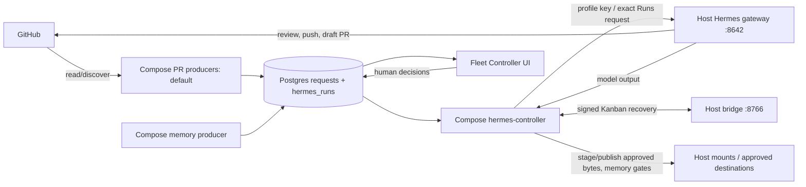

# Host-native fleet architecture

Current topology is **one macOS host**: Docker Desktop runs discovery, Postgres, the controller, UI, and support services; a dedicated non-admin `hermes-agent` account runs one pinned Hermes gateway with immutable per-kind profiles. The old Compose-embedded agent workers are historical. The [from-zero guide](getting-started.md) explains when this topology becomes live.

The diagram shows the **default Postgres path**, not opt-in host-direct Kanban/cron modes. Direct Kanban review and maintenance producers enqueue into host Hermes and use its direct workflow/journal rather than creating new Compose `requests`/`hermes_runs`; direct PR-safety council intake does not yet automatically settle to Postgres, publish a final handoff, or populate the incident queue. Persisted controller-owned Kanban attempts still recover on their original route. See [engine changes](operations.md#queue-engine-changes) before switching.

On the default path, Postgres `requests` stores kind, identity, dedupe key, state, and lease; `hermes_kind_routes` pins profile/route/generations and kind caps; `hermes_runs` stores immutable operation identity, exact submitted bytes/digest and run marker. Claim and attempt reservation are one transaction. The controller may replay the *same* stored request on a lost response, never an invented second operation. It renews leases, verifies typed results, and nonce-fences settlement. Uncertain maintenance and SWE effects enter `reconcile`; review failures (including malformed output or interrupted runs) usually settle `failed`. Inspect GitHub state before manually re-enqueueing a failed review or resolving a `reconcile` row—neither state proves what happened remotely. [Hermes queue/Runs details](hermes/README.md#queue-and-runs-ledger) and [substrate schema](../docker/README.md#schema) cover the implementation.

## Credential and network boundaries

- **Host Hermes** holds provider credentials, GitHub CLI state/deploy keys, and profile tools under `hermes-agent`; its service home is not mounted in Docker. An operator-approved token in the service `.env` is copied to the Compose producer token file at install time; the *copy has the same scope*. GitHub permissions and branch protection, not the authority YAML or agent prompts, limit effects.
- **Default Compose producers** read authority/scope and the copied GitHub token, query GitHub, and **write queued requests to Postgres**. They do not execute models. `pr-safety-producer` can accept a repo by authority **or** allowed organization for an approved author; a narrow authority file alone does not narrow it.
- **Compose controller** gets Postgres credentials, a profile-scoped API key bundle, a bridge HMAC key copy, and bounded mounts for staged documents, handoffs, snapshots, and memory sources. It cannot see the service-account home or host provider OAuth. It handles exact document publication and deterministic memory gates; it does not hold the host profile's GitHub effect credentials.
- **Gateway** listens on host loopback `127.0.0.1:8642`; Compose reaches it via `host.docker.internal` with per-profile API keys. The `127.0.0.1:8766` signed bridge has no Postgres or GitHub effect credentials. Its HTTP transport assumes a trusted single-host Docker Desktop-to-loopback path; HMAC authenticates messages, not confidentiality on an untrusted network. Default `single` PR safety creates no new council; the bridge stays available for persisted Kanban recovery.
- **Fleet Controller** is behind localhost-only nginx/TLS at `https://fleet.localhost:8080` with session/Host/Origin/CSRF checks for mutations. Hindsight API is localhost-bound at 8888. **Request Postgres** publishes `REQUESTS_DB_PORT` without an explicit loopback bind; firewall/restrict it. Shared Coderag reads `CODE_ROOT`; SwarmVault watcher writes its vault while MCP readers mount it read-only. See [configuration](configuration.md) for mounts and secrets.

## Workflows and effects

Each submitted model run may incur provider cost, including review, maintenance, document, safety, memory, and SWE requests. Default Compose producers discover/enqueue and the controller later claims work; direct host Kanban producers may create runnable cards without a Compose controller claim.

| Workflow / profile | Admission | Possible effect and human gate |
| --- | --- | --- |
| `pr-review` / `pr-review-v1` | Default Compose producer discovers assigned open PRs in granted repos; opt-in host Kanban producer runs separately | Host profile can submit a GitHub review. Default controller validates returned head marker; direct Kanban uses its own journal/verification, not Compose settlement. Not a dry run. |
| `pr-maintain` / `pr-maintain-v1` | Default Postgres producer enqueues authored open PRs even without feedback; opt-in host Kanban producer checks for actionable feedback | Host profile may fix, commit, push, or reply under branch/round gates. Postgres limits requests per PR lineage; direct Kanban uses its own round journal. Uncertain effects need human review on their original engine. |
| `swe-implement` / `swe-implement-v1` | Explicit approved task/handoff through Fleet Controller | Host profile may open a draft PR; controller validates repo-bound URL. No default discovery producer. |
| `doc-write` / `doc-write-v1` | Operator request in Fleet Controller | Paid model drafts/refines; controller stages exact bytes, then requires human approval before publication to configured inbox. |
| `pr-safety-review` / `pr-safety-v1` | Merged PRs from configured authors and repo **or org** scope; `single`/Postgres default | Default controller publishes local handoff; only incident candidates enter human queue. Opt-in direct Kanban council intake is **enqueue-only** today: no automatic Postgres settlement, final handoff, or incident queue. Require separate approval. |
| `memory-curate` / `memory-curate-v1` | Compose schedule by default; opt-in host cron | Model proposes bounded facts from read-only host sources; controller applies deterministic filters/dedupe/watermark before eligible team/org writes. Confirm external memory destinations and private-source policy first. |

Source of truth: [`../docker-compose.yml`](../docker-compose.yml) for containers/mounts, [`../scripts/fleet.sh`](../scripts/fleet.sh) for orchestration/switches, [`../scripts/hermes-native.sh`](../scripts/hermes-native.sh) for host launchd and installation, [`../scripts/hermes-controller.py`](../scripts/hermes-controller.py) for settlement, and [`../agent-config/hermes/profiles/`](../agent-config/hermes/profiles/) for model/tool roles. The [Hermes runtime guide](hermes/README.md) has route generations and bridge contracts; PRDs and M0/M2 designs in the [docs index](README.md) are historical when they disagree with shipped code.
