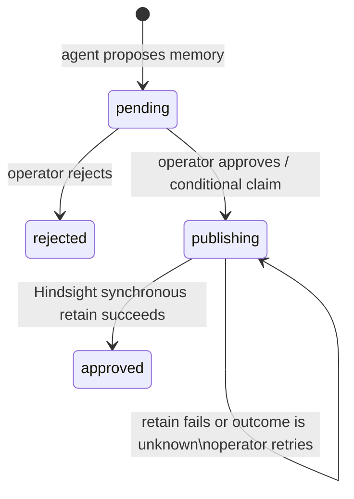

# Pending Decision Approval

- status: ready for review
- owner: local fleet operator
- scope: `pending_decisions` only
- source: user request, 2026-09-04
- evidence: `bin/agent-server`, `bin/status-server`, `docker/initdb/01-schema.sql`, `docs/roadmap.md`; live Hindsight 0.9.2 OpenAPI, 2026-09-04

## Problem

The status page labels shared-memory proposals as pending but hides their contents and offers no decision. A human cannot inspect, approve, or reject proposed memory safely.

## Goals

- Show each pending proposal with source PR, summary, decisions, findings, and provenance.
- Let local operator reject without calling Hindsight.
- Let local operator approve exactly reviewed stored content into `fleet-shared`.
- Prevent duplicate approval requests from creating duplicate shared documents.
- Keep all existing GitHub and maintenance-queue behavior unchanged.

## Non-goals

- User accounts, team assignment, notifications, bulk actions, rejection reasons, history UI, or pagination.
- Changing agent proposal generation or redesigning memory schema.
- GitHub writes, approval, or merge actions.
- Automatic recovery/publishing worker or new dependency.

## Success Criteria

| Criterion | Evidence |
| --- | --- |
| Operator can inspect proposal before choosing | Escaped page test covers stored proposal and provenance |
| Reject changes only its pending row | SQL mock test; no Hindsight call |
| Approve writes one deterministic document, then marks row approved | HTTP and SQL mock tests |
| Concurrent/stale approve cannot begin another publication | conditional `pending` to `publishing` claim test |
| Retain error leaves item explicitly retryable, never approved | failure test and `publishing` UI state |
| Existing status-server tests pass | `python3 tests/test-status-server.py` |

Primary success signal: every visible pending decision can reach an explicit terminal decision without a manual database command.

Guardrails:

- Retain bank is fixed to `fleet-shared`; Hindsight URL, content, metadata, and document ID come only from process configuration and stored database values—not form fields.
- Agent-authored content is always HTML-escaped.
- Local-host, Origin, and CSRF protections apply to decision actions.
- No action marks approval until Hindsight confirms synchronous retain success.

## Design

Use existing `status-server` POST protections and request Postgres. Add `publishing` to the existing pending-decision state machine plus `publish_started_at` and `publish_error` for recovery visibility.



A process-local publish lock plus the state claim serializes browser actions. A retry uses the same deterministic Hindsight `document_id`, `pending-decision-<id>`, with item-level `update_mode: replace`; Hindsight 0.9.2 documents replacement for repeated document IDs. Therefore a retry after a lost response replaces the same source document rather than adding a second one.

```mermaid
sequenceDiagram
    participant O as Local operator
    participant UI as status-server
    participant DB as Request Postgres
    participant H as Hindsight fleet-shared

    O->>UI: POST approve(id, CSRF token)
    UI->>DB: pending → publishing; RETURN proposal + provenance
    alt claim succeeds
      UI->>H: retain one stored JSON document, stable document_id
      alt retain succeeds
        UI->>DB: publishing → approved; decided_at
        UI-->>O: approved
      else failed or timeout
        UI->>DB: retain publishing; publish_error
        UI-->>O: retry required
      end
    else stale or already handled
      UI-->>O: no action
    end
```

What matters: no browser payload can alter shared memory. A timeout is not treated as rejection or success; retry remains safe because it targets same Hindsight document.

### Stored Hindsight Document

One retained item per pending-decision row:

- `content`: canonical JSON with `pending_decision_id`, `proposal`, and `provenance`.
- `document_id`: `pending-decision-<id>`.
- `metadata`: string-only `pending_decision_id`, `request_id`, and `kind`.
- `tags`: `human-approved`, `pending-decision`.
- `async`: `false`; item-level `update_mode`: `replace`.

This preserves the exact reviewed proposal and provenance. Hindsight documents can be removed by deterministic document ID if rollback is required.

### Files

| Path | Change |
| --- | --- |
| `docker/initdb/04-pending-decision-approval.sql` | Add publish fields and `publishing` state idempotently |
| `docker-compose.yml` | Replay migration 04; give status service Hindsight URL |
| `bin/status-server` | Render decision details, claim/approve/retry/reject state changes, call Hindsight through Python stdlib |
| `tests/test-status-server.py` | Cover rendering, state transitions, retain payload/failure, retry, CSRF routing |
| `docker/README.md` | Explain approval, retry, and rollback semantics |

## Alternatives

| Option | Decision |
| --- | --- |
| Local approve only, no memory write | Rejected: conflicts with roadmap’s defined promotion behavior |
| Synchronous write without a claim | Rejected: concurrent clicks can duplicate writes |
| Async Hindsight operation plus status poller | Rejected: larger state machine and worker; synchronous API plus stable replacement document meets v1 need |
| New service/queue/audit system | Rejected: local single-user UI already owns queue controls |

## Security And Operations

- Localhost-only deployment remains unauthenticated by design; actor is local operator, not a named user.
- `HINDSIGHT_URL` is deployment configuration; target bank is fixed to `fleet-shared`. No request controls either value.
- Hindsight 0.9.2 API supports synchronous retain and documents stable `document_id` replacement. If deployed API drops this behavior, stop and return to this design.
- `publishing` requires operator retry after a crash or external failure. It must never silently become approved.
- Rollback: delete Hindsight document `pending-decision-<id>` using Hindsight API, then investigate before changing database history. This feature does not automate rollback.

## Task Plan

1. **Migration and configuration**
   - Add/replay additive migration; pass status service Hindsight URL.
   - Accept: existing DB volumes migrate cleanly; initial DB gets same state model.
   - Validate: inspect generated schema or run migration in existing compose environment.

2. **Decision UI and state operations**
   - Add escaped dedicated table and whitelisted decision routes.
   - Accept: operator sees stored context; pending can claim/reject; publishing can retry; stale actions do nothing.
   - Validate: focused unit tests with mocked `psql`.

3. **Hindsight promotion**
   - Use stdlib HTTP with bounded timeout. Retain exactly one canonical stored document under stable ID before final approval.
   - Accept: success marks approved; every failed/ambiguous request stays publishing with safe retry.
   - Validate: mocked success, failure, and repeat publish tests.

4. **Regression, docs, review**
   - Document behavior; run focused suite and shell syntax checks.
   - Accept: current status controls remain protected and all tests pass.
   - Stop: any evidence that Hindsight does not replace same-document retries or that the migration cannot replay safely.

## Council Gate

- level: single-lens reliability review
- initial verdict: block, pending Hindsight delivery semantics
- resolution: live Hindsight 0.9.2 OpenAPI documents same-`document_id` replacement and synchronous retain; design retains `publishing` on every non-confirmed outcome.
- next gate: delta reliability review, then implementation.
