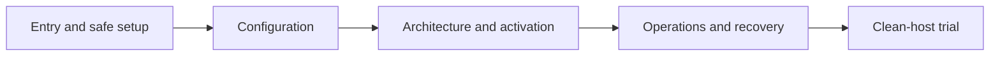

# Documentation rollout plan

## Goal

A new operator can prepare the **current host-native Hermes fleet** from an empty macOS host, understand every credential and filesystem boundary, inspect prerequisites, and deliberately authorize live startup. There is no verified full-fleet idle startup command. A contributor can distinguish as-built instructions from historical design records.

This plan is based on `origin/main` after the host-native/control-plane migration. Older Compose-embedded Hermes setup instructions are not applicable: Compose now runs queue control and producers; the `hermes-agent` macOS account runs the model gateway and profiles. Do not copy commands from the retired worker path into current onboarding.

## Ordered slices

1. **First mergeable slice — entry and safety.** Add a from-zero operator checklist, link it from the root README and docs index, and warn that `scripts/fleet.sh up` and bare `scripts/compose.sh up -d --build` start live producers and controller. Reuse the existing no-overwrite TLS generator, native install, authority, and verification steps; explain that root-level host install and browser CA trust need operator approval. Document the absence of a verified idle full-fleet bring-up rather than inventing one.
2. **Configuration reference.** Explain `.env.example` settings by boundary: Compose DB/UI/TLS, host service user/runtime, copied producer token and its actual scopes, per-profile API keys, repository authority, memory and private-doc mounts. Include ownership/mode requirements and `host.docker.internal` single-host constraint; never copy actual secrets.
3. **Architecture and per-workflow activation.** Diagram host gateway ↔ Compose control plane, exact requests/attempts and reconcile semantics. Separate review, maintenance, doc-write, PR-safety, memory-curate, and SWE; identify provider billing and GitHub effects, authorization gates, and queue-engine switches. Use `docs/hermes/README.md` for detailed contracts.
4. **Operator runbook.** Cover `fleet.sh status/logs/down`, TLS renewal and controller recovery, host launchd health, stuck/reconcile rows, bridge state, backup/restore limits, upgrade drain, and named-volume loss. Add real commands only after reviewing/validating their effect boundaries.
5. **Contributor guide and doc check.** Map source/tests/config and define when setup/architecture/operations docs change. Check local links and examples. Arrange a separate authorized clean-host and test-PR walkthrough; do not start paid workflows, install a privileged service, modify keychain trust, or mutate GitHub as part of a docs PR.

## First-slice acceptance

- [x] README links a current host-native setup guide rather than treating the default `up` as inert.
- [x] Guide shows required host account, credential files, TLS, authority, service installation, verification, and clear first live-effect boundary.
- [x] No step implies Compose controllers or producer discovery are read-only; producer token scope is the service-account token copied at install time.
- [x] No existing in-progress local Hermes profile changes are included in this PR.
- [ ] An independent operator completes clean-host setup and a scoped test PR with explicit provider/GitHub approval. This cannot be inferred from static documentation review.

## Known gaps after first slice

- The existing `scripts/generate-ui-tls.sh` is now the referenced no-overwrite generator; actual CA trust remains an explicit operator action.
- A fully idle boot path that starts *all* infrastructure without automatic queue processing is not documented or tested. Do not present `fleet.sh up` as that path.
- PR-safety admission accepts an approved author in an allowed organization **or** an authorized repository. A repo-only authority file does not restrict that producer to one repo. A narrower activation path or policy intersection needs its own code/test change before a one-repo PR-safety pilot.
- Fleet Controller's manual PR injection creates a timestamp dedupe key instead of a head-SHA marker. A successful posted review can settle `failed` if used as a review retry; fix and test that contract separately. Until then, do not recommend manual injection for review recovery.
- Production backup/restore for Postgres plus host Hermes state and pinned profile generations needs a separately tested runbook.

## Follow-on documentation status

- [x] [Configuration reference](configuration.md): Compose vs host path precedence, secret ownership, GitHub scope, optional data mounts, and queue switches.
- [x] [Architecture and workflow effects](architecture.md): host/Compose control plane, identity/lease/route fencing, all six queue kinds, and external effects.
- [x] [Operator runbook](operations.md): read-only status/queue checks, bridge inspection, pause/drain/reconcile guidance, TLS and upgrade limits, backup warning.
- [x] [Contributor guide](contributing.md) and updated navigation from root README, docs index, and first-install guide.
- [ ] Authorized clean-host, paid-provider, test-PR, CA-trust, and full backup/restore trials. Documentation-only static review cannot complete these; do not run them from this checklist without explicit operator approval.
