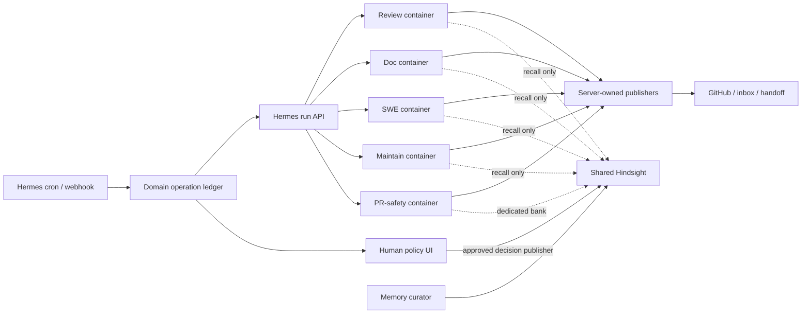

# Hermes Migration Roadmap

Date: 2026-09-14

Status: active; M0 merged and validated

Owner: Zhach

Decision scope: migrate commodity agent orchestration to Hermes. Keep domain safety controls until parity proven.

Hermes baseline: [`NousResearch/hermes-agent@14efb460`](https://github.com/NousResearch/hermes-agent/commit/14efb46089250e8b9e56e59b74291cf8dce8b207)

## Decision

Use strangler migration. No big-bang rewrite.

Deployment stays in Docker Compose. Hermes runs as pinned Compose services, not host-managed daemons. Each trust tier gets its own service, state volume, credentials, mounts, network policy, and resource limits.

Hermes owns commodity work:

- agent runtime;
- profiles and skills;
- cron and webhook ingress;
- run API and telemetry;
- generic task execution;
- generic dashboard;
- container supervision.

This repo keeps policy work:

- immutable PR identity and provenance;
- head-SHA and same-PR-lineage rules;
- deterministic GitHub publishing;
- side-effect intent, fencing, and reconciliation;
- human approval state machines;
- trust-tier isolation;
- curated shared-memory writes;
- Rokt prompts, handbook, and acceptance tests.

Target is smaller policy overlay around pinned Hermes. Target is not zero custom code.

## Scope Lock

### In

- root `docker-compose.yml` remains sole fleet deployment manifest;
- `scripts/compose.sh` remains operator entrypoint;
- `pr-review` scheduling and execution;
- `doc-write` execution;
- `swe-implement` execution;
- `pr-maintain` execution;
- generic worker lifecycle and status;
- Hermes-compatible skills and MCP config;
- removal of replaced Compose services, scripts, and tests.

### Out Until Separate Approval

- replacing Docker Compose with host-managed Hermes services;
- collapsing trust tiers into one all-purpose Hermes container;
- weaker credential, mount, or network boundaries;
- direct agent ownership of GitHub publishing;
- direct agent writes to shared Hindsight memory;
- replacement of immutable PR-safety verification with prompt rules;
- shared Hermes profile as isolation between trust tiers;
- multi-machine migration;
- Postgres removal before all reconciliation and human queues drain;
- use of Hermes internal SQLite schema as an integration API.

## Migration Invariants And Current Gaps

Migration preserves these rules or stops:

1. One operation identity binds repo, PR, head SHA, and kind.
2. One active worker per PR lineage.
3. Stale attempt cannot finish work owned by new attempt.
4. External effect intent recorded before effect.
5. Crash after possible effect becomes `reconcile`, not blind retry.
6. Changed immutable input becomes `superseded`.
7. Review verdict maps deterministically to GitHub review action.
8. Human-approved content is exact content published.
9. Shared memory has trusted server-owned writers only: curator and human-approved decision publisher. Agents never write it directly.
10. Each trust tier gets separate credentials, mounts, network, and state.
11. Every cutover has one active ingress and one active consumer.
12. Rollback does not replay uncertain external effects.

Known current gaps:

- expired `doc-write` and `swe-implement` attempts can requeue after side-effect intent because generic reclaim only special-cases `pr-maintain`;
- M2 and M5 must fix and fault-test these gaps before Hermes activation. Migration cannot preserve known unsafe behavior as parity.

Canonical evidence:

- queue and effect recovery: [`lib/queue.sh`](../lib/queue.sh), [`bin/agent-server`](../bin/agent-server);
- runtime topology: [`docker-compose.yml`](../docker-compose.yml), [`docker/README.md`](../docker/README.md);
- PR-safety contract: [`pr-safety-review.md`](pr-safety-review.md);
- decision publishing: [`decision-approval.md`](decision-approval.md);
- doc human loop: [`doc-writer.md`](doc-writer.md);
- memory ownership: [`memory-curation.md`](memory-curation.md).

## Hermes Fit

| Capability | Hermes fit | Migration rule |
| --- | --- | --- |
| Cron and webhook ingress | Strong | Pilot first. One scheduler active. |
| Agent runtime, skills, MCP | Strong | Replace runner behind current controller. |
| Profiles | Useful identity/config | Never treat as security boundary. |
| Docker and s6 supervision | Strong | Run pinned Hermes image as separate Compose service per trust tier. |
| Run API and status | Strong | Use documented API only. Persist operation-to-run mapping. |
| Kanban queue | Partial | Single-host SQLite. Adopt only after fault and load gates. |
| Worktrees | Partial | Use for low-risk jobs first. Keep immutable snapshot rules. |
| Dashboard | Partial | Generic status only. Keep human action panels until parity. |
| Hindsight provider | Wrong default for untrusted jobs | Disable automatic shared writes. Keep curator and bank lock. |
| GitHub webhook review delivery | Too agent-owned | Keep deterministic server-owned publisher. |
| PR-safety containment | Insufficient by itself | Dedicated container and current verifier remain mandatory. |

Hermes states it is single-tenant. Profiles are not sandboxes. One multi-profile container cannot replace current trust separation.

## Target Shape



One root `docker-compose.yml` remains sole deployment manifest. `scripts/compose.sh` remains operator entrypoint. Compose health checks and dependency conditions own startup order. Hermes profiles can organize agents inside one trust tier. They never cross trust tiers.

Authority:

- Docker Compose owns deployment topology and service isolation;
- domain ledger owns operation identity, provenance, external effects, reconciliation, and approvals;
- Hermes owns model execution and generic run lifecycle;
- publisher owns visible side effects;
- status UI owns human policy actions and publishes exact human-approved decisions;
- Hindsight curator owns automated shared-memory writes;
- agents own no shared-memory write path.

Stable join key: `operation_id -> hermes_run_id`.

## Scoring Model

Scores use 1–5. Higher value, learning, confidence, and reversibility help. Higher effort and risk hurt.

```text
priority = 3*value + 2*learning + confidence + reversibility - 2*effort - 3*risk
```

Risk includes duplicate effects, stale work, privilege spread, and rollback difficulty.

## Candidate Scores

| Candidate | Value | Learning | Confidence | Reversible | Effort | Risk | Score | Order |
| --- | ---: | ---: | ---: | ---: | ---: | ---: | ---: | --- |
| Hermes cron runs existing review producer | 3 | 5 | 5 | 5 | 1 | 1 | 24 | 2 (dependency-adjusted) |
| Hermes runtime runs existing doc harness | 3 | 4 | 4 | 4 | 2 | 2 | 15 | 1 (smaller first seam) |
| Read-only Hermes review shadow | 4 | 5 | 4 | 5 | 3 | 2 | 19 | 3 |
| Live review through custom publisher | 5 | 4 | 3 | 4 | 3 | 3 | 15 | 4 |
| SWE implementation through custom publisher | 4 | 3 | 3 | 3 | 3 | 4 | 6 | 5 |
| Maintenance execution | 5 | 3 | 2 | 2 | 4 | 5 | 2 | 6 |
| PR-safety execution | 2 | 2 | 1 | 1 | 5 | 5 | -13 | 7 or never |
| Postgres and custom UI retirement | 5 | 2 | 1 | 1 | 5 | 5 | -4 | Last |

Negative score means defer. It does not mean impossible.

## Dependencies And Capacity

Assumptions:

- one primary engineer;
- half-time migration capacity;
- 20% interrupt buffer inside that capacity;
- one security reviewer for trust-boundary changes;
- one operator for canary and rollback drills;
- single-host deployment remains acceptable.

| Dependency | Blocks | Owner | Ready condition |
| --- | --- | --- | --- |
| Pinned Hermes image digest and public API contract | Every pilot | Migration owner | Reproducible build and one-version rollback |
| Compose deployment contract | Every live service | Migration owner | One service and volume per trust tier; health and restart checks pass |
| Baseline metrics | Cutover claims | Migration owner | Current 14-day queue, latency, failure, duplicate, and human-review data |
| Contract test matrix | Worker replacement | Migration owner | Every current invariant has test or explicit retained component |
| Per-tier containers | Live agent work | Platform/security | Secret, mount, network, and state isolation tests pass |
| Structured result adapter | Live review and maintenance | Migration owner | Schema-invalid result cannot reach publisher |
| Fault-injection harness | Queue or publisher retirement | Migration owner | Kill-before/after-effect cases produce expected terminal state |
| State-loss recovery drill | Hermes durable state adoption | Operator | Tier policy proves clean restore or deterministic quarantine without replay |
| Human UI parity | Status UI retirement | Migration owner | All actions preserve actor, provenance, retry, and CSRF/auth rules |

No calendar commitment before baseline and Hermes integration spike. Expected shape: Now = 1–2 weeks, Next = 3–6 weeks, Later = evidence-driven.

## Horizons

### Now: Prove Substrate

Keep existing policy controller. Replace no safety contract.

- M0: lock contracts, metrics, pin, isolated state-volume round trip, and revert-only rollback.
- M2: investigate doc-writer model execution through Hermes; activate only after child design gate.
- M1: investigate one review schedule through Hermes cron; activate only after child design gate.

Execution order is M0 → M2 → M1. Milestone IDs stay stable for history.

Outcome: evidence that Hermes can run existing commands and prompts predictably.

### Next: Move Low-Risk Execution

Keep Postgres domain authority and custom publishers.

- M3: shadow `pr-review` with no GitHub-write credential.
- M4: canary live `pr-review` through current publisher.
- M5: move `swe-implement` only after review is stable.

Outcome: Hermes becomes normal model runtime. Visible effects remain deterministic and server-owned.

### Later: Move High-Risk Work, Then Delete

- M6: move `pr-maintain` after crash recovery parity.
- M7: evaluate dedicated Hermes PR-safety container. Keeping current worker is valid end state.
- M8: decide Kanban/Postgres split. Retire components only after deletion gates pass.

Outcome: small overlay repo. No duplicate control plane.

## Milestones

### M0 — Contract Lock And Baseline — Complete

Build:

- pin Hermes image by digest and record upstream commit;
- add one pinned, disabled `hermes-doc` service shape to existing `docker-compose.yml` behind explicit M0 profile;
- reserve separate state, credentials, mounts, networks, health checks, and resource limits per future trust tier without configuring live access;
- keep `scripts/compose.sh` as operator entrypoint;
- inventory every request kind, credential, mount, network, state transition, external effect, and human action;
- map each invariant to retained code, Hermes public contract, or new adapter test;
- capture current throughput, queue age, start lag, completion latency, failure, retry, reconcile, superseded, and human-disposition metrics;
- mark duplicate-effect and missed-eligible audits unavailable until target inventory exists;
- prove isolated Hermes state-volume checksum round trip;
- defer production backup, clean-host restore, and 15-minute route rollback to M2/M1 child designs after ownership exists;
- ban integration with Hermes private modules or SQLite tables.

Exit:

- parity matrix reviewed;
- static Compose contract passes;
- baseline output is deterministic and read-only;
- isolated state-volume round trip passes;
- no production route, provider work, GitHub work, queue schema, or current service changed.

### M1 — Scheduler Pilot

Runs after M2 evidence. Activation needs separate plan-to-launch design approval.

Build:

- dedicated Hermes scheduler instance;
- Hermes cron invokes existing `bin/pr-producer review`;
- existing Postgres dedupe and workers stay unchanged;
- old Compose review scheduler pauses during pilot;
- maintenance scheduler stays untouched.

Run:

- 7 days or 20 scheduled triggers, whichever is longer;
- one planned Hermes restart;
- one rollback drill.

Pass:

- 20/20 triggers accounted for;
- zero duplicate queue rows or external effects;
- zero missed eligible PRs;
- p95 start lag no more than 2x baseline;
- failure rate no more than 5 percentage points worse than baseline;
- rollback under 15 minutes.

Delete after pass:

- review producer sleep-loop service only.

### M2 — Doc Runtime Pilot — Active

M2a non-routing foundations passed design council and are planned. M2b paid shadow/live activation remains blocked behind M2a evidence, separate plan-to-launch, and human approval.

Build:

- dedicated zero-tool Hermes doc service and provider egress tier;
- existing `doc-write` queue, refine/finalize loop, daily cap, status actions, and controller authority stay;
- exact-byte Publish/Dismiss approval precedes inbox write;
- current worker calls documented Runs API through durable request-phase identity;
- automatic Hermes tools, memory, background review, and shared-memory sync disabled.

Run:

- M2a non-routing foundation first;
- M2b: five paid paired-shadow payloads, then at most 10 operator-triggered draft admissions plus one council phase per finalized request;
- include restart, timeout, malformed result, existing-filename, state-loss, and rollback-quarantine cases.

Pass:

- every accepted draft/council phase reaches completed, failed, or reconcile;
- zero clobbered or duplicate inbox files;
- zero unexpected or model-directed writes; approved infrastructure writes are Hermes state, doc stage, request DB, proxy tmpfs, bounded adapter temp, hidden inbox staging, gate reports, and exact-approved inbox target;
- malformed open-question result fails closed;
- council remains advisory and published bytes carry exact-approved `human_reviewed` metadata;
- restart/state loss deterministically recovers or quarantines to reconcile;
- rollback to legacy completes within 15 minutes without replaying attached ambiguity.

Delete after pass:

- after M2b evidence and 14-day rollback window, doc-specific direct model-runner glue can be removed;
- exact-byte human approval and server-owned publisher remain.

### M3 — Read-Only Review Shadow

Build:

- dedicated review container with no source-write, push, merge, deploy, or CI-write credential;
- replay same immutable PR heads through Hermes;
- no GitHub review posting from shadow;
- persist `operation_id`, Hermes run ID, result schema version, model, duration, and token use;
- compare verdict, material findings, false positives, and runtime with current worker.

Run:

- at least 30 PR heads;
- include clean, blocked, self-review, changed-head, timeout, and malformed-output cases.

Pass:

- zero unauthorized writes;
- zero stale-head results accepted;
- 100% results schema-valid or safely rejected;
- no material regression in accepted findings;
- every shadow run traceable to immutable input.

### M4 — Live Review Canary

Build:

- current domain controller submits Hermes run;
- current server validates result and chooses `APPROVE`, `COMMENT`, or `REQUEST_CHANGES`;
- current head marker, dedupe, self-review rule, and body preview remain;
- Hermes gets no direct `github_comment` delivery path.

Roll out:

- one allowlisted repository;
- then 10%, 50%, 100% review traffic;
- no overlapping legacy and Hermes consumer for same lineage.

Pass:

- at least 50 successful live jobs;
- zero duplicate reviews;
- zero wrong-head reviews;
- zero invalid verdict mappings;
- restart and timeout tests preserve dedupe and reconciliation;
- human disposition no worse than baseline.

Delete after pass:

- legacy review model runner and its image-only dependencies;
- generic status read panels only where Hermes dashboard has retention parity.

### M5 — SWE Implementation

Build:

- dedicated write-capable container and state;
- fresh clone/worktree remains mandatory;
- custom publisher still owns branch push and draft-PR creation;
- source SHA, handoff digest, validation evidence, and created PR URL stay in domain ledger;
- created PR still enters full review flow.

Pass:

- 50 successful jobs;
- zero default-branch writes;
- zero non-draft PRs;
- zero duplicate PRs after crash or retry;
- rollback leaves every uncertain publish in `reconcile`.

### M6 — Maintenance

Build only after M4 and M5 pass.

Keep:

- one bounded fix pass;
- no force-push, merge, deploy, release, CI retry, or workflow edit;
- same-PR-lineage exclusion;
- side-effect intent before push or reply;
- ambiguous effects parked for human reconciliation;
- current CI classification and human queue.

Fault gates:

- kill after claim;
- kill before commit push;
- kill after push before response;
- kill before and after review-thread reply;
- head changes during run;
- lease or heartbeat loss;
- duplicate ingress.

Pass:

- zero duplicate pushes or replies;
- stale worker cannot settle reclaimed work;
- every ambiguous effect becomes `reconcile`;
- no weaker CI workaround reaches a branch.

### M7 — PR-Safety Decision

Default: retain current verifier and containment.

Hermes may replace model execution only when dedicated deployment proves:

- read-only root and immutable snapshot/policy mounts;
- internal-only network;
- sole egress through allowlisted proxy;
- no queue DB credential in agent subprocess;
- no GitHub, CI, or Datadog write authority;
- exact head, base, diff hash, policy version, and policy digest validation;
- changed input becomes `superseded`;
- handoff publication remains server-owned and immutable.

Failure of one item means no migration. Keeping PR-safety custom is acceptable.

### M8 — Control-Plane Reduction

Decision gate, not promised migration.

Compare:

1. Postgres domain ledger plus Hermes run API;
2. Hermes Kanban plus minimal custom effect/approval ledger.

Choose option 2 only when deleted code exceeds bridge and recovery complexity.

Required before Postgres retirement:

- no active, `reconcile`, pending-maintenance, or pending-decision rows;
- historical export verified;
- Kanban load, lock, disk-full, corruption, and restore tests pass;
- one source of routing authority;
- no dual-write transaction gap that can lose work;
- one rollback window completes with no legacy reads or writes.

Postgres may remain. Goal is less owned complexity, not database deletion.

## Operational Gates

Hard stop on first occurrence:

- unauthorized external write;
- duplicate review, push, reply, PR, document, or memory write;
- lost accepted job;
- stale head accepted;
- wrong trust-tier credential, mount, network, memory bank, or state access;
- uncertain side effect retried automatically;
- rollback failure;
- untraceable result.

Monitor:

- ingress accepted and deduped;
- queue age p50/p95/p99;
- start lag and completion latency;
- success, timeout, retry, reclaim, reconcile, and superseded rates;
- Hermes API availability;
- SQLite busy time, WAL size, disk use, and restore age if Kanban used;
- provider tokens and cost;
- human queue depth and age;
- accepted finding and false-positive rates;
- duplicate and unauthorized effect count.

## Deletion Rules

Delete only after observed replacement.

- Scheduler: M1 pass plus rollback drill.
- Per-kind runner: 50 successful live jobs plus crash tests.
- Status read panel: equivalent history and terminal-state visibility.
- Human action panel: actor, provenance, auth/CSRF, retry, and recovery parity.
- Publisher: never replaced by direct agent action without separate design approval.
- Memory curator and approved-decision publisher: never replaced by automatic conversation sync.
- Postgres: M8 gates only.
- PR-safety verifier: only exact containment and provenance parity.

Keep legacy image, config, and database history for one rollback window after each cutover.

## Rejected Sequences

| Sequence | Reason |
| --- | --- |
| Replace all services with one Hermes container | Profiles do not isolate credentials or data. |
| Replace Compose with host-managed Hermes gateways | Loses one reproducible deployment and isolation contract. |
| Start with maintenance | Highest side-effect and reconciliation risk. |
| Start with PR-safety | Lowest migration value. Highest containment risk. |
| Let Hermes webhook post GitHub review directly | Loses deterministic publisher and effect fencing. |
| Make Postgres and Kanban co-authoritative | Split-brain and rollback ambiguity. |
| Delete custom UI early | Human actions carry policy, not presentation only. |
| Enable Hermes automatic Hindsight writes | Breaks curated shared-memory ownership. |
| Depend on Hermes internal DB tables | Upgrade trap. No public contract. |

## Council And Approval

Council level: minimal architecture, reliability, and MVP roadmap review; minimal architecture, reliability, and red-team M0–M2 design review.

Verdict:

- wholesale replacement: **block**;
- strangler migration with retained policy controller: **pass with required gates**;
- M0 inert evidence scaffolding: **pass with changes**;
- M1 and M2 activation: **block pending child designs and machine-verifiable gates**;
- M0 → M2 → M1 investigation order: **accepted**.

Named dissent:

- MVP lens wants first commitment limited to M1 scheduler pilot, then M2 doc runtime pilot. No policy-bearing worker migration before both pass.
- Architecture and reliability lenses require custom domain ledger and publisher until fault tests prove equivalent behavior.

Approval ask:

- approve M0–M2 only;
- do not pre-approve M3–M8;
- review evidence and deletion diff after each horizon;
- accept PR-safety and Postgres as valid retained components if replacement adds more complexity than it removes.

Next decision: after M2, choose stop, extend pilot, or authorize read-only review shadow.
