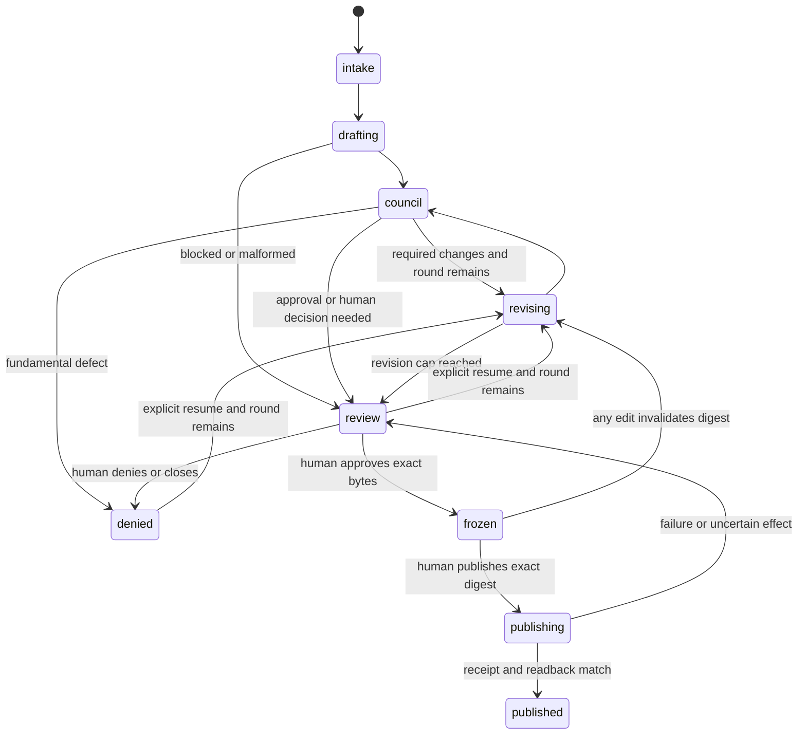

# Hermes Kanban Document Workflows Roadmap

Status: revised proposal for approval

## Decision, users, and outcomes

Approve one visible Hermes Kanban workflow for PRDs, design docs, and roadmaps.

- Engineers need useful docs sooner and fewer rewrite cycles before implementation.
- Product teams need clear users, outcomes, scope, and required changes.
- Leadership needs one view of progress, quality, cost, blockers, and publication.
- Today, `doc-write` lifecycle state is split between Postgres, the Compose controller, Hermes Runs, and Fleet Controller. Roadmaps have no first-class workflow.
- Target outcomes are faster accepted docs, lower rewrite and cycle cost, bounded review, and no lost, duplicate, or unapproved publication effects.

M0 must lock the baseline, canary sample, and numerical pass/stop thresholds before its first canary. Its first PRD readout must cover the first five canary operations and arrive within five business days of canary admission.

## Scope

In:

- intake, drafting, council, at most two revisions, human review, exact-byte publication, and rollback;
- persistent `prd-write`, `design-write`, and `roadmap-write` boards;
- type-specific writers, rubrics, councils, and immutable artifacts;
- reuse of one workflow and publication contract across all three document types.

Out:

- automatic publication;
- changes to memory curation, `pr-review`, `pr-maintain`, or PR safety;
- custom profile management or inspection;
- a parallel journal or Postgres lifecycle for document work;
- committed legacy deletion. M4 makes that decision after validation.

## Source of record

Hermes Kanban task, event, and run state is the lifecycle source of record. Hermes task attachments hold immutable intake, draft, revision, council, final, publication-receipt, readback, and rollback artifacts. The root task points to the current attachment and state.

The publication target is an external effect, not lifecycle state. The workflow records its request, receipt, and readback as attachments. Repo code may use only supported Hermes CLI or API operations. It must not read or mutate Hermes state files, SQLite, or profile internals.

Hermes profile names are trusted operator contracts:

| Type | Board | Writer profile |
| --- | --- | --- |
| PRD | `prd-write` | `prd-write-v1` |
| Design | `design-write` | `design-write-v1` |
| Roadmap | `roadmap-write` | `roadmap-write-v1` |

## Lifecycle



The flow keeps one operation visible from intake through external effect. Humans control publication and any restart after denial; the system never hides uncertainty by creating another operation.

| State | Actor that moves it | Allowed next states |
| --- | --- | --- |
| `intake` | requester or admission adapter | `drafting` |
| `drafting` | type writer | `council`, `review` |
| `council` | council runner after all required results | `revising`, `review`, `denied` |
| `revising` | type writer | `council`, `review` |
| `review` | human | `revising`, `frozen`, `denied`, or close operation |
| `frozen` | human | `publishing`; any edit moves to `revising` |
| `publishing` | publication adapter | `published`, `review` |
| `published` | none | terminal; rollback is a new human action on the same operation |
| `denied` | human | explicit `revising` resume only while a round remains, new operation, or close |

Round 0 is the initial draft. Two writer revision rounds are allowed. At the cap, required changes move the operation to `review`; a human closes it or starts a new operation. A human may override denial only with an explicit resume while rounds remain or a new operation.

## Artifact, graph, and verdict contracts

- One operation ID is the Hermes tenant and one root task covers the full operation.
- Draft, revision, final, council, decision, receipt, and readback attachments are immutable and digest-addressed.
- Each revision records its parent digest, delta, complete resulting bytes, and resulting digest.
- Any edit after freeze invalidates the frozen digest and returns the operation to `revising`.
- Every graph task has deterministic key `{operation,type,round,role}`.
- Parent edges and graph-contract version are recorded. On restart, the runner adopts matching tasks and attachments instead of duplicating them.
- Each milestone must prove deterministic keys, parent edges, version handling, and restart adoption before activation.

```text
verdict: approve | revise | deny | needs-human
blockers: defects that prevent approval
required: changes needed for approval
optional: non-blocking improvements
residual: accepted risk or uncertainty and owner
```

Missing or malformed results, unresolved specialist conflict, and uncertain effects go to `review`. Synthesis classifies findings but cannot rewrite the document or erase a blocker.

## Councils

Initial councils stay small:

| Type | Core council |
| --- | --- |
| PRD | `product-pm`, `mvp`, `occams-razor` |
| Design | `software-architect`, `mvp`, `occams-razor` |
| Roadmap | `product-pm`, `vp-eng`, `mvp`, `occams-razor` |

Add a lens only when its trigger is recorded:

| Lens | Trigger |
| --- | --- |
| `ceo` | cross-company strategy or executive commitment |
| `cto` | irreversible technology strategy or cross-org platform choice |
| `generalist-swe` | cross-stack integration or maintainability risk |
| `red-team` | abuse case, adversarial use, or disputed critical assumption |
| `reliability-sentinel` | availability, scale, recovery, or operational risk |
| `security` | credentials, sensitive data, trust boundary, or external-effect risk |
| `cost-finops` | material spend, capacity, or budget trade-off |

A council has at most seven members. This uses the requested broader roles when relevant without paying their cost on every document. Delta councils always include `mvp` and `occams-razor`, then only owners of unresolved blockers. All members review the same immutable bytes in parallel; missing results cannot become approval.

## Publication and rollback contract

- Human action binds operation ID, target, exact final bytes, media type, and SHA-256.
- Publication uses compare-and-swap against the expected target state and a stable idempotency key derived from operation, target, and digest.
- Success requires a durable receipt and target readback whose digest matches the frozen digest.
- Failure or uncertainty returns to `review`; the runner does not rerun an uncertain effect.
- Rollback is a separate human-approved external effect with its own receipt and readback.

M0 defines the target-specific CAS, idempotency, receipt, readback, and rollback details. Later document types reuse that contract.

## Metrics and gates

M0 locks exact baselines and thresholds before canary admission; this proposal does not invent them.

- human acceptance rate and material-rewrite rate;
- intake-to-publication time;
- human edit distance or required-change rate;
- model and workflow cost per accepted document;
- lost or duplicate operations, tasks, artifacts, or publications;
- frozen/published digest mismatch and unapproved publication count;
- revision-cap, orphan-task, restart-adoption, and rollback results.

Loss, duplication, digest mismatch, and agent publication remain zero-tolerance stop conditions. Admission also stops on a locked quality, time, or cost threshold breach.

## Milestones

Each milestone gets one plan-to-launch run. Grounding, PRD/DD, council, implementation plan, implementation, review, activation, and readout stay in that run. Implementation and activation use separate PRs.

| Milestone | Work | Exit |
| --- | --- | --- |
| M0: PRD vertical | Lock baseline, first-five sample, thresholds, and rollback owner. Build `prd-write` from intake through draft, core council, at most two revisions, human exact-byte publish, receipt/readback, and rollback. Land inert implementation, then activate named canaries in a separate PR. | First five canaries produce a readout within five business days; quality/cost gates pass; no safety stop fires; deterministic graph and restart adoption pass; rollback drill passes. |
| M1: Design reuse | Reuse the M0 engine and publication contract for `design-write`; add design rubric, core council, and triggered lenses. Implement and activate in separate PRs. | Locked design gates, graph acceptance, publication checks, and rollback drill pass. |
| M2: Roadmap reuse | Reuse the same contracts for `roadmap-write`; add roadmap rubric, capacity/dependency inputs, and core council. Implement and activate in separate PRs. | Locked roadmap gates, operation visibility, publication checks, and rollback drill pass. |
| M3: evidence-driven shared operations | Only if M0-M2 evidence shows a repeated cross-board gap, add the smallest shared alert, reconciliation, operator, or cost control. | Named evidence is resolved without changing type-specific rubrics or expanding default councils. If no shared gap exists, skip M3. |
| M4: legacy retirement decision | After all activated types pass their locked validation windows, compare remaining Postgres/Fleet document responsibilities, history needs, rollback risk, and operating cost. | Human decision records retain, defer, or open a separately approved deletion plan. Legacy deletion is not committed scope. |

Do not overlap first canaries for two new document types. A board rollback stops admission, preserves Hermes state and attachments, exposes uncertainty in `review`, and never creates a replacement operation for an uncertain publication.

## Council outcome

- Council level: minimal.
- Verdict: `revise`; `pass-after-changes` when this revision lands.
- Named dissent: `software-architect` wanted an immutable profile fingerprint. The proposal dismisses it because the Hermes profile name is the trusted operator contract and repo code must not inspect profile internals.
- Trade-off: full councils can catch more specialist issues, but they increase latency, spend, and synthesis conflict. Triggered lenses keep that safety option for relevant risk.

## Next gate

Approve M0 for a plan-to-launch run that locks its baseline, first-five canary sample, numerical thresholds, publication contract, and rollback owner before implementation.
