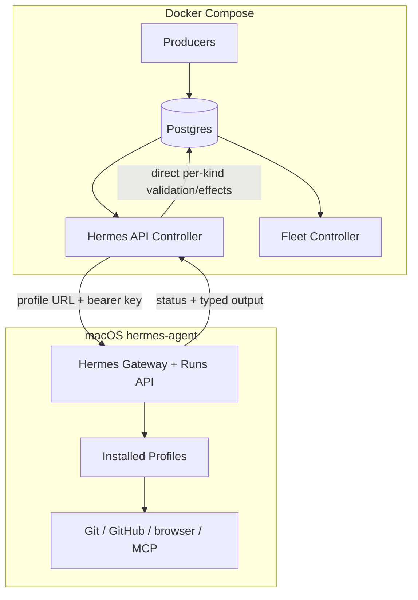
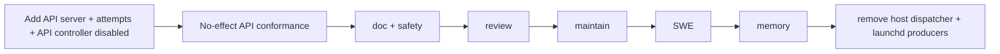

# DD: API-Driven Hermes Control Plane

- status: draft
- owner: Zhach
- reviewers: architecture, reliability, security, simplicity
- PRD: [PRD-api-driven-control-plane.md](PRD-api-driven-control-plane.md)
- grounding: [grounding-api-control-plane.md](grounding-api-control-plane.md)
- next gate: minimal/full council

## Decision

Compose owns queue control.

Host Hermes owns agent runs.

Use the Runs API. Remove host dispatcher and launchd producers.

## Scope

In:

- Compose producer services;
- Compose API controller;
- Hermes API/multiplex/key setup;
- durable run attempt ledger;
- per-kind DB caps and route fencing;
- all six kinds;
- deterministic doc/safety/memory post-processing;
- kind-by-kind cutover and rollback.

Out:

- containerized Hermes;
- Docker socket;
- SSH back to host;
- multi-host scheduling;
- profile sandbox claims;
- changing merge ownership.

## System



Notice:

- No Compose process gets OAuth, deploy key, or host agent credentials.
- No host process polls Postgres or owns queue state.
- One API boundary joins the systems.
- Model-only role effects stay in direct per-kind controller branches.

## Components

| Component | Owns | Does not own |
|---|---|---|
| Compose producers | discovery and enqueue | model calls |
| Postgres | queue, lease, route generation, attempts, decisions | agent process |
| API controller | claim, caps, API submit/poll/stop, strict per-kind validation/effects, settlement | provider/Git credentials |
| Hermes gateway | profile execution, tools, sessions, run status | queue truth |
| profiles | role prompt/tool behavior | durable queue transitions |
| Fleet Controller | human decisions and operations UI | model execution |

## Queue Route, Cap, And Operation Fence

One small control table:

```sql
hermes_kind_routes(
  kind text primary key,
  route text check (route in ('native','api')),
  generation bigint not null,
  max_concurrent integer not null
)
```

One claim function accepts `expected_route`.

In one transaction it:

1. locks kind route row;
2. checks route and generation;
3. counts attempts that may still execute against the kind cap;
4. picks oldest queued request with `SKIP LOCKED`;
5. derives per-kind operation key;
6. rejects an operation with any active or uncertain attempt;
7. claims request + reserves attempt.

Canonical capacity predicate:

```sql
state = 'submitting'
```

`submitting` covers reserved, POST-in-flight, accepted/running, and stop-unconfirmed. These are
predicates over columns, not extra states:

- reserved: `state='submitting' AND first_submit_at IS NULL`;
- first POST allowed: `state='submitting' AND first_submit_at IS NULL`;
- replay allowed: `state='submitting' AND first_submit_at IS NOT NULL AND now() < replay_until`; 
- accepted/running: `state='submitting' AND run_id IS NOT NULL AND terminal_status IS NULL`;
- stop-unconfirmed: `state='submitting' AND stop_requested_at IS NOT NULL AND terminal_status IS NULL`.

`completed`, `failed`, and `reconcile` do not consume a kind slot. `reconcile` means no run is
believed capable of further execution, but its operation key stays blocked until a human records
`done`, `not-done`, or `abandoned`.

Final pre-submit CAS:

- controller locks attempt + route row immediately before POST;
- route/generation/auth/profile generation must still match;
- attempt must still be submitting and owned by live queue nonce;
- CAS stamps `submit_started_at` and increments bounded submit count.

Route switch uses the same route-row lock. It refuses while old-generation attempts remain
`submitting`. Old-generation `reconcile` rows may survive the switch; their operation keys continue
to block only matching work across both routes, allowing unrelated work to meet rollback RTO.

No separate native/API claim implementations.

## One Fleet Runs Ledger

Generalize and migrate the existing `hermes_doc_runs` mechanism. Do not keep two ledgers.

```sql
hermes_runs(
  request_id bigint references requests(id),
  attempt_no integer,
  operation_key text,
  route_generation bigint,
  auth_generation bigint,
  profile text,
  profile_generation text,
  idempotency_key text unique,
  request_bytes bytea,
  request_digest text,
  state text check (state in ('submitting','completed','failed','reconcile')),
  submit_count smallint check (submit_count between 0 and 8),
  first_submit_at timestamptz,
  replay_until timestamptz,
  submit_started_at timestamptz,
  stop_requested_at timestamptz,
  stop_confirmed_at timestamptz,
  run_id text unique,
  terminal_status text,
  output_digest text,
  reconcile_outcome text check (reconcile_outcome in ('done','not-done','abandoned')),
  reconcile_reason text,
  reconciled_by text,
  reconciled_at timestamptz,
  error text,
  created_at timestamptz,
  updated_at timestamptz,
  primary key(request_id, attempt_no)
)
```

Required constraints:

- immutable operation, route/auth/profile generations, request bytes/digest, idempotency key;
- digest must equal exact serialized request bytes;
- one open attempt per request;
- one active-or-uncertain attempt per operation key;
- legal transitions enforced by SECURITY DEFINER CAS functions;
- settlement requires live queue nonce and same route generation;
- migrate doc run evidence, then retire `hermes_doc_runs` and old helpers in the same rollout.

`terminal_status` carries Hermes detail (`completed`, `failed`, `cancelled`, `interrupted`). Four
controller states remain enough; no mirror of every upstream state.

## Admission And Replay

1. Atomic queue claim + attempt reserve stores exact serialized POST bytes, digest, stable key, and all generations.
2. Final pre-submit CAS rechecks route/generations/nonce.
3. In that DB CAS, set `first_submit_at=clock_timestamp()` if null, set
   `replay_until=first_submit_at + interval '23 hours'`, and stamp `submit_started_at`; POST exact bytes.
4. On 202, store run ID with CAS.
5. On lost response, replay exact bytes/key. Same run ID required.
6. On 429, renew lease and retry the same key/body with exponential jitter, maximum 8 total POSTs
   and 5 minutes. `submit_count` increments in each pre-submit CAS. Then release safely only if Hermes
   never admitted; otherwise reconcile.
7. On 409, reconcile.
8. `replay_until = first_submit_at + 23 hours` (one-hour margin under Hermes 24-hour retention). After it, never POST; reconcile.
9. On restart, poll stored run ID. If run ID was not stored, replay exact bytes/key before deadline.
10. Digest terminal output before strict parsing.

## Credential And Profile Generations

Pin supported Hermes runtime:

- version `0.21.3`;
- commit `14efb46089250e8b9e56e59b74291cf8dce8b207`;
- Runs API conformance fixture required before startup and upgrade.

`profile_generation` is SHA-256 over immutable profile files + pinned Hermes manifest. Controller
rejects pre-submit mismatch. Profile replacement requires kind pause and drain/quarantine.

Each profile has `auth_generation` and one distinct API key. Rotation protocol:

1. pause kind/producer;
2. block route switch and new claims;
3. drain or reconcile every old-auth attempt;
4. retain old key until old runs are terminal and poll/stop is complete;
5. write new key to profile and controller secret;
6. preflight wrong-key denial + right-key Runs conformance;
7. increment auth/route generation;
8. resume.

Emergency rotation sequence:

1. pause route/producers;
2. revoke/replace profile key and restart the pinned gateway, which must conformance-test that all
   old runs become terminal `interrupted` and their processes exit;
3. move those attempts from `submitting` to `reconcile` with operation fences intact;
4. preflight new key/profile;
5. increment auth/route generation and resume unrelated operations.

If process termination cannot be proven, attempts remain `submitting`, consume capacity, and route
stays closed. Never replay an old attempt under a new key.

## Runs API Contract

Endpoint:

```text
POST http://host.docker.internal:8642/p/<profile>/v1/runs
GET  http://host.docker.internal:8642/p/<profile>/v1/runs/<run_id>
POST http://host.docker.internal:8642/p/<profile>/v1/runs/<run_id>/stop
```

Headers:

```text
Authorization: Bearer <profile-specific key>
Idempotency-Key: request:<id>:attempt:<n>:generation:<g>
```

Body:

```json
{
  "input": "<immutable rendered prompt>",
  "session_id": "fleet-<kind>-<request-id>-<attempt>",
  "instructions": "Return only the required typed result"
}
```

Controller accepts only:

- HTTP 202 on submit/replay;
- same run ID for same key/body;
- terminal status from authenticated same-profile route;
- strict kind schema in `output`.

## API Keys And Gateway

Gateway config:

```yaml
gateway:
  multiplex_profiles: true
  api_server:
    enabled: true
    host: 127.0.0.1
    port: 8642
    max_concurrent_runs: 10
```

Key rules:

- one random key per named profile;
- key stored in profile `.env`, mode 0600, owner `hermes-agent`;
- key bundle stored as one Compose secret, root/operator owned;
- controller maps kind to fixed profile + fixed key;
- caller cannot choose profile;
- keys never logged or sent to model;
- wrong profile/key pair must return 401 in preflight;
- controller image receives the bundle; no producer/status/nginx container receives it;
- controller compromise equals API invocation authority for every fleet profile. This is an explicit
  TCB consequence, accepted by the owner at launch approval; it does not expose provider OAuth or
  deploy-key files directly.

Network contract:

- macOS Docker Desktop only for v1;
- API binds `127.0.0.1:8642`; never `0.0.0.0`;
- controller reaches `host.docker.internal:8642`;
- startup preflight proves container→loopback reachability, right-key success, wrong-key/profile
  denial, no CORS, and listener bound only to loopback;
- failure keeps controller unready and claims closed.

No generic admin/dashboard API key in controller.

## Per-Kind Contracts

### pr-review

Hermes:

- exact-head review;
- GitHub review write;
- marker/read-back dedupe;
- typed JSON output.

Controller:

- operation key: `review:<repo>#<pr>@<head>`;
- render immutable repo/PR/head input;
- strict parse;
- unknown/interrupted → human reconcile; same operation stays blocked.

Direct-effect kind. No blind second run and no auto-confirm adapter in v1. Marker is evidence for the
human disposition.

### pr-maintain

Hermes:

- exact branch/head worktree;
- one bounded fix pass;
- force-with-lease;
- replies/thread resolution;
- typed pushed head/result.

Controller:

- operation key: `maintain:<repo>#<pr>@<claim-head>:round:<n>`;
- enforce three-round cap via DB;
- strict parse;
- unknown/interrupted → human reconcile; operation stays blocked.

Direct-effect kind. No blind second run and no auto-confirm adapter in v1.

### swe-implement

Hermes:

- clone, branch, edit, test, push, draft PR;
- operation marker/read-back;
- typed PR URL.

Controller:

- operation key: existing SWE dedupe/operation identity;
- validate PR URL and repo;
- unknown/interrupted → human reconcile; operation stays blocked.

Direct-effect kind. No blind second run and no auto-confirm adapter in v1.

### doc-write

Hermes:

- zero-tool/model-only;
- output strict draft/questions or final document.

Controller:

- stage exact bytes;
- route questions;
- create immutable approval record;
- publish approved bytes with existing deterministic helper;
- run crash reconciler.

No model filesystem publication access.

### pr-safety-review

Hermes:

- file/read-only analysis;
- strict result only.

Controller:

- validate snapshot/head/base/diff/policy before submit;
- write immutable handoff;
- incident-only human queue insert;
- clear result creates no human row.

No model DB/GitHub write credentials.

### memory-curate

Hermes:

- receive bounded source bytes in prompt;
- propose strict memory candidates.

Controller:

- base secret/shape/dedupe gate;
- team write;
- stricter org gate/write;
- watermark only after successful model run.

No model retain endpoint.

## Lease And Effect Policy

Controller renews lease while run is nonterminal.

On renewal failure:

1. stop all deterministic effects and settlement;
2. POST stop to same profile/run;
3. poll for at most 60 seconds;
4. terminal cancelled/failed/interrupted is recorded; otherwise `stop-unconfirmed`;
5. never settle with stale nonce;
6. same attempt remains recovery owner; no second run is admitted.

Recovery owner resumes same attempt:

- poll known run ID; or
- replay exact POST key/body to recover run ID.

Direct-effect kinds:

- interrupted, cancelled after uncertainty, missing run, or stop-unconfirmed → human reconcile;
- operation key remains dedupe-blocking across producer runs and route changes;
- never create new attempt automatically;
- read-back markers are evidence only in v1; human records done/not-done/abandoned.

Model-only kinds:

- no deterministic effect before completed output;
- interrupted before output may settle failed and allow producer retry under normal retry cap.

## Controller Concurrency

DB enforces per-kind caps inside API claim.

Gateway enforces global cap 10.

Controller claims only after a DB slot exists. Every attempt with `state='submitting'` counts
against caps even if the queue lease expired; accepted/running/stop-unconfirmed are derived
predicates inside that state. Terminal human-reconcile rows release global capacity
but keep their operation key blocked. 429 does not create a new attempt and waits at most five
minutes. Fair scan order:

1. oldest queued per kind;
2. round-robin kinds;
3. caps prevent maintain from taking review/SWE slots.

One controller replica in first release. DB cap still prevents accidental second replica overlap.

## Compose Shape

New image: `agent-fleet/hermes-controller`.

Services:

- `hermes-controller` — API queue controller with direct per-kind branches;
- `pr-producer-review`;
- `pr-producer-maintain`;
- `pr-safety-producer`;
- `memory-curate-producer`.

Mounts for controller:

- shared doc stage read/write;
- private-docs inbox write (publication only);
- safety snapshot read-only;
- safety handoff write;
- pinned safety policy read-only;
- API key bundle secret;
- exact serialized prompt bytes are stored in Postgres, not a filesystem mount.

No mounts:

- service account home;
- OAuth;
- SSH keys;
- GitHub write token;
- browser profile.

Producers get read-only GitHub token only.

## Security

Accepted risk:

- profiles are not sandboxes;
- direct-effect profiles share `hermes-agent` credential union;
- user accepted full autonomy.

Required controls:

- profile route fixed server-side in controller;
- distinct API keys;
- loopback API bind;
- Compose secret mount;
- exact input/output schemas;
- no controller profile/model override;
- max input/output bytes;
- per-kind/global caps;
- model-only roles have no effect credentials in prompt/controller;
- direct-effect uncertainty reconciles.

No claim that API transport reduces host profile authority. It reduces orchestration duplication.

## Reliability

| Failure | Result |
|---|---|
| controller crash before POST | attempt reserved; resume same key/body |
| crash after accept before run ID stored | exact replay returns original run ID |
| gateway restart | run becomes interrupted; controller applies kind policy |
| DB lease loss | stop request; stale nonce cannot settle; reconcile if effectful |
| 429 | same attempt waits/backoffs |
| malformed output | failed/reconcile; no deterministic effect |
| Compose restart | attempt ledger resumes polling/replay |
| API unreachable | bounded wait; same attempt remains owner; model-only safe release or direct-effect reconcile |
| key rotation with old run | rotation blocked until drain/reconcile; old key retained for poll/stop |
| duplicate producer request for uncertain effect | operation-key uniqueness blocks enqueue/admission |

## Observability

Fleet Controller shows:

- request ID;
- attempt number;
- profile;
- route generation;
- Hermes run ID;
- API state;
- queue lease age;
- output digest;
- reconcile reason.

Metrics/logs:

- enqueue-to-submit latency;
- submit-to-start latency;
- run duration;
- 429 count;
- replay count;
- idempotency conflict count;
- interrupted count;
- lease-loss stop result;
- per-kind active/cap;
- malformed output count;
- deterministic effect failures.

Never log API keys or raw private prompts.

## Migration



Per kind:

1. producer pause;
2. drain native running row;
3. route switch native→api; generation++;
4. start API controller kind;
5. bounded live pilot;
6. resume producer;
7. observe 3 successful operations or one full schedule cycle;
8. keep native fallback installed for a 7-day bake window.

Rollback:

1. pause producer;
2. stop new API claims;
3. stop/poll active Runs;
4. reconcile uncertain API attempts;
5. route switch api→native; generation++;
6. start native dispatcher kind;
7. resume producer.

Only untouched queued rows move routes. API-attempt rows stay pinned or reconcile. Rollback owner is
Zhach. Target RTO is 15 minutes **when termination is confirmed**. If process termination cannot be
proven, fail-closed safety overrides RTO: route remains closed until operator disposition; no degraded
route may start a potentially duplicate effect. Before removing native fallback, rehearse rollback
under lost 202, gateway restart, lease loss, and termination-unconfirmed escalation.

## Alternatives

| Option | Result | Decision |
|---|---|---|
| Current host fork dispatcher | duplicates Hermes lifecycle; proven setup bugs | reject |
| Containerize Hermes | mounts host credentials/state; browser/worktree friction | reject |
| Compose controller + host Runs API | clean control/execution seam; existing API | choose |
| Compose calls a new host RPC executor | duplicates Runs API | reject |
| Hermes cron only | weak durable queue/effect integration | reject |

## SPADE

- setting: eliminate duplicate execution orchestration after repeated live failures
- owner/approver: Zhach
- consulted: architecture, reliability, red-team, simplicity council
- decision: Compose controller uses profile-scoped Runs API; Hermes remains host-native
- explanation: PRD/DD/plan + per-kind rollout evidence

## Open Questions

| Question | Owner | Blocks |
|---|---|---|
| API key bundle implementation: `{generation, profiles:{name:{key}}}`; root/operator 0600 Compose secret | implementation | no |
| Controller language: Python 3.11 with pinned `aiohttp` + `psycopg` in one image | implementation | no |
| Direct-effect read-back: human reconcile only in v1 | owner | no |
| Stop deadline: 60 seconds, then stop-unconfirmed reconcile | owner | no |

## Stop Conditions

Do not implement past scaffold if:

- per-profile key routing fails closed incorrectly;
- accepted POST cannot recover run ID by exact replay;
- route fence allows native/API overlap;
- controller cannot stop/reconcile on lease loss;
- deterministic gates require giving model direct DB/publication/memory credentials.
