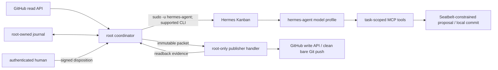

# DD: Direct PR Operations
- status: proposed;
- owner: fleet operator;
- PRD: `PRD-direct-pr-operations.md`;
- implementation: `plan-direct-pr-operations.md`;
- migration order: `pr-review`, then `pr-maintain`;
- activation: separate human action, never merge side effect.
## Decision
Use Hermes Kanban as lifecycle authority for new review and maintenance work. Keep exactly one persistent board per kind. Use one small root-owned coordinator for admission, policy, recovery, and effects. It uses official Hermes CLI as `hermes-agent`; it never imports Kanban internals or opens its database.

Split authority:
| Principal | Can | Cannot |
| --- | --- | --- |
| model profile under `hermes-agent` | call task-scoped proposal/workspace tools; create local commit in sandbox; block own card | use host shell/file/network; read Hermes home/journal; use GitHub write credential; publish; complete; request human review |
| Seatbelt-constrained workspace child | edit/test/commit inside one bound worktree | read disallowed host state or credentials; network; mutate Kanban |
| root coordinator | discover; journal; validate; invoke CLI; execute root-only publisher handler; finalize | infer success from model text or command exit alone |
| authenticated human | dispose `review` item | alter immutable admission, intent, receipt, or prior disposition |

Root is trusted control code. Task-scoped tools and OS-enforced Seatbelt policy keep model actions away from host control state. Root-only publisher handlers keep GitHub credentials out of model processes, environments, files, keychains, arguments, and logs. GitHub rules remain final wall for protected branches, workflows, deployment, administration, and merge.
## System And Trust Boundaries


- GitHub text, code, comments, CI, model output, and card metadata are untrusted.
- Journal identity and root-owned validators are policy authority.
- Kanban owns task status and run history.
- GitHub readback owns external-effect fact.
- No publisher credential crosses into `hermes-agent`, sandbox worker, MCP environment, worktree, process arguments, or logs.
- Maintain publisher never opens model-writable Git configuration. It imports validated commit objects into clean publisher-owned bare state with system/global config disabled, hooks disabled, canonical remote, no filters, no submodules, and no credential helpers from worktree.
## Boards, Identity, And Journal
Boards are fixed: `pr-review` and `pr-maintain`. Startup refuses missing, duplicate, renamed, or unexpected owned boards.

Canonical values:
```text
review_identity   = canonical(kind, repo, pr, head)
maintain_identity = canonical(kind, repo, pr, head, feedback_digest)
operation_id      = <kind>-<sha256(identity)>
tenant            = operation_id
lineage           = <repo>#<pr>
```

Only validated `operation_id` enters paths. Raw identity stays inside each record and is rehashed on read. Opens use fixed parent directories, `O_NOFOLLOW`, owner/mode/link checks, and path confinement.

Maintain admission also stores immutable round `1..3`. `feedback_digest` is required lowercase SHA-256 of the non-empty actionable snapshot; head remains its safety fence, not its sole trigger. Cutover records a one-time lineage-round floor with the exact historical feedback digests from drained Postgres history and blocks if they are unavailable. Round count includes every admitted snapshot across engines and heads. Supersede or post-reservation crash never refunds a round. Round 4 is rejected before task creation.

Root-owned state, mode `0700`; immutable records, mode `0600`:
```text
state/direct-pr/
  modes/<kind>.json
  cursors/<kind>.json
  lineages/<sha256(lineage)>/
    floor.json
    rounds/<round>-<operation_id>.json
  operations/<operation_id>/
    admission.json
    binding.json
    effects/<sequence>-intent.json
    effects/<sequence>-receipt.json
    quarantine.json
    dispositions/<sequence>.json
    closure.json
```

Records use exclusive create, canonical JSON, digest chaining, file and parent `fsync`. Mutable mode/cursor files use temp-write, `fsync`, rename, parent `fsync`. Journal does not mirror task status. One per-kind lock serializes both engine paths. Maintain reserves next round under this lock before admission; same operation replays same reservation. Crash after reservation consumes round. Different-head races cannot reserve same round. Every committed record is synchronously copied to an operator-configured separate failure domain. Startup verifies both copies and blocks admission on mismatch. Restore reconciles journal, Kanban, and GitHub before ingress opens.

Admission binds kind, tenant, operation, lineage, round, exact head, base/head metadata digest, authority digest, discovery cycle, mode generation, engine, board ID, and profile generation. Binding adds task ID, title/body digest, workspace, assignee/profile/model, and creation readback. Any conflict quarantines before dispatch.
## Deterministic Discovery
One root coordinator is the sole admission front door. `--kind` and mode select handler, not another producer. Both Postgres rollback and Kanban paths create/read same admission before queue mutation.

1. acquire kind lock and capture mode generation, cycle end, and authority digest;
2. enumerate every allowed repository with paginated GitHub reads, not result-order-dependent search;
3. apply current kind eligibility; for maintenance, admit only a changed non-empty actionable feedback digest;
4. resolve exact PR head and required metadata;
5. sort by repository, PR, head, then maintenance feedback digest;
6. create or verify engine-neutral admission before Postgres or card mutation;
7. reject any conflicting engine owner or unresolved same-lineage maintenance work;
8. advance cursor only after every item in closed cycle is admitted, already owned, or deterministically ineligible.

Use bounded overlap on restart. Fail closed on pagination cap, authority change during cycle, unreadable head, backup mismatch, or cursor conflict. Cutover pauses both ingress paths, drains old process/children and Postgres work, closes one final discovery window, records approved history and lineage-round floors, increments mode generation, then enables one engine for an allowlisted cohort. It does not backfill old Postgres work.
## State Machine
```mermaid
stateDiagram-v2
  [*] --> Admitted
  Admitted --> Ready: exact binding verified
  Ready --> Running: Hermes dispatch
  Running --> Blocked: proposal/local commit written; model blocks
  Blocked --> Publishing: coordinator validates
  Publishing --> Closed: all intents have readback receipts; card completed; closure last
  Admitted --> Quarantined: identity or binding fault
  Running --> Blocked: human need recorded; worker claim released
  Blocked --> Quarantined: drift or invalid result
  Publishing --> Quarantined: uncertain effect or readback mismatch
  Quarantined --> Review: unassign; unblock; request-review
  Blocked --> Review: human input/judgment/capability needed
  Review --> Blocked: authenticated immutable resume disposition
  Review --> Closed: authenticated immutable terminal disposition
```

`Closed` means closure record exists after task completion readback. `Quarantined` is durable and automation-fenced. If quarantine needs human action, same task must enter `Review`; a journal record or alert alone is invalid.
## Card And Review Transitions
Creation uses blocked staging. Coordinator verifies admission, one exact tenant/operation match across active and archived cards, exact fields, and no run. It then unblocks once to `ready`.

Model has no generic terminal/file tool. Review uses one proposal MCP tool. Maintain uses one task-bound workspace MCP plus proposal MCP. Workspace commands run through pinned macOS Seatbelt (`sandbox-exec`) profile: default deny; worktree-only writes; bounded read-only toolchain; no network, service sockets, keychain, Hermes home, journal, publisher path, inherited descriptors, or uncontrolled temp; process group, CPU, memory, file, and wall-time caps. Tool closes descriptors and kills child/grandchild process group on exit. Preflight attacks paths, symlinks, sockets, child/grandchild processes, and network. Missing or drifting Seatbelt support blocks maintenance activation.

Model's only terminal handoff is:
1. proposal tool writes bounded canonical proposal and artifact digest under bound workspace;
2. for maintain, sandbox leaves one clean local commit rooted at admitted head;
3. proposal tool blocks card with typed reason and releases worker claim;
4. model stops.

Normal coordinator path keeps card blocked through publication. After all effect receipts, coordinator completes card through CLI, reads back `done`, then writes closure.

Human path always uses existing card:
1. write quarantine or human-need record with bounded question and evidence digests;
2. wait for blocked state and prove worker claim/process ended;
3. CLI unassign blocked card;
4. CLI unblock; read back unassigned `ready` with no worker;
5. CLI `request-review`; read back `review`, null assignee, no claimable run;
6. accept disposition only through authenticated local operator action; derive actor from OS/session identity and bind decision, reason/answer, operation, task, nonce, prior state digest, and time in immutable record.

Pinned-runtime preflight proves `assign ... none`, `unblock`, `request-review`, `show`, and `complete` through real CLI/readback. It also proves no default-assignee auto-promotion. Unassigned `ready` and `review` cards are non-dispatchable. If one proof fails, activation stays blocked.

No timer or producer reopens `review`. `resume`, `effect_confirmed`, `effect_absent_retry_authorized`, `abandon`, and `supersede` are explicit dispositions. A retry after uncertainty needs `effect_absent_retry_authorized`, a new intent sequence, and fresh exact-head checks. It is never automatic.
## Effect Protocol
For each effect:
1. validate live authority, lineage, exact head/branch, card binding, proposal, and prior receipts;
2. write immutable intent with target, expected pre-state, payload digest, publisher identity, and sequence;
3. invoke root-only publisher handler with exact packet by file descriptor or root-readable file, never shell text;
4. perform final precondition inside publisher. Review POST pins admitted `commit_id`; push uses exact force-with-lease. Effects without server CAS are admitted-head-pinned, then post-write drift is quarantined;
5. read remote state using publisher identity plus marker, commit ID, event, payload digest, creation window, remote SHA, comment ID, or thread ID;
6. write receipt with captured pre-state and observed identity/digest;
7. continue only on exact match. A pre-existing marker is adopted only when publisher identity, admitted commit, event, payload digest, and intent all match; attacker-controlled text never proves effect.

| Kind | Proposal | Effects in order | Readback |
| --- | --- | --- | --- |
| review | verdict, summary, bounded inline findings, exact marker | one head-pinned GitHub review | marker, event, review ID, commit ID |
| maintain | local commit, tests, feedback ledger, proposed replies | exact lease push; each reply; each thread resolution | remote SHA; comment IDs/bodies; thread states |

Review keeps existing verdict mapping and self-review rules. Review is always pinned to admitted commit; a head race can make it stale but never attach it to another commit. Post-write drift enters human review. Acceptance promises zero wrong-commit review, not impossible atomic latest-head CAS.

Maintain requires admitted head, captured branch, one local commit parent, exact force-with-lease, one fix pass, all feedback ledgered, and round at most 3. Root validates full commit graph/tree/diff: expected parent, allowed object types/modes, no gitlinks, bounded files/bytes, and authority-defined paths. Default high-risk path classes—CI/workflows, ownership, deploy/release, IaC, security policy, and data contracts—enter human review. Enrollment proves PR-branch CI uses no sensitive secrets or privileged write token with changed code; otherwise maintenance is disabled. Head drift before first effect supersedes. Drift or uncertainty after any effect enters human review.
## Failure Rules
- Known no-effect failure may close failed or enter review when human capability is needed.
- Unknown effect outcome always writes quarantine and moves same card to `review`.
- No operation with admission, intent without receipt, quarantine, `review`, or closure can be auto-admitted by another engine. Same-lineage maintain uncertainty blocks newer heads too.
- Coordinator crash re-reads journal, CLI, and GitHub. It may finish verified bookkeeping. It cannot repeat an effect without authenticated retry disposition.
- Task/card drift, duplicate cards, wrong board, wrong profile, missing local commit, receipt mismatch, or journal corruption stops new dispatch for that kind.
## Observability
Emit bounded status, not telemetry files:

- discovery heartbeat, cycle/cursor, authority digest, candidates/admissions;
- board ID, task counts by state, oldest ready/running/blocked/review age;
- admission without binding, intent without receipt, quarantine, closure lag;
- publisher success/readback mismatch by effect type;
- exact-head supersede, lineage floor, and maintain round reservations;
- engine owner counts and old-engine drain count.

Alert on stale producer/coordinator heartbeat, stale cursor, oldest queue age, zero discovery progress, publisher saturation, any quarantine, intent older than 5 minutes without receipt, `review` transition failure, assigned/dispatchable review item, duplicate tenant/operation, round 4, credential probe failure, backup mismatch, or board/journal mismatch. Before canary, status UI names owner and runbook; deadman and queue-age alerts are exercised during restart/rollback drills. Logs contain IDs, digests, states, and bounded errors; never source, proposal bodies, credentials, or tokens.
## Rollout, Rollback, And Removal
Per kind: install inert pieces; prove discovery parity; make coordinator sole front door in Postgres mode; stop old producer; drain all old Postgres work in Postgres; close final discovery cycle; record history/round floor; increment mode generation; enable Kanban only for one allowlisted repository at concurrency one; canary; ramp; bake 50 successful jobs; hold dated rollback window; retire old route.

Rollback pauses new Kanban admission and restores old ingress for never-admitted work only. Existing Kanban operations remain Kanban-owned and visible until closure/disposition. Existing Postgres operations remain Postgres-owned. No row or card migrates.

Retirement uses exact manifest of files, services, SQL symbols, credentials, and tests. Static/runtime reachability proves other kinds safe. Historical rows keep inspect/reconcile support. Disabled old-route artifact is restored against fresh and existing databases before deletion approval. Other kinds stay unchanged.
## Rejected Options
| Option | Reason |
| --- | --- |
| model publishes directly | exposes GitHub write authority to untrusted model context |
| per-operation board | board churn; persistent board plus tenant gives enough isolation |
| reuse Postgres for effects | keeps duplicate lifecycle authority |
| separate publisher service/account | root already owns policy and invocation; narrow root-only handler gives same model separation with less lifecycle |
| container/Docker sandbox | model path must not receive Docker socket; pinned Seatbelt child gives local OS enforcement without new service |
| direct Kanban database access | unsupported and couples to Hermes internals |
| copy uncertain work to a human card | violates one visible operation and loses task history |
| auto-retry after readback failure | can duplicate review, push, reply, or resolution |
