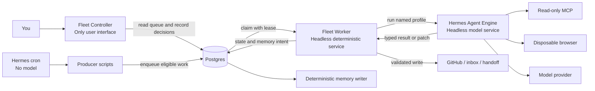

# DD: Host-Native Hermes Agent Engine

- status: draft
- responsible owner: Zhach
- reviewers: architecture, reliability, security
- decision date: 2026-09-17
- supersedes if approved: Compose-owned Hermes runtime in [`docs/hermes-migration-roadmap.md`](../hermes-migration-roadmap.md)
- related designs: [`DD-m0-m2.md`](DD-m0-m2.md), [`DD-m2-doc-runtime.md`](DD-m2-doc-runtime.md)
- next gate: human approval, then task decomposition

## Decision Need

Choose runtime shape for remaining Hermes migration.

Current Compose shape works. Cost high:

- Compose wraps Hermes s6 supervision;
- profile lifecycle fights mounted state;
- dashboard adds no required human action;
- containers block easy host OAuth, browser, and local MCP use;
- each agent migration adds deployment plumbing before agent value.

Need simpler boundary.

## Decision

Run pinned Hermes natively under dedicated unprivileged `hermes-agent` macOS account.

Use native Hermes:

- named profiles;
- loopback gateway;
- cron;
- provider OAuth;
- disposable browser;
- local read-only MCP connections;
- session and run state.

Run deterministic workers under separate unprivileged `fleet-worker` account. Fleet Workers keep Postgres leases, validation, workspace setup, approval enforcement, and external writes.

Keep Docker Compose for support services:

- Postgres;
- Hindsight and Coderag;
- read-only MCP bridge;
- deterministic memory writer;
- lightweight authenticated Fleet Controller UI.

Remove Hermes dashboard from required architecture.

## Context

Repository already proves core policy seams:

- queue leases and nonce fencing: [`lib/queue.sh`](../../lib/queue.sh);
- GitHub review and maintenance fences: [`bin/agent-server`](../../bin/agent-server);
- exact-byte document approval: [`bin/doc-writer-publication`](../../bin/doc-writer-publication);
- immutable PR-safety input: [`bin/agent-server-pr-safety`](../../bin/agent-server-pr-safety);
- human review queue: [`bin/status-server`](../../bin/status-server).

Hermes v0.21.3 supports named profile routing at `/p/<profile>/...`. Local pinned-runtime probe on 2026-09-17 confirmed profile-scoped Runs submit/poll and zero-tool behavior.

Hermes cron supports `--script --no-agent`. Producer schedules can run existing deterministic scripts without model calls.

Earlier roadmap made Compose sole deployment manifest. This design replaces that decision. Compose remains support manifest. `launchd` owns host Hermes and workers.

## Goals

| Goal | Done when |
|---|---|
| Native agent engine | Every model call names Hermes profile. No direct model SDK or Me Write runtime remains. |
| Native integrations | Approved profiles use host OAuth, disposable browser, and authenticated read-only MCP. |
| Cheap producers | Hermes cron runs producer scripts with `--no-agent`; no inference call. |
| Small human surface | One localhost UI handles approve, reject, retry, cancel, and reconcile. |
| Preserved authority | Postgres, workers, and humans retain current policy decisions. |
| Brokered model output | Hermes gets no human or GitHub write credential. Fleet Worker validates before effect. |
| Simple operation | One Hermes LaunchDaemon, worker jobs, one Compose support stack, no Hermes UI. |

## User Experience

The fleet has one user interface: **Fleet Controller**.

| Component | User interface? | Purpose |
|---|---|---|
| Fleet Controller | Yes | Shows queues. Accepts human decisions and manual requests. |
| Hermes Agent Engine | No | Runs profiles, models, browser lookups, MCP reads, and cron schedules. |
| Fleet Worker | No | Claims work, validates model output, and performs allowed effects. |
| Compose support services | No | Store queue state, memory, and code indexes. |

The user opens Fleet Controller in a browser. The user does not open Hermes to review fleet work. Hermes dashboard is not deployed.

Hermes CLI remains available for engine administration. It can show profiles, cron jobs, runs, and health. It cannot approve fleet actions.

## Use Cases

| Use case | Trigger | Hermes Agent Engine | Fleet Worker | Fleet Controller |
|---|---|---|---|---|
| Review a PR | Hermes cron finds eligible PR | `pr-review` returns verdict and findings | Validates head and posts GitHub review | Shows merge-ready or blocked result |
| Maintain a PR | Unresolved review threads | `pr-maintain` edits detached snapshot and returns patch | Validates and pushes exact PR branch | Shows escalation or round-cap stop |
| Implement a task | User submits issue, handoff, or prompt | `swe-implement` returns patch and PR proposal | Validates, pushes branch, opens draft PR | Accepts task and shows result |
| Write a document | User submits title and requirements | `doc-write` drafts, refines, and critiques | Stages and publishes exact approved bytes | Collects answers and approval |
| Run PR safety review | New immutable safety snapshot | `pr-safety` returns typed safety result | Validates snapshot and writes handoff | Shows incident candidates only |
| Curate memory | Scheduled source scan | `memory-curator` proposes memories | Validates and records approved memory intent | Shows only decisions that need a human |
| Operate fleet | User opens Fleet Controller | No action | Supplies status and executes approved control action | Shows queues, failures, and reconciliation |

Common interaction:

1. The user opens Fleet Controller.
2. Fleet Controller reads Postgres state.
3. The user approves, rejects, retries, cancels, or reconciles an item.
4. A Fleet Worker performs the allowed deterministic action.
5. Fleet Controller shows the final state.

Hermes does not receive the user's Fleet Controller session or approval credential.

## Non-Goals

- Replace Postgres with Hermes Kanban or SQLite.
- Treat profiles as security sandboxes.
- Give Hermes merge, release, deploy, publication, or approval authority.
- Public or multi-user control plane.
- Hard isolate every profile from every other profile.
- Delete current workers before replacement works.
- Build general publisher platform before role needs it.

## Architecture



What to notice:

- You interact only with Fleet Controller.
- Hermes Agent Engine has no fleet UI.
- Fleet Worker has no UI. It validates Hermes output and performs allowed writes.
- Postgres connects Fleet Controller, producers, and workers.
- OS accounts separate Hermes credentials from worker credentials.

## Authority Table

| Principal | Has | Must not have |
|---|---|---|
| `hermes-agent` | Provider OAuth, read-only GitHub discovery, enqueue-only DB role, read-only MCP, browser, detached operation workspaces | Human login, GitHub write, approval, publisher, broad DB role |
| `fleet-worker` | Worker DB role, gateway key, scoped GitHub write, clean checkout ownership, publication paths | Human approval authority |
| Fleet Controller | Actor-bound approval/reject/retry/cancel/reconcile functions | GitHub token, Hermes profile secret, arbitrary SQL |
| Support services | Service-local state, read-only MCP, authenticated UI, deterministic memory writer | Host home, worker credentials |

Canonical rule: model output is data. Fleet Worker decision code converts validated data into an effect.

## OS And Filesystem Boundary

`hermes-agent` and `fleet-worker` use separate homes, state, logs, and credentials.

Root owns:

- Hermes binary/version pin;
- LaunchDaemon manifests;
- committed profile source;
- cron definitions and producer scripts.

`hermes-agent` owns:

- Hermes runtime state;
- provider and read-only integration credentials;
- temporary profile sessions;
- explicit operation workspace only.

`fleet-worker` owns:

- queue credentials;
- GitHub write credentials;
- exact publication paths;
- worker state;
- clean checkouts and validated patch artifacts.

No ACL grants `hermes-agent` access to human GitHub config, SSH keys, login-account Keychain items, private-docs root, worker home, or UI credentials.

## Profiles

| Profile | Tools | Read context | Fleet Worker-owned result |
|---|---|---|---|
| `doc-write` | none; optional web lookup | request packet, handbook, read-only memory/code context | typed draft or critique |
| `pr-review` | none by default | immutable metadata/diff, optional read-only CI/code context | typed verdict/findings |
| `pr-maintain` | terminal, file | agent-owned detached snapshot, review threads, read-only CI/code context | patch plus typed maintenance result |
| `swe-implement` | terminal, file, optional browser | agent-owned detached snapshot, issue/handoff packet, read-only context | patch plus draft-PR proposal |
| `pr-safety` | none by default | immutable snapshot and policy | typed safety result and handoff draft |
| `memory-curator` | none by default | approved source packets | candidate memories |

Rules:

- committed profile source canonical;
- install immutable versioned profile IDs such as `pr-review-v1`; never update active profile in place;
- logical role changes route only after old runs drain;
- profile route always names exact version;
- profile credentials read-only except provider use;
- browser uses disposable profile with no human cookies or authenticated business session;
- repository instructions, browser pages, and MCP output are untrusted evidence;
- immutable repo, PR, head, base, policy, and content digests come from worker.

## Producer Scheduling

Hermes cron owns schedule. Existing producer scripts own discovery and eligibility.

```bash
hermes -p producer cron create '*/5 * * * *' \
  --name pr-review-producer \
  --script pr-review-producer.sh \
  --no-agent \
  --deliver local
```

Producer contract:

- root-owned script;
- no model call;
- read-only GitHub credential;
- enqueue-only database role;
- stable bounded output;
- one active scheduler per kind.

Tradeoff: all profiles share `hermes-agent`, so tool-enabled model runs can reach producer read/enqueue credentials. This is accepted low authority. Enqueue never grants effect.

Fleet Worker must recheck repo allowlist, current head, eligibility, retry cap, round cap, and queue-rate cap before paid execution. SQL dedupe blocks duplicate operation identity. Cutover still stops old producer before enabling cron.

## Fleet Worker Flow

1. Claim Postgres row with lease and nonce.
2. Revalidate immutable operation identity.
3. Build immutable request packet or source snapshot with no remote, hooks, credentials, or worker Git metadata.
4. Invoke exact Hermes profile through loopback Runs API.
5. Persist operation ID, exact profile ID/digest, Hermes binary digest, request/result schema versions, run ID, and request digest.
6. Validate typed result and artifact.
7. Recheck lease and remote identity.
8. Perform current deterministic effect.
9. Settle DB state or mark `reconcile` after unknown outcome.

Runs API contract:

```text
POST http://127.0.0.1:<port>/p/<profile>/v1/runs
Idempotency-Key: <operation-derived key>
```

Submit, poll, stop, and replay use original immutable profile route. Prior profile versions remain installed through rollback expiry. Unknown submit or stop result becomes `reconcile`.

## Role-Specific Effects

### Documents

Keep current exact-byte approval and publication. Hermes returns text only. Fleet Worker stages, hashes, routes human approval, then publishes approved bytes.

### PR Review

Keep current immutable request, result schema, head recheck, GitHub marker, event mapping, and server-owned review POST.

### PR Maintain

Change only push ownership:

- worker exports exact-head source snapshot into agent inbox;
- Hermes edits agent-owned detached workspace with no remote or worker Git metadata;
- worker copies patch into worker-owned inbox and validates copied bytes, never mutable source;
- worker validates changed paths, result schema, current head, exact branch, lease, and three-round cap;
- worker applies patch in clean worker-owned checkout with hooks, filters, and credential helpers disabled;
- worker pushes exact refspec with pinned force-with-lease only when required.

### SWE Implement

Same split as maintain:

- Hermes edits detached snapshot and creates patch, not PR;
- worker copies and validates patch, then applies it in clean checkout;
- worker validates branch and base;
- worker pushes and opens draft PR;
- created PR enters `pr-review` queue.

### Memory Curator

Hermes proposes candidate memories. Fleet Worker validates source, retention policy, sensitivity, and approval rule, then records approved memory intent in Postgres. Compose-internal deterministic memory writer performs Hindsight write. Hermes and host worker never receive raw Hindsight write access.

### PR Safety

Keep immutable snapshots, policy digest, typed result validation, local handoff, and incident-only human escalation.

## MCP And Browser Boundary

Raw Hindsight write REST stays Compose-internal. Do not publish it to host.

Expose authenticated read-only MCP bridge:

- Hindsight recall only;
- Coderag search/read only;
- optional CI/log read APIs;
- server-enforced method allowlist;
- separate per-profile credentials where service supports them.

Browser:

- disposable profile per operation;
- no human cookies, saved passwords, extensions, or logged-in business sessions;
- public lookup only unless read-only credential is technically enforced;
- no UI credential;
- browser evidence cannot change operation identity or grant effect authority.

## Fleet Controller

Keep existing status UI shape. Remove general fleet/dashboard ambition.

Add authentication before browser-enabled Hermes launch:

- localhost bind;
- operator login secret unavailable to `hermes-agent`;
- authenticated bounded session;
- CSRF, Origin, and Host checks retained;
- fixed action allowlist;
- actor/action audit on every decision.

Required views:

- pending document decisions;
- merge-ready reviews;
- maintenance escalations;
- PR-safety incidents;
- failures and reconciliation;
- queue depth and oldest age.

## Reliability

Supervision:

- LaunchDaemon `ai-pr-automation.hermes-gateway` runs as `hermes-agent`;
- worker LaunchDaemons run as `fleet-worker`;
- separate stop and restart controls;
- root-owned maintenance flag disables automatic restart during drain;
- binary version and SHA-256 checked before start;
- owner-only logs.

Failure behavior:

| Failure | Behavior |
|---|---|
| Hermes down | Producer/model work pauses. DB, UI, and completed effects remain. |
| Fleet Worker down | Leases expire under current rules. Unknown effects reconcile. |
| Postgres down | Producers/workers stop. Hermes stays idle. |
| MCP/browser down | Optional lookup skipped or explicit blocked result. No invented evidence. |
| UI down | Human-gated work waits. Automated safe work can continue. |

Keep current per-kind timeout, lease heartbeat, retry, round-cap, and stale-head contracts unless role migration explicitly improves them.

## Security Tradeoff

Native Hermes loses container filesystem and egress isolation.

Dedicated `hermes-agent` account limits blast radius. Profiles do not.

Residual risk:

- tool-enabled profile can read every file exposed to `hermes-agent`;
- profiles share one process and network authority;
- prompt injection can cause unwanted read or public network activity;
- browser can perform anonymous web actions.

No privileged business effect follows unless worker accepts validated result. If dedicated account is still too broad for a role, keep that role containerized. Do not claim profile isolation.

## Observability

Fleet Controller and logs show:

- queue depth and oldest age by kind/status;
- active lease and stale reclaim;
- Hermes run status by profile;
- cron last success;
- provider latency and token usage;
- pending human decision age;
- reconciliation age;
- installed profile digest.

Use no-agent watchdog cron for local notification when gateway, producer, or reconciliation age fails threshold.

## Alternatives

| Option | Pros | Cons | Decision |
|---|---|---|---|
| Keep Hermes fully in Compose | Hard runtime boundary | Native profiles, OAuth, browser, MCP, and s6 fight Compose lifecycle | Reject |
| Run Hermes as human login account | Easiest local access | Reads human credentials and private files | Reject |
| Native Hermes under dedicated account | Native capability plus OS boundary | Less isolation than per-role containers | Choose |
| One all-authority Hermes | Smallest topology | Prompt injection reaches approvals and writes | Reject |
| Keep Hermes dashboard | Session UI | Extra auth/state surface; no required action | Reject |
| Replace Postgres | Fewer services | Loses proven domain contracts | Reject |

## Rollout

### 1. Native Foundation

- create `hermes-agent` and `fleet-worker` accounts;
- install pinned Hermes and committed profiles;
- install gateway/worker LaunchDaemons;
- add authenticated UI and read-only MCP bridge;
- prove profile submit, poll, stop, replay, restart, OAuth, browser, and MCP;
- keep current routing active.

### 2. Producers

For each kind:

- create paused no-agent cron;
- run producer manually and compare eligibility;
- stop old Compose producer;
- enable Hermes cron;
- verify next tick and dedupe.

### 3. Read-Only Roles

- move `doc-write` and `pr-review` model execution to native profiles;
- keep current workers and effects;
- drain old Hermes run IDs before route change;
- remove Compose Hermes document/review runtime after both work.

### 4. Workspace Roles

- move `pr-maintain`, then `swe-implement`;
- remove GitHub write credential from agent execution;
- add worker patch capture, clean apply, validation, and publication;
- preserve current rollback image until both work.

### 5. Remaining Roles And Deletion

- move `memory-curator` reasoning;
- move `pr-safety` last;
- remove Me Write paths;
- remove Hermes Compose gateway, dashboard, egress, profile-init, and obsolete tests;
- update roadmap and runbooks.

One PR per step. Human merges and runtime activation.

## Rollback

Per role:

1. Stop new claims or cron.
2. Let active lease drain; unknown effect becomes `reconcile`.
3. Disable native route.
4. Restart previous pinned worker or producer.
5. Verify one active consumer/scheduler.
6. Never replay unknown external effect.

Keep old schema, grants, images, and manifests until final deletion gate. Native Hermes failure does not require Postgres/UI rollback.

## Validation Gates

- OS-account test: Hermes cannot read human/worker/UI/GitHub-write credentials.
- profile route test against pinned native Hermes.
- cron `--no-agent` test proves zero provider call.
- existing producer dedupe and three-round tests pass unchanged.
- result schemas reject malformed profile output.
- review/document effect tests pass unchanged.
- maintain/SWE patch cannot push without worker.
- clean-checkout publisher ignores agent hooks/config/credential helpers.
- raw Hindsight write API unreachable from Hermes; MCP methods read-only.
- disposable browser has no authenticated human session.
- dashboard-free reboot and rollback drill passes.
- repository has no direct model SDK or Me Write runtime after final phase.

## Open Questions

| Question | Owner | Blocks |
|---|---|---|
| Accept one `hermes-agent` account as shared boundary for native profiles? | Zhach | Native launch |
| Which read-only MCP and browser access belongs to each profile? | Zhach | Profile install |
| Which tool-heavy profile, if any, stays containerized after adversarial test? | Zhach | Workspace-role launch |
| Exact native install path and pin verification command? | Migration owner | Foundation implementation |

## Approval Ask

Approve:

1. Hermes leaves Docker Compose and runs natively under dedicated `hermes-agent` account.
2. Existing deterministic workers run separately as `fleet-worker`.
3. Hermes dashboard leaves required architecture.
4. Hermes cron replaces producer schedules with `--script --no-agent`.
5. Compose remains for Postgres, memory/code services, read-only MCP bridge, and authenticated Fleet Controller UI.
6. GitHub writes, approvals, exact publication, and shared-memory writes stay outside Hermes.
7. Tool-enabled profiles accept dedicated-account read/network exposure; container fallback remains allowed.

After approval: write dependency-ordered implementation plan. This document changes no runtime.
