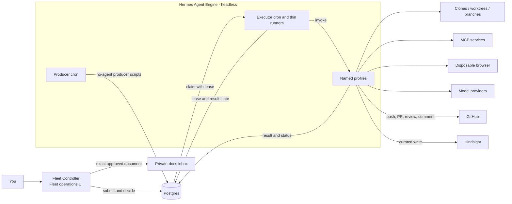

# DD: Host-Native Autonomous Hermes Fleet

- status: approved; full-autonomy direction selected
- responsible owner: Zhach
- reviewers: architecture, reliability, security
- decision date: 2026-09-17
- supersedes if approved: Compose-owned Hermes runtime in [`docs/hermes-migration-roadmap.md`](../hermes-migration-roadmap.md)
- related designs: [`DD-m0-m2.md`](DD-m0-m2.md), [`DD-m2-doc-runtime.md`](DD-m2-doc-runtime.md)
- implementation plan: [`plan-host-native-autonomous-hermes.md`](plan-host-native-autonomous-hermes.md)
- next gate: approve implementation plan

## Decision

Run pinned Hermes natively under dedicated unprivileged `hermes-agent` macOS account.

Give Hermes full agent autonomy inside approved repositories and services. Hermes can:

- schedule producers;
- claim queued work;
- create clones, worktrees, and branches;
- edit files;
- run tests;
- commit and push changes;
- open and update pull requests;
- post PR reviews and comments;
- use provider OAuth;
- use approved MCP connections;
- use a disposable browser;
- write shared memory through the curator profile.

Keep one fleet-operations and agent-gated decision UI: **Fleet Controller**. GitHub remains the PR merge UI.

Fleet Controller handles:

- task and document submission;
- pending decisions;
- exact document approval;
- incident disposition;
- retries, cancellation, and reconciliation;
- queue and fleet status.

Hermes Agent Engine keeps Fleet Controller as the operations/decision UI and exposes the host-native
Hermes dashboard for runtime diagnostics. nginx fronts both on one loopback TLS port; the Hermes UI
is Basic-Auth protected and remains outside the decision/merge authority path. Hermes CLI remains an
administrative tool.

Keep Docker Compose for support services only:

- Postgres;
- Hindsight;
- Coderag;
- Fleet Controller.

No Fleet Worker. No Effect Gateway.

## Why

Current Compose-hosted Hermes works. It also duplicates Hermes lifecycle:

- Compose wraps Hermes s6 supervision;
- profile setup fights mounted state;
- a dashboard is optional diagnostics, not a decision surface;
- containers block easy host OAuth, browser, and MCP use;
- each agent migration adds deployment plumbing.

Hermes already provides profiles, cron, tools, browser, MCP, worktrees, and gateway execution. Use those capabilities directly.

## User Experience

The fleet has one operations and agent-gated decision UI. GitHub remains the PR merge UI.

| Component | User interface? | Purpose |
|---|---|---|
| Fleet Controller | Yes | Submit work. Review queues. Make human decisions. See status. |
| Hermes Agent Engine | Administrative CLI only | Run autonomous profiles and scheduled work. |
| Compose support services | No | Store queue, memory, and code-index state. |

Normal interaction:

1. The user opens Fleet Controller.
2. The user submits work or reviews a pending decision.
3. Hermes processes eligible work automatically.
4. Fleet Controller shows progress and final state.
5. The user merges PRs in GitHub.

The user opens Hermes CLI only for profile, cron, run, or health administration.

## Use Cases

### Review A PR

Trigger owner: Hermes producer cron.

Automated decision and GitHub effect owner: Hermes.

Human decision owner: user merges or declines PR in GitHub.

Hermes:

1. Enqueues exact repo, PR, base, and head identity.
2. Runs `pr-review` profile.
3. Reads immutable diff and approved read-only context.
4. Posts review or comment to GitHub.
5. Records result in Postgres.

Fleet Controller shows merge-ready, blocked, failed, or reconcile state.

### Maintain A PR

Trigger owner: Hermes producer cron detects unresolved review threads.

Automated decision and GitHub effect owner: Hermes.

Human decision owner: user handles blocked work or work past round cap in Fleet Controller.

Hermes:

1. Claims exact PR lineage.
2. Creates exact-head worktree.
3. Reads all unresolved threads.
4. Edits code and runs tests.
5. Commits and pushes exact PR branch.
6. Replies to and resolves handled threads.
7. Records result.

Postgres still enforces maximum three automated rounds per PR lineage.

Fleet Controller shows only blocked work, round-cap stops, failures, or reconciliation.

### Implement A Task

Trigger owner: user submits issue, handoff, or prompt in Fleet Controller.

Automated decision and GitHub effect owner: Hermes.

Human decision owner: user merges or declines draft PR in GitHub.

Hermes:

1. Runs `swe-implement` profile.
2. Creates fresh clone and branch.
3. Reads task context through approved MCP or browser tools.
4. Edits code and runs tests.
5. Commits and pushes branch.
6. Opens draft PR.
7. Enqueues new PR for review.

Fleet Controller shows task, branch, draft PR, failure, or reconciliation.

### Write A Document

Trigger owner: user submits title and requirements in Fleet Controller.

Automated draft owner: Hermes.

Human approval owner: user through Fleet Controller.

Publication effect owner: Fleet Controller.

Hermes:

1. Runs `doc-write` profile.
2. Reads approved handbook, memory, code, and web context.
3. Drafts or refines document.
4. Returns open questions or final bytes.

Fleet Controller collects answers. The user approves exact bytes. Fleet Controller publishes approved document.

### Run PR Safety Review

Trigger owner: Hermes producer creates immutable safety snapshot.

Automated analysis owner: Hermes.

Human decision owner: user handles incident candidate in Fleet Controller.

Hermes runs `pr-safety` against snapshot and policy digest. Hermes writes staged handoff and typed result.

Fleet Controller shows incident candidates only.

### Curate Memory

Trigger owner: Hermes curator cron.

Automated decision and memory effect owner: Hermes.

Human decision owner: user handles policy exceptions in Fleet Controller.

Hermes runs `memory-curator`. Profile applies source, sensitivity, and retention policy. Curator writes accepted memories to Hindsight.

Fleet Controller shows only memory decisions that require a human.

### Operate Fleet

Human decision owner: user.

Control-recording effect owner: Fleet Controller.

Resulting agent-work owner: Hermes.

User opens Fleet Controller to:

- inspect queues;
- submit work;
- approve or reject exact content;
- retry safe failures;
- cancel queued work;
- resolve reconciliation;
- inspect profile and cron health.

## Architecture



What to notice:

- You use Fleet Controller for fleet operations and agent-gated decisions.
- You use GitHub for PR merge decisions.
- Hermes is autonomous but headless.
- Hermes owns repository work from clone through PR.
- Postgres keeps queue, lease, round, approval, and reconciliation state.
- Human merge and exact document approval remain outside Hermes.

## Autonomy Boundary

### Hermes Can Do

- Read approved repositories and context.
- Create and modify branches.
- Push unprotected branches.
- Open, update, and comment on PRs.
- Submit PR reviews.
- Run tests and CI-read operations.
- Browse public web with disposable browser.
- Call approved MCP tools.
- Enqueue and settle agent work.
- Curate shared memory.

### Hermes Cannot Do

Server-side controls must prevent Hermes from:

- pushing default or protected branches;
- bypassing branch rules;
- approving exact document publication;
- changing CI workflows;
- triggering deployments or releases;
- administering repositories or teams;
- reading human GitHub, SSH, Keychain, browser, or Fleet Controller credentials;
- changing human approval records;
- administering credentials at provider or GitHub issuer.

### Human Authority

Human retains:

- normal merge responsibility, enforced by operating policy rather than credential scope;
- exact document approval;
- incident disposition;
- paid-call and rollout approval;
- issuer-level credential creation, rotation, and revocation;
- changes to autonomy boundary.

## Credentials And Server-Side Controls

Run Hermes under dedicated `hermes-agent` account. Do not run as human login account.

Give that account only:

- provider OAuth;
- per-repository SSH deploy keys for branch pushes;
- dedicated `zhach1` GitHub credential with repository Write access;
- CI and log read credentials;
- approved MCP credentials;
- Hermes worker database role;
- Hindsight curator credential.

Use SSH deploy key for Git pushes and `zhach1` for PR APIs. Full autonomy means `zhach1` can technically merge after branch requirements pass.

GitHub rulesets:

- block direct default-branch push;
- block force push and deletion on protected branches;
- require pull request before default-branch update;
- require human approval where configured;
- do not list Hermes app or deploy key as bypass actor;
- deny Actions, Administration, Deployments, and Workflows permissions.

Repository enrollment gate:

- prove deploy key cannot update protected branch;
- run branch-push workflows with no write token, production secret, or deployment authority;
- reject unsafe `pull_request_target` workflows that check out agent-controlled code;
- require human approval for protected environments and releases;
- keep repository outside allowlist until all denial checks pass.

Database grants:

- allow approved enqueue, claim, lease, result, round, and reconcile functions;
- deny human approval functions;
- deny arbitrary table DML;
- enforce repo allowlist, exact operation identity, round cap, and legal state transitions in SQL.

These controls limit damage. They do not make Hermes a sandbox. Hermes can refresh access tokens and can delete its local credentials. Only issuer administration remains human-only.

## Profiles

Use immutable versioned profile IDs, such as `pr-review-v1`. Record profile digest on every run.

| Profile | Tools | Intended workflow authority |
|---|---|---|
| `doc-write` | file-free model, MCP, optional web | Staged draft only |
| `pr-review` | immutable input, read-only MCP | PR review/comment |
| `pr-maintain` | terminal, file, Git, read-only MCP | Exact PR branch, review replies |
| `swe-implement` | terminal, file, Git, browser, MCP | New branch and draft PR |
| `pr-safety` | immutable input, limited reads | Local handoff only |
| `memory-curator` | source reads, Hindsight | Curated memory write |
| `producer` | root-owned scripts, no model | Queue enqueue only |

Profile rules:

- committed profile source is canonical;
- active profile is never updated in place;
- route changes only after old runs drain;
- repository instructions, browser pages, and MCP output are untrusted;
- profile records operation ID, request digest, binary digest, and profile digest;
- every tool use should stay inside role scope.

Effective authority is union of all credentials available to `hermes-agent`. Profile rows describe normal behavior, not containment. Injected or bypassing runs can ignore lease, round, and role policy. Detection response: stop Hermes LaunchDaemon, revoke agent credentials, and reconcile affected operations.

## Scheduling And Queue Execution

Hermes cron owns producer schedules.

Use `--script --no-agent` for discovery. Producer tick makes no model call.

```bash
hermes -p producer cron create '*/5 * * * *' \
  --name pr-review-producer \
  --script pr-review-producer.sh \
  --no-agent \
  --deliver local
```

Producer script keeps current:

- repository allowlist;
- eligibility rules;
- exact operation identity;
- active dedupe;
- retry cap;
- three-round maintenance cap.

Hermes executor cron starts one thin runner per queue kind. Runner owns only process lifecycle:

1. Claim one row with lease and nonce through restricted database function.
2. Invoke exact profile.
3. Renew lease while profile runs.
4. Confirm row reached terminal or reconcile state.
5. Mark non-terminal exit `reconcile`.

Profile owns domain decision and effect. Profile calls restricted database functions to record intent, perform GitHub or memory write, read back outcome, and settle state.

Runner does not translate model result into effect. It is part of Hermes deployment, not separate service.

Full autonomy accepts these scripts as normal-path reliability, not containment. Hermes can call same credentials directly.

## GitHub Effect Rules

### Review

- Bind review to exact head SHA.
- Map typed verdict to COMMENT, REQUEST_CHANGES, or APPROVE.
- Include operation marker.
- Read back marker after unknown POST.
- Never approve incomplete diff.

### Maintain

- Confirm queued head equals current PR head.
- Process all unresolved threads each round.
- Push only PR branch.
- Use exact force-with-lease only when required.
- Stop after three rounds.
- Unknown push or thread result becomes reconcile.

### SWE Implement

- Use fresh clone.
- Create new branch.
- Open draft PR only.
- Never modify default branch.
- Enqueue created PR for review.
- Unknown push or PR-create result becomes reconcile.

## Documents And Human Decisions

Full autonomy does not remove human approval for exact document publication.

Hermes writes document and PR-safety artifacts into agent-owned staging. Fleet Controller mounts this staging read-only.

When item enters human queue, Fleet Controller:

1. Opens regular source without following symlink.
2. Copies exact bytes into Fleet Controller-owned approval store.
3. Computes digest from copied bytes.
4. Shows copied bytes and digest.
5. Records human decision through human-only database function.
6. Publishes exact approved copy.
7. Rejects mismatch or changed target.

Hermes cannot access Fleet Controller approval store or private-docs inbox. PR-safety handoff and incident disposition use same immutable-copy contract.

## MCP And Browser

MCP connections can include:

- Coderag;
- Hindsight;
- Buildkite or CI logs;
- GitHub read context;
- approved local tools.

Prefer read-only credentials. `memory-curator` is exception with Hindsight write.

Browser:

- use disposable profile per operation;
- no human cookies, saved passwords, extensions, or login sessions;
- public lookup by default;
- authenticated lookup only with dedicated agent credential;
- no Fleet Controller session.

## Fleet Controller

Fleet Controller remains small.

Required views:

- task submission;
- document questions and exact approval;
- merge-ready reviews;
- maintenance round-cap or blocked state;
- PR-safety incidents;
- failures and reconciliation;
- queue depth and oldest age;
- profile and cron health.

Security:

- localhost bind;
- operator authentication;
- session credential unavailable to `hermes-agent`;
- CSRF, Origin, and Host checks;
- fixed action allowlist;
- actor and action audit.

## Security Tradeoff

Full autonomy is deliberate.

A prompt-injected tool profile can:

- read every file exposed to `hermes-agent`;
- use read and write credentials available to that account;
- push unprotected branches;
- create or edit PRs and comments;
- enqueue work;
- write memory through available curator credential;
- make public network requests.

Profiles do not isolate these credentials from each other. Dedicated OS account protects human credentials, not profile-to-profile authority.

For enrolled repositories, tested server-side branch rules and credential permissions protect default branch, administration, deployment, workflows, and Fleet Controller decisions. Merge remains normal human policy, not a hard credential boundary.

If this risk is not acceptable, full autonomy is wrong. Add a credential broker or return tool-heavy roles to containers.

## Reliability

Keep current Postgres contracts for normal fleet execution:

- one operation identity per repo, PR, head, and kind;
- one active worker per PR lineage;
- renewable lease and nonce fencing;
- side-effect intent before effect;
- unknown effect becomes reconcile;
- stale input becomes superseded;
- exact human-approved bytes;
- maximum three maintenance rounds.

These contracts control scheduled execution. They do not contain a profile that bypasses runner and uses shared credentials directly. Detection response: stop LaunchDaemon, revoke agent credentials, inspect GitHub and Hindsight, then reconcile affected operations.

Use `launchd` for native Hermes:

- dedicated `hermes-agent` account;
- pinned binary/version digest;
- KeepAlive;
- owner-only state and logs;
- maintenance mode for drain and rollback;
- profile and cron health checks.

Failure behavior:

| Failure | Behavior |
|---|---|
| Hermes down | Producers and execution pause. Fleet Controller and Postgres remain. |
| Postgres down | Executor cron stops new claims. Active profile can still use direct GitHub credentials. Watchdog stops Hermes and alerts operator. |
| MCP/browser down | Skip optional lookup or return blocked result. |
| GitHub unknown outcome | Read back marker/ref/PR. Otherwise reconcile. |
| Fleet Controller down | Automated work continues. Human-gated work waits. |

## Alternatives

| Option | Pros | Cons | Decision |
|---|---|---|---|
| Compose-hosted Hermes | Hard runtime boundary | Blocks native profile/browser/MCP lifecycle | Reject |
| Native Hermes plus Fleet Worker | Stronger validation boundary | Duplicates worktree, branch, patch, and execution flow | Reject |
| Native Hermes plus Effect Gateway | Scoped credentials | Extra service and remote-write hop | Reject |
| Native fully autonomous Hermes | Simplest agent architecture | Larger prompt-injection blast radius | Choose |
| Human-account Hermes | Easiest setup | Exposes human credentials and files | Reject |
| Host-native Hermes dashboard behind loopback nginx + Basic Auth | Runtime diagnostics without authority | Extra local UI surface | Choose |

## Rollout

### 1. Native Foundation

- create `hermes-agent` account;
- install pinned Hermes;
- install immutable profiles;
- install paused producer and executor cron jobs plus thin lease runners;
- add provider OAuth, MCP, browser, DB, and GitHub credentials;
- add authenticated Fleet Controller;
- keep current workers active;
- run synthetic autonomy, executor lifecycle, and denial tests.

### 2. Producers

For each kind:

- create paused no-agent cron;
- compare discovery with current producer;
- stop old producer;
- enable Hermes cron;
- verify next tick and dedupe.

### 3. Document And Review

- move `doc-write` and `pr-review` to native profiles;
- preserve exact document approval;
- let Hermes post GitHub reviews;
- drain old run IDs;
- remove old Compose Hermes runtime after both work.

### 4. Maintain And SWE

- move `pr-maintain` and `swe-implement`;
- let Hermes own worktree through PR;
- validate server-side branch and merge protections;
- preserve old worker rollback until both work.

### 5. Memory, Safety, And Deletion

- move `memory-curator`;
- move `pr-safety` last;
- remove Me Write paths;
- remove Hermes Compose gateway, dashboard, egress, and obsolete tests;
- update roadmap and runbooks.

One PR per step. Human merges and runtime activation.

## Rollback

Per role:

1. Pause profile cron and new claims.
2. Let active lease drain.
3. Mark unknown effect reconcile.
4. Restart previous pinned worker or producer.
5. Verify one active consumer and scheduler.
6. Never replay unknown external effect.

Keep old schema, images, and manifests until final deletion gate.

## Validation Gates

- Hermes runs as dedicated account, not human account.
- Hermes cannot read human GitHub, SSH, Keychain, browser, or Fleet Controller credentials.
- GitHub server rejects default-branch push, protected-branch force push, unsafe workflow execution, deployment, and administration.
- Allowed profile can create branch, push commit, open draft PR, and post review.
- Cron `--no-agent` makes zero provider calls.
- Executor cron starts one thin runner per allowed queue kind and prevents overlap.
- Queue lease, nonce, dedupe, retry, and three-round tests pass in normal path.
- Unknown GitHub effects reconcile by read-back.
- Document and PR-safety artifacts are copied into Fleet Controller-owned approval store before human decision.
- Document publication still requires exact human-approved bytes.
- Disposable browser has no human session.
- Fleet Controller actions require authenticated human session.
- Gateway/dispatcher reboot works without the dashboard; dashboard failure does not stop agent work.
- No direct model SDK or Me Write runtime remains after final phase.

## Open Questions

| Question | Owner | Blocks |
|---|---|---|
| Accept cross-profile access to all `hermes-agent` credentials? | Zhach | Native launch |
| Which repositories receive Hermes deploy keys? | Zhach | GitHub setup |
| Which MCP and browser credentials belong to Hermes? | Zhach | Profile install |
| Exact native install path and pin command? | Migration owner | Foundation implementation |

## Approval Ask

Approve:

1. Hermes runs natively under dedicated `hermes-agent` account.
2. Hermes gets full autonomy inside approved repositories and services.
3. Hermes owns repository work from clone through PR and review.
4. Hermes cron replaces producer schedules with no-agent scripts.
5. Fleet Controller is fleet-operations and agent-gated decision UI. GitHub remains PR merge UI.
6. Postgres remains queue, lease, approval, round-cap, and reconciliation store.
7. Human normally performs merges and retains exact document approval, incidents, rollout, and credential control.
8. Server-side GitHub rules and scoped credentials replace Fleet Worker or Effect Gateway isolation.

After approval: write dependency-ordered implementation plan. This document changes no runtime.
