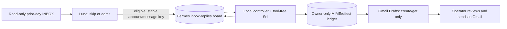

# DD: Gmail-to-Kanban triage and Gmail Drafts

- Status: draft-only workflow selected; one supervised pilot created a Gmail Draft. An owner LaunchAgent schedules drafts at 08:00 New York; no automatic email send path exists. See [PRD](PRD-inbox-replies.md) and [plan](PLAN-inbox-replies.md).

## Flow and authority

Luna receives only sender, subject, and snippet, never OAuth credentials or board tools. Intake creates one **blocked** card assigned to `inbox-sol`. It does not move the card Ready: pinned Hermes dispatcher workers inherit Kanban tools broader than this private-mail role needs. The local controller checks the card's source binding, reads only its admitted thread through the read-only adapter, and gives Sol bounded plain-text thread content and the short persona file from `~/private-docs/inbox/`. Sol receives no Gmail or Kanban tool. The controller stages MIME and a reply preview, then leaves the card blocked and unassigned for operator visibility.

The Calendar token is unchanged. Each enrolled account has its own owner-only Gmail token with `gmail.readonly` for intake and thread freshness, and a **separate** owner-only `gmail.readonly` + `gmail.compose` token for draft creation. The latter scope permits sending at the provider level, but this workflow calls no send endpoint. The existing OAuth client secret was reused. Never put these tokens, raw mail, persona files, or MIME bytes in Git or shared memory. Generated reply text is intentionally visible both on the local Kanban card and in Gmail Drafts. Hermes one-shot profile sessions retain local prompts/replies with operator consent.

## Intake and replay

Compute yesterday's `00:00` inclusive and today's `00:00` exclusive in `America/New_York`, then filter Gmail `internalDate` after paginating `labelIds=INBOX`. Both read and unread count. Stop visibly above 250 unique listed IDs. A private SQLite manifest per account records `started → complete|failed`, selected count, and per-message admitted/skipped decisions. Each manifest is bound to one Gmail account; one runner lock protects the shared board and draft ledger. Existing `started` rows become failed after the holder exits; no automatic older-date replay. A user-triggered failed-date replay re-reads the **original date** against the current INBOX and skips completed decisions. The same opaque account/message-derived Kanban key deduplicates ambiguous card creation. A changed INBOX listing can change replay eligibility; over-250 dates still overflow.

## Draft creation and uncertain effects

1. Validate the blocked card's creator, account/message key, thread ID, route, and current source head. Refuse a changed thread, wrong authenticated account, ambiguous recipient, self-addressed reply, missing plain-text body, or oversized MIME/thread data. Sol returns only bounded JSON `{"body":"..."}`; the controller owns headers and recipient.
2. Stage canonical plain-text RFC 5322 MIME in an owner-only SQLite ledger with recipient/account/thread/source fingerprint, digest, stable version and Message-ID. Copy generated text and target metadata—not the incoming message body—to the blocked/unassigned Kanban card. A changed review text needs explicit restaging; do not overwrite another actor's edit. No Kanban `Approve`/Ready cue is needed to create a Gmail Draft.
3. Recheck account, latest Gmail source fingerprint, card body, staged digest/version, and recipient before writing to Gmail. Durably mark `gmail_drafts.status=started` **before** `drafts.create`; one task can claim this effect once. Call only Gmail `drafts.create`, then `drafts.get` to verify the returned draft ID, thread, `DRAFT` label, From/To/Subject/reply ancestry, and a valid provider-assigned Message-ID. Gmail may rewrite Message-ID on draft creation; matching recipient/thread/ancestry is required.
4. Store a verified draft ID as `created` and add a content-free `gmail_draft_created` board event. On timeout or failed readback, retain any known draft ID as `reconcile`, never automatically create another. The operator can explicitly re-read a known draft ID and settle it without another create. An unknown ID needs manual inspection in Gmail Drafts before any further action. A draft deleted or edited in Gmail must not be silently recreated.

No provider API can atomically check an unchanged thread/card and create a draft. A same-user edit or new inbound mail in the final interval is residual risk; Gmail Drafts are reviewable and nothing is auto-sent. The ledger and Kanban use separate SQLite files, so final readbacks narrow—but do not eliminate—the cross-store race.

## Current state and remaining gates

The local board, restricted Luna/Sol profiles, Gmail tokens, private manifest, and draft ledger exist. A supervised prior-day pass triaged 37 messages and staged 2 Kanban previews. One eligible card produced a verified Gmail Draft; the other card is archived and was not migrated. The 08:00 New York owner LaunchAgent is loaded with owner-only logs and content-free `last-run.json`; a same-day launchd kickstart completed 0/0/0 without repeating intake. Synthetic live Kanban notices for missed/overflow/reconcile were verified and archived. No Gmail API send, send OAuth token, or sender enable file exists. The earlier `Approve`+Ready sender design and its council block are superseded by the operator's Gmail Drafts decision.

Operations: the operator reviewed the Gmail Draft and approved scheduling. `~/Library/LaunchAgents/ai.hermes.inbox-drafts.plist` currently points at the `ai-pr-automation-inbox` worktree; keep it available and repoint to a merged runtime checkout before removing it. `RunAtLoad=false`; the first scheduled interval is the next 08:00 New York. Inspect `~/.config/ai-pr-automation/inbox/last-run.json`, owner-only logs, and blocked Kanban notices for failures. Keep archived cards excluded and do not automatically backfill older Gmail dates. Stop on account mismatch, wrong recipient/thread, unresolved `reconcile`, duplicate draft, or unexpected provider/model data handling.
