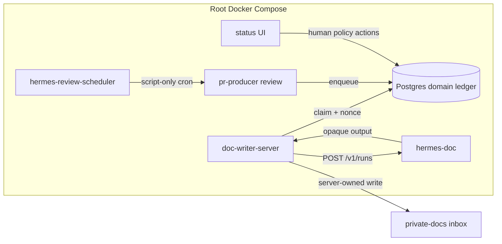
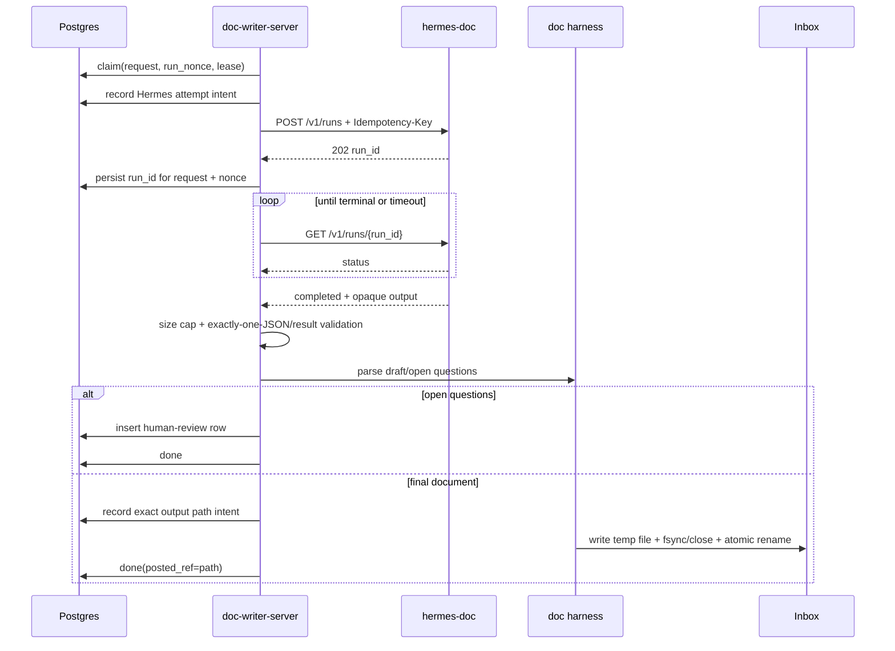
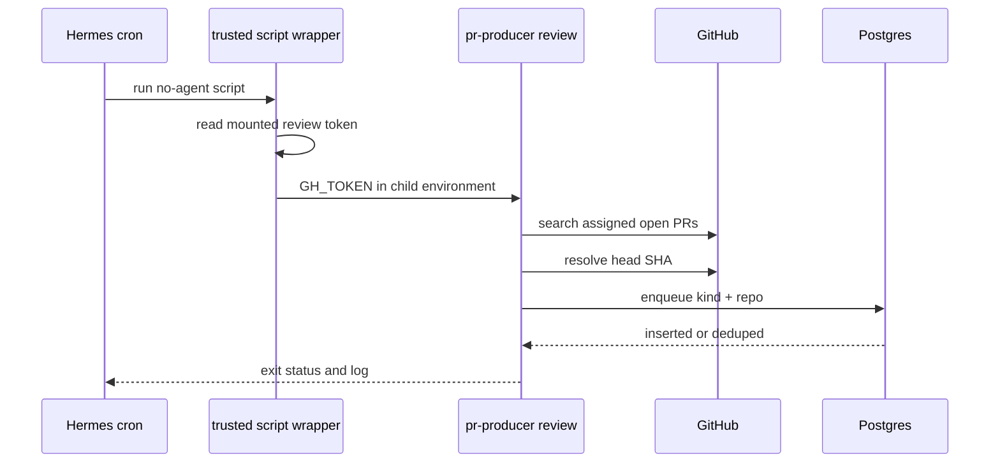

# DD: Hermes Migration Foundation And Pilots

- status: M0 approved with changes; M1/M2 activation blocked
- responsible owner: Zhach
- reviewers: architecture, reliability, security
- PRD: [`PRD-m0-m2.md`](PRD-m0-m2.md)
- grounding: [`grounding-brief.md`](grounding-brief.md)
- roadmap: [`../hermes-migration-roadmap.md`](../hermes-migration-roadmap.md)
- target implementation window: M0 now; M2 and M1 need child design gates
- next gate: M0 task decomposition

## Context

Current fleet has two layers mixed in same workers:

- commodity layer: model invocation, process supervision, schedule loop, session/runtime setup;
- policy layer: operation identity, leases, nonce fencing, immutable input, effect intent, reconciliation, approvals, publishing.

Hermes can own commodity layer. Hermes cannot replace policy layer through profiles, cron, Kanban, or `/v1/runs` alone.

Pinned baseline:

- upstream commit: `14efb46089250e8b9e56e59b74291cf8dce8b207`;
- version: `0.21.3`;
- multi-architecture image: `nousresearch/hermes-agent@sha256:6d7285e1476d0661fc347e3d55245c99decb781d76d39d67582166d2c9561874`;
- amd64 manifest: `sha256:84855d8cb038fcc5562daa04bfc27992606831222276d8147d198d60c68e0214`;
- arm64 manifest: `sha256:9201490c5bace78b4cf52188c4b22ed18ad9fb2d9cca44c52856aa12fea07335`.

## Scope

In:

- pinned Hermes Compose service contract;
- one state volume per trust tier;
- liveness and authenticated readiness;
- domain-to-Hermes run attempt mapping;
- strict Runs API adapter;
- baseline metrics;
- backup and rollback commands;
- doc-runtime pilot;
- review-producer cron pilot.

Out:

- live PR review runtime;
- direct Hermes publisher;
- maintenance, SWE, or PR-safety changes;
- human UI replacement;
- shared-memory write changes;
- Kanban;
- Postgres removal.

Assumptions:

- one host;
- Docker Compose v2;
- private provider key available at runtime;
- current Postgres remains source of truth;
- current publisher and status UI remain available.

## Goals

- Run Hermes only through root Compose.
- Keep each trust tier isolated by container, volume, credentials, mounts, and network.
- Preserve current queue and effect semantics.
- Prove one model path and one schedule path.
- Make rollback executable.
- Delete nothing before evidence gate.

## Non-Goals

- General agent-platform abstraction.
- Hermes source fork.
- Private Hermes Python imports.
- Direct Hermes SQLite access.
- Shared profile as sandbox.
- New queue service.
- New external dependency.

## Overview

Add two isolated Hermes services over first horizon:

1. `hermes-doc`: official pinned image. M0 adds disabled shape only with unique state and no doc config or provider work. M2 child design decides no-tools config, read mounts, egress, and internal Runs API. No inbox, GitHub token, queue DB password, or shared-memory write endpoint.
2. `hermes-review-scheduler`: thin derivative of pinned image. Adds `gh`, `jq`, `psql`, and GNU timeout. Runs script-only Hermes cron. Reads one review-scoped GitHub secret file. Calls current producer against Postgres.

Keep current workers. Replace seams one at a time.

Dependency-adjusted execution order:

1. M0 foundation.
2. M2 doc runtime.
3. M1 scheduler.

Reason: doc runtime uses official image and one public API. Scheduler needs derivative image, secret-file bridge, cron state, and producer tools. Cheap failure first.

## System Context



Notice:

- Hermes does not own domain state.
- Hermes doc service never mounts inbox.
- Scheduler does not run model work.
- Existing producer remains unchanged in first pilot.

## Compose Contract

### Common Rules

- Root `docker-compose.yml` is only deployment manifest.
- `scripts/compose.sh` remains operator command.
- Hermes image uses exact digest.
- Keep image default entrypoint.
- Do not set `user:`.
- Do not set `init: true`.
- Do not override entrypoint.
- Use `command: ["gateway", "run"]`.
- Set `HERMES_UID` and `HERMES_GID` for host ownership.
- Give each service unique `/opt/data` named volume.
- Do not publish API port to host.
- Join only required internal network.
- Add memory, CPU, and PID limits.
- Use read-only mounts where possible.

### `hermes-doc`

Environment:

- `API_SERVER_ENABLED=true`;
- `API_SERVER_HOST=0.0.0.0`;
- `API_SERVER_KEY` from private `.env`, minimum 16 characters, operational target 32 random bytes;
- provider key needed by selected model;
- no `GH_TOKEN`;
- no `PGPASSWORD`;
- no Buildkite or Datadog token;
- built-in/shared automatic memory disabled.

M0 mounts:

- unique state volume at `/opt/data`;
- no doc config, handbook, inbox, or code mount.

Candidate M2 mounts after child approval:

- `agent-config/doc-writer` read-only at stable path;
- no `/inbox`;
- no code root;
- no Hindsight writable endpoint.

Network:

- private `hermes-doc` network shared only with `doc-writer-server`;
- provider egress allowed;
- no host port.

Health:

- liveness: `GET /health`;
- readiness: authenticated `GET /health/detailed`, parse top-level `status == "ok"`;
- doc worker starts only after readiness.

### `hermes-review-scheduler`

Image:

- thin Dockerfile `FROM` pinned Hermes digest;
- add only `gh`, `jq`, PostgreSQL client, and coreutils;
- copy trusted producer wrapper and current producer/queue code;
- no Hermes source modification.

Runtime:

- script-only cron job;
- `no_agent=true`;
- unique state volume;
- review producer secret mounted read-only;
- wrapper reads secret file, exports `GH_TOKEN` only for producer child, then `exec`s producer;
- no provider key required;
- current Postgres dedupe remains final guard.

## Data Flow: Doc Run



Critical change: final doc effect gets deterministic intent and atomic publication. Crash after intent never blind-replays.

## Candidate Run Attempt Schema

Not approved for M0 implementation. M2 child design must settle sole-writer ownership, submit ambiguity, exact input identity, runtime provenance, and reconciliation deadline before migration lands.

Candidate additive table. Postgres remains authority.

```sql
CREATE TABLE hermes_run_attempts (
  request_id       BIGINT NOT NULL REFERENCES requests(id),
  run_nonce        TEXT NOT NULL,
  idempotency_key  TEXT NOT NULL,
  hermes_run_id    TEXT,
  status           TEXT NOT NULL,
  output_digest    TEXT,
  error            TEXT,
  created_at       TIMESTAMPTZ NOT NULL DEFAULT now(),
  updated_at       TIMESTAMPTZ NOT NULL DEFAULT now(),
  PRIMARY KEY (request_id, run_nonce),
  UNIQUE (idempotency_key),
  UNIQUE (hermes_run_id)
);
```

Rules:

- one row per domain attempt;
- idempotency key derived from request ID plus random nonce;
- request payload fingerprint remains inside Hermes reservation;
- POST replay with same key recovers run ID after client crash;
- new domain retry gets new nonce and key;
- output digest records validated terminal output, not raw private content;
- never store API key or full prompt.

Open design detail: `status` constraint values follow adapter states, not Hermes private enum. Proposed: `submitting`, `queued`, `running`, `stopping`, `completed`, `failed`, `cancelled`, `interrupted`, `invalid_output`.

## Runs Adapter Contract

New trusted executable. Suggested path: `bin/hermes-run`.

Inputs:

- prompt on stdin or prompt-file path;
- API URL from config;
- API key from environment;
- request ID;
- domain run nonce;
- timeout;
- optional model/provider settings.

Behavior:

1. Build fixed request body.
2. Send `Idempotency-Key = request-<id>-<nonce>`.
3. Require HTTP 202 and valid `run_id`.
4. Persist returned run ID under matching live nonce.
5. Poll documented statuses.
6. Renew domain lease independently.
7. On timeout, call `/stop`.
8. Wait bounded time for terminal status.
9. Treat gateway restart `interrupted` as failed attempt. Domain controller decides retry.
10. Cap output bytes before parse.
11. Require exactly one JSON object for machine-result mode.
12. Validate full expected schema and nonce/provenance.
13. Write current result contract itself. Hermes cannot write publisher state.

Failure rules:

- submit timeout: replay same key; do not create new key;
- 409 key conflict: fail closed;
- auth/readiness failure: fail attempt;
- nonterminal stop timeout: kill local wait, leave domain attempt failed or reconcile based on effect state;
- malformed/oversized output: `invalid_output` and domain failure;
- lost lease: call stop best-effort; stale worker cannot update domain state.

## Doc Side-Effect Repair

Existing bug blocks live M2:

- `queue_mark_side_effect` failure is ignored;
- generic reclaim requeues `doc-write` after possible file effect;
- final write is direct, not atomic;
- crash after write and before `done` can create suffixed duplicate.

Repair:

- make effect-intent write mandatory;
- extend reclaim rule: expired `doc-write` with effect intent and no posted ref becomes `reconcile`;
- choose final output path before publication;
- persist intended path in attempt/domain state;
- write same-directory temporary file;
- close then atomic rename without overwrite;
- mark done with exact path;
- on restart, verify intended path and digest before manual or trusted automatic reconciliation;
- never generate another suffix for same request attempt.

No live Hermes doc pilot before repair tests pass.

## Data Flow: Scheduler



Rules:

- no prompt or model;
- cron job created paused;
- legacy review loop stops before resume;
- maintenance loop stays active;
- rollback pauses Hermes job before legacy review loop starts;
- trigger accounting comes from Hermes executions plus producer logs plus Postgres rows.

## Baseline Metrics

Add versioned read-only collector. Suggested path: `scripts/hermes-baseline.py`.

Inputs:

- Postgres connection from existing environment;
- UTC window start/end;
- optional output JSON path.

Outputs:

- requests by kind/status;
- throughput;
- queue age p50/p95/p99;
- start lag p50/p95/p99;
- completion latency p50/p95/p99;
- failure, retry, reconcile, superseded rates;
- pending-human counts and age;
- explicit `null` for empty percentiles;
- schema version and window.

Duplicate effects and missed eligible PRs need target/ GitHub audit. Keep separate from DB-only baseline.

## Backup And Rollback

### Backup Set

- request Postgres dump;
- Hermes state volume archive per trust tier;
- doc stage state;
- current Compose config and image digests;
- operation-to-run attempt rows;
- no provider or GitHub secret in archive output.

### Rollback Order

1. Stop new ingress.
2. Stop or drain Hermes consumer.
3. Inspect running attempts and effect intent.
4. Move uncertain attempts to `reconcile`.
5. Start pinned legacy worker/scheduler.
6. Verify one active ingress and consumer.
7. Measure elapsed time.

Rollback RTO: 15 minutes.

Rollback never translates active Hermes state into a blind queued retry.

## Components And Responsibilities

| Component | Responsibility | Owner | Notes |
| --- | --- | --- | --- |
| `docker-compose.yml` | topology, state volumes, network, health, limits | repo | sole deployment manifest; `scripts/compose.sh` is operator entrypoint |
| Postgres | domain operation and attempt authority | repo | retained |
| `hermes-doc` | model execution | upstream runtime | no publisher mounts |
| Runs adapter | API auth, idempotency, polling, timeout, output validation | repo | public API only |
| doc worker/harness | human loop and final publication | repo | repaired effect contract |
| scheduler image/wrapper | script-only cron environment | repo | review token only |
| current producer | discovery, allowlist, SHA dedupe | repo | unchanged first pilot |
| status UI | human policy actions and exact approved-decision Hindsight publishing | repo | retained |
| Hindsight curator | automated shared-memory writes | repo | retained |

## Interfaces And Contracts

- Hermes API:
  - contract: `POST /v1/runs`, `GET /v1/runs/{id}`, `POST /v1/runs/{id}/stop`, `/health`, `/health/detailed`;
  - compatibility: pinned commit and image digest;
  - failure modes: auth, submit ambiguity, interrupted run, opaque malformed output, degraded readiness.
- Domain attempt:
  - contract: request ID plus nonce owns one Hermes run admission key;
  - compatibility: additive migration;
  - failure modes: stale nonce, lost lease, POST timeout before mapping persist.
- Doc output:
  - contract: exact preselected path, atomic no-overwrite publish, digest, posted ref;
  - compatibility: same user-visible filename format;
  - failure modes: path exists, disk full, crash before/after rename.
- Scheduler:
  - contract: same `bin/pr-producer review` CLI and env;
  - compatibility: no producer behavior change;
  - failure modes: missing secret, GitHub error, DB error, duplicate trigger.

## Alternatives Considered

| Option | Pros | Cons | Decision |
| --- | --- | --- | --- |
| One Hermes container with profiles | few services | no trust isolation | rejected |
| Hermes Kanban replaces Postgres now | more deletion | weak domain-effect parity; split-brain bridge | rejected |
| Hermes directly posts/writes | less adapter code | loses deterministic publisher and fencing | rejected |
| Current controller plus Runs API | smallest reversible runtime seam | temporary dual runtime | selected |
| Scheduler first | initial score rank; low model risk | derivative image and secret bridge first | deferred behind doc spike |
| Doc runtime first | official image; one HTTP seam | must repair existing doc crash behavior | selected after repair |
| Keep current stack | zero migration risk | no maintenance reduction | rollback/fallback |

## Key Tradeoffs

- tradeoff: Postgres remains.
  - decision: keep.
  - consequence: less immediate deletion.
  - mitigation: M8 evaluates later with evidence.
- tradeoff: one container per tier.
  - decision: keep isolation over lower resource use.
  - consequence: more volumes and services.
  - mitigation: Compose profiles load only active pilots.
- tradeoff: custom output adapter.
  - decision: keep strict schema boundary.
  - consequence: owned code remains.
  - mitigation: one small generic HTTP client plus per-kind schema validation.
- tradeoff: dependency order differs from milestone numbers.
  - decision: M2 investigation before M1.
  - consequence: milestone IDs are not chronological.
  - mitigation: roadmap records M0 → M2 → M1 and keeps IDs for history.

## Security And Privacy

Data:

- private prompts, drafts, repository metadata, provider output;
- no customer data expected;
- private code can reach approved provider only.

Controls:

- separate service/state per trust tier;
- no host-published Hermes API;
- strong internal bearer key;
- no inbox mount in model container;
- no GitHub/DB credentials in doc model container;
- no provider key in script-only scheduler;
- review token mounted read-only to scheduler wrapper;
- no automatic shared-memory writes;
- prompt and output omitted from run-attempt table;
- whole-process container is security boundary, not profile or prompt.

## Reliability And Operations

SLIs:

- Hermes readiness;
- run submit/poll latency;
- accepted-operation accounting;
- terminal status rate;
- reconcile count;
- duplicate effect count;
- scheduler trigger accounting;
- state volume disk use.

Alerts before live pilot:

- Hermes degraded/unready;
- domain running attempt older than timeout;
- Hermes run mapping missing after submit retry;
- reconcile row created;
- duplicate/unauthorized effect counter nonzero;
- scheduler missed trigger;
- state volume low disk.

Fallback:

- M0 service can stop with no behavior change;
- M2 feature flag restores direct `mewritecode` runner;
- M1 pauses Hermes job and restarts legacy schedule loop.

## Performance And Cost

- one extra gateway process per active trust tier;
- doc pilot serial; no throughput target beyond current worker;
- API polling interval bounded; no tight loop;
- Runs API status retention is 24 hours for idempotent records;
- Postgres keeps durable long-term operation history;
- provider cost measured from Hermes usage when available;
- Compose resource limits prevent pilot from starving Postgres/status.

## Data And Migration

- additive `hermes_run_attempts` table;
- no request backfill needed;
- existing requests keep old runner path;
- feature flag chooses Hermes per kind;
- rollback keeps attempt history;
- migration replay must be idempotent;
- no write to Hermes internal DB.

## Testing And Validation

Hermetic:

- Compose render contract;
- image digest contract;
- attempt schema and nonce fencing;
- Runs adapter with fake HTTP server;
- submit ambiguity and replay;
- output size/JSON/schema failures;
- lost lease stop behavior;
- doc atomic write and no duplicate after crash;
- generic reclaim sends doc effect intent to `reconcile`;
- baseline collector fixed fixtures;
- scheduler wrapper fake `gh` and Postgres;
- one-active-route config.

Local pinned Hermes, no GitHub/provider where possible:

- liveness/readiness;
- state survives restart;
- auth fails closed;
- API not host-published;
- unique volume ownership;
- scheduler cron execution with fake producer;
- backup/restore.

Live gates:

- provider needed for doc runtime sample;
- GitHub needed for 20-trigger scheduler evidence;
- no live gate before hermetic and local suites pass.

## Rollout

- phase: M0 inert.
  - scope: docs, baseline instrumentation, conformance tests, pinned disabled Compose profile.
  - entry: M0 scope approved.
  - exit: no route or attempt schema changed; focused tests pass.
- phase: M2 child design.
  - scope: no-tools containment, run ownership, doc-effect recovery, executable rollback, machine gate.
  - entry: M0 evidence available.
  - exit: delta council pass.
- phase: M2 shadow/local.
  - scope: fake server, then local pinned Hermes.
  - entry: child DD approved and all pre-live controls implemented.
  - exit: contract, isolation, injection, exfiltration, backup, and rollback suites pass.
- phase: M2 live pilot.
  - scope: 10 operator-triggered docs.
  - entry: one machine-verifiable manifest records baseline lock, green suites, alerts/runbook, restore drill, timed rollback, zero uncertain effects, and named human approval.
  - exit: PRD gates pass.
- phase: M1 child design.
  - scope: scheduler ledger, route fence, reproducible image, secret and DB least privilege, machine gate.
  - entry: M2 evidence reviewed.
  - exit: delta council pass.
- phase: M1 local.
  - scope: derivative scheduler image and fake producer.
  - entry: child DD approved and all pre-live controls implemented.
  - exit: cutover, overlap, hung-run, backup, and rollback suites pass.
- phase: M1 live pilot.
  - scope: review schedule only.
  - entry: one machine-verifiable manifest records baseline window, green suites, route-fence state, alerts/runbook, restore drill, timed rollback, and named human approval.
  - exit: 20/20 triggers over at least 7 days.

## Council Decision

Council verdict is split by scope:

- M0 inert evidence work: pass with changes;
- M2 activation: block;
- M1 activation: block;
- M2 investigation before M1: accepted;
- no attempt schema or live route in M0.

Required child-design issues:

1. Domain controller is sole Postgres writer. Adapter is pure HTTP.
2. Document publication stores canonical path and exact final byte digest before no-clobber publish. Recovery handles absent, matching, and mismatching files. New attempts stay fenced during reconciliation.
3. Submit intent stores request digest, runtime identity, and deadline before POST. Unknown submit after Hermes 24-hour retention becomes manual reconciliation.
4. Hermes doc execution disables unused tools, APIs, cron, skills, MCP, and memory; provider egress and persisted state are controlled and tested.
5. Scheduler gets durable slot accounting and one route-generation fence shared with legacy path.
6. Backup, restore, rollback, and pilot authorization become executable and machine-verifiable.

Council transcript: `~/.agent-fleet/agent-chat/rooms/council-hermes-m0m2-docs-20260914`.

## SPADE

- setting: choose first safe integration and deployment boundary.
- people: Zhach decides; architecture, reliability, security consulted.
- alternatives: big bang, Kanban-first, scheduler-first, doc-first, no migration.
- decision: Compose + current controller + public Runs API. Doc-first after side-effect repair. Scheduler second.
- explanation plan: roadmap and implementation plan record council result. Every later milestone stays separately gated.

## Open Questions

| Question | Owner | Blocks | Status |
| --- | --- | --- | --- |
| Exact Hermes no-tools and memory-disable config for doc service | Zhach | M2 child design | open |
| Provider config required for selected model | Zhach | M2 live | open |
| Automatic reconciliation allowed when intended doc path and digest match? | Zhach | M2 recovery | council input |
| Store run status history or latest state only? | Zhach | migration schema | proposed latest only |
| Baseline window before 14 days accrue | Zhach | M1 live | open |
| Scheduler image package source/pinning | Zhach | M1 local | open |

## Review Checklist

- goals and non-goals clear: yes;
- diagrams show authority boundaries: yes;
- alternatives and tradeoffs included: yes;
- security and reliability addressed: yes;
- rollout and rollback defined: yes;
- implementation decomposition ready: after council;
- live routing blocked by unresolved gates: yes.
