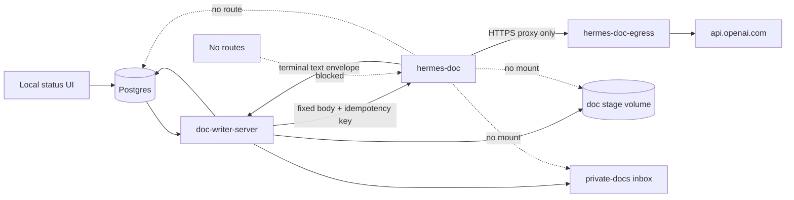
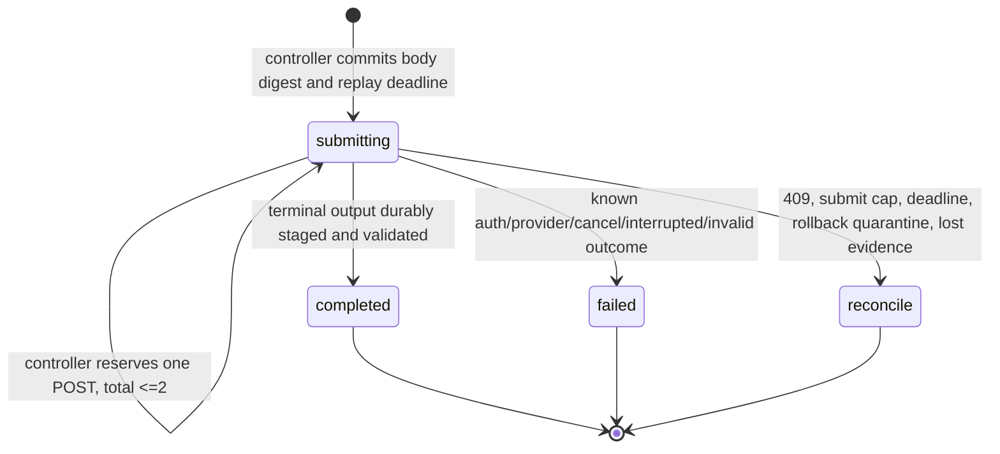
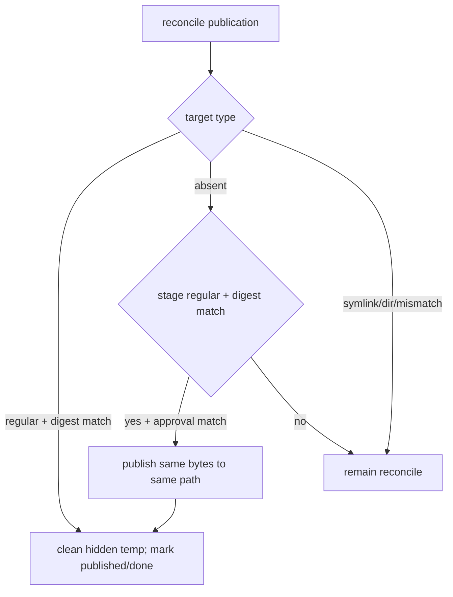

# DD: Hermes M2 Doc Runtime

- status: M2a foundation approved with changes; M2b live activation blocked
- responsible owner: Zhach
- reviewers: architecture, reliability, security, cost
- PRD: [`PRD-m2-doc-runtime.md`](PRD-m2-doc-runtime.md)
- grounding: [`grounding-m2-doc-runtime.md`](grounding-m2-doc-runtime.md)
- parent councils: [`council-m0-m2.md`](council-m0-m2.md), [`council-m2-doc-runtime.md`](council-m2-doc-runtime.md)
- next gate: human review of M2a machine-gate evidence

## Context

M0 proves static Compose shape only. M2 replaces two direct model calls in doc workflow:

- draft/refine call;
- final council call.

M2 keeps current request queue, status UI, human rounds, stage volume, inbox mount, and publication authority.

Current publication has known crash gaps. M2 repairs them before enabling Hermes.

## Scope

In:

- zero-tool Hermes profile and runtime conformance;
- prompt-embedded persona/handbook policy;
- pure HTTP Runs adapter;
- durable draft/council run identity;
- crash-safe document publication;
- atomic open-question completion;
- doc-specific provider egress;
- shadow, machine gate, pilot, rollback.

Out:

- M1 scheduler;
- Hindsight/Coderag in Hermes doc path;
- public API;
- inbound Runs proxy;
- Hermes file/terminal/browser/delegation/memory/skills/MCP;
- SWE recovery;
- queue replacement;
- publisher relocation.

## Threat Model

In scope:

- requirements or prior draft contains prompt injection;
- model emits tool call or instruction-shaped output;
- model tries memory, skill, process, file, browser, MCP, cron, or network action;
- duplicate/late HTTP submission;
- controller/worker crash at any DB, HTTP, stage, or inbox boundary;
- wrong/missing API key;
- provider/off-allowlist egress;
- stale queue owner;
- target path race, symlink, directory, mismatch, disk/permission failure;
- sensitive prompt/output persists longer than retention.

Out of scope:

- malicious pinned Hermes image;
- compromised Docker daemon or host root;
- compromised trusted doc controller;
- DNS tunneling by arbitrary code inside compromised Hermes process;
- public/multi-tenant caller.

Reason: status UI is localhost-only. Controller already owns DB and inbox. M2 removes model tools and mounts. It does not claim containment against trusted-code compromise.

## Decision

Use stock pinned Hermes image. Use direct trusted controller → internal Runs API. Use separate outbound Squid proxy. Add no inbound proxy or custom Hermes derivative unless conformance fails.

Reasons:

- one caller;
- private network;
- controller already has stronger authority;
- proxy would add another auth/retry/health state machine;
- stock image already supports explicit empty API toolsets, disabled memory/background review, safe mode, and concurrency cap;
- runtime tests decide. Design returns to council if stock image cannot satisfy controls.

## System Context



Notice:

- controller is only bridge between domain state and Hermes;
- Hermes sees prompt text only;
- provider proxy is only external route;
- inbox and stage never enter Hermes container.

## Compose Topology

### `hermes-doc`

- image pinned to M0 digest;
- profiles: `hermes-m0`, `hermes-m2`;
- default image entrypoint and s6 bootstrap retained;
- unique `/opt/data` volume;
- reviewed config file mounted read-only at `/opt/data/config.yaml`;
- internal `hermes-doc` network only;
- no host port;
- no default network;
- no DB, GitHub, Hindsight, Coderag, inbox, stage, code, handbook, Docker socket, or host-home mount;
- `OPENAI_API_KEY` only provider secret;
- `API_SERVER_KEY` internal caller secret;
- `HTTPS_PROXY`/`HTTP_PROXY` points to doc egress service;
- `NO_PROXY` contains loopback only;
- one CPU, 2 GiB, 256 PIDs;
- health uses authenticated detailed readiness.

### `hermes-doc-egress`

- separate image/config from PR-safety tier;
- read-only root;
- non-root proxy user;
- all capabilities dropped;
- no-new-privileges;
- tmpfs for run/log/spool;
- joins internal doc network and default external network;
- CONNECT only;
- port 443 only;
- destination only `api.openai.com`;
- no cache.

### `doc-writer-server`

- remains one service and one controller;
- joins default network plus internal doc network;
- `DOC_WRITER_RUNTIME=legacy|hermes`, default `legacy` until gate;
- in Hermes mode, calls internal API;
- retains Postgres/stage/inbox authority;
- retains legacy provider key only during rollback window; remove after pilot/deletion gate;
- no Hermes service dependency in legacy mode. Cutover command starts Hermes/proxy first, then recreates controller with flag.

## Hermes Config

Reviewed config is versioned in repo. Candidate:

```yaml
platform_toolsets:
  api_server:
    - no_mcp
memory:
  memory_enabled: false
  user_profile_enabled: false
  provider: ""
  nudge_interval: 0
auxiliary:
  background_review:
    enabled: false
skills:
  creation_nudge_interval: 0
agent:
  max_turns: 1
  run_budget_seconds: 1000
  api_max_retries: 0
gateway:
  api_server:
    max_concurrent_runs: 1
```

Environment:

```text
HERMES_SAFE_MODE=1
HERMES_IGNORE_RULES=1
```

Conformance checks effective behavior, not file text:

- `/v1/toolsets` has zero enabled entries;
- fake provider receives absent or empty `tools`;
- one prompt can cause no tool event;
- no memory/profile/background-review file changes caused by run;
- off-allowlist network fails;
- gateway and descendants run non-root after s6 bootstrap;
- root and `/opt/hermes` remain non-writable to gateway user;
- if stock image fails one hard check, stop and return to DD. Do not patch around with prompt rules.

## Prompt Bundle

No model reads files.

Controller renders exact request JSON before run intent.

### Draft Instructions

- persona body with frontmatter removed;
- `Shared context` and path-based `Knowledge base` sections removed;
- explicit statement: Hindsight, Coderag, files, tools, memory, and live clarification unavailable;
- selected handbook files embedded with filename fences;
- output contract retained verbatim;
- untrusted request framed after policy.

PRD bundle:

- selected `template-seprd.md` or `template-mlprd.md`; no template file for Launchpad;
- `glossary.md`;
- `naming-definitions.md`;
- `business-context.md`;
- `architecture-principles.md`;
- `boundaries-and-engagement.md`;
- `standards-paved-road.md`;
- `testing-standards.md`;
- `coding-standards.md`;
- `service-ownership.md`;
- `incident-response.md`.

DD bundle:

- selected `template-sedd.md` or `template-mldd.md` based on explicit request/inference rule;
- `e2e-ownership-manifesto.md`;
- `development-lifecycle.md`;
- `service-ownership.md`;
- `architecture-principles.md`;
- `architecture-benchmarks.md`;
- `boundaries-and-engagement.md`;
- `business-context.md`;
- `glossary.md`;
- `naming-definitions.md`;
- `standards-paved-road.md`;
- `approved-tooling.md`;
- `testing-standards.md`;
- `incident-response.md`;
- `production-operations.md`.

### Draft Input

Only:

- doc type;
- title;
- round;
- requirements, or prior draft plus human answers;
- finalize flag as workflow context, not authority to write.

### Council Request

Instructions:

- current adversarial single-lens rubric;
- no tools/context claim;
- exact verdict/issue output contract.

Input:

- staged draft only, capped at existing 60,000 bytes.

Authority:

- council is advisory;
- it never rewrites draft;
- final staged bytes are original draft plus council appendix and provenance frontmatter;
- staged publication frontmatter sets `human_reviewed: true` because those exact bytes can publish only after explicit digest-bound approval; unapproved stage is never presented as a published document;
- every council verdict routes to exact-byte human Publish/Dismiss approval;
- failed council keeps current unreviewed warning and still needs exact-byte approval.

Limits:

- rendered HTTP body ≤1 MiB;
- terminal output ≤256 KiB;
- prompt bundle digest stored with runtime generation;
- immutable request-specific body stored in stage volume for replay/recovery;
- no prompt/body stored in Postgres.

## Hermes Run Identity

One run operation per request phase.

```text
doc:<request_id>:draft
doc:<request_id>:council
```

Queue `run_nonce` owns current controller lease. It never owns Hermes identity.

### Pinned Idempotency Contract

Header:

```text
Idempotency-Key: doc:<request_id>:draft|council
```

Pinned behavior to prove before live use:

- first exact body/key returns HTTP 202 and one run ID;
- repeated exact body/key returns HTTP 202, `Idempotency-Replayed: true`, and same run ID;
- different body under same key returns HTTP 409;
- reservation and terminal status survive gateway restart;
- nonterminal restart becomes documented `interrupted` terminal status;
- reservation remains available through conservative local 23-hour deadline;
- no public lookup-by-key exists. Replay is only recovery for lost first response.

Failure of one conformance check blocks direct API design and returns to DD.

### Schema

```sql
CREATE TABLE IF NOT EXISTS hermes_doc_runs (
  request_id          BIGINT NOT NULL REFERENCES requests(id),
  phase               TEXT NOT NULL CHECK (phase IN ('draft','council')),
  request_digest      TEXT NOT NULL,
  runtime_generation  TEXT NOT NULL,
  state               TEXT NOT NULL CHECK (state IN ('submitting','completed','failed','reconcile')),
  submit_count        SMALLINT NOT NULL DEFAULT 0 CHECK (submit_count BETWEEN 0 AND 2),
  hermes_run_id       TEXT UNIQUE,
  raw_status          TEXT,
  replay_until        TIMESTAMPTZ NOT NULL,
  output_digest       TEXT,
  usage               JSONB,
  error               TEXT,
  created_at          TIMESTAMPTZ NOT NULL DEFAULT now(),
  updated_at          TIMESTAMPTZ NOT NULL DEFAULT now(),
  PRIMARY KEY (request_id, phase),
  CHECK (
    (state = 'completed' AND hermes_run_id IS NOT NULL AND output_digest IS NOT NULL) OR
    (state = 'submitting' AND output_digest IS NULL) OR
    (state IN ('failed','reconcile'))
  )
);
```

No idempotency-key column. Key derives from primary key.

`runtime_generation` attaches request phase to Hermes when row first inserts. Queued requests with no Hermes row can use legacy after rollback. Any request with nonterminal Hermes row quarantines; it never changes runtime because process flag changed.

Generation digest covers:

- Hermes image and config;
- rendered Compose topology relevant to doc tier;
- egress proxy image/config;
- prompt renderer, personas, handbook bundle;
- adapter, publication helper, gate verifier, and contract-test versions.

Generation change rules:

- new admissions use current approved generation only;
- completed/published rows remain history;
- nonterminal old-generation run or publication never silently migrates;
- old work completes under exact old runtime artifacts when still available, otherwise request moves to reconcile;
- config/verifier/helper change drains or quarantines old work before new generation starts;
- child implementation stores component digests alongside aggregate generation for diagnosis.

### State Rules



No `accepted` state in v1. Adapter blocks until terminal and returns HTTP facts. `submitting` means admission absent, running, or unknown.

### Controller/Adapter Boundary

Controller:

1. Renders exact request file and computes digests.
2. Under current request nonce/lease, inserts or adopts phase row.
3. Refuses request/runtime mismatch.
4. Before each POST, atomically increments `submit_count` only when below two, before deadline, and while current lease is live.
5. Invokes adapter once per reservation. Process crash consumes reservation.
6. Keeps existing lease heartbeat active through render, POST, poll, stop, output stage, and publication.
7. On heartbeat failure, terminates adapter best effort and forbids settlement.
8. Durably stages validated output before setting `completed`.
9. Under current request nonce/lease, stores terminal result.

Adapter:

- reads fixed request file;
- allows exact body keys only: `input`, `instructions`, `model`, `provider`;
- validates fixed provider/model and body cap;
- with no known run ID, performs exactly one POST per invocation; controller owns retries;
- with known run ID, performs poll-only invocation and sends zero POSTs;
- accepts first/replayed HTTP 202 and captures replay header/run ID;
- polls documented run ID/status only;
- logs status changes only;
- polls every 10 seconds;
- on timeout/TERM calls `/stop` best effort;
- caps response body and terminal output;
- returns machine envelope to controller;
- writes no DB, stage, inbox, config, or state outside temp output.

### Recovery

- same phase row and digests: adopt under fresh queue nonce;
- known run ID: poll same run with zero POST regardless of submit count/replay deadline;
- unknown run ID with submit count below two and before deadline: reserve one same body/key POST;
- unknown run ID with submit count two, deadline reached, 409, or lost body: phase/request reconcile with zero POST;
- known failed/cancelled/interrupted: failed; no fresh run;
- lost queue lease: stale controller cannot settle or publish;
- deliberate rerun needs new request ID.

Rollback can quarantine `submitting` immediately. It does not wait for provider, run timeout, or replay deadline.

Conservative replay deadline: intent time +23 hours.

## Draft Processing

Refactor harness into deterministic phases. Keep one file; no framework.

```text
doc-writer render-draft-request --payload ... --request-id ...
doc-writer consume-draft --payload ... --response-file ... --request-id ...
doc-writer render-council-request --draft-file ... --request-id ...
doc-writer consume-council --draft-file ... --response-file ... --request-id ...
```

Legacy top-level `--payload` stays during rollback window.

Outputs:

- render commands write canonical JSON request under request-specific stage directory and print path/digest metadata;
- consume draft parses current trailing `open_questions` contract;
- open-question output stays staged under request-specific path;
- consume council renders exact final bytes to request-specific publish-stage file;
- no consume command writes inbox.

Request-specific stage root:

```text
$DOC_WRITER_STAGE_DIR/requests/<request_id>/
```

Files:

- `draft-request.json`;
- `draft-response.json`;
- `draft.md`;
- `council-request.json`;
- `council-response.json`;
- `publish.md`.

Permissions follow existing `umask 077`.

## Open-Question Transaction

Replace two-step insert/done sequence with one queue helper.

Transaction:

1. Lock current running request by ID, queue nonce, and unexpired lease.
2. Insert pending human review on `request_id`; conflict allowed only for same stored proposal/provenance.
3. Mark request done with posted ref `queued: awaiting answers (round N)`.
4. Commit both or neither.

No publication intent for draft staging. Request-specific staged draft can be overwritten by same request recovery only when digest matches.

## Publication Approval And State

Use doc-owned table. Do not add generic effect columns.

```sql
CREATE TABLE IF NOT EXISTS doc_publications (
  request_id          BIGINT PRIMARY KEY REFERENCES requests(id),
  state               TEXT NOT NULL CHECK (state IN (
                        'awaiting_approval','approved','prepared','published','reconcile','invalid','dismissed')),
  staged_path         TEXT NOT NULL,
  target_path         TEXT NOT NULL UNIQUE,
  content_digest      TEXT NOT NULL,
  document_generation TEXT NOT NULL,
  approved_at         TIMESTAMPTZ,
  published_at        TIMESTAMPTZ,
  error               TEXT,
  created_at          TIMESTAMPTZ NOT NULL DEFAULT now(),
  updated_at          TIMESTAMPTZ NOT NULL DEFAULT now(),
  CHECK (
    (state = 'awaiting_approval' AND approved_at IS NULL AND published_at IS NULL) OR
    (state IN ('dismissed','invalid') AND approved_at IS NULL AND published_at IS NULL) OR
    (state IN ('approved','prepared') AND approved_at IS NOT NULL AND published_at IS NULL) OR
    (state = 'reconcile' AND approved_at IS NOT NULL AND published_at IS NULL) OR
    (state = 'published' AND approved_at IS NOT NULL AND published_at IS NOT NULL)
  )
);
```

`staged_path` is normalized relative to configured stage root. `target_path` is normalized relative to configured inbox root. Insert rejects absolute paths, traversal, empty segments, and alternate spellings. Outstanding rows bind to logical roots; root relocation must mount same logical content or quarantine rows.

`document_generation` exists for legacy and Hermes output. It hashes runtime mode, renderer/persona/handbook/council inputs, publication helper, and publication contract. Task 1 defines helper; Task 2 uses it. Legacy value is `legacy:<digest>`; future Hermes value is `hermes:<digest>`.

### Durable Stage

1. Render exact final bytes, including advisory council review, to request-specific temp with `O_CREAT|O_EXCL`.
2. fsync temp.
3. Atomically rename with no replacement to `publish.md`.
4. fsync request stage directory.
5. Independently read and hash final staged bytes.
6. Generate canonical root-relative target using current type/date/slug/suffix rule.
7. Insert `doc_publications(awaiting_approval)` and publication-review row in same transaction.
8. Mark request done as awaiting publication approval in same transaction.

No target access occurs before human approval. Council verdict never mutates draft; council text is advisory appendix in exact staged bytes.

### Exact-Byte Approval

Status service mounts doc stage volume read-only.

Publish action transaction:

1. Load publication and human-review rows by server-side IDs.
2. Require states `awaiting_approval` and `pending`.
3. Recompute staged regular-file path and digest under stage root.
4. Require stored target, digest, and document generation. Form sends none of them.
5. Set publication `approved`, approval time, human row `reviewed`.
6. Requeue same request ID with run/lease fields cleared and publication-only marker in server-owned payload/state.
7. Commit all or none.

Dismiss action sets publication and human row dismissed. It publishes nothing and leaves request terminal. Missing, replaced, or corrupt staged bytes before approval transition only `awaiting_approval → invalid`, dismiss the pending action with an error, and require a new doc request. Corruption discovered after approval transitions to `reconcile` and retains approval evidence.

Controller claims approved request and skips every model phase.

### Prepare

1. Revalidate approval, stage path, target path, generation, and digest under current queue nonce/lease.
2. Transition publication `approved → prepared`, set request `side_effect_at`, and move request `running → reconcile` in one transaction.
3. Clear queue lease in same commit before target access. Prepared publication is intentionally quarantined, so no worker can reclaim it.
4. Target never changes after approval.

### Publish

Use small Python helper.

1. Revalidate stage path and digest.
2. Reject target symlink, directory, or existing mismatch.
3. Create deterministic hidden temp under inbox `.ai-pr-automation-staging/` with `O_CREAT|O_EXCL`; extension is `.tmp`, never `.md`.
4. Copy exact bytes and fsync temp.
5. Launch only after prepare succeeds. No background transition mutates prepared publication state; rollback stops controller first and leaves prepared state intact.
6. Atomically move temp to final path with Linux `renameat2(RENAME_NOREPLACE)`.
7. fsync hidden staging directory and final target parent.
8. Transaction requires prepared publication, matching target/digest/document generation, exact human approval, and matching target bytes.
9. Transition publication to `published`; mark request done; set `posted_ref=target_path`.

Preparation quarantines request before filesystem effect, so lease cannot expire into another owner during publication. `renameat2` support is runtime-tested on actual inbox bind filesystem. No hard-link or overwrite-capable fallback. Crash before rename leaves one deterministic hidden temp; reconcile validates or removes it. Successful rename leaves no second name. Either fsync failure leaves request in reconcile.

### Reclaim

Before generic requeue:

- prepared publication already has request `reconcile`; generic reclaim cannot claim it;
- expired legacy `doc-write` with old side-effect intent and no publication row → request reconcile;
- published publication/posted ref → done;
- approved but not prepared → safe requeue for publication-only work;
- no publication intent → current run-adoption behavior.

### Reconcile



Explicit operator CLI only:

```text
bin/doc-writer-reconcile <request-id> --inspect
bin/doc-writer-reconcile <request-id> --complete-matching
bin/doc-writer-reconcile <request-id> --publish-absent
```

CLI never changes target, runs model, or bypasses exact approval. It discovers only deterministic hidden temp for that request/digest and removes it after matching-target completion or invalid cleanup.

## Rollback

Rollback changes runtime only. Publication repair and exact approvals remain.

Quarantine-first sequence:

1. Pause doc submissions.
2. Stop controller after short bounded drain.
3. In one transaction, move every nonterminal Hermes phase and attached request to reconcile. Prepared publications already have request `reconcile`; leave their immutable state intact after controller stops. No POST or provider wait.
4. Stop Hermes and egress proxy.
5. Set runtime default to legacy for requests with no Hermes phase row.
6. Start exactly one legacy controller.
7. Verify legacy claim path and no Hermes route.
8. Resume new submissions.
9. Reconcile quarantined request IDs offline. Never replay them through legacy.

Queued request with no Hermes phase can use legacy. Any request attached to Hermes stays quarantined or completes through explicit Hermes recovery.

Do not drop schema or delete Hermes state during rollback window.

RTO: 15 minutes. Hung provider/run cannot sit in critical path.

## Machine Gate

Independent verifier recomputes runtime generation from repository files, rendered Compose topology, image/config/proxy digests, and verifier version. It runs evidence commands and writes owner-only report outside doc stage:

```text
~/.local/state/ai-pr-automation/hermes-doc/gates/m2-<runtime-generation>.json
```

Report contains command, exit status, timestamp, and artifact hash for each check. Runtime evidence binds container ID, inspected image digest, init PID/start time, PID namespace/cgroup, mounts, networks, Hermes run ID, fake-provider capture, and trace interval to same generation. Trace starts before run admission, follows descendants through terminal state, records dropped-event count, and fails closed on mismatch or dropped events. It does not trust caller-supplied booleans. Host and controller are trusted in M2; cryptographic signing is unnecessary.

Manifest profile `m2a-foundation` requires:

- config digest and rendered topology;
- inspected image ID, mounts, networks, process tree, and effective config;
- zero toolsets and provider request with no tools;
- no memory/background write;
- process/file/socket trace for adversarial fake-provider run with no unexpected model-directed effect;
- prompt bundle under limit;
- adapter and pinned idempotency conformance;
- attempt and publication fault matrices;
- open-question atomicity;
- egress allow/deny;
- state inspection;
- rollback quarantine under 15 minutes.

Manifest profile `m2b-live` requires same generation and every M2a artifact plus:

- paired quality accepted;
- all-in provider budget and generation-scoped admission reservation;
- alerts/runbook;
- retention and purge proof;
- zero unreconciled ambiguity;
- named human approval.

M2a evidence cannot authorize routing or paid calls. Launch script recomputes generation, verifies raw evidence bindings, and requires `HERMES_DOC_APPROVED_GENERATION` to match M2b report. Controller refuses Hermes runtime when generation differs. Exact document publication still needs separate per-document digest approval.

## Observability

Per phase:

- request ID;
- phase;
- runtime generation;
- run ID;
- state/raw status;
- duration;
- input/output tokens;
- paid calls;
- transport submits;
- request/output digests;
- error class;
- replay deadline.

Never log prompt, response, API key, prior draft, answers, or handbook bundle.

Alerts:

- submitting run older than timeout;
- replay deadline under one hour;
- reconcile created;
- prepared effect older than five minutes;
- Hermes unready;
- egress proxy unhealthy;
- state volume above retention/disk threshold;
- pilot admission or budget cap reached.

## State Retention

Hermes state can contain prompt/output session data.

- dedicated M2 volume generation;
- local encrypted host storage;
- no general backup; M2 accepts Hermes state loss rather than restoring sensitive prompt history;
- missing/corrupt Hermes volume quarantines every attached nonterminal run/request to reconcile without POST;
- missing/corrupt doc stage before approval becomes invalid; after approval becomes reconcile;
- inspect actual SQLite/files after conformance;
- retain through 24-hour idempotency plus 24-hour recovery margin;
- export only run IDs, usage, digests, and terminal evidence;
- stop Hermes and destroy pilot volume after rollback window and no open run;
- config stays in git; secrets stay in environment.

## Performance And Cost

- one concurrent run;
- one model turn;
- Hermes provider retries zero;
- controller transactionally reserves at most two transport POSTs total per request phase;
- adapter performs one POST per reservation;
- poll every 10 seconds;
- request ≤1 MiB;
- output ≤256 KiB;
- draft timeout 1,000 seconds;
- council timeout 500 seconds;
- outer request ceiling stays 1,800 seconds;
- ten draft admissions max;
- one council phase per finalized request;
- provider project hard budget required for M2b;
- M2a engineering ceiling: 10 engineer-days; exceed means rescope/council;
- target recurring operation: under 30 minutes/week;
- compare tokens, paid calls, duration, failure, operator time, and approved-document quality to legacy path.

## Testing

### Hermetic

- schema applies twice;
- request/phase key and runtime digest;
- body allowlist and caps;
- same-key replay and 409 mismatch;
- 401, 404, 422, malformed, extra, oversized output;
- timeout/TERM stop;
- replay at 22h59 and block at 23h;
- queue nonce changes while phase identity stays;
- stale owner cannot settle;
- open-question insert/done atomicity;
- publication prepare/publish/reconcile matrix;
- symlink/directory/mismatch/renameat2-unsupported/orphan-temp cases;
- current legacy tests unchanged.

### Pinned Runtime With Fake Provider

- reviewed config loads;
- zero enabled toolsets;
- actual provider request has no tools;
- safe mode skips plugins/hooks/MCP;
- memory/background files unchanged after malicious prompt;
- gateway child UID non-root;
- inspected long-lived process tree matches allowlist;
- process/file/socket trace shows no unexpected model-directed child, write, or connection;
- no write to root or `/opt/hermes` as gateway user;
- state survives restart for idempotency;
- API missing/wrong auth fails;
- concurrency second run gets 429;
- direct internet and off-allowlist fail;
- fake provider succeeds on test network.

### Live Shadow

M2b only. Separate human approval required.

- five paired payloads;
- no inbox/human/DB terminal mutation from Hermes output;
- blinded quality review;
- token/cost/latency capture.

### Live Pilot

M2b only. Separate human approval required.

- ten operator admissions;
- kill after run intent, POST, terminal output stage, publication quarantine, before/after `renameat2`, after each directory fsync, and before done;
- restart Hermes and controller;
- rollback drill;
- first guardrail breach stops.

## Rollout

M2a:

1. Exact-byte approval and publication repair behind legacy runtime.
2. Run-attempt schema, durable submit reservations, and adapter with fake server.
3. Prompt phases with legacy behavior tests.
4. Pinned runtime conformance with fake provider.
5. Egress, quarantine rollback, and independent verifier.
6. Stop. Publish evidence. No live provider call or Hermes-routed request.

M2b, separate approval:

7. Lock provider budget and shadow set.
8. Paired shadow. No visible effect.
9. Human approves runtime generation and pilot.
10. Ten-run pilot.
11. Review cost, quality, ambiguity, retries, incidents, and operator time.
12. Keep legacy for 14-day rollback window. Delete direct runtime within 30 days unless Zhach records one dated extension. Abandon Hermes if accepted quality, safety, or TCO gate fails.

## Alternatives

| Option | Decision | Reason |
| --- | --- | --- |
| Direct trusted controller | selected | smallest seam |
| Inbound runs proxy | rejected | no useful boundary for trusted controller; extra state |
| Stock pinned Hermes | selected conditionally | conformance decides |
| Custom derivative | fallback | only if stock config/runtime fails hard control |
| Read-only MCP/tools | rejected | not zero-tool |
| Full handbook mount | rejected | requires file tools |
| Prompt-embedded bundle | selected | auditable and no mounts |
| Automatic reconcile | rejected v1 | explicit operator command keeps ambiguous effects visible |
| Fresh Hermes process per request | rejected | loses idempotent restart value and adds startup cost |

## Open Questions

| Question | Owner | Blocks |
| --- | --- | --- |
| Does mounted read-only config survive stock s6 config migration? | implementation spike | runtime conformance |
| Does `platform_toolsets.api_server: [no_mcp]` produce no provider tools at pinned digest? | implementation spike | runtime conformance |
| Is `renameat2(RENAME_NOREPLACE)` supported on actual inbox bind filesystem? | implementation spike | publication choice |
| Exact provider project budget and enforcement | Zhach | live pilot |
| Which five payloads form paired shadow? | Zhach | quality gate |
| Retention purge command for actual pinned state schema | implementation spike | live pilot |

## Design Stop

Return to DD/council if:

- stock image emits tool schema;
- provider call bypasses proxy;
- config needs writable unreviewed mutation;
- stage/inbox must mount in Hermes;
- output cap or single-turn bound cannot hold;
- request identity needs queue nonce;
- publication cannot do no-overwrite atomic finalization;
- rollback cannot meet 15 minutes;
- shadow quality materially regresses.
