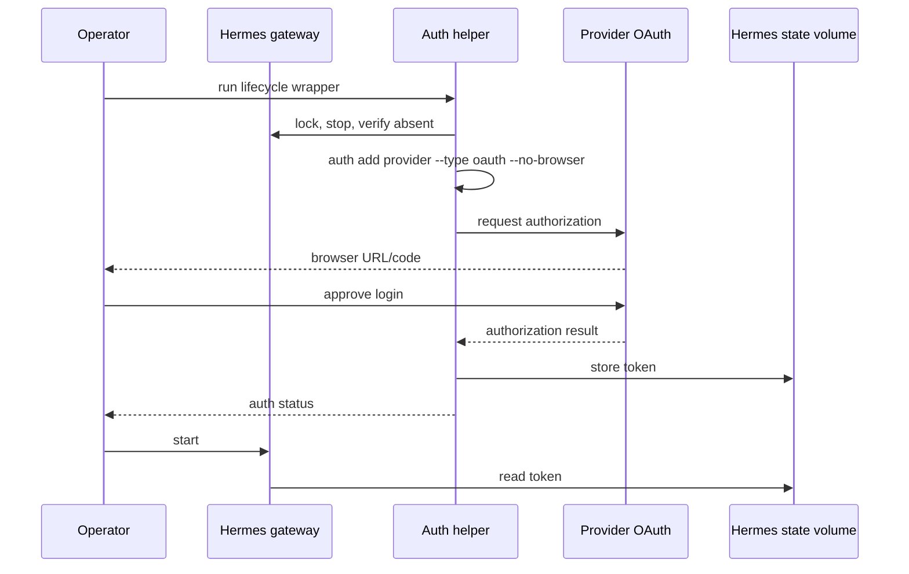

# DD: Hermes OAuth Login

- Owner: Zhach
- Status: OpenAI OAuth validated; Anthropic slice in progress
- PRD: [`PRD-oauth-login.md`](PRD-oauth-login.md)
- Deadline: 2026-09-15

## Decision

Add one-shot `hermes-doc-auth` Compose service. Same pinned Hermes image. Same `hermes_doc_state` volume. Dedicated internal auth network and OAuth-only proxy. No ports. No repo, inbox, Docker socket, DB, or provider credentials. Helper receives existing internal API-server key only to prevent pinned-image setup from rotating persisted gateway auth.

Add one lifecycle wrapper. Atomic host lock. Stop and verify gateway absent before auth write. Hold lock until helper exits. Compose start refuses while lock is live.

Keep `hermes-doc` on internal network. Expand runtime proxy only for pinned provider inference and refresh hosts. Do not put OAuth token in Compose environment.

## Boundaries

| Component | Can read/write | Network | Lifetime |
| --- | --- | --- | --- |
| `hermes-doc-auth` | `/opt/data` OAuth state | internal auth network plus OAuth proxy | one command |
| `hermes-doc` | `/opt/data`; read-only config | internal network plus proxy | long-running |
| `hermes-doc-egress` | proxy logs/temp only | provider domains | long-running |
| Browser | provider login page | normal host network | human session |

## Flow



What matters:

- Host lock and container check enforce one shared-state writer.
- Browser sees provider secrets. Repo and Compose do not.
- Runtime token refresh crosses provider proxy, not default network.

## Interface

Operator uses one wrapper:

```bash
scripts/hermes-oauth.sh login openai-codex
scripts/hermes-oauth.sh status openai-codex
scripts/hermes-oauth.sh logout openai-codex
```

OpenAI slice accepts no other provider. Anthropic support comes in next PR. Login/logout take kernel lifecycle lock and stop gateway. Status is read-only. Kernel releases lock after process death; child inherits lock until auth work exits.

## Egress

Auth proxy contract:

- OpenAI device login/token exchange: `auth.openai.com:443`;
- Anthropic token exchange: `platform.claude.com:443`, fallback `console.anthropic.com:443`.

Human browser reaches `auth.openai.com/codex/device` or `claude.ai/oauth/authorize` outside Compose.

Runtime proxy contract:

- OpenAI API inference: `api.openai.com:443`;
- OpenAI Codex refresh: `auth.openai.com:443`;
- OpenAI Codex inference: `chatgpt.com:443`;
- Anthropic inference: `api.anthropic.com:443`;
- Anthropic refresh: `platform.claude.com:443`, fallback `console.anthropic.com:443`.

CONNECT ACL limits host and port, not URL path. Accepted blast radius: one provider-owned host under one trusted local operator. Tests deny unrelated domains. New host needs evidence and PR.

## Storage

OAuth state stays in `hermes_doc_state`. No host bind. Pinned Anthropic flow writes `.anthropic_oauth.json` atomically at mode `0600`. Pinned OpenAI flow writes provider state under Hermes auth lock. No backup. Local logout does not prove provider revocation. For exposure, revoke in provider account first. Volume quarantine/deletion requires separate human confirmation.

Pinned OAuth facts:

- Anthropic: authorization-code PKCE S256, random state check, 15-second token exchange, scopes `org:create_api_key user:profile user:inference`, rotating refresh token.
- OpenAI Codex: device-code flow, authorization-code exchange with verifier, token/refresh pair, inference base `https://chatgpt.com/backend-api/codex`.
- Operator must accept these scopes and provider terms in browser. Login stops if scope or endpoint differs from pinned behavior.

## Alternatives

| Option | Decision | Reason |
| --- | --- | --- |
| Put OAuth token in `.env` | reject | leaks token into process/config surfaces |
| Mount host `~/.claude` or `~/.codex` | reject | grants unrelated credentials and state |
| Give gateway or auth helper default network | reject | destroys credential destination boundary |
| Separate personal volume | reject for this request | operator wants login for this Hermes runtime |
| One-shot helper plus shared volume | choose | smallest path with explicit broad-network window |

## Failure And Rollback

- Login fails: helper exits; lock clears; gateway remains stopped; no route changes.
- Status fails after restart: stop gateway; run provider logout; inspect state metadata without printing token.
- Unexpected proxy host: deny; do not broaden automatically.
- Token exposure: revoke at provider, stop gateway, then ask before deleting volume.

## Validation

- Compose contract: helper has state plus read-only TLS config, no ports/provider secrets, pinned image, internal auth network, auth proxy, stable API-server key.
- Lifecycle test: skipped stop, live lock, stale lock, concurrent login/start, signal cleanup.
- Egress test: exact auth/runtime domains allowed; unrelated hosts denied.
- Login test: fixed provider/action command; no fake OAuth token committed.
- M2a regression: no controller dependency, caller network, route, or approved generation.
- Manual gate: human login, status after fresh container, then separately approved OAuth-only smoke with same-provider API key unset.

## Decisions

- OpenAI Codex first. Anthropic second.
- Human accepted Anthropic requested scopes. Browser approval still controls provider terms.
- Each provider needs own status, restart, refresh, logout, and OAuth-only smoke evidence.

## Next Gate

OpenAI PR review and merge. Then Anthropic implementation slice.
