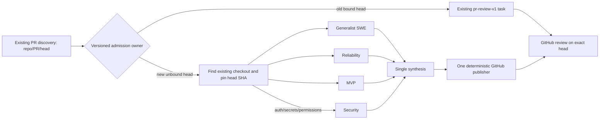

# DD: pre-merge PR review council

- Source: [PRD](PRD-pr-review-council.md), [issue #341](https://github.com/Zhachory1/ai-pr-automation/issues/341).
- Status: offline implementation only; production route remains disabled. The operator approved a bounded host-local worker. Ingress now records a pending owner without GitHub I/O; the worker locates an existing checkout, pins the PR commits, and settles outside the ingress lock. A separate daily stale-head GC redacts only complete terminal council cards after confirming head rollover, no review marker, and no uncertain effect; it preserves task IDs/history. Active or partial graphs, unresolved effects, and operator-modified cards require manual reconciliation. Profile-scoped Codex authentication, runtime tool proof, and cutover validation still block activation. Reuse the **shape**, not post-merge semantics, of `scripts/hermes-kanban-risk-council.py` v2. Source inspiration: [Autopraxis PR review skill](https://github.com/Zhachory1/autopraxis/blob/main/skills/pr-review/SKILL.md) (context-first, architecture before nits, prior-feedback ledger, evidence, delta-only re-review, human merge), not its different marker or publish contract.

## Identity and boundaries

Keep `hermes_direct_pr_journal.identity("pr-review", repo, number, head_sha)` and the existing marker. Eligibility is the existing review producer's open, operator-authorized, assignee/owner-selected PR head. The existing immutable per-operation `request.json` is the durable owner record: legacy and council payloads have disjoint shapes and contend for the same atomic file, under the ingress lock when called through ingress. Existing legacy request/workspace/task bindings always stay legacy; an operation with uncertain prior effect cannot be reassigned. A council head cannot later fall back to legacy if any task/setup/post step fails. New council records bind expected base/head SHA, diff and context digests, shared checkout path, selected role set, contract digest, task IDs, and phase. Once pinned context exists, partial graph setup adopts only the same keyed tasks on retry; it never creates another graph or falls back to legacy posting. A crash after the owner claim but before snapshot completion is unresolved and needs operator reconciliation, not a fresh fetch of possibly changed input. If an old GitHub review already carries the exact marker, council must not publish.

A first worker step finds an existing local checkout with the matching GitHub remote and ensures the PR head is in its Git object store; it never clones or switches branches. All roles use the same checkout path and pinned base/head SHAs. The restricted `snapshot/` tool prefix reads Git objects (`git show`, `git diff`, `git grep`), not the mutable worktree or a copied diff. Bounded PR intent, prior feedback, and CI remain under owner-only `input/`. Reject missing commits or incomplete input; no false “clean” result from a truncated diff. Store no private code in Kanban card bodies, Git, shared memory, or logs. Use the existing restricted `snapshot_read`/`snapshot_search` and task-lifecycle tool pattern where its board/root bindings can be safely scoped to this new workflow; do not give specialists terminal, browser, GitHub auth, task creation, or review-posting tools. Source privacy/retention must be checked at activation.

## Graph and result

The host creates three specialist cards (`pr-review-generalist-v2`, `pr-review-reliability-v2`, `pr-review-mvp-v2`) with role-specific stable keys. The operator selected the existing `openai-codex` provider and `gpt-6-sol` for all five PR-review profiles. The isolated no-post group run used earlier test-only OpenAI API overrides; it did not validate this exact production model. Before activation, verify `openai-codex` auth and tool access in each installed profile. Add `pr-review-security-v2` only when a changed path contains an auth, secret, credential, IAM, crypto, or permission segment; conflicting/multiple triggers still select **at most one** security role. One `pr-review-synthesis-v2` card has precisely those specialists as parents. Those five profile IDs are separate from post-merge PR-safety profiles. Use the existing `pr-review` board; distinct profile IDs and idempotency keys separate legacy/council cards without changing the producer's `board=pr-review` response. Three-role and four-role graphs are distinct exact contracts whose role set and digest are fixed in the owner record; no worker can mutate its roster. One exact contract per selected role set prevents replay from silently changing the graph. Each specialist returns bounded typed `clear | findings | needs-info` and changed-line evidence; synthesis preserves all specialist findings, including nits and dissent. `APPROVE` means **no required changes**, not “no nits.” One inconclusive/missing required handoff precludes approval. Synthesis may conservatively return `needs-info` even if specialists said `clear` when synthesis itself finds missing evidence. Final synthesis is the verdict; no separate approval brief or vote-count threshold.

The publisher is the only GitHub writer. Before any write it verifies the current open PR/head, pinned local Git evidence and complete synthesis, then checks all paginated reviews/comments for the exact existing marker. It durably records `post_started` before GitHub I/O, posts one review with `commit_id=<head>`, and verifies review ID, author, commit, event and marker. An ambiguous timeout is `reconcile`, never an automatic second POST. A head change terminates the old operation without publishing; a new head gets a distinct operation. Preserve `COMMENT` for needs-info and GitHub self-review constraints, `REQUEST_CHANGES` for required changes, `APPROVE` for clean/nit-only, and human-owned merge.

## Validation and rollout

Fake GitHub and isolated Kanban tests must prove exact graph replay, optional security selection, typed handoff validation, timeout/budget fail-closed paths, old-task replay, stale head, and one GitHub effect after an ambiguous response. No private PR fixtures or live GitHub posts in the test path. Reuse existing v2 risk-council validation functions only if doing so does not mix its merged-PR incident contract into pre-merge review.

The historical `docs/hermes-migration-roadmap.md` M3→M4 shadow/canary sequence predates this separately approved direct-Kanban review redesign; the operator explicitly waived a shadow pilot for issue #341, not the correctness/rollout checks for other roadmap phases. The existing producers, ingress and `pr-review-v1` remain unchanged until the new route and effect ledger pass code review. Cut over only future unbound heads; pause review discovery, verify running old workers and unresolved effects, deploy one compatible ingress/client version, then resume. Preserve existing maintenance and post-merge safety pipelines. New admission can be paused independently for rollback; never reroute a partially admitted council head into the legacy writer. No all-PR pilot gate, but first production cycles require bounded observation and rollback on wrong-head/duplicate/incomplete review.

## Open engineering proofs

1. Pin one publisher owner per `(repo, PR, head)` across old/new routes without changing operation IDs. Reuse the existing `pr-review` board and response. The legacy enqueuer and council chooser must contend for the same atomic `request.json` binding inside the ingress admission lock; a direct legacy enqueue must fail against a council binding, even outside ingress.
2. Synthetic helper tests pin Git reads to the same local base/head despite dirty worktree files; still verify the installed Hermes runtime exposes only these read-only tools before activation.
3. Wire `PR_REVIEW_COUNCIL_REPO_ROOT`, `PR_REVIEW_COUNCIL_WORKFLOW_ROOT`, `HERMES_COUNCIL_TOOLS_BIN`, and `HERMES_COUNCIL_TOOLS_PYTHON` into the isolated profile environment. Local checkout lookup must fail closed when no matching repo or PR commit is available; no clone or copied diff. Remove private context after verified reconciliation; retain unresolved context until manual reconciliation.
4. Prove old/new concurrent admission, a crash after GitHub accepts a review but before receipt write, all paginated prior-marker lookups, and new-head rollover while old-head setup is incomplete. Old direct enqueuers using check-then-rename must be drained/upgraded before cutover.
5. GitHub reads and publication run in a bounded worker outside the ingress lock, independently of discovery. Stale-head GC runs once daily at 03:00 host-local time; it only clears heads after exact-marker/no-effect proof and terminal-card evidence cleanup, leaving active/partial graphs, uncertain effects, and operator-modified cards for manual reconciliation. Validate the no-post and verified cleanup paths before enabling `--review-council-install`.

If any proof fails, stop before changing producer routing or granting council workers GitHub effects.
