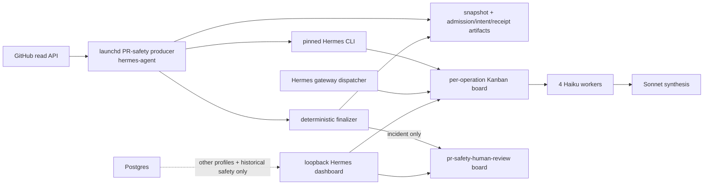

# DD: Direct-Kanban PR Safety

- status: approved for inert implementation;
- responsible owner: fleet operator;
- reviewers: architecture, reliability, security/product scope;
- PRD: `docs/hermes/PRD-pr-safety-direct-kanban.md`;
- supersedes for new PR-safety work: `docs/hermes/DD-pr-safety-kanban-council.md`;
- target implementation: ordered reviewed PRs; no activation by merge;
- next gate: implementation PR 1 (`plan-pr-safety-direct-kanban.md`);

## Decision

Use host-native Hermes Kanban as the sole execution lifecycle for new PR-safety analysis. Move PR-safety discovery/admission/finalization under `hermes-agent`, invoke official pinned CLI commands locally, represent incident-only human review in Kanban, and retire the PR-safety Postgres/controller/bridge path after a rollback window. A bounded engine-neutral operation journal owns admission fencing plus immutable commit/audit records; it does not lease, schedule, retry, or mirror task progress.

Postgres remains authoritative for every other profile and all historical rows.

## Context

Current implementation is safe but structurally duplicated:

- producer snapshots and enqueues Postgres;
- Compose controller claims and leases;
- controller signs requests to host bridge;
- bridge persists its own phase machine and creates Kanban tasks;
- gateway dispatches Kanban;
- controller settles Postgres and bridge archives Kanban.

That shape was required while Postgres remained the request authority. The operator now chooses Kanban as execution authority for this effect-free path. No external effect is retried after a lost Postgres lease because no Postgres lease or replacement worker exists.

Source of truth is explicit per predicate:

| Predicate | Sole source of truth |
| --- | --- |
| operation admitted, engine owner, request digest, mode generation | immutable admission record |
| task creation, dependency, claim, attempt, completion | Kanban board |
| exact verified graph/task IDs | immutable graph manifest |
| operation rejected from automated finalization | immutable quarantine record |
| intended handoff path/digest, human-card operation ID/title/body digest, result digest | immutable finalization intent |
| operation fully closed and all five tasks archived | immutable closure receipt written last |
| human disposition | typed Kanban comment plus immutable disposition receipt |

Filesystem artifacts never infer or overwrite Kanban task status. Kanban never decides cross-engine admission.

## Scope

### In scope

- one host launchd PR-safety producer with `postgres|kanban` mode;
- direct fixed-graph admission through Hermes `0.21.5` CLI;
- bounded operation journal with immutable admissions/intents/receipts/quarantine;
- CLI-based graph inspection, task closure, and retention-time board archive;
- deterministic result validation, handoff publication, and incident-only human cards;
- snapshot GC based on workflow receipts;
- status/preflight/rollback procedures;
- eventual deletion of bridge, HMAC secret, Compose Kanban controller branch, and unused SQL functions.

### Out of scope

- other profile queues/controllers;
- historical Postgres migration or deletion;
- changes to model/tool profile capability;
- direct model effects;
- remote/multi-host Kanban;
- Hermes fork/runtime patch;
- production route or policy activation in implementation PRs.

## Goals

- one durable authority for each new PR-safety operation;
- exact fixed graph and current typed safety result;
- crash/replay behavior that cannot silently dispatch a malformed or duplicate graph;
- one visible human incident item without Postgres;
- immediate rollback to Postgres/single mode without replaying completed direct operations;
- net deletion of owned lifecycle code after bake.

## Non-Goals

- exactly-once distributed transactions across GitHub, filesystem, Kanban, and Postgres;
- automatic recovery of ambiguous/quarantined operations;
- hiding failures to preserve throughput;
- keeping the old Fleet safety table as the new human queue.

## System Context



What changed:

- producer and finalizer run beside Hermes, so no Docker-to-host transport exists;
- Kanban is queue and execution ledger, not a child of a Postgres attempt;
- filesystem state records trusted admission/finalization identity, not a second claim scheduler;
- incident review remains human-only but moves to a blocked Kanban card.

## Components And Responsibilities

| Component | Responsibility | Authority |
| --- | --- | --- |
| `bin/hermes-pr-safety-producer` | discover merged PRs, validate policy, create immutable snapshots, call queue backend, reconcile active operations, GC safe snapshots | GitHub read, snapshot root, driver only |
| `scripts/hermes-pr-safety-kanban.py` | lock, operation journal, CLI execution, staged graph, reconciliation, finalization, human card, task archive | workflow root, handoff root, local Hermes CLI |
| service-account Hermes CLI | board/task mutation and exact JSON reads | local Kanban public interface |
| Hermes gateway | dispatch and worker claim/reclaim/runtime limits | Kanban dispatcher only |
| v2 council profiles/MCP | role analysis and own-task typed completion | exact seven read/lifecycle tools |
| shared safety-result module | typed validation, incident threshold, trusted identity, handoff bytes | pure/bounded filesystem publication |
| `pr-safety-human-review` board | blocked incident-candidate inbox and human comments/archive | operator only; no agent unblocks it |
| Postgres/controller | rollback `postgres` mode, other profiles, historical rows | unchanged outside target mode |

## Ingress Modes

```text
PR_SAFETY_QUEUE_ENGINE=postgres|kanban
```

### `postgres`

Host producer exclusively creates/reads an admission record with `engine=postgres`, then ensures exactly one current `hermes_enqueue_pr_safety_event` result for that operation. Crash after admission but before SQL enqueue is repaired by operation-ID lookup and idempotent enqueue. Compose PR-safety producer is removed so one launchd process owns discovery in both modes. Controller uses `PR_SAFETY_ANALYSIS_ENGINE=single` for rollback.

### `kanban`

Host producer exclusively creates/reads an admission record with `engine=kanban`, then ensures exactly one direct board/graph. It never calls PR-safety enqueue/claim/settle SQL.

`mode.json` contains generation, engine, activation time, and one-time initial history floor. Per-author discovery cursors record the last fully admitted GitHub window. Every cycle queries a 24-hour overlap ending at a captured cycle-end time, paginates all matching merged PRs, creates/validates admissions, then advances cursor only after the full window is fenced. Existing admissions dedupe overlap.

Mode switch acquires the producer lock, drains old process/CLI children, runs and commits one final old-engine discovery window, preserves cursors, requires no open Postgres safety request when entering Kanban, writes next mode generation atomically, then restarts launchd. New engine repeats cursor overlap, so delayed GitHub visibility cannot fall through a timestamp gap. An existing admission always wins over current mode: Postgres admission is reconciled only by Postgres; Kanban admission only by Kanban.

## Operation Identity

Existing operation ID remains:

```text
pr-safety-<sha256(repo#pr@merge_sha)>
```

One merge commit gives one operation. Canonical request includes exactly:

- operation ID;
- repository and PR number;
- merge/head SHA and base SHA;
- diff hash;
- policy version/digest;
- snapshot and policy paths.

Driver creates `admissions/<operation_id>.json` with `O_CREAT|O_EXCL`, mode `0600`, request bytes/digest, engine, mode generation, and admission timestamp before queue mutation. Same operation plus same bytes and engine replays. Different bytes or engine conflicts and exits nonzero without mutating either queue. Every phase—including staging, active, finalizing, and quarantined—therefore blocks cross-engine admission.

No attempt nonce exists in direct mode. Failed or ambiguous operations do not auto-rerun. Human-approved rerun, if later required, needs separate versioned design.

## Board And Graph

Each operation gets one board:

```text
pr-safety-op-<first-32-hex-of-operation-digest>
```

Persistent incident inbox uses:

```text
pr-safety-human-review
```

Task graph remains four specialists feeding synthesis.

```mermaid
stateDiagram-v2
    [*] --> Admitted: exclusive admission record
    Admitted --> Staging: create blocked cards idempotently
    Staging --> Active: graph manifest verified; release exact cards
    Staging --> Quarantined: duplicate/drift/CLI ambiguity
    Active --> Active: Kanban workers progress
    Active --> Finalizing: package verified; write finalization intent
    Active --> Quarantined: member failure/deadline/identity drift
    Finalizing --> Finalized: effects verified; five tasks archived; closure receipt last
    Finalizing --> Finalizing: crash replay from intent and exact targets
    Quarantined --> Quarantined: admission fence remains; operator inspection only
```



Important properties:

- every card starts `blocked`;
- synthesis has four parent IDs before any release;
- driver verifies exact board cardinality and every task field through CLI JSON;
- driver releases specialists one at a time while synthesis stays blocked; a crash leaves a valid mixed-release active graph and replay releases only still-blocked exact specialists. Synthesis releases only after all four one-run handoffs and remaining deadline revalidate;
- duplicate or unknown cards before release keep board blocked and create quarantine record;
- drift after release creates quarantine record and rejects all output. Effect-free workers may finish until Hermes runtime limit/circuit breaker stops them, but admission fence prevents any Postgres or second-Kanban analysis;
- gateway dispatcher is the only worker scheduler.

## CLI Contract

A manual v0.21.5 observation summary is recorded in `docs/hermes/evidence-pr-safety-direct-kanban-cli.json`. It is not implementation proof: raw outputs were not retained. PR 3 must persist sanitized argv/exit/output fixtures with digests and execute them against installed pinned runtime before any workflow code may rely on the CLI contract.

Driver executes service launcher directly, never operator CLI:

```text
/Users/hermes-agent/.local/bin/hermes kanban --board <slug> <command> --json
```

Required command/schema matrix:

| Command | Required fields/behavior | Failure rule |
| --- | --- | --- |
| `--version` | exact `0.21.5`; installed git commit `f97608f1...` | preflight blocks |
| `boards list --all --json` | active board slug, metadata, path, counts | unknown field/shape blocks |
| `boards create <slug>` | successful text response followed by exact `boards list` proof | conflict without exact board blocks |
| `boards rm <slug>` | recoverable board archive used only by retention GC; CLI does not list removed archives, so closure never depends on it | nonzero blocks GC; GC tombstone records output/path evidence |
| `create ... --json` | task id, status, assignee, model/provider, workspace, retry/runtime, completion contract; v0.21.5 omits idempotency key from JSON | missing/mismatch quarantines before release |
| `archive <id>` | successful text response followed by `show` status `archived` and no open/worker-bearing run | ambiguous response re-read; closure waits |
| `list --archived --json` | exact board cardinality and task summaries | extra/missing card quarantines |
| `show <id> --json` | full task fields, parents, children, comments, events, runs with metadata/profile/status/outcome/worker/times | missing/mismatch blocks or quarantines |
| `attachments <id> --json` | exact empty list for council cards | any attachment rejects result |
| `unblock <id>` | one-card recovery based on subsequent `show` | ambiguous response re-read; mismatch quarantines |

Normal closure archives the five execution tasks individually and verifies them through `show`. The operation board remains retained audit state through the 30-day rollback window; retention GC may later use `boards rm` but board removal is not a closure predicate.

Execution rules:

- argument arrays only; never shell command text;
- exact `HOME`, `HERMES_HOME`, `PATH`, board, timeout, and locale;
- stdin closed unless explicitly used;
- stdout size bounded and parsed as one JSON value;
- stderr bounded and redacted in operator error;
- return code, JSON shape, board/task identity, and model/profile fields all checked;
- one `fcntl` process lock is passed to child CLI processes with `pass_fds`, preventing restart overlap while a command remains alive;
- producer shutdown forwards TERM to its CLI process group, waits 10 seconds, then tree-kills survivors; mode switch refuses until lock/drain succeeds and reports lock owner/age;
- pinned runtime/preflight executes every consumed command against an isolated board and validates all required JSON fields; any schema drift blocks install/start/cutover.

No Kanban SQLite file is mounted into Docker or parsed by the driver. Existing profile `state.db` read-only usage matching remains because Hermes CLI does not expose provider tokens; this is usage evidence, not queue mutation.

## Staged Graph Creation

For roles `review`, `security`, `reliability`, and `architecture`:

1. write exact body to workflow input file;
2. call `create` with blocked status, role profile/model/provider, `dir:<workflow-root>`, 900-second runtime, `max-retries=1`, local-only completion, and deterministic key. In Hermes CLI semantics `1` trips on the first failure and permits zero retries; `0` is falsey and falls back to dispatcher default, so it is forbidden;
3. record returned task ID atomically.

Create synthesis with all four `--parent` arguments under blocked status. Then:

1. list board including archived tasks;
2. require exactly five cards;
3. show every card;
4. require exact title/body/assignee/model/provider/workspace/retry/runtime/status/parents/children; v0.21.5 does not expose idempotency key in task JSON, so dedicated-board cardinality plus exact task identity is replay authority;
5. require zero attachments;
6. write immutable graph manifest containing exact five task IDs and contract/profile/runtime digests;
7. keep synthesis blocked;
8. unblock each specialist separately, verifying each transition; replay skips exact cards already `ready|running|done`;
9. show all cards again and require four `ready|running|done` specialists plus blocked synthesis;
10. after all four specialists are done, revalidate graph, identity, one-run handoffs, and remaining deadline, then unblock synthesis exactly once. Quarantine before this gate leaves synthesis non-dispatchable.

A crash resumes missing steps from state and CLI evidence. If CLI idempotency races create duplicates, exact cardinality fails before unblock and board is quarantined.

## Durable Admission And Audit Artifacts

Root:

```text
/Users/hermes-agent/.local/state/ai-pr-automation/pr-safety-kanban/
  mode.json
  cursors/<author>.json
  admissions/<operation_id>.json
  graphs/<operation_id>.json
  finalization/<operation_id>.json
  quarantine/<operation_id>.json
  quarantine-dispositions/<operation_id>.json
  receipts/<operation_id>.json
  dispositions/<operation_id>.json
  locks/driver.lock
```

Each file has one responsibility:

- `mode.json`: mutable only by stopped/drained mode-switch command; generation, engine, activation, initial history floor;
- `cursors`: per-author last fully admitted discovery window, advanced only after all results receive admission fences; switch preserves cursor and overlap;
- `admissions`: immutable O_EXCL cross-engine fence and canonical request;
- `graphs`: immutable exact verified board/task IDs and digests;
- `finalization`: immutable result digest plus precomputable handoff path/digest and human-card operation ID/title/body digest before local effects; create still supplies deterministic idempotency key, but generated card ID appears only in verified closure evidence;
- `quarantine`: immutable first rejection reason/evidence pointer; blocks finalization;
- `quarantine-dispositions`: immutable operator reason after all tasks drain; allows retention GC but never rerun;
- `receipts`: immutable closure evidence written only after all five execution tasks are archived and worker-free;
- `dispositions`: immutable human decision parsed from typed card comment.

Files use mode `0600`, temporary file, file fsync, rename, and parent fsync; immutable files use exclusive create and exact-byte replay. State root is service-owned mode `0700`. Request fields are validated and bounded before persistence.

Closure receipt contains identity/digests, exact task IDs/models/profiles, terminal statuses, usage totals, result/handoff digests, optional human card ID, and verified five-task archive evidence. It does not contain source code or secrets. Quarantined operations have admission plus quarantine record, never a false closure receipt.

## Reconciliation And Failure Policy

Launchd invokes producer periodically. Each invocation first reconciles nonfinal operations, then discovers/enqueues, then reconciles again.

- admission without graph manifest: reconstruct blocked cards from board/list evidence, finish verification, or quarantine;
- graph manifest plus open cards: inspect five cards and deadline; release only exact still-blocked cards during staging recovery;
- all done: validate package and create finalization intent;
- any released specialist `blocked|failed|cancelled|archived`, synthesis `blocked|failed|cancelled|archived` after its explicit release, post-release graph drift, missing usage, or deadline: create quarantine record; synthesis `blocked` before specialist gate is expected and not failure;
- finalization intent without receipt: replay exact handoff/human-card targets, archive each exact execution task, verify all five archived and worker-free, then write closure receipt last;
- closure receipt: exact replay returns receipt; no new board;
- quarantine record: report only; no automatic graph mutation, finalization, or single-agent fallback.

Kanban max runtime and first-failure breaker own worker termination/reclaim. Because no Postgres lease can launch replacement analysis, driver does not need a custom confirmed-stop service. Quarantined boards count active until every task is nonclaimable and worker-free.

New discovery stops before snapshot/admission when free space is below the greater of 5 GiB or 10% of volume; warning starts at the greater of 10 GiB or 20%. Quarantine never bypasses this backpressure. After inspection and worker drain, operator runs typed `resolve-quarantine <operation> --reason ...`; driver archives exact tasks, writes immutable quarantine-disposition record, retains board/snapshot for 30 days, then normal GC may remove them. Resolution never reruns analysis.

## Result Validation And Finalization

Extract current pure logic from controller/risk-council code into one shared module used by both rollback and direct modes:

- exact specialist/synthesis metadata schemas;
- changed-line evidence checks;
- dissent/residual-risk union;
- profile-scoped usage matching and 150,000-token ceiling;
- trusted identity projection;
- `clear|changes_requested|needs_human_decision|incident_candidate` validation;
- incident five-condition threshold;
- immutable handoff rendering/publication.

Normal order:

1. create immutable finalization intent with verified result digest, exact handoff target, and human-card operation ID/title/body digest; idempotency key is supplied on create but is not replay evidence because v0.21.5 omits it from JSON; never predict generated task ID;
2. publish immutable handoff for non-clear result, idempotently by operation ID/digest;
3. create incident-only blocked human card, idempotently;
4. archive each exact execution task;
5. verify all five tasks are `archived`, with no open or worker-bearing run;
6. write immutable closure receipt last;
7. retain board for audit; retention GC may archive board after 30 days and writes GC tombstone.

Crash replay checks finalization intent and exact existing bytes. For human card it enumerates active and archived inbox cards: zero exact operation-ID/title/body matches permits create, one exact match is adopted, more than one exact match or any same-operation body conflict quarantines. Generated task ID enters closure receipt only after verification. Task-archive evidence is re-read before continuing. Different existing bytes or identity creates quarantine record and no closure receipt.

## Human Review Board

Incident card properties:

- board: `pr-safety-human-review`;
- initial status: `blocked`;
- no dispatchable assignee;
- idempotency key: operation ID;
- title: `<repo>#<pr> incident candidate`;
- body: bounded identity, result/handoff digests, handoff path, exact incident predicates/evidence, and operator instructions;
- no source code, credentials, or model prompt;
- required disposition comment is canonical JSON with `decision: acknowledged|dismissed|remediation_planned`, nonempty reason, actor, and timestamp;
- human archives card only after comment; driver validates latest matching comment and writes immutable disposition receipt;
- archive without valid disposition remains unresolved and keeps snapshot protection.

Driver never unblocks, completes, or archives human cards. It writes a bounded derived status index under shared runtime; Fleet status displays count, oldest age, unresolved archived cards, and dashboard link. Index/board ambiguity fails closed. Oldest age over 24 hours degrades status and emits operator alert; owner is fleet operator.

## Snapshot Retention

Producer replaces `hermes_pr_safety_operation_active()` with admission/audit checks:

- keep snapshot for every admission without closure receipt, including quarantine;
- keep snapshot until any human card has valid immutable disposition receipt, even if card was archived;
- closed/disposed snapshots become GC-eligible only after 30 days and while outside newest-25 retention;
- admission/graph/finalization/quarantine/receipt/disposition or board-query ambiguity fails closed and keeps snapshot;
- every deletion writes bounded GC audit tombstone before mutation;
- GC resolves paths under configured root and refuses symlinks.

## Security And Privacy

- service account receives read-only GitHub discovery token; no GitHub write token;
- models retain exact seven-tool MCP boundary;
- driver has no Postgres credential in `kanban` mode and no network listener;
- CLI children inherit only approved environment and driver lock;
- snapshot/workflow path confinement and digest checks run before unblock and before finalization;
- task bodies and model metadata are untrusted; admission request and graph manifest identity are authoritative;
- handoff and receipt filenames derive from validated identity;
- logs contain operation IDs/status/reasons, never code, prompts, model output, tokens, or secrets;
- human board is loopback-dashboard visible and not a hostile-tenant boundary;
- direct-operation boards exclusively use `pr-safety-op-<32hex>`; human inbox exclusively uses `pr-safety-human-review`; driver refuses collisions with unexpected names/metadata and never mutates other boards;
- current shared Hermes home remains one accepted OS trust tier. Retained controller and cleanup code has no direct-board prefix operation; preflight scans installed support code/config for forbidden direct-board mutation.

## Reliability And Operations

SLIs and launch monitors:

- producer heartbeat: degraded after 3 minutes without successful cycle;
- admitted operation age: degraded at 15 minutes without closure or quarantine evidence;
- quarantine count: alert on any new record;
- lock contention/owner age: degraded after 2 minutes; mode switch blocked;
- graph cardinality/profile/model drift: alert on first mismatch;
- completion latency, deadline failures, usage, and cost;
- human-review backlog: degraded on any card over 24 hours;
- derived human index freshness: degraded after 3 minutes or any board-query ambiguity;
- snapshot count/bytes/oldest GC hold: degraded when configured disk headroom is crossed;
- unauthorized effect, Postgres write in Kanban mode, or cross-engine admission conflict: immediate stop condition.

Driver writes bounded machine-readable status under shared runtime. Existing status server exposes it and links runbook commands for inspect, quarantine, mode drain/switch, and rollback. Fleet operator owns response.

Preflight verifies:

- exact Hermes version/commit and CLI schemas;
- service user/path ownership;
- profile generations/tools/models;
- workflow/human board state and state-root integrity;
- no simultaneous Compose PR-safety producer;
- configured ingress mode;
- policy and snapshot roots;
- Postgres credentials absent from driver environment in `kanban` mode.

No new network service, HMAC key, HTTP port, or daemon is introduced.

## Performance And Cost

- discovery interval remains 60 seconds;
- one active council initially;
- CLI process overhead is local and negligible versus five model calls;
- model budget remains 150,000 aggregate tokens and 15 minutes;
- measured provider cost still needs human acceptance;
- human board is low volume because admission remains incident-only.

## Migration And Rollback

### Stage 1: producer ownership parity

Install host launchd producer in `postgres` mode and remove Compose PR-safety producer. Keep controller `single`. Prove same dedupe/snapshot behavior before direct mode exists.

### Stage 2: inert direct driver

Install driver/preflight with no production mode change. Run fixtures and sanitized boards.

### Stage 3: one live canary

Stop producer, set `kanban`, process one explicitly approved merged PR, verify receipt/handoff/human visibility, then either continue or restore `postgres`.

### Rollback

1. invoke mode-switch command, which acquires driver lock and drains producer/CLI children;
2. leave active/quarantined direct boards untouched; their `engine=kanban` admissions permanently fence Postgres enqueue;
3. run and commit final current-engine discovery window, preserve per-author cursors and 24-hour overlap;
4. write next `mode.json` generation with `engine=postgres`; keep analysis engine `single`;
5. restart producer and Compose controller;
6. producer reconciles only admissions owned by Postgres and skips every Kanban admission regardless of board/receipt phase;
7. reconcile direct operations manually; never enqueue them into Postgres automatically.

Entering Kanban similarly requires zero queued/running Postgres safety requests. No dual write or mirror period exists.

### Cleanup

After 20 operations, restart drill, accepted evaluation, and rollback window:

- delete bridge launchd/service/preflight/reconcile/HMAC key mount;
- delete controller Kanban branch and bridge client;
- retire Kanban-specific Postgres claim/stop functions through idempotent migration;
- remove Compose bridge secret and controller environment;
- retain single Runs API safety path and historical tables for rollback/history until separate deletion decision.

## Alternatives Considered

| Option | Benefit | Cost/risk | Decision |
| --- | --- | --- | --- |
| Current Postgres/controller/bridge | strongest existing cross-system recovery | duplicate authority and recurring boundary failures | rollback during migration |
| Thin CLI HTTP bridge | uses public CLI | still network/HMAC/second state owner | rejected |
| Host controller plus Postgres | removes HTTP bridge | preserves unnecessary lease/settlement lifecycle | rejected |
| Direct Kanban host driver | smallest coherent authority | human queue and rollback ingress move | selected |
| Native `swarm` command | atomic graph helper | adds verifier and violates fixed 4→1 model contract | rejected |
| Hermes fork | could add primitives | permanent upstream divergence | rejected |

## SPADE

- setting: simplify effect-free PR-safety after bridge/installation failures exposed boundary cost;
- responsible: fleet operator;
- approver: human operator;
- consulted: architecture, reliability, product/scope, security review;
- alternatives: current bridge, thin bridge, host controller, direct driver, fork;
- decision: direct host Kanban driver, one ingress mode, Kanban-native human incident queue;
- explanation: merge docs first, implement in reversible slices, publish validation/council evidence, require separate launch approval.

## Testing And Validation

### Unit

- mode/admission/graph/finalization/quarantine/receipt/disposition schemas and atomic/exclusive writes;
- CLI argv/env/timeout/output bounds;
- graph create/replay/cardinality/drift;
- exact show/list/attachments parsing;
- metadata/evidence/usage/result/handoff;
- human-card operation-ID/title/body replay, duplicate, and conflict handling;
- snapshot GC state rules;
- mode and preflight fencing.

### Integration

- producer `postgres` parity with current fixture and crash repair between admission/SQL enqueue;
- delayed GitHub visibility, merge during mode switch, cursor crash before/after advance, 24-hour overlap replay, and pagination beyond prior search limit produce no lost or duplicate admission;
- direct fixture from snapshot through five-card closure receipt;
- restart during every admission, staging, per-card release, and finalization step;
- orphan CLI child plus driver restart and stop/drain mode switch;
- duplicate task injection remains blocked/quarantined;
- mixed release resumes exact remaining blocked cards;
- member failure/deadline/usage ambiguity creates quarantine and admission continues fencing both engines;
- incident creates one blocked human card, derived status entry, typed disposition receipt, and 24-hour age signal;
- clear creates no handoff/human card;
- rollback at every direct phase skips all existing Kanban admissions, not only closed receipts;
- no Postgres safety writes in `kanban` mode.

### Evaluation and live gates

Use the PRD’s independent 30 severe-positive plus 60 ordinary/clean case corpus, three repetitions collapsed to case-level outcomes, one-sided 95% intervals, measured cost, one seeded incident-human-flow drill, one approved live canary, then 20-operation operational bake with restart and rollback drills. Under-sampled results remain `INCONCLUSIVE`.

## Design Stop Conditions

Return to design if:

- official CLI cannot expose fields required for exact task/result validation;
- graph can dispatch before exact verification;
- Kanban mode requires Postgres writes or a network bridge;
- human incident card cannot remain non-dispatchable and visible;
- rollback can admit any operation already fenced to Kanban, regardless of direct phase;
- source added through final cleanup is not smaller than source deleted;
- any locked quality/security gate fails.

## Open Questions

| Question | Owner | Blocks | Status |
| --- | --- | --- | --- |
| Provider/model policy approval | human operator | production cutover | open |
| Populate locked 30 severe + 60 ordinary/clean independent corpus | human reviewer | production cutover | open |
| Measured provider cost ceiling | human operator | production cutover | open |

## Next Gate

Architecture/reliability/product/red-team council completed in room `council-pr-safety-direct-kanban`; repo summary is `docs/hermes/council-pr-safety-direct-kanban.md`. Delta checker passed after required changes. Proceed through technical plan one PR at a time; production launch remains separately blocked.
