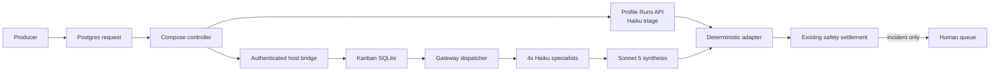
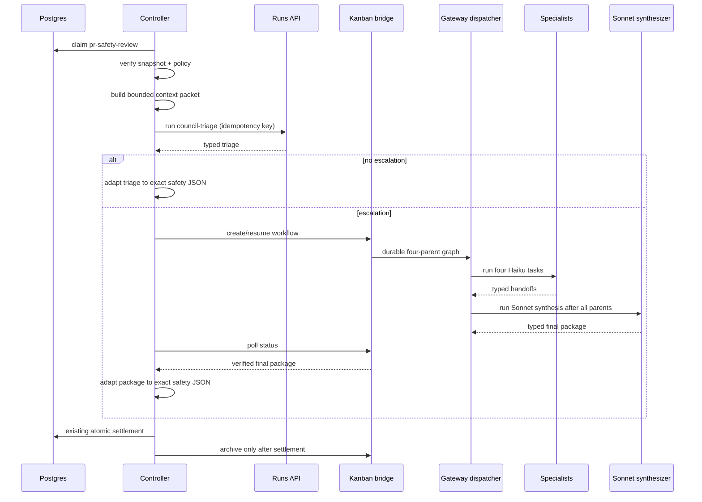
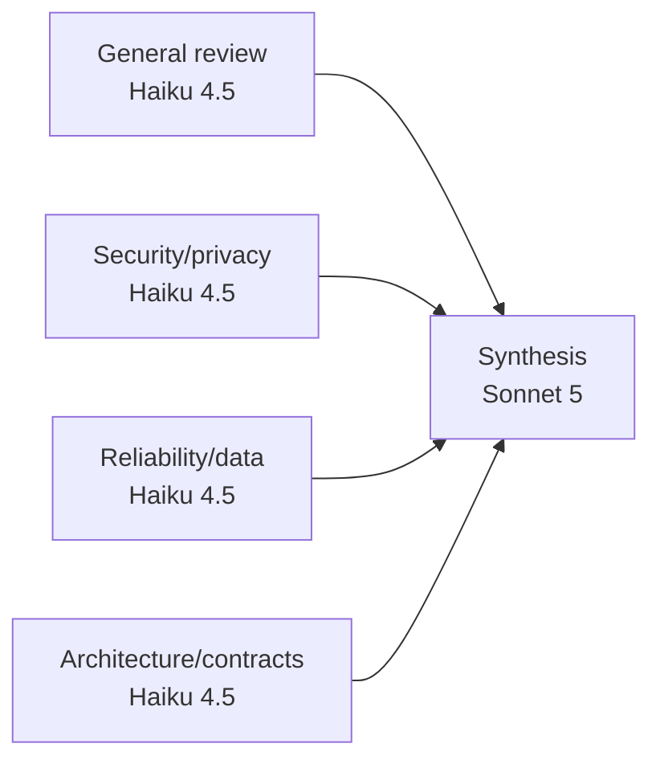
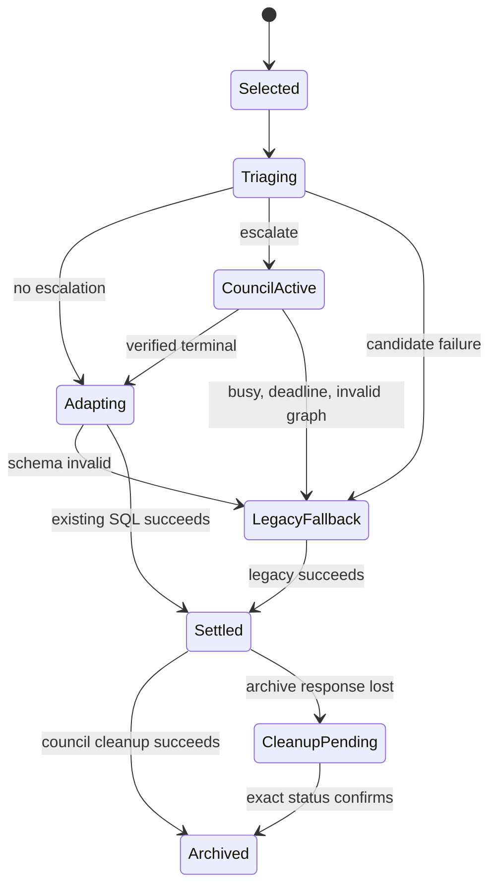

# DD: Adaptive PR Safety Kanban Council

- Status: draft.
- Owner: fleet operator.
- PRD: `docs/hermes/PRD-pr-safety-kanban-council.md`.
- Grounding: `docs/hermes/grounding-pr-safety-kanban-council.md`.
- Target: staged PRs. No activation in design PR.
- Next gate: full council, then task plan.

## Decision

Keep safety control plane. Replace candidate analysis only.

Build only after prior gate earns next piece:

1. offline context packet, Haiku triage, pure adapter, and replay report;
2. narrow authenticated host bridge for bounded live shadow;
3. durable controller route state, settlement fences, and canary routing.

Use existing gateway Kanban dispatcher. Do not add host dispatcher.

Use Sonnet 5 only as final escalated synthesizer. Use Haiku 4.5 for triage and four specialists.

## Scope

### In

- New `council-triage` restricted profile.
- Versioned v2 production workflow contract.
- Existing council specialist profiles.
- Existing `council-orchestrator`, used as final synthesis task.
- Context packet and typed output contracts.
- Offline replay runner and pure adapter first.
- Host bridge owned by `hermes-agent` only after offline pass.
- Bounded live shadow only after bridge and policy pass.
- Durable controller route state, settlement fences, and canary selection only after live-shadow pass.
- Policy v2 with approved exact providers/models and retention.

### Out

- Producer rewrite.
- New external effects.
- Kanban direct settlement.
- GitHub, memory, docs, CI, deploy, incident, or repository writes.
- General-purpose Kanban HTTP API.
- New queue system.
- Opus or model fallback.
- Concurrent production councils before later approval.
- SQLite WAL mode before safe linked SQLite.

## Existing Boundary

| Owner | Keeps authority |
| --- | --- |
| Producer | Event allowlist, immutable snapshot, identity, dedupe input |
| Postgres | Request truth, lease, retry cap, supersession, route lineage |
| Compose controller | Preflight, admission, model/bridge calls, adapter, handoff, settlement |
| Hermes Runs API | Triage and legacy model lifecycle |
| Host bridge | Kanban graph lifecycle only |
| Gateway Kanban dispatcher | Claims and runs assigned tasks |
| Models | Untrusted analysis proposals |
| Settlement SQL | Atomic incident-only human queue insertion |
| Human | Policy approval, rollout rate, incident/effect decision, merge |

## System Context



Notice:

- Bridge touches Kanban only.
- Bridge cannot touch Postgres or effects.
- Controller remains only join between request and analysis.
- Models cannot settle or route.

## Main Flow



Notice:

- Same request stays leased while analysis runs.
- Every create call is idempotent.
- Archive happens after settlement. Lost archive is cleanup work, not lost result.
- Lost response is polled. It is not treated as safe success.

## Context Packet

Models do not get arbitrary host file tools.

Controller builds canonical JSON from verified snapshot:

```json
{
  "schema_version": 1,
  "identity": {
    "operation_id": "string",
    "repo": "owner/repo",
    "pr": 123,
    "head_sha": "40 hex",
    "base_sha": "40 hex",
    "diff_hash": "64 hex",
    "policy_version": "v2",
    "policy_digest": "64 hex"
  },
  "policy": "full pinned policy text",
  "repository_rules": [
    {"path": "AGENTS.md", "content": "text"}
  ],
  "diff": "full git diff bytes decoded as UTF-8 replacement text",
  "changed_files": [
    {"path": "path", "status": "M", "content": "bounded full file or omitted marker"}
  ],
  "packet": {
    "complete_diff": true,
    "omitted_changed_files": []
  }
}
```

Canonical identity:

- `packet_bytes = canonical(packet_without_derived_metadata).encode("utf-8")`.
- `canonical()` is existing controller JSON: sorted keys, compact separators, UTF-8, no ASCII escaping.
- Git diff bytes decode with UTF-8 `errors="replace"` before canonicalization.
- `artifact_digest = sha256(packet_bytes)`.
- `artifact_bytes = len(packet_bytes)`.
- Digest and byte count live in request envelope. They are not inside digest preimage.
- Final signed HTTP body size includes envelope and must stay below 1 MiB. Candidate packet has smaller token gate below.

Rules:

- Identity comes from trusted payload.
- Diff digest is recomputed before packet build.
- Read repository rules and changed files by verified Git object, not joined checkout path.
- Reject symlink, submodule, special mode, NUL, absolute path, `..`, and post-read object mismatch.
- Full diff required for candidate route.
- Changed file content is useful context, not identity.
- Candidate packet max: 22,000 UTF-8 bytes. This is conservative token admission, not HTTP capacity.
- If full diff plus policy and required rules do not fit, candidate is ineligible. Legacy handles request before adaptive claim. No hidden truncation.
- Bound every array, string, finding, evidence item, and cumulative metadata size.
- Raw packet does not enter shared memory or handoff.
- Secret scanner runs before any model or Kanban persistence. A hit blocks candidate and records only redacted reason. Legacy remains route.
- No real repository packet goes to Anthropic before approved provider non-retention terms and policy v2.

Why packet, not file tools:

- Restricted profiles keep no terminal, web, MCP, plugin, memory, or general file capability.
- Snapshot remains outside worker workspace.
- Task text is complete untrusted evidence.
- Large or context-heavy PRs can stay on legacy path until a separate read-only tool design is approved.

Tradeoff: candidate has less repository exploration than legacy. Eval must prove quality. Candidate never claims full coverage when packet says omitted files.

## Triage Contract

Top-level keys exact:

```json
{
  "schema_version": 1,
  "workflow_id": "operation-bound string",
  "artifact_digest": "packet digest",
  "escalate": true,
  "escalation_reasons": ["security|privacy|reliability|data_integrity|architecture|incident_uncertainty|low_confidence"],
  "confidence": "low|medium|high",
  "proposed": {
    "status": "clear|changes_requested|needs_human_decision|incident_candidate|superseded",
    "intent": {},
    "findings": [],
    "coverage": {},
    "documentation": {},
    "observability": {},
    "incident": {
      "candidate": false,
      "changed_line_cause": false,
      "concrete_trigger": false,
      "severe_impact": false,
      "high_confidence_chain": false,
      "stop_rollback_or_page": false,
      "evidence": []
    },
    "human_decisions_needed": []
  },
  "external_effects": 0
}
```

Deterministic rules:

- `low` confidence requires escalation.
- Any incident criterion true with candidate false requires escalation.
- Candidate true requires all five incident criteria true and high confidence.
- Material security, privacy, reliability, data-integrity, or architecture finding requires matching escalation reason.
- `clear` requires empty findings, gaps, human decisions, and incident evidence.
- Wrong identity/digest, extra keys, wrong type, fallback model, or missing usage fails candidate.
- Prompt template separates policy from data. Repository rules, paths, code, comments, and parent handoffs stay inside untrusted-data delimiters.
- Runtime attestation is not model output. Controller persists route generation, submitted profile digest, prompt digest, policy digest, expected model, and pinned runtime digest before Runs API submit. Terminal Runs API model/usage plus stored submission metadata form trusted attestation. Any mismatch drains candidate work to legacy.

## Council Graph



Graph rules:

- Board: `pr-risk-council`.
- One active workflow.
- Four specialists ready in parallel.
- Sonnet task blocked on all four.
- One attempt per task. Zero retries.
- Specialist max runtime: 600 seconds.
- Request absolute deadline: 2,700 seconds from Postgres claim.
- Candidate deadline: claim time plus 900 seconds. This includes packet build, triage, bridge admission, council, and adaptation.
- Legacy reserve: final 1,800 seconds. Candidate stops at candidate deadline and transitions to legacy fallback.
- Bridge receives remaining candidate deadline. It never resets clock at create.
- Specialist task gets at most remaining workflow time, capped at 600 seconds.
- Synthesis starts only when remaining time and reserved token budget fit. Otherwise workflow fails.
- Triage budget: at most 30,000 input plus output tokens.
- Council budget: at most 150,000 input plus output tokens.
- Pre-admission reserve: four specialists each at most 22,000 input bytes plus 4,000 output tokens; synthesis at most 20,000 input plus 8,000 output tokens. Remaining budget is safety margin.
- Bridge records actual input, output, and cache tokens after each task. No next task starts if reserve plus actual spend exceeds ceiling.
- Deadline handler stops active workers and terminalizes outstanding tasks. Isolated fault test must prove this against pinned Hermes before live shadow.
- Exact Anthropic model IDs. No fallback.
- Scratch workspace only.
- No attachments or child tasks.
- Worker can call own-task Kanban lifecycle tools only.
- Final task reads parent handoffs through Kanban.
- Comment fallback is not accepted for production. Structured metadata required from all five tasks.

Current sanitized script may keep bounded specialist comment fallback for old canary evidence. Production adapter rejects it.

## Specialist Contract

Each specialist returns exact keys:

```json
{
  "workflow_id": "string",
  "artifact_digest": "64 hex",
  "role": "review|security|reliability|architecture",
  "verdict": "clear|findings|needs_human_decision|inconclusive",
  "claims": [],
  "evidence": [],
  "confidence": "low|medium|high",
  "dissent": [
    {
      "source_role": "security",
      "source_task_id": "id",
      "claim": "string",
      "evidence": [{"path": "file", "line": 1, "side": "new", "quote": "text"}],
      "disposition": "accepted|rejected|unresolved",
      "rationale": "string"
    }
  ],
  "residual_risk": [
    {
      "source_role": "security",
      "claim": "string",
      "evidence": [],
      "requires_human_decision": true
    }
  ],
  "external_effects": 0
}
```

Evidence uses typed `{path,line,side,quote}` citations. Adapter checks path and changed line against trusted diff map. Unchanged context can support chain. It cannot create incident cause.

Every list and string has contract caps. Production rejects comment fallback and free-form evidence.

## Synthesis Contract

Sonnet returns exact keys:

```json
{
  "workflow_id": "string",
  "artifact_digest": "64 hex",
  "verdict": "approve|changes_requested|needs_human_decision|incident_candidate|inconclusive",
  "intent": {},
  "material_findings": [],
  "coverage": {},
  "documentation": {},
  "observability": {},
  "incident": {
    "candidate": false,
    "changed_line_cause": false,
    "concrete_trigger": false,
    "severe_impact": false,
    "high_confidence_chain": false,
    "stop_rollback_or_page": false,
    "evidence": []
  },
  "human_decisions_needed": [],
  "consensus": [],
  "dissent": [
    {
      "source_role": "security",
      "source_task_id": "id",
      "claim": "string",
      "evidence": [],
      "disposition": "accepted|rejected|unresolved",
      "rationale": "string"
    }
  ],
  "residual_risk": [],
  "evidence": [],
  "members_completed": ["four task IDs"],
  "members_failed": [],
  "external_effects": 0
}
```

Bridge computes trusted runtime attestation before task creation and after every completion:

- hash installed SOUL, skills, config, and native env for each assigned profile;
- resolve effective CLI toolsets and require Kanban lifecycle only;
- read actual run profile/model/usage from Kanban run row;
- hash prompt templates and v2 workflow contract;
- read pinned Hermes commit from installed manifest;
- compare all values to create admission and saved state. Model metadata is never attestation.

Bridge verifies:

- exact workflow and packet digest;
- policy, prompt, workflow-contract, profile, toolset, and pinned-runtime digests;
- exact expected task IDs and profiles;
- one completed attempt each;
- exact provider/model;
- no attachment, child task, retry, or external effect;
- all four parent IDs completed;
- zero failed members;
- terminal before deadline;
- usage present and under budget;
- every typed citation exists in trusted diff map.

Bridge derives final dissent ledger from parent handoffs. It keys each item by source task plus canonical claim/evidence digest. Sonnet can propose disposition and rationale. Missing disposition becomes `unresolved`. Bridge preserves every parent dissent and residual-risk item exactly once. Every unresolved dissent and human-required residual risk enters `human_decisions_needed`.

## Safety Adapter

Adapter accepts trusted request plus one verified analysis package.

Adapter, not model, writes:

- nonce;
- operation ID;
- repo and PR;
- head and base SHA;
- diff hash;
- policy version and digest.

Mapping:

| Candidate verdict | Safety status |
| --- | --- |
| `approve` or triage `clear` | `clear` only if every empty-state invariant holds |
| `changes_requested` | `changes_requested` |
| `needs_human_decision` | `needs_human_decision` |
| `incident_candidate` | `incident_candidate` only if all incident booleans true |
| `inconclusive` | `needs_human_decision`, never `clear` or incident |
| malformed/missing/timed out | same running request transitions to legacy fallback; only legacy failure can fail request |

Lossless mapping:

- `findings[]` item: `{role,claim,evidence,confidence,dissent,residual_risk}`.
- `coverage.council`: `{consensus,dissent,residual_risk,members_completed,workflow_id,artifact_digest}`.
- `incident.evidence`: only adapter-validated changed-line citations.
- `human_decisions_needed[]`: synthesis items plus unresolved specialist dissent.

Handoff adds `## Council context` from `coverage.council`. Existing identity, findings, and human-decision sections stay. Top-level keys remain unchanged. `valid_safety()` remains final gate.

## Host Bridge

Build only after offline pass. Repo-owned Python service. Runs as `hermes-agent`. Separate launchd label. Not part of pinned Hermes source. It is not a dispatcher.

Endpoints:

```text
POST   /v1/councils
GET    /v1/councils/{workflow_id}
POST   /v1/councils/{workflow_id}/archive
GET    /healthz
```

### Authentication

Every non-health request has:

```text
Content-Type: application/json
Host: hermes-council.localhost:<port>
X-Council-Generation: <integer>
X-Council-Timestamp: <unix seconds>
X-Council-Nonce: <32 hex>
X-Council-Signature: <hex HMAC-SHA256>
```

Request signature preimage:

```text
REQUEST\nMETHOD\nPATH\nGENERATION\nTIMESTAMP\nNONCE\nSHA256(BODY)
```

Every response carries generation, timestamp, request nonce, and signature. Response signature preimage:

```text
RESPONSE\nMETHOD\nPATH\nHTTP_STATUS\nGENERATION\nTIMESTAMP\nREQUEST_NONCE\nSHA256(BODY)
```

Controller verifies response signature before reading state or result. Health response is unsigned and contains no workflow data.

Rules:

- Dedicated random HMAC key in mode-0600 file. Key never shares profile API key.
- Constant-time compare.
- Bind loopback only. Compose reaches `host.docker.internal`.
- Exact Host allowlist. Reject `Origin`. No CORS. Exact content type.
- Timestamp window: 60 seconds.
- Durable nonce cache for 120 seconds. Replay returns 409.
- Generation rotation requires stop admission, drain, rotate, preflight, resume.
- Body max 1 MiB.

### Create

Exact request:

```json
{
  "schema_version": 1,
  "request_id": 1,
  "identity": {
    "operation_id": "string",
    "repo": "owner/repo",
    "pr": 1,
    "head_sha": "40 hex",
    "base_sha": "40 hex",
    "diff_hash": "64 hex",
    "policy_version": "v2",
    "policy_digest": "64 hex"
  },
  "artifact": {},
  "artifact_digest": "64 hex",
  "artifact_bytes": 1,
  "candidate_deadline_at": 1,
  "auth_generation": 1,
  "workflow_contract_digest": "64 hex",
  "profile_generations": {},
  "runtime_digest": "64 hex"
}
```

Caller does not choose workflow or idempotency ID.

Bridge recomputes packet bytes/digest. It derives:

```text
workflow_id = "pr-risk-council:" + operation_id
idempotency_key = sha256(operation_id + artifact_digest + policy_digest + workflow_contract_digest)
```

Accepted response is exact:

```json
{
  "schema_version": 1,
  "workflow_id": "string",
  "state": "active|terminal",
  "replayed": false,
  "artifact_digest": "64 hex",
  "task_ids": {
    "review": "id",
    "security": "id",
    "reliability": "id",
    "architecture": "id",
    "synthesis": "id"
  }
}
```

HTTP rules:

- `201`: created.
- `200`: exact idempotent replay.
- `400`: malformed JSON or key/type/size violation.
- `401`: signature/generation/timestamp failure.
- `409`: nonce replay, identity mismatch, or same workflow with different canonical bytes.
- `422`: profile, model, runtime, policy, packet, graph, or journal preflight failure.
- `429`: another workflow active. No queue in bridge.
- `503`: board store unavailable.

Adaptive controller does not wait on 429. It atomically selects legacy before model work. Supervised shadow skips sample. No Postgres lease waits for slot.

### Status

Active `200` response exact keys:

```json
{
  "schema_version": 1,
  "workflow_id": "string",
  "state": "active",
  "artifact_digest": "64 hex",
  "created_at": 0,
  "deadline_at": 0,
  "tasks": {
    "review": {"task_id": "id", "profile": "council-reviewer", "model": "claude-haiku-4-5-20251001", "status": "ready|running|done|blocked", "attempts": 0},
    "security": {"task_id": "id", "profile": "council-security", "model": "claude-haiku-4-5-20251001", "status": "ready|running|done|blocked", "attempts": 0},
    "reliability": {"task_id": "id", "profile": "council-reliability", "model": "claude-haiku-4-5-20251001", "status": "ready|running|done|blocked", "attempts": 0},
    "architecture": {"task_id": "id", "profile": "council-architect", "model": "claude-haiku-4-5-20251001", "status": "ready|running|done|blocked", "attempts": 0},
    "synthesis": {"task_id": "id", "profile": "council-orchestrator", "model": "claude-sonnet-5", "status": "blocked|ready|running|done", "attempts": 0}
  },
  "usage": {"input_tokens": 0, "output_tokens": 0, "cache_read_tokens": 0, "cache_write_tokens": 0}
}
```

Terminal `200` exact keys:

```json
{
  "schema_version": 1,
  "workflow_id": "string",
  "state": "terminal",
  "outcome": "completed|failed|timed_out",
  "artifact_digest": "64 hex",
  "created_at": 0,
  "deadline_at": 0,
  "tasks": {},
  "usage": {},
  "result_digest": "64 hex or empty",
  "result": null
}
```

`result` is synthesis contract only for completed verified graph. Archived `410` returns exact `{schema_version,workflow_id,state:"archived",artifact_digest,result_digest,purged_at}`. Unknown workflow returns `404`. Every 4xx/5xx body is exact `{schema_version,error_code,detail,retryable}`. `error_code` is one of `malformed_request|unauthorized|replay|identity_conflict|preflight_failed|workflow_busy|workflow_active|workflow_missing|store_unavailable|internal_error`. Detail is redacted and at most 200 characters.

### Archive

Request has exact empty object `{}`. Response:

```json
{
  "schema_version": 1,
  "workflow_id": "string",
  "state": "archived",
  "result_digest": "64 hex",
  "purge_due_at": 0
}
```

Only exact terminal workflow can archive. Active returns 409. Repeated archive returns same 200 tombstone.

### Persistent State And Recovery

Bridge stores mode-0600 atomic JSON. Temporary file, file fsync, rename, parent-directory fsync.

```json
{
  "schema_version": 1,
  "phase": "creating|active|terminal|archived",
  "request_id": 1,
  "operation_id": "string",
  "repo": "owner/repo",
  "head_sha": "40 hex",
  "base_sha": "40 hex",
  "policy_digest": "64 hex",
  "artifact_digest": "64 hex",
  "canonical_body_digest": "64 hex",
  "auth_generation": 1,
  "workflow_contract_digest": "64 hex",
  "profile_generations": {},
  "runtime_digest": "64 hex",
  "workflow_id": "string",
  "idempotency_key": "64 hex",
  "task_ids": {},
  "created_at": 0,
  "deadline_at": 0,
  "packet_path": "absolute private runtime path",
  "packet_digest": "64 hex",
  "result_digest": null,
  "result": null,
  "purge_due_at": null
}
```

Restart rules:

Before phase becomes `creating`, bridge writes canonical packet to mode-0600 `packet_path`, fsyncs it, records digest, then fsyncs state. Recovery re-reads packet, checks path containment, mode, owner, digest, and canonical identity before any task write.

- `creating` plus absent board: resume deterministic board/task creation from verified saved packet.
- `creating` plus matching board: finish only missing idempotency-bound tasks.
- `active` plus matching board: resume status. Gateway owns dispatch.
- deadline exceeded: stop workers; terminalize once; no recreate or retry.
- `terminal`: return saved verified result and digest.
- `archived`: return tombstone. Do not recreate.
- `active|terminal` plus absent board: fail closed and require reconcile.
- board without state or identity mismatch: quarantine board and require reconcile.

Provide `scripts/hermes-council-reconcile.py` before live shadow. It reports only by default. Human chooses resume exact create, terminalize timed-out workflow, purge exact archived workflow, or quarantine mismatch. No destructive default.

### SQLite And Retention

- Assert `journal_mode=DELETE` and configured busy timeout at startup and health.
- Bounded busy retry cannot pass workflow deadline.
- Check integrity and disk headroom before create.
- Clean-host restore drill before live shadow.
- Real packet exists in signed request body memory, bridge state while active, Kanban task bodies, provider request, and bounded diagnostics only.
- Local state uses mode 0700 directories and mode 0600 files on FileVault-backed disk. No backup or shared-memory inclusion.
- After controller records verified result, bridge replaces raw task bodies with digests if supported; otherwise removes board DB after metadata/result export. Raw code purge deadline: 24 hours. Purge proof is recorded.
- Provider non-retention terms must be approved before real packet inference.
- Logs never contain packet, code, model raw output, or secrets.

Bridge has no Postgres, GitHub, memory, doc, CI, deploy, terminal, or generic shell API.

## Controller State

Do not add production lineage before offline pass. Bounded supervised shadow can use signed local eval artifacts. Any unattended shadow requires durable shadow jobs first.

Before canary add authoritative Postgres state. No raw model text.

```text
pr_safety_analysis_runs
- request_id
- route: legacy|adaptive
- phase: selected|triage|council|adapted|legacy_fallback|settled|cleanup_pending|cleanup_complete|failed
- route_generation
- profile_generations
- packet_path
- artifact_digest
- triage_run_id
- workflow_id
- candidate_result_digest
- legacy_run_id
- settled_result_digest
- latency_ms
- input_tokens
- output_tokens
- cost_usd
- created_at
- updated_at
```

Unique keys:

- `request_id`;
- `workflow_id` when present.

Controller writes through security-definer functions. `hermes_worker` gets no direct table DML.

Atomic transitions:

1. claim request and persist route/generations/packet binding;
2. start or recover triage;
3. bind exact workflow before bridge create;
4. record candidate result digest;
5. adapt or transition to `legacy_fallback`;
6. start/recover legacy run if needed;
7. settle exact selected result once;
8. mark cleanup pending/completed.

Packet file remains immutable until settlement and bridge cleanup. Snapshot remains active because request stays `running`. Route generation cannot change in flight.

## Modes

```text
PR_SAFETY_ENGINE=legacy|adaptive
PR_SAFETY_CANARY_PERCENT=0..100
```

### Offline

Policy v2 or reviewed sanitized-evaluation exception must be merged before any Anthropic call. Separate operator command. No request claim, bridge, Postgres migration, handoff, or settlement. Uses sanitized committed fixtures and explicit local inputs. Produces signed comparison report.

### Bounded Live Shadow

Separate operator command after offline pass and policy v2. It copies canonical packet before legacy settlement, runs one sample through bridge, and writes signed local eval result. It has no database credential, handoff path, or settlement function. Legacy never waits.

Do not add continuous `shadow` controller mode. If later needed, return to DD for separate shadow-job table, packet TTL, recovery, spend cap, and SQL settlement denial.

### Legacy

Current path. Default. No candidate work.

### Adaptive

Deterministic selection:

```text
sha256(operation_id)[0:8] mod 100 < canary_percent
```

Selected eligible request uses candidate. Busy bridge, candidate timeout, malformed output, drift, or adapter rejection transitions same running request to legacy fallback. Others use legacy. Selection persists before model call.

Changing percentage affects new requests only. Existing request keeps stored route.

## Crash And Uncertainty



Rules:

- Triage POST uses stable idempotency key and persisted run ID.
- Bridge create uses stable derived identity.
- Lost response means poll/reconcile same ID.
- Never create second workflow for same request.
- Client monotonic candidate deadline starts at request claim and applies through packet, triage, bridge, council, and adaptation.
- Final 1,800 seconds stay reserved for legacy fallback. Request hard deadline is 45 minutes.
- No 429 wait while lease held.
- Candidate failure does not terminalize request. Same request and snapshot fall back to legacy.
- Legacy failure follows current safety failure rules.
- Existing direct-effect profiles keep `reconcile` rule.
- Settlement response uncertainty checks request/nonce and stored result digest before repeat.
- Archive failure does not reverse settlement. It creates operator cleanup state.
- Rollback sets new admission to legacy, lets completed candidate adapt, sends incomplete candidate to legacy fallback, then drains bridge. Timed drill required before 5%.

## Versioned Profile And Runtime Contract

Keep current sanitized v1 graph unchanged for old canary evidence.

Add `agent-config/hermes/workflows/pr-risk-council-kanban-v2.json`:

- seventh profile: `council-triage`, Haiku 4.5;
- four existing Haiku specialists;
- `council-orchestrator`, Sonnet 5, as dependent synthesis;
- `council-verifier` remains v1-only;
- exact prompt, policy, toolset, profile, and runtime digests;
- exact per-role input/output caps;
- no fallback.

Configurator and preflight accept explicit v1 or v2 contract. They never reinterpret `verification` as `synthesis`.

Offline uses local profile invocation. Before live Runs API triage:

1. pause and drain controller;
2. rotate API key bundle to version 2 with additive `council-triage` key;
3. install profile key and route;
4. run profile-scoped conformance;
5. restart controller with matching auth/profile generations.

Legacy route and v1 graph stay usable through rollback window.

## Security And Privacy

Threats:

- prompt injection in policy-adjacent repository rules, paths, code, comments, and parent handoffs;
- forged identity, changed-line citation, incident predicate, or dissent in model output;
- task body asks worker for external action;
- bridge key theft, replay, Host confusion, or cross-workflow request;
- packet persistence or logs leak source, secret, or customer data;
- hostile Git path, symlink, submodule, special mode, or object swap;
- profile, prompt, toolset, runtime, or provider generation drift;
- profile fallback gains broader tools;
- SQLite corruption.

Controls:

- data-only prompt framing plus injection evals for every untrusted source;
- trusted identity never copied from model;
- adapter validates changed-line citations and all five incident predicates;
- bridge unions parent dissent independently;
- exact prompt/profile/tool/model/runtime digest checks before create and after completion;
- no external tools, MCP, plugins, memory, terminal, web, or generic file tools;
- generation-bound HMAC, timestamp, nonce, Host/content-type/Origin checks;
- Git-object reads and hostile-mode/path rejection;
- field, body, metadata, and log bounds;
- workflow/task/digest/idempotency binding;
- one active board;
- DELETE journal;
- fail closed and drain on drift.

Profiles are not sandboxes. Security claim is capability minimization plus deterministic fencing, not tenant isolation.

## Reliability And Operations

### Signals

Emit before canary:

- `hermes_pr_safety_queue_depth` and `hermes_pr_safety_queue_age_seconds`;
- `hermes_pr_safety_analysis_total{route,phase,outcome}`;
- `hermes_pr_safety_analysis_seconds{route,phase}`;
- `hermes_pr_safety_escalation_total{reason}`;
- `hermes_pr_safety_council_active_age_seconds`;
- `hermes_pr_safety_task_attempts{role,outcome}`;
- `hermes_pr_safety_bridge_http_total{status}`;
- `hermes_pr_safety_workflow_deadline_total`;
- `hermes_pr_safety_tokens_total{model,role,direction,cache}`;
- `hermes_pr_safety_cost_usd{model,role}`;
- `hermes_pr_safety_adapter_rejection_total{reason}`;
- `hermes_pr_safety_incident_candidate_total{route}`;
- `hermes_pr_safety_cleanup_pending_age_seconds`;
- `hermes_pr_safety_sqlite_bytes` and `hermes_pr_safety_sqlite_integrity`.

Bounded supervised shadow uses signed report and local redacted logs. No dashboard or new UI.

### Alerts

Before canary:

SLOs:

- 99% of candidate-selected requests adapt or enter legacy fallback within 15 minutes.
- 99% of all safety requests settle within 45 minutes after claim.
- 99.9% bridge request availability during enabled windows.
- Hard-gate failures remain zero.

Track p50/p95/p99 for queue, packet, triage, bridge admission, council, adaptation, fallback, and total settlement. Track traffic, typed errors, worker CPU/memory/process slots, SQLite busy time/disk/headroom, provider rate-limit headroom, and bridge file-descriptor saturation.

Alerts before canary:

- fast burn: 14.4x error-budget burn over 1 hour;
- slow burn: 6x error-budget burn over 6 hours;
- candidate active beyond 15 minutes or request beyond 45 minutes;
- bridge unavailable for 5 minutes;
- any hard-gate counter above zero;
- wrong model/profile/fallback;
- duplicate task attempt;
- invalid or corrupt Kanban DB;
- cleanup pending older than 30 minutes;
- any saturation signal above tested capacity threshold.

Canary entry requires `ONCALL.md` steps for admission stop, route fallback, bridge restart, exact reconcile, stale workflow, SQLite quarantine, raw-packet purge, and recovery verification. Owner: fleet operator.

No automatic Postgres watchdog. Operator recovery remains `scripts/fleet.sh up` plus bridge/board reconcile command.

## Performance And Cost

- Triage: one Haiku call for candidate-eligible PR.
- Escalated: four parallel Haiku calls plus one Sonnet call.
- Concurrency: one workflow. One task per specialist profile.
- Deadline: 15 minutes.
- Triage ceiling: 30,000 tokens. Council ceiling: 150,000 tokens.
- Admission rejects overlap. Supervised shadow skips sample. Adaptive falls back to legacy.
- Before canary measure peak merged-PR arrival, escalation rate, council p50/p95 runtime, and overlap rejects.
- Require utilization `arrival_rate * escalation_rate * mean_runtime < 0.7`.
- Model 1x and 10x volume. Return to DD before increasing concurrency.
- Lock model prices and date. Report p50/p95 USD per PR, USD per escalation, cache charges, legacy cost for ineligible PRs, shadow double-run cost, local storage/operations, and monthly 1x/10x projection.
- Run Sonnet-vs-Haiku synthesis ablation on same handoffs. Human approves Sonnet cost only with measured quality lift.
- Candidate report uses provider usage and actual billed token classes. Pre-admission reserve remains hard gate.

## Data Migration

- Add lineage table and functions. No backfill required.
- Existing requests stay legacy.
- Existing handoff schema stays readable.
- New nested evidence fields are additive.
- Old controller ignores new lineage table.
- Rollback leaves inert rows.

## Tests

### Unit

- packet canonicalization, digest, size, secret gate, symlink rejection;
- triage exact schema and escalation floor;
- incident five-condition gate;
- synthesis exact schema and parent set;
- adapter identity copy and verdict mapping;
- canary hash stability;
- bridge auth, body limit, idempotency, 409, 429;
- recovery phases;
- profile/model/tool policy.

### Integration

- controller to fake Runs API triage;
- controller to fake bridge;
- bridge to isolated Kanban DB;
- four-parent fan-in to Sonnet task;
- one attempt each and zero effects;
- crash before/after create, terminal, settlement, archive;
- shadow cannot settle candidate;
- incident queues exactly once;
- old legacy route unchanged.

### Eval

- minimum 90 independent safety cases: 30 severe, 30 ordinary non-incident, 30 clean/mechanical;
- three repetitions for variance, not sample count;
- baseline and candidate same packet for eligible cases;
- report ineligible cases and route-weighted result; no selection hiding;
- recent over-classification cases;
- severe data loss, broad outage, security/privacy controls;
- prompt injection in rules, paths, code, comments, and parent handoffs;
- malformed output, forged citation/dissent, stale identity, deadline, failed specialist;
- blind human preference;
- Sonnet-vs-Haiku synthesis ablation;
- 1x/10x cost and capacity model.

## Rollout

| Stage | Entry | Exit | Rollback |
| --- | --- | --- | --- |
| 0. Docs | Human accepts PRD/DD/plan | Design merged | Close/revise docs PR |
| 1. Offline | Policy v2 or reviewed sanitized-eval exception merged; packet, contracts, pure adapter, and operator-run graph ready | Locked replay gates pass; human decides whether bridge is earned | Stop candidate work; build no production infra |
| 2. Live shadow | Policy v2 and retention approved; bridge/reconcile/cleanup tests pass | Locked supervised sample, cost, capacity, and disagreement report accepted | Stop bridge admission; purge sample state |
| 3. 5% canary | Live shadow pass; lineage, SQL fences, metrics, ONCALL, rollback drill pass | Hard gates zero; sample reviewed | Set percent 0; drain/fallback to legacy |
| 4. 25% canary | 5% pass | Hard gates zero; sample reviewed | Set prior percent or `legacy` |
| 5. Adaptive default | 25% pass; human approval | Ongoing gates hold | Set `legacy` |

No route activates from merge alone. Operator changes config after human approval.

## Alternatives

| Option | Why reject |
| --- | --- |
| Full council every PR | Cost and latency without value on mechanical changes |
| Let Sonnet create graph | Adds model authority to deterministic routing |
| Let Compose mount Kanban SQLite | Cross-owner state writes and SQLite corruption risk |
| Add SSH-back or Docker socket | Breaks boundary policy |
| Give workers terminal or broad file tools | Exposes host/service-account capability; profiles are not sandboxes |
| Put raw snapshot in shared memory | Privacy, staleness, and authority failure |
| Replace settlement schema | Unneeded cutover risk |
| Remove legacy route | No immediate rollback |
| Accept comment fallback in production | Weak typed handoff and attribution |

## Policy Change

Current policy says OpenAI only. Current and planned model configs use Anthropic. This is a hard blocker.

Policy v2 must name:

- `claude-haiku-4-5-20251001` for triage and specialists;
- `claude-sonnet-5` for escalated synthesis;
- legacy model only while rollback route exists;
- no fallback provider/model;
- approved provider non-retention terms;
- local source/packet inventory, backup exclusion, 24-hour purge, and purge proof;
- human approval for future provider/model changes.

Do not run Haiku/Sonnet replay under v1. First land reviewed v2 or a narrow reviewed sanitized-evaluation exception. Bind real repository packets and requests to v2 digest only after rollout approval.

## Open Questions

| Question | Owner | Blocks |
| --- | --- | --- |
| Human approves policy v2 or sanitized-eval exception, plus exact legacy model allowance? | Human | Offline replay |
| What fraction of real PRs fit complete 22,000-byte candidate packet? | Eval owner | Live shadow |
| Locked live-shadow sample size and duration? | Human before shadow | Canary |

## Design Stop Conditions

Return to DD if:

- candidate needs broad file, terminal, web, MCP, or plugin capability;
- bridge needs Postgres or external-effect access;
- current top-level safety schema cannot carry required evidence;
- one-active-workflow is not enough for queue SLO;
- packet incompleteness causes severe recall below 100%;
- provider policy cannot be approved.
