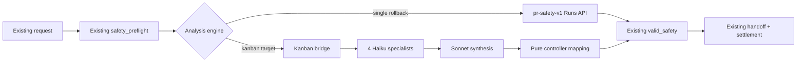
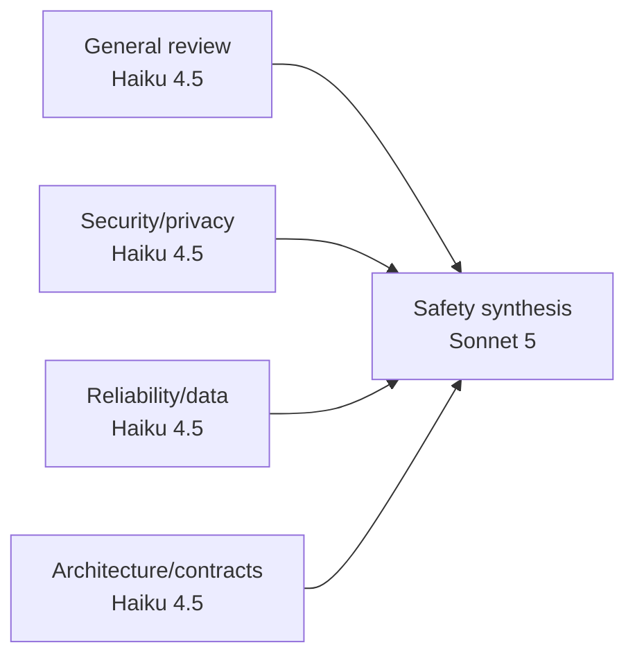

# DD: Kanban-Backed PR Safety Analysis

- Status: draft.
- Owner: fleet operator.
- PRD: `docs/hermes/PRD-pr-safety-kanban-council.md`.
- Next gate: implementation plan after approval.

## Decision

Replace controller’s single safety Runs API call with one fixed Kanban graph.

Keep everything before and after analysis unchanged.



## Scope

### Change

- Add production v2 council contract.
- Add read-only council analysis profile policy.
- Parameterize proven council script for one immutable safety request.
- Add narrow authenticated host bridge.
- Add controller `single|kanban` analysis branch.
- Add one private pure controller function mapping synthesis to current safety schema.
- Add comparison harness and tests.

### Do Not Change

- producer;
- request kind or payload;
- Postgres request schema;
- lease, dedupe, retry, or supersession;
- snapshot or policy identity;
- top-level safety result schema;
- handoff ownership;
- incident threshold;
- settlement SQL;
- human queue or UI;
- external-effect authority.

## Ownership

| Component | Responsibility |
| --- | --- |
| Producer | Create immutable merged-PR snapshot and enqueue same request |
| Postgres/controller | Own request, lease, nonce, identity, and settlement |
| Bridge | Create, inspect, and archive exact Kanban graph |
| Gateway dispatcher | Run assigned Kanban tasks |
| Specialists | Produce typed role findings |
| Synthesizer | Combine four handoffs into one proposed safety result |
| Human | Decide incident, remediation, merge, and activation |

Bridge never accesses Postgres or external-effect systems.

## Workflow Contract V2

Create `agent-config/hermes/workflows/pr-risk-council-kanban-v2.json`.

Keep current v1 sanitized canary contract and installed profiles unchanged. V2 uses versioned profiles because read-only snapshot tools change profile bytes:

- `council-reviewer-v2`;
- `council-security-v2`;
- `council-reliability-v2`;
- `council-architect-v2`;
- `council-orchestrator-v2`.

Configurator installs/restores v2 names separately. V1 profiles and rollback evidence remain intact.

V2 graph:



Profiles:

| Role | Profile | Model |
| --- | --- | --- |
| General | `council-reviewer-v2` | `claude-haiku-4-5-20251001` |
| Security | `council-security-v2` | `claude-haiku-4-5-20251001` |
| Reliability/data | `council-reliability-v2` | `claude-haiku-4-5-20251001` |
| Architecture/contracts | `council-architect-v2` | `claude-haiku-4-5-20251001` |
| Synthesis | `council-orchestrator-v2` | `claude-sonnet-5` |

Rules:

- one attempt per task;
- zero retries;
- no fallback provider/model;
- `claude-sonnet-5` is exact Anthropic catalog ID in pinned Hermes v0.21.3; no dated Sonnet 5 ID exists in that catalog;
- four specialist tasks ready in parallel;
- synthesis blocked on all four;
- no attachments or child tasks;
- typed completion metadata required;
- no production comment fallback;
- 15-minute graph deadline;
- 150,000 aggregate input/output token ceiling;
- one active workflow initially.

`council-verifier` stays available for v1 canary only. V2 does not reinterpret it.

## Snapshot Access

Same use case requires repository context, not a truncated packet.

Bridge receives already-preflighted snapshot and policy paths. It verifies:

- path under configured roots;
- no symlink escape;
- HEAD equals request head;
- clean worktree;
- recomputed diff digest;
- policy path, version, and digest;
- snapshot is not writable through exposed worker tools.

V2 fails before workflow-input or task creation unless `PR_SAFETY_SNAPSHOT_ROOT`, `PR_SAFETY_POLICY_PATH`, `PR_SAFETY_POLICY_VERSION`, and `PR_SAFETY_POLICY_DIGEST` are present and exactly match trusted request identity and resolved paths.

PR 3 bridge will write mode-0440 workflow inputs:

```text
workflow-input/
  .council-tools.json
  input/
    identity.json
    diff.patch
    policy.md
```

### Narrow MCP design kickback

Pinned Hermes v0.21.3 auto-adds its full worker Kanban toolset when `HERMES_KANBAN_TASK` is present. That set includes attachment and URL tools and does not meet this workflow's capability boundary. PR 1 therefore adds repo-owned stdio MCP `hermes-council-tools`, installed root-owned mode 0555 at `/usr/local/libexec/ai-pr-automation/hermes-council-tools`.

Gateway launch config pins `HERMES_COUNCIL_TOOLS_PYTHON` to the installed Hermes venv. Profile MCP config interpolates it into `COUNCIL_TOOLS_PYTHON`; the server validates that alias and re-executes through it before importing handlers, so `/usr/bin/env` or launchd PATH cannot select another Python/runtime.

The server exposes exactly seven tools, in contract order:

- `snapshot_read`;
- `snapshot_search`;
- `kanban_show`;
- `kanban_comment`;
- `kanban_heartbeat`;
- `kanban_complete`;
- `kanban_block`.

Profile config selects only `platform_toolsets.cli: [council-tools]` and sets `agent.disabled_toolsets: [delegation, kanban]`. This removes auto-added built-in Kanban tools. No create, link, list, unblock, review-routing, attachment, or URL tool reaches the model.

Kanban MCP schemas contain no task, board, run, claim-lock, or session field and reject additional properties. MCP discovery starts before `AIAgent` creates `HERMES_SESSION_ID`, so profile config does not transport worker session identity. It explicitly interpolates task, run, claim lock, board, DB, workspace, snapshot root, workflow root, profile, and interpreter into `COUNCIL_*` aliases. The server validates every alias. Snapshot binding uses only council root/workspace aliases. Before a Kanban call, the server removes ambient `HERMES_KANBAN_*` and `HERMES_SESSION_ID`, restores only task, run, claim lock, board, DB, and `HERMES_PROFILE` from validated aliases, verifies pinned DB/board resolution, and calls the exact `tools.kanban_tools` handler with trusted task and board arguments. It removes `HERMES_DELEGATED_CHILD_CONTEXT` only in that handler scope because this MCP process is the dispatcher's explicitly supervised own-task transport, not an agent-created descendant. Pinned ownership, expected-run, and claim-lock checks remain authoritative. Missing or invalid aliases, schema violations, oversized input, and pinned handler `{"error":...}` results fail closed; malformed JSON-RPC retains standard `-32700`, `-32600`, `-32601`, and `-32602` errors.

PR 2's sanitized local graph creates `COUNCIL_WORKSPACE/.council-tools.json` so its executable workspace can satisfy local graph acceptance. PR 3 owns creation of this binding in production. The binding is exact, schema-versioned, owned by current service uid, mode 0440, regular, non-symlink, and single-link:

```json
{"schema_version":1,"snapshot_root":"/absolute/snapshot","input_root":"/absolute/workflow/input"}
```

Logical `snapshot/<relative>` maps to `snapshot_root`; `input/<relative>` maps to `input_root`. Bound roots must remain under validated `COUNCIL_SNAPSHOT_ROOT` and `COUNCIL_WORKFLOW_ROOT`, interpolated from `PR_SAFETY_SNAPSHOT_ROOT` and `PR_SAFETY_WORKFLOW_ROOT`. Absolute paths, `..`, backslash aliases, paths over 4,096 characters or 32 components, symlink components, non-regular files, and non-UTF-8 text fail closed. `PR_SAFETY_WORKFLOW_ROOT`, production binding creation, and live bound reads are PR 3 bridge responsibilities; PR 1 does not claim a live snapshot read. PR 2 creates only the sanitized local graph binding described above.

Limits are fixed: 256 KiB per JSON-RPC request line; 1 MiB per file; literal query at most 256 characters; search at most 2,000 files, 4,096 entries, 32 directory levels, 16 MiB total bytes, 100 results, and 2,000 characters per returned line. Kanban text is at most 16,000 characters, heartbeat notes 2,000 characters, and completion metadata 64 KiB, 64 top-level properties, 1,024 entries, and 16 levels deep. Completion metadata cannot declare `artifacts`, closing the pinned handler's metadata-based attachment path.

They may not receive:

- terminal or process tools;
- write, patch, or delete tools;
- built-in file tools;
- web/browser tools;
- GitHub, CI, deploy, incident, monitor, memory, document, other MCP, plugin, delegation, or connection tools;
- orchestrator Kanban create/link/unblock/list tools.

Pinned-runtime preflight launches each profile with dummy task, run, claim lock, board, DB, workspace, roots, profile, and interpreter env; performs real MCP discovery through stdio `initialize` and `tools/list`; discovers only `council-tools`; and compares all seven MCP-prefixed model definitions against canonical descriptions and schemas, including bounds and `additionalProperties`. It also proves zero built-in tools, exact profile config including alias interpolation, exact models, empty fallback lists, sources, and graph. Any drift fails closed. Bound-root and live-read enforcement remains deferred to PR 3.

Profiles remain one OS trust tier, not sandboxes. This change does not claim tenant isolation.

## Specialist Handoff

Exact keys:

```json
{
  "workflow_id": "string",
  "artifact_digest": "64 hex",
  "role": "review|security|reliability|architecture",
  "verdict": "clear|findings|needs_human_decision|inconclusive",
  "claims": ["bounded claim"],
  "evidence": [
    {"path": "relative/file", "line": 1, "side": "new", "quote": "bounded changed-line text"}
  ],
  "confidence": "low|medium|high",
  "dissent": [
    {
      "source_role": "security",
      "claim": "bounded disagreement",
      "evidence": [],
      "disposition": "accepted|rejected|unresolved",
      "rationale": "bounded reason"
    }
  ],
  "residual_risk": [
    {"source_role": "security", "claim": "bounded risk", "evidence": [], "requires_human_decision": true}
  ]
}
```

Evidence cites file, changed line, side, and bounded quote. Incident claims require direct changed-line citation.

## Synthesis Handoff

Exact keys:

```json
{
  "workflow_id": "string",
  "artifact_digest": "64 hex",
  "verdict": "clear|changes_requested|needs_human_decision|incident_candidate|inconclusive",
  "intent": {},
  "findings": [],
  "coverage": {},
  "documentation": {},
  "observability": {},
  "incident": {
    "candidate": false,
    "changed_line_cause": false,
    "concrete_trigger": false,
    "severe_impact": false,
    "high_confidence_chain": false,
    "stop_rollback_or_page": false,
    "evidence": []
  },
  "human_decisions_needed": [],
  "dissent": [],
  "residual_risk": []
}
```

Bridge verifies:

- exact workflow/artifact identity;
- exact five tasks and four parent IDs;
- one completed attempt per task;
- expected profile and model;
- all four structured parent handoffs;
- no failed member, attachment, child, retry, or effect-capable tool;
- deadline and budget;
- every incident citation points to changed line.

Usage is resolved only after task and run `worker_pid` values clear. The verifier opens each expected profile's `state.db` with a read-only SQLite URI and selects closed sessions (`ended_at` non-null after token flush) using fields pinned Kanban workers actually populate: `source='kanban'`, expected model when that schema column exists, and `started_at`/`ended_at` within a fixed bounded window around the Kanban run. Profile-scoped state plus one-worker-per-profile concurrency provides role isolation. Exactly one row must match. Input/output token columns are required; cache-read/write columns are included when available. Zero matches, multiple matches, unsupported required columns, wrong source/model, out-of-window rows, or any negative count fail closed. Nullable Kanban `cwd`, optional pinned-handler `worker_session_id`, and task `session_id` are never trusted or required.

Evidence, dissent, and residual-risk item schemas are exact as shown above. Strings, arrays, quotes, and item counts have fixed bounds.

Bridge deterministically unions specialist dissent and residual risk by source role plus canonical item digest. Sonnet proposes disposition/rationale but cannot remove an item. Missing disposition becomes `unresolved`.

## Pure Controller Mapping

One private pure function receives trusted request, controller nonce, and verified synthesis package. It is not a service, class hierarchy, or package.

Function writes trusted fields:

- nonce;
- operation ID;
- repo and PR;
- head and base SHA;
- diff hash;
- policy version and digest.

Verdict mapping:

| Synthesis | Safety status |
| --- | --- |
| `clear` | `clear` only if findings/gaps/human decisions/incident evidence are empty |
| `changes_requested` | `changes_requested` |
| `needs_human_decision` | `needs_human_decision` |
| `incident_candidate` | `incident_candidate` only when all five incident conditions are true |
| `inconclusive` | `needs_human_decision` |

Function projects council detail without new top-level keys:

- `findings[]` keeps role, claim, typed evidence, confidence, dissent, and residual risk;
- `coverage.council` keeps full dissent/residual-risk ledger plus workflow/artifact identity;
- unresolved dissent and human-required residual risk enter `human_decisions_needed`.

Output then passes unchanged `normalize_safety()` and `valid_safety()`.

`write_safety_handoff()` adds one `## Council context` JSON section from `coverage.council`. Existing identity, findings, and human-decision sections remain. `hermes_settle_pr_safety_request()` stays authoritative.

## Bridge

Repo-owned Python service. Runs as `hermes-agent`. Uses pinned Hermes Python environment. Gateway remains only dispatcher.

Endpoints:

```text
POST /v1/councils
GET /v1/councils/{workflow_id}
POST /v1/councils/{workflow_id}/stop
POST /v1/councils/{workflow_id}/archive
GET /healthz
```

Authentication:

- dedicated generation-bound HMAC key;
- bind `127.0.0.1` only;
- exact Host and content type;
- reject Origin and CORS;
- timestamp and nonce replay window;
- sign request and response body digests;
- 1 MiB body limit;
- mode-0600 key/state files.

Create request binds:

- operation ID;
- repo/PR/head/base/diff identity;
- policy identity;
- snapshot and policy paths;
- workflow contract digest;
- profile generations;
- pinned Hermes runtime digest;
- absolute deadline.

Bridge derives workflow and task idempotency keys. Caller cannot choose them.

Responses:

- `201`: graph created;
- `200`: exact replay or status;
- `409`: same identity with different bytes, active archive, or replay nonce;
- `422`: path/profile/model/tool/runtime/graph preflight failure;
- `429`: another workflow active;
- `404`: unknown workflow;
- `410`: archived tombstone;
- `503`: Kanban store unavailable.

No bridge queue. Controller holds one safety request at a time.

Stop is authenticated and idempotent. It marks `stopping`, terminates active Kanban worker processes through pinned runtime APIs, terminalizes unfinished tasks, confirms no worker remains, then returns `stopped`. If confirmation fails, controller cannot recover lease or start replacement analysis.

## Durable State And Recovery

Bridge writes state before board mutation:

```json
{
  "schema_version": 1,
  "phase": "creating|active|stopping|stopped|terminal|archiving|archived",
  "workflow_id": "operation-derived",
  "operation_id": "string",
  "artifact_digest": "64 hex",
  "contract_digest": "64 hex",
  "profile_generations": {},
  "runtime_digest": "64 hex",
  "task_ids": {},
  "created_at": 0,
  "deadline_at": 0,
  "result_digest": null
}
```

Atomic write: temporary file, file fsync, rename, parent-directory fsync.

Recovery:

- `creating`: resume only missing idempotency-bound tasks.
- `active`: inspect same graph and continue polling.
- deadline or lease loss: enter `stopping`; stop and confirm all workers before terminal failure.
- `stopped|terminal`: return same terminal state and verified result digest when present.
- archive: persist `archiving`, remove exact board idempotently, then persist retained `archived` tombstone.
- restart in `archiving`: detect board presence; remove exact matching board if present; persist same tombstone.
- `archived`: return tombstone. Never delete tombstone during rollback window.
- state/board identity mismatch: fail closed and require report-only reconcile command.

Controller recovery uses no new table. Kanban claim uses a security-definer claim function that atomically claims request and writes `run_id='kanban:' || workflow_id` in same transaction. No claimed-but-unbound window exists. Recovery branches from persisted prefix, never current engine config. Engine changes affect new claims only.

Extend open-attempt query to include settled-but-not-closed Kanban attempts. Split safety postprocess:

1. validate and settle exact result;
2. archive exact workflow;
3. call `hermes_complete_effect_attempt` only after archive/tombstone confirmation.

Crash after settlement resumes archive from persisted Kanban run marker, then closes attempt. Settlement nonce/status fence prevents repeat. Controller keeps renewing same lease before settlement.

## Controller Change

```text
PR_SAFETY_ANALYSIS_ENGINE=single|kanban
```

### Single

Current code path unchanged:

- build safety prompt;
- submit `pr-safety-v1` Runs API request;
- poll;
- parse safety JSON;
- existing postprocess.

### Kanban

- claim request and persist `kanban:<workflow_id>` atomically;
- run existing `safety_preflight()`;
- call bridge create with stable identity;
- poll signed status while renewing Postgres lease;
- map verified terminal package;
- call new settlement-only helper containing current `postprocess_safety()` validation, handoff, and `hermes_settle_pr_safety_request()` logic but not `hermes_complete_effect_attempt`;
- archive exact workflow and confirm tombstone;
- call `hermes_complete_effect_attempt`.

Current `postprocess_safety()` wrapper keeps single-engine behavior by calling settlement-only helper and then immediately completing attempt.

On deadline or lease loss, controller calls bridge stop and requires confirmed worker termination before lease recovery or terminal failure. No automatic single-agent retry or hidden fallback.

Rollback changes engine to `single` for new claims. Persisted `kanban:` attempts continue Kanban recovery regardless of process config. Operator may instead stop and terminally settle them before restart.

## Policy

Current policy says OpenAI only. Current safety profile and target council use Anthropic.

Before real PR cutover, human-reviewed policy must approve:

- `claude-haiku-4-5-20251001` specialists;
- `claude-sonnet-5` synthesis;
- no provider/model fallback;
- provider retention terms;
- local Kanban artifact retention and purge.

Policy change is separate PR and human decision.

## Security

- Treat policy-adjacent repo files, code, comments, paths, and handoffs as untrusted data.
- Model never supplies trusted identity.
- Bridge checks installed profile/config/runtime digests before create and after completion.
- Worker toolset is exact read/search plus own-task Kanban lifecycle.
- Bridge has no Postgres, GitHub, memory, doc, CI, deploy, incident, or infrastructure access.
- Controller has no direct Kanban SQLite mount.
- Raw code stays in existing snapshot plus local Kanban/workflow state. No shared memory or logs.
- Purge workflow inputs/board after settlement and audit metadata export.
- Keep `journal_mode=DELETE` until linked SQLite is patched.

## Reliability And Operations

Signals:

- safety request queue depth/age;
- bridge availability/errors;
- active workflow age;
- task state/attempt/profile/model;
- workflow completion/failure/deadline;
- pure mapping rejection;
- token/cost by role;
- cleanup pending;
- SQLite busy time/disk/integrity.

Stop conditions:

- wrong profile/model/toolset/runtime generation;
- any fallback;
- duplicate task attempt;
- missing/invalid handoff;
- lost dissent;
- stale artifact;
- token ceiling exceeded or usage missing;
- workflow beyond 15 minutes;
- SQLite corruption.

Operator recovery remains explicit. No Postgres watchdog. Add bridge status/reconcile/archive commands before cutover.

## Tests

### Unit

- v2 contract and exact graph;
- profile effective tool schemas;
- specialist/synthesis metadata;
- dissent union;
- profile-scoped usage matching, ambiguity, time/source/model bounds, nullable Kanban `cwd`, and negative counts;
- incident five-condition gate;
- adapter identity and verdict mapping;
- bridge HMAC, replay, body, path, idempotency, and error handling;
- recovery states and deadline;
- engine selection.

### Integration

- immutable snapshot to five-task terminal graph;
- four-parent fan-in;
- one attempt each;
- exact models and zero fallback;
- controller lease renewal while polling;
- controller restart during create/running/terminal/archive;
- same handoff and incident-only settlement as single path;
- bridge cannot access effects;
- legacy `single` route unchanged.

### Evaluation

Run both engines on same labeled snapshots, three repetitions. Score current safety metrics, latency, tokens, cost, variance, and blind human preference.

## Rollout

1. Merge design.
2. Add v2 contract and read-only profile preflight.
3. Add parameterized graph and pure controller mapping.
4. Add bridge and fault tests.
5. Add controller engine branch, default `single`.
6. Run baseline comparison.
7. Human approves policy and cutover evidence.
8. Set engine `kanban`; verify one live request.
9. Keep `single` as immediate rollback.

No merge alone activates Kanban analysis.

## Rejected Complexity

- Adaptive triage.
- Conditional specialists.
- New request kinds.
- New route/lineage database.
- Controller percentage rollout.
- New UI.
- Kanban effect handoff.
- Broad worker terminal/file access.
- Replacing current settlement schema.

## Design Stop Conditions

Return to design if:

- exact read-only worker toolset cannot be enforced;
- bridge needs Postgres or effect credentials;
- current safety schema cannot carry council findings;
- pinned Hermes cannot stop deadline-expired tasks safely;
- fixed graph fails quality or cost gate.
