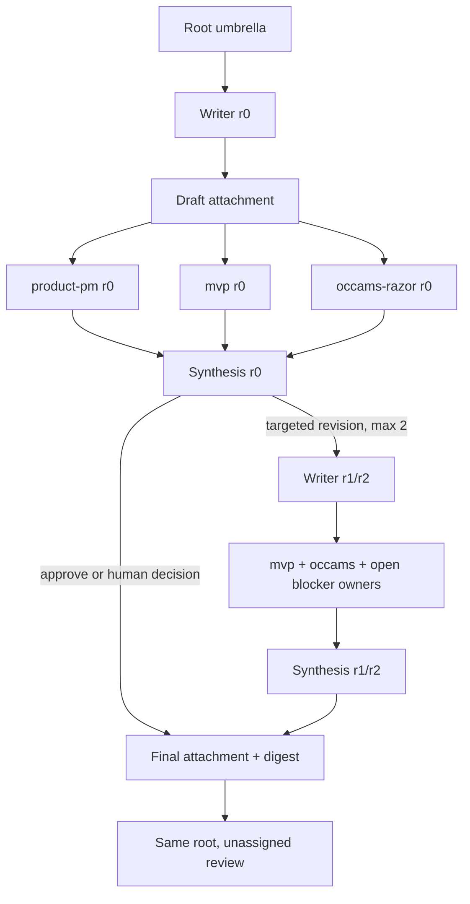

# DD: PRD Kanban M0

- Status: approved for implementation
- PRD: `PRD-prd-kanban-m0.md`
- Board/profile: `prd-write` / `prd-write-v1`

## Design

Hermes owns task state, events, runs, attachments, concurrency, retries, and recovery. M0 adds a task graph, not a control plane.

One complete real intake creates one tenant-scoped root umbrella. Producer-created tasks use deterministic idempotency keys so replay adopts the same create instead of duplicating it. These keys are not locks or lifecycle state.

## Task Graph



Round 0 has six tasks including the root: root, writer, three reviewers, and synthesis. A revision adds one writer, mandatory `mvp` and `occams-razor`, any open blocker owners, and one synthesis task. Duplicate roles collapse to one task.

Suggested create key:

```text
{tenant}:{root-operation}:{round}:{role}
```

Use the intake's tenant on every task. Validate exact intake identity before creating the graph. After create, trust Hermes to serialize workers and recover runs.

## Attachments

Use Hermes attachments for accepted intake bytes; draft or revision PRD bytes; reviewer results bound to the writer-declared digest; and synthesis blockers, owners, resolutions, and reviewed digest.

The synthesis attachment is the blocker ledger. Do not build another ledger service or state store. All reviewers in a round review the same digest.

Synthesis chooses final handoff, a targeted revision when rounds remain, or human review for malformed/conflicting output or blockers after round 2.

Synthesis does not rewrite PRD bytes. The writer produces each changed PRD attachment.

## Completion

After synthesis selects a final PRD:
1. keep the selected writer attachment as the final artifact;
2. put its task ID, filename, size, and declared digest in root review summary;
3. leave the same root unassigned in standard Hermes `review`;
4. let a human download it, verify SHA-256, and copy or publish it outside automation;
5. let the human mark the root `done` or `denied`.

M0 does not track publication state or verify the external copy. Root, child tasks, events, runs, and attachments provide the full workflow record.

## Deliberate Omissions

Do not add:
- CAS, leases, claims, fences, coordinator recovery, custom lifecycle state, journals, registries, or Postgres tables;
- publisher, receipt, readback, quarantine, rollback, attachment probes, fallback storage, or direct Hermes storage inspection;
- profile/config/tool reads, fingerprints, aliases, setup, or preflight.

Tests cover graph shape, producer replay without duplicates, digest binding, reviewer selection, two-round cap, final handoff, and visible human review. They do not inject publication or rollback faults.

## Tradeoff

M0 accepts Hermes' official behavior instead of rebuilding its guarantees. If that behavior fails during a canary, stop intake and inspect the visible root. Do not add a second control plane.

## Council Outcome

MVP and architect approve this design. Reliability's publication blocker no longer applies because M0 performs no automated external effect. Profile-fingerprint dissent is dismissed.
