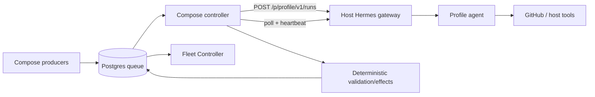
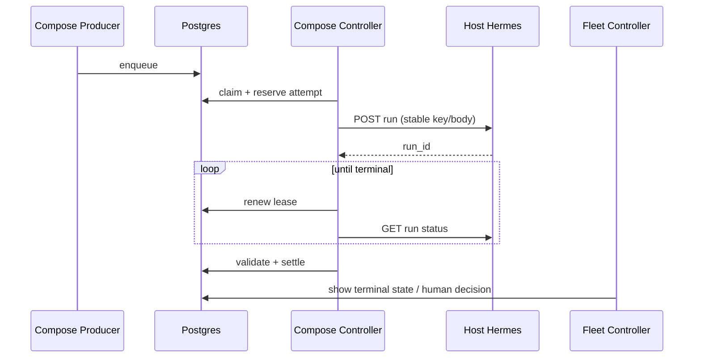

# PRD: API-Driven Hermes Control Plane

- status: draft
- owner: Zhach
- audience: operator, implementers, reviewers
- source: [grounding brief](grounding-api-control-plane.md)
- next gate: DD council

## Problem

Current control path duplicates Hermes.

Host launchd dispatcher:

- polls Postgres;
- forks Hermes CLI;
- tracks child PIDs;
- injects paths and env;
- renews leases;
- fights restart and stale-process edge cases.

Hermes server already does run admission, profile routing, process ownership, progress, stop, and durable idempotency.

Result today: too many moving parts. Hard setup. Split job state. Confusing UI. Runtime bugs from env, Bash version, paths, and stale leases.

## Why This Matters

Operator wants one simple fleet:

- Compose starts deterministic services;
- Postgres holds work;
- Hermes server runs agents;
- Fleet Controller shows state;
- GitHub holds code and merge decisions.

No duplicate consumer scheduler. No host fork supervisor.

Evidence:

- Runs API already supports profile routes, durable idempotency, polling, stop, and concurrency.
- Live incidents came from the duplicate path: missing work root, Bash 3.2 arrays, dispatcher restart leaving stale lease.
- User explicitly chose API submission to the already-running Hermes server.

## Users

Primary:

- local operator running autonomous PR automation.

Secondary:

- engineers reviewing draft PRs, reviews, docs, and incident handoffs.

Excluded:

- multi-host fleet;
- Linux/remote Docker portability in first launch;
- external customers.

## Goals

1. Compose owns deterministic producers and queue control.
2. Compose submits work to host Hermes Runs API.
3. Host keeps only Hermes gateway/dashboard/profiles.
4. Queue work starts within 5 seconds after enqueue when capacity exists.
5. Per-kind caps remain:
   - maintain: 3;
   - review: 1;
   - SWE: 1;
   - doc: 1;
   - memory: 1;
   - safety: 1.
6. No duplicate external effect after controller/gateway restart.
7. Fleet Controller remains human decision UI.
8. One command starts the fleet.

## Non-Goals

- Move Hermes/provider OAuth/deploy keys into containers.
- Add Docker socket or host SSH.
- Remove Postgres.
- Replace Fleet Controller.
- Change human merge ownership.
- Make profiles security sandboxes.
- Support multiple hosts in first release.

## Primary Metric

- name: API-controlled execution coverage
- definition: terminal queue requests launched through `/p/<profile>/v1/runs` divided by all terminal agent requests
- baseline: 0%
- target: 100% for six agent kinds
- window: first 20 live requests after cutover
- source: Postgres attempt ledger + Hermes run IDs

## Guardrails

| Guardrail | Target | Failure action |
|---|---:|---|
| duplicate visible effects | 0 | stop kind; reconcile; rollback |
| requests stuck running after lease expiry | 0 beyond one reclaim cycle | stop controller; inspect attempt ledger |
| cross-profile API key success | 0 | block launch |
| per-kind cap violation | 0 | block launch |
| malformed model output accepted | 0 | block launch |
| doc bytes changed after approval | 0 | block launch |
| non-incident safety result enters human queue | 0 | block launch |
| enqueue-to-Hermes-start p95 | <=5s with free capacity | inspect controller saturation |

## Approach

Use Hermes as execution server.

Use Compose as control plane.

What matters:

- Hermes owns agent lifecycle.
- Controller owns queue lifecycle.
- Model-only roles return intent/content.
- Deterministic controller owns doc, safety, memory durable writes.
- Direct-effect roles reconcile unknown outcomes. No blind retry.

## Key Features

### Compose producers

- review discovery;
- maintain discovery;
- merged-PR safety discovery;
- memory trigger.

Zero model calls.

### Compose controller

- claim only when kind slot exists;
- persist API attempt before submit;
- use stable idempotency key;
- submit exact body;
- poll status;
- renew lease;
- stop on lease loss;
- strict parse;
- deterministic post-process;
- nonce-fenced settle.

### Host Hermes

- one gateway;
- multiplex profiles;
- one distinct API key per profile;
- global cap >=8;
- no controller credentials beyond API auth.

## User Flow

## Launch

1. Shadow API calls for zero-effect fixture profiles.
2. Cut over doc and safety model-only kinds.
3. Cut over review.
4. Cut over maintain.
5. Cut over SWE.
6. Cut over memory.
7. Remove host dispatcher and producer launchd jobs.

Rollback per kind. Never big-bang.

## Open Questions

| Question | Owner | Blocks |
|---|---|---|
| Exact attempt ledger schema and replay deadline | DD | implementation |
| API key generation/sync into profile `.env` and Compose secret | DD | implementation |
| Direct-effect unknown-outcome policy by kind | DD | launch |
| Which current profile tools remain enabled under API mode | DD | launch |

## Do Not Continue If

- controller cannot recover accepted-but-unrecorded POST by idempotency replay;
- API route cannot prove profile-scoped auth;
- direct-effect lease loss can auto-retry;
- doc/safety/memory deterministic gates move into model trust;
- rollback requires deleting durable evidence.
