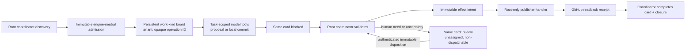

# PRD: Direct PR Operations
- status: proposed high-risk migration;
- owner: fleet operator;
- scope: move `pr-review`, then `pr-maintain`, from Compose/Postgres/controller to host-native Hermes Kanban;
- source evidence: `README.md`, `docs/hermes/parity-matrix.md`, `docs/hermes/DD-api-driven-control-plane.md`, `bin/hermes-pr-producer`, `scripts/hermes-controller.py`;
- next gate: approve `DD-direct-pr-operations.md` and `plan-direct-pr-operations.md`.
## Problem
Review and maintenance already run in host Hermes, but Compose producers, Postgres attempts, and the controller own admission, leases, result handling, and settlement. Models can also reach GitHub write authority. This leaves two lifecycle systems and too much authority in model tool paths.
## Decision
Move one kind at a time to two persistent boards:

- `pr-review`;
- `pr-maintain`.

Each task uses one opaque operation tenant bound to `kind|repo|PR|head`. One root-owned coordinator is the only admission front door for both rollback and Kanban engines. Models only propose a review or make a local maintenance commit through task-scoped tools. They receive no generic host terminal and no GitHub write credential. Root-owned publisher handlers perform exact GitHub writes from immutable packets. Maintain push runs only from a clean publisher-owned bare repository, never model-writable Git state.

Reviewer moves first. Maintainer starts only after review retirement passes.
## Goals
| Goal | Target |
| --- | ---: |
| One new-work engine per kind and operation | 100% |
| Model processes with GitHub write credentials | 0 |
| Effects without prior immutable intent and verified receipt | 0 |
| Uncertain effects retried automatically | 0 |
| Human-needed operations visible on existing card in `review` | 100% |
| Effects attached to wrong commit, wrong authority, or wrong lineage | 0 |
| Automated maintenance rounds per PR lineage | at most 3 |
| Accounted live bake before old-route removal | 50 successful jobs per kind |
## Non-Goals
- migrate old Postgres rows or active work into Kanban;
- add per-operation boards, a Hermes fork, direct SQLite access, or a new network service;
- give a model generic host shell/file access or let it publish, push, reply, resolve, merge, deploy, release, or decide human disposition;
- change review verdict rules, maintenance fix bounds, branch protection, or human merge authority;
- remove generic Compose/Postgres support still used by other kinds.
## Required Flow

What matters:

- admission happens before card creation;
- card identity is bound before dispatch;
- normal proposals stay blocked until publisher receipts exist;
- closure is last;
- human work never becomes a log-only or separate hidden item.
## Requirements
### Identity And Admission
- Canonical identity is kind, repository, PR number, exact head SHA, authority digest, and PR lineage.
- `operation_id` and tenant are filename-safe digests of canonical identity. Raw identity stays inside validated records.
- One immutable admission names engine owner, mode generation, board, tenant, operation, discovery cycle, and input digest.
- One immutable card binding names task ID, profile digest, body digest, workspace, and admission digest.
- Replays adopt one exact card. Missing, duplicate, or mismatched cards quarantine the operation.
- Newer heads may supersede only work with no effect uncertainty. They never steal ownership from an admitted operation.
### Model And Publisher
- Review model returns a bounded review proposal through one task-scoped tool only.
- Maintain model uses one sandboxed workspace tool backed by mandatory macOS Seatbelt (`sandbox-exec`) enforcement. It edits an exact-head worktree and creates a local commit. It cannot reach Hermes home, journal, publisher credentials, service CLI, unrestricted host shell, or network. Missing or failed Seatbelt proof blocks maintenance activation.
- Proposal tool parks current card `blocked`; model cannot complete, publish, or request human review.
- Coordinator checks exact head, authority, lineage, proposal schema, and kind rules before every effect.
- Root commit policy requires one parent at admitted head, bounded tree/diff, no gitlinks, and repository-specific path policy. CI/workflow, ownership, deployment, IaC, security-policy, data-contract, and other high-risk paths require human review. Repository enrollment proves PR-branch CI cannot expose sensitive secrets or privileged write tokens to changed code.
- Root-only publisher handler receives one immutable effect packet. Every review, push, reply, and resolution gets its own intent and readback receipt. Push imports validated objects into clean publisher-owned bare Git state with sanitized configuration.
- Unknown readback means quarantine and human review, never retry.
### Human Review
Any need for human input, judgment, capability, or uncertain-effect disposition moves the existing task to its work-kind board's Hermes `review` queue. The task must be unassigned and non-dispatchable. It contains one bounded question plus evidence pointers. It is never only logged, hidden, copied to another queue, or auto-reopened.

Safe transition is fixed: model blocks and releases its claim; coordinator verifies no live worker; coordinator unassigns blocked card; coordinator unblocks it to unassigned `ready`; coordinator calls `request-review`; coordinator verifies `review`, no assignee, and no dispatchable run. Preflight proves Hermes default auto-assignment is disabled, so unassigned `ready` cannot dispatch. Resume or closure requires an authenticated, immutable human disposition first.
### Migration And Rollback
- Install one engine-neutral admission front door before cutover. Both Postgres rollback and Kanban paths must consult it before queue mutation.
- Stop old ingress, drain old Postgres work in place, then open Kanban ingress. Never copy or replay old work.
- Engine ownership is permanent per admission. Rollback changes default engine only; Kanban admissions stay Kanban-owned and Postgres admissions stay Postgres-owned.
- Maintain mode records one immutable pre-cutover lineage-round floor from drained Postgres history. Supersede never refunds a started round.
- Activation requires verified journal backup on a separate failure domain plus restore drill.
- Remove each kind's Compose producer, controller route, and Postgres functions only after 50 successful live jobs, restart and rollback drills, and the approved rollback window.
## Acceptance And Stop Gates
| Gate | Pass | Stop |
| --- | --- | --- |
| Discovery | same bounded GitHub snapshot yields same sorted operations; no gaps/duplicates in crash tests | any missed or duplicate admission |
| Credential isolation | runtime probe proves task-scoped model tools cannot reach host shell, Hermes state, network, or publisher credential | any reachable control state or write credential |
| Effects | intent precedes every effect; exact readback precedes closure | effect without intent, duplicate effect, false receipt |
| Human path | all injected human/uncertain cases end on same unassigned `review` card | log-only, assigned, dispatchable, or auto-reopened card |
| Review quality | existing locked review eval thresholds pass | regression below threshold |
| Disaster recovery | separate-failure-domain restore reconstructs owner/card/effect state before admission opens | missing owner, false receipt, or admission before reconciliation |
| Maintain safety | exact head/branch, root commit/path policy, safe enrolled CI, all feedback accounted, one fix pass, round 4 denied | wrong-commit push, unsafe path/workflow, privileged CI exposure, missing feedback, round 4 |
| Bake | 50 successful jobs/kind; zero P0 breach; all operations closed or visibly quarantined | any unaccounted operation or P0 breach |
| Rollback | one owner per operation; no cross-engine replay | ownership transfer or duplicate effect |

No failed gate can be waived by latency, cost, or throughput. Human approval is required for each canary, cutover, rollback, and retirement.
