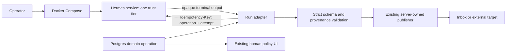

# PRD: Hermes Migration Foundation And Pilots

- one-line description: prove pinned Hermes can replace commodity scheduler and model-runtime work without weakening fleet policy
- status: M0 approved with changes; M1/M2 activation blocked
- responsible owner: Zhach
- contributors: migration implementation agent
- reviewers: architecture, reliability, security
- linked resources: [`grounding-brief.md`](grounding-brief.md), [`../hermes-migration-roadmap.md`](../hermes-migration-roadmap.md)
- next gate: M0 implementation plan

## Problem

This repo owns agent runtime, scheduling, queueing, supervision, status, safety policy, and publishers. Hermes now owns much of the commodity runtime. Keeping both full stacks increases maintenance. Replacing policy controls with generic Hermes behavior creates duplicate effects, stale work, or broader privilege.

## Why This Matters

- user impact: fleet operator maintains fewer custom services and gets one supported agent runtime.
- engineering impact: upgrades, models, skills, MCP, sessions, and generic run telemetry move to upstream Hermes.
- risk: migration can weaken exactly-once effect handling, immutable-input checks, memory ownership, and trust-tier isolation.
- why now: M0 implementation is approved. M1/M2 investigation is permitted; activation is blocked. Hermes image and public Runs API have a pinned current baseline.
- evidence:
  - current fleet owns leased workers and runners: `docker-compose.yml`, `bin/agent-server`, `bin/doc-writer-server`.
  - Hermes provides Docker, cron, Runs API, skills, MCP, and supervision at commit `14efb460`.
  - Hermes profiles are not security boundaries: pinned upstream `SECURITY.md` and profile docs.
  - confidence: high.

## Current State

- review and maintenance producers run sleep loops in Compose.
- Postgres owns operation identity, dedupe, claim leases, attempt nonce, and terminal state.
- custom workers invoke `mewritecode` directly.
- custom publishers post GitHub reviews, push branches, create draft PRs, write docs, and publish handoffs.
- status UI owns policy-bearing human actions and publishes exact human-approved decisions to shared Hindsight.
- memory curator owns automated shared-Hindsight writes. Agents have no shared write path.
- baseline migration metrics are not collected yet.
- clean-host rollback is manual and incomplete.

## Target User

- primary user: local fleet operator.
- secondary user: engineer maintaining workflow policy and tests.
- excluded users: multi-tenant operators and multi-machine fleets.

## Goals

| Goal | Metric Or Signal | Target | Priority |
| --- | --- | --- | --- |
| Keep Compose deployment | supported start/stop path | all Hermes services controlled by root Compose and `scripts/compose.sh` | P0 |
| Prove Hermes runtime | accounted doc pilot jobs | 10/10 terminal domain outcomes | P0 |
| Prove Hermes scheduler | accounted review-producer triggers | 20/20 over at least 7 days | P0 |
| Preserve safety | unauthorized, duplicate, stale, or untraceable effects | zero | P0 |
| Preserve rollback | old route restored | under 15 minutes without replaying uncertain effects | P0 |
| Reduce custom runtime | replaced code after evidence | delete only code made redundant by passed pilot | P1 |

## Non-Goals

- live review worker migration; M3 owns it.
- maintenance, SWE, or PR-safety migration.
- Postgres or human UI retirement.
- Hermes Kanban adoption.
- direct Hermes GitHub delivery.
- automatic Hermes writes to shared memory.
- one shared Hermes container for all trust tiers.
- host-managed Hermes gateway.
- multi-machine support.

## Primary Metric

- name: accepted-operation accounting correctness.
- definition: accepted trigger or job has exactly one traceable terminal domain outcome tied to its immutable input and attempt.
- unit: correctly accounted accepted operations / all accepted operations.
- baseline: not yet measured; M0 collector must establish current value and denominator.
- target: 100% for M1 and M2 pilot samples.
- measurement source: Postgres request ledger, Hermes run mapping, scheduler execution ledger, output file inventory.
- evaluation window: M2 = 10 jobs; M1 = at least 20 triggers and 7 days.
- decision rule: one lost, duplicate, stale, unauthorized, or untraceable operation fails pilot.

## Guardrails

| Guardrail | Threshold | Source | Failure Action |
| --- | --- | --- | --- |
| Unauthorized external writes | 0 | effect ledger and target audit | stop route and rollback |
| Duplicate external effects | 0 | domain key plus target audit | stop route; reconcile before retry |
| Stale immutable input accepted | 0 | head/diff/policy checks | stop route |
| Wrong trust-tier access | 0 | isolation probes | stop deployment |
| Uncertain effect auto-replayed | 0 | fault tests and reconcile rows | block release |
| Rollback time | ≤15 minutes | timed drill | block live pilot |
| Scheduler p95 start lag | ≤2x baseline | execution timestamps | rollback or extend pilot |
| Failure-rate delta | ≤5 percentage points worse | terminal states | rollback or extend pilot |
| Doc output containment | 100% inside inbox | resolved-path audit | stop route |
| Shared-memory writes from Hermes jobs | 0 | Hindsight audit | stop deployment |

Metrics are locked before pilot. Threshold changes require human approval and roadmap update.

## Council Decision

Minimal council verdict:

- M0 inert evidence scaffolding: pass with changes;
- M2 doc-runtime activation: block;
- M1 scheduler activation: block;
- investigate M2 before M1 after M0;
- run separate plan-to-launch gate before each live pilot.

M0 can add docs, baseline instrumentation, conformance tests, and disabled pinned Compose service. M0 cannot activate provider work, GitHub work, or lock unresolved run-attempt/publication schemas.

M2 needs enforceable no-tools execution, egress and container controls, deterministic document-effect recovery, bounded submit-ambiguity recovery, executable rollback, and one machine-verifiable launch gate.

M1 needs durable schedule-slot accounting, route-generation fencing, reproducible derivative image, executable rollback, and one machine-verifiable launch gate.

Council transcript: `~/.agent-fleet/agent-chat/rooms/council-hermes-m0m2-docs-20260914`.

## Approach

Use Hermes as execution substrate behind current domain controller.

- Pin official multi-architecture image by digest.
- Run one Compose service and one `/opt/data` volume per trust tier.
- Keep Postgres as operation authority.
- Use Hermes public HTTP APIs only.
- Parse and validate Hermes opaque output in custom adapter.
- Keep publishers outside Hermes.
- Keep old route available for rollback.
- Start with no-routing M0 proof.
- Investigate doc runtime before scheduler cutover. Activate neither without child design approval.

## Key Features

| Feature | User Value | Priority | Acceptance Criteria |
| --- | --- | --- | --- |
| Reproducible Hermes service | known runtime and rollback | P0 | exact digest, health, readiness, unique volume |
| Run adapter | current worker can invoke Hermes | P0 | fenced attempt mapping, timeout/stop, strict result validation |
| Baseline collector | pass thresholds become measurable | P0 | versioned output from fixed fixtures and live DB |
| Restore/rollback commands | safe pilot reversal | P0 | clean-host restore and timed rollback test |
| Scheduler wrapper | Hermes cron can invoke producer | P1 | dependencies present, secret-file bridge, no model needed |
| Contract tests | changes fail closed | P0 | hermetic and local-Hermes suites cover listed gates |

## Key Flow

What matters:

- Compose remains deployment boundary.
- Postgres and attempt nonce remain authority.
- Hermes never publishes visible effects.
- Adapter converts opaque output into current typed contract.

## Key Logic

- rule: one Hermes state volume per Compose service.
  - why: upstream forbids concurrent gateways sharing state.
  - edge case: restart reuses same service volume; rollback uses backed-up volume or prior clean volume.
- rule: idempotency key includes operation ID and attempt nonce.
  - why: Hermes key replay lasts 24 hours and cannot represent a fresh domain retry by itself.
  - edge case: interrupted run gets new attempt only when domain effect rules permit.
- rule: strict output cap and one-object JSON parser.
  - why: Runs API returns opaque text without schema enforcement.
  - edge case: malformed, truncated, oversized, or extra output fails closed.
- rule: detailed health must parse `status == ok`.
  - why: degraded readiness still returns HTTP 200.
- rule: no direct environment `GH_TOKEN` for cron scripts.
  - why: Hermes strips protected credentials from script environment.
  - edge case: scheduler uses read-only mounted secret file and trusted wrapper.

## Decision Frame

- setting:
  - what decision: approve first implementation slice and pilot order.
  - why it matters: wrong boundary can duplicate effects or broaden access.
  - when needed: before adding live Hermes route.
  - why that timing: M0 can remain inert; M1/M2 cannot.
- people:
  - responsible: Zhach.
  - approver: Zhach.
  - consulted: architecture, reliability, security reviewers.
  - informed: repo maintainers.
- alternatives:
  - big-bang Hermes replacement.
    - pros: fastest deletion.
    - cons: no parity or rollback proof.
    - decision: rejected.
  - Hermes behind current controller.
    - pros: reversible, preserves authority, tests one seam.
    - cons: temporary two-runtime deployment.
    - decision: selected.
  - keep current fleet unchanged.
    - pros: no migration risk.
    - cons: keeps all custom runtime maintenance.
    - decision: fallback if pilots fail.
- decision: investigate doc runtime before scheduler, while preserving roadmap milestone IDs.
- explanation plan: roadmap and DD record council verdict; each activation needs child plan-to-launch approval.

## Launch Plan

| Horizon | Milestone | Description | Exit Criteria | Owner |
| --- | --- | --- | --- | --- |
| Now | M0 | pin, static Compose scaffold, metrics, isolated state round trip, revert-only rollback | no live route; local contracts pass | Zhach |
| Now | M2 spike | doc worker calls Hermes behind flag | 10/10 jobs; zero guardrail breach | Zhach |
| Next | M1 pilot | Hermes cron owns review-producer schedule | 20/20 triggers; 7 days; rollback drill | Zhach |
| Later | M3 gate | decide whether to shadow review runtime | explicit approval | Zhach |

## Operational Checklist

| Function | Prompt | Status | Owner |
| --- | --- | --- | --- |
| Measurement | baseline collector ready? | no | Zhach |
| Security | trust-tier probes pass? | no | security reviewer |
| Reliability | restore and rollback tested? | no | Zhach |
| Engineering | contract tests pass? | no | Zhach |
| Operations | liveness/readiness and alerts ready? | no | Zhach |
| Product/GTM | customer launch needed? | n/a | n/a |

## Open Questions

| Question | Owner | Blocks | Status |
| --- | --- | --- | --- |
| Minimum provider config for non-interactive Hermes Runs API? | Zhach | M2 live pilot | open |
| Exact durable run-mapping schema change? | Zhach | DD approval | open |
| Should doc writer first fix existing crash-after-write duplicate risk? | Zhach | M2 | proposed yes |
| Which baseline window exists before 14 days accrue? | Zhach | M1 comparison | open |
| Does scheduler derivative image justify M1 at all after M2? | Zhach | M1 launch | open |

## Review State

| Reviewer | Role | Status | Required Changes |
| --- | --- | --- | --- |
| Architecture | boundaries | approved M0 only | close authority, compatibility, and scheduler fencing before pilots |
| Reliability | recovery | approved M0 only | close publication, submit-expiry, rollback, and gate state machines |
| Security | isolation | blocked for pilots | prove no-tools execution, egress, container, auth, and persisted-state controls |

## Do Not Continue If

- primary metric cannot be measured;
- Hermes service needs shared trust-tier state;
- result validation requires trusting prose;
- rollback can replay an uncertain effect;
- provider or GitHub secret must enter wrong tier;
- live route lacks one authoritative operation ledger.

## Changelog

| Date | Change | Owner |
| --- | --- | --- |
| 2026-09-14 | Initial M0–M2 PRD from approved roadmap and grounding brief | Zhach |
