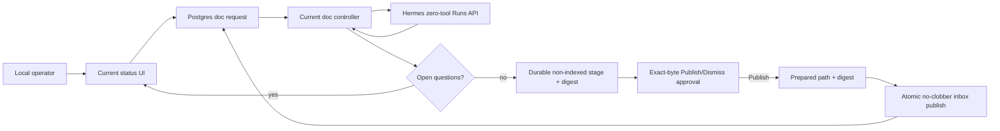

# PRD: Hermes M2 Doc Runtime

- one-line description: move doc drafting and council model calls to pinned Hermes while keeping queue, human loop, exact-byte approval, and publication under current controller
- status: M2a foundation approved with changes; M2b live activation blocked
- responsible owner: Zhach
- reviewers: architecture, reliability, security, cost
- grounding: [`grounding-m2-doc-runtime.md`](grounding-m2-doc-runtime.md)
- parent roadmap: [`../hermes-migration-roadmap.md`](../hermes-migration-roadmap.md)
- next gate: M2a Task 0 cheap-failure spikes

## Problem

Current doc worker owns both product policy and commodity model runtime. M2 must replace model runtime without giving Hermes file, tool, memory, publisher, DB, or broad network authority. Current doc publication recovery also permits duplicate files after crash and must be repaired before route activation.

## Why Now

- M0 is merged and validated.
- Hermes image/API/config contracts are pinned.
- Doc writer has smaller blast radius than GitHub-writing workflows.
- M2 evidence gates M1 scheduler work.

## Users

- primary: local fleet operator drafting PRDs and DDs from localhost status UI;
- secondary: engineer maintaining personas, handbook, and workflow runtime;
- excluded: public webhook callers, multi-tenant users, external untrusted clients.

## Current Flow

- status UI enqueues one `doc-write` request per round;
- controller claims with Postgres nonce and lease;
- harness invokes Me Write directly;
- model may use read-only Hindsight/Coderag tools and handbook files;
- harness parses draft/open questions;
- open questions enter human queue;
- finalization runs council and writes inbox directly;
- controller marks request done after write.

Known gaps:

- publication intent happens too early and failure is ignored;
- expired effect-bearing doc work blind-requeues;
- crash after file write can create another suffixed file;
- open-question insert and request completion are separate transitions.

## Target Outcome

Hermes owns no policy decision or visible effect.

- controller owns Postgres and publication;
- pure HTTP adapter owns only Runs API transport;
- Hermes gets prompt bytes and returns text;
- no model-facing tools, memory, background review, file mounts, or publisher credentials;
- provider egress passes through doc-only allowlist proxy;
- exact run and publication state survives controller restart;
- feature flag restores legacy model runtime only after ambiguity is quarantined.

## Goals

| Goal | Target | Priority |
| --- | --- | --- |
| Account every accepted phase | 100% draft/council phases have one terminal domain state | P0 |
| Prevent visible duplicates | zero duplicate or overwritten inbox files | P0 |
| Contain model action | zero model-facing tools, tool events, model-directed side effects, memory writes, or non-provider connections | P0 |
| Preserve human loop | refine/finalize/dismiss stay; finalized bytes add explicit Publish/Dismiss approval | P0 |
| Preserve quality | paired shadow has no material template/policy regression accepted by operator | P0 |
| Bound spend | ten draft-run admissions; one council admission per final doc; no fresh-key auto retry | P0 |
| Roll back safely | legacy runtime restored in ≤15 minutes with all ambiguity in reconcile | P0 |
| Earn deletion | direct Me Write model path removable after pilot or approved temporary fallback window | P1 |

## Non-Goals

- Hindsight or Coderag access from Hermes doc runtime;
- public Hermes API;
- inbound runs proxy;
- Hermes dashboard as policy UI;
- Hermes memory, skills, cron, delegation, browser, terminal, or file tools;
- move inbox publisher into Hermes;
- replace Postgres queue;
- production-wide Hermes upgrade;
- fix SWE effect recovery in M2;
- M1 scheduler.

## Primary Metric

- name: accepted phase accounting correctness;
- definition: each admitted `doc-write` draft/council phase maps to one stable idempotency key, one terminal controller state, and at most one visible document effect;
- baseline: current model path has no phase ledger; current request terminal count is observable but crash ambiguity is not;
- target: 100% across shadow and ten-run pilot;
- decision rule: one lost, duplicated, stale, fresh-key-retried, or untraceable phase fails M2.

## Guardrails

| Guardrail | Threshold | Failure Action |
| --- | --- | --- |
| Model tool schema | zero tools in actual provider request | stop |
| Model-caused process/file/memory action | zero | stop and destroy pilot state |
| Non-provider egress | zero successful connections | stop |
| Inbox overwrite/duplicate | zero | stop; reconcile before any retry |
| Unknown submit after replay deadline | zero automatic POSTs | reconcile |
| New queue owner settles stale work | zero | stop |
| Request body | <1 MiB | reject before submit |
| Accepted output | bounded by configured byte cap | reject as invalid output |
| Concurrent Hermes runs | ≤1 | reject excess |
| Pilot draft admissions | ≤10 | stop pilot |
| Council admissions | ≤1 per finalized request | reconcile duplicate |
| Provider spend | within operator-approved project budget | stop pilot |
| Rollback | ≤15 minutes | no launch |
| Human-loop regression | zero lost/double refine/finalize transitions | stop |
| Quality | no material missing template/policy section in paired operator review | revise or stop |

Metrics are locked before shadow results. Changes need human approval.

## Council Decision

- M2a non-routing foundations: pass with required changes;
- M2b paid shadow/live pilot: block pending M2a evidence and separate human approval;
- direct internal Runs API: accepted under trusted-controller threat model;
- exact-byte publication approval: required;
- durable submission/admission budget and rollback quarantine: required;
- provider-wide key authority through Squid: explicitly accepted only for scoped pilot;
- inbound proxy, TLS relay, and hardened derivative: deferred unless conformance or threat model requires them.

Source: [`council-m2-doc-runtime.md`](council-m2-doc-runtime.md).

## Product Flow

What matters:

- refine flow stays same; finalization adds exact-byte publication approval;
- Hermes is text-only inference lane;
- controller owns all state and effects;
- every uncertain boundary becomes reconcile, not retry.

## Key Requirements

### R1 — Zero-Tool Runtime

- `platform_toolsets.api_server: [no_mcp]`;
- built-in memory and user profile false;
- external memory provider empty;
- background review false;
- safe mode on;
- one turn and one concurrent run;
- no session/history/continuation fields;
- captured provider request proves tools absent or empty;
- runtime volume inspection proves no memory or skill write caused by run.

### R2 — Prompt-Embedded Policy

- controller embeds persona and deterministic handbook bundle;
- no handbook/config/code mount in Hermes;
- instructions declare context services unavailable and route unknown facts to Open Questions;
- request digest covers exact body bytes;
- body under 1 MiB;
- payload and result remain local/private.

### R3 — Stable Run Identity

- one stable key per request phase: `doc:<request_id>:draft|council`;
- key never includes queue lease nonce;
- controller persists intent before POST;
- controller transactionally reserves each POST and stores total submit count;
- adapter performs one POST per reservation; Hermes provider retries are zero;
- at most two same-body/key POST reservations across crashes;
- replay only before conservative deadline;
- unknown run ID with expired replay deadline or exhausted submit count becomes reconcile; known run ID remains poll-only;
- no new key generated automatically;
- adapter writes no DB and publishes no file.

### R4 — Exact-Byte Human Approval

- council output is advisory and becomes part of staged final bytes;
- final bytes stay outside indexed private-docs inbox;
- status UI previews exact staged bytes and digest;
- human Publish approval binds source request, runtime generation, target path, and content digest;
- Dismiss publishes nothing;
- controller verifies approval binding immediately before publication;
- approved request requeues same request ID for publication-only work; no model rerun.

### R5 — Crash-Safe Publication

- exact final bytes staged under request-specific path;
- canonical target path and byte digest committed before target access;
- atomic Linux `renameat2(RENAME_NOREPLACE)` publication in inbox filesystem;
- matching target can reconcile to done;
- absent target plus matching stage can resume same target;
- mismatch, symlink, directory, missing stage, or bad digest stays reconcile;
- no suffix changes after intent;
- inbox never mounted into Hermes.

### R6 — Atomic Human Handoff

- open-question row insertion and request completion settle in one Postgres transaction;
- duplicate controller run cannot create second human row;
- existing refine/finalize close-before-enqueue rule remains.

### R7 — Provider Egress

- dedicated internal doc network;
- separate doc egress proxy allows only `api.openai.com:443`;
- Hermes has no default/external network;
- PR-safety proxy not shared;
- direct and off-allowlist connections fail in runtime test.

### R8 — Feature Flag And Rollback

- default stays legacy until machine gate and human approval;
- rollback changes model seam only;
- repaired publication and attempt schema remain;
- ingress pauses during rollback;
- rollback immediately quarantines every nonterminal Hermes run and prepared effect as reconcile without provider wait;
- exactly one legacy controller restarts;
- no down migration during rollback window.

## Shadow And Pilot

### Paired Shadow

M2b only. Separate human approval required because it makes paid provider calls.

- use five representative historical/local payloads;
- Hermes output discarded from inbox and normal human queues; isolated evaluator reads shadow artifact only;
- compare required template sections, open-question fidelity, policy claims, latency, tokens, and cost;
- operator reviews outputs blinded to runtime;
- any material quality regression returns to prompt bundle design.

### Live Pilot

Blocked until separate M2b human approval after M2a evidence.

- ten accepted draft admissions maximum;
- operator-triggered only;
- one controller replica;
- one run at a time;
- M2 gate manifest approved before feature flag;
- stop on first guardrail breach;
- no automatic expansion after ten.

## Cost And Retention

- record input/output tokens, paid calls, duration, retries, terminal state, and provider/model per phase;
- OpenAI project-level pilot budget required because pinned Runs API has no caller output-token cap;
- at most two transport submissions with same key/body before reconcile;
- no fresh-key retry;
- retain sensitive Hermes state only through 24-hour idempotency window plus recovery margin;
- no general state-volume backup;
- destroy pilot generation after evidence export and rollback window.

## Launch Gates

M2a foundation report must show:

- pinned image/config/prompt-bundle/topology digests;
- zero-tool and no-memory fake-provider conformance;
- process/file/socket evidence bound to inspected container;
- egress allow/deny pass;
- run-attempt fault matrix pass;
- publication and exact-byte approval fault matrix pass;
- human-loop regression pass;
- state inspection pass;
- quarantine rollback ≤15 minutes.

M2a cannot authorize routing or paid calls.

M2b live manifest must bind same runtime generation and add:

- paired shadow quality accepted;
- baseline locked;
- all-in admission/spend reservation and provider hard budget;
- alerts/runbook ready;
- state retention and purge pass;
- zero open ambiguity outside reconcile;
- named human approval.

No result can be inferred from prose or skipped test.

## Alternatives

| Option | Decision | Reason |
| --- | --- | --- |
| Keep Me Write runtime | fallback | safe if M2 fails; keeps custom runtime |
| Direct trusted controller → Hermes | selected | one API seam; controller already owns stronger DB/inbox authority |
| Add inbound runs proxy | rejected for M2 | no meaningful boundary under trusted-controller threat model; adds retry/auth service |
| Give Hermes read-only tools | rejected | violates zero-tool containment and broadens prompt-action surface |
| Mount handbook read-only | rejected | file access still requires tools; prompt bundle is simpler and auditable |
| Publish finalized bytes without exact human approval | rejected | model output is tainted and inbox is agent-readable |
| Move publisher into Hermes | rejected | loses effect fencing and containment |
| Custom hardened Hermes derivative | defer | stock pinned image plus zero tools/internal egress tested first; add only on failed conformance |
| Two enforcing proxies and disposable process per run | defer | stronger compromised-runtime posture, much higher complexity; outside local operator threat model |

## Open Questions

| Question | Owner | Blocks |
| --- | --- | --- |
| Exact handbook bundle by document type | Zhach | shadow quality/cost |
| Provider-side hard budget amount and enforcement | Zhach | M2b live pilot |
| Manual same-target publication recovery implementation details | M2a implementation | M2a scope |
| Stock image runtime conformance under safe-mode config | M2a implementation | M2b pilot |
| State purge mechanism after 24h+margin | M2a implementation | M2b pilot |

## Do Not Continue If

- provider request contains any tool;
- Hermes needs inbox, code, handbook, DB, or Docker mount;
- controller cannot own one stable phase key across queue reclaim;
- publication requires overwrite or new suffix after intent;
- provider egress cannot be isolated;
- rollback requires replaying ambiguity;
- paired quality loses required policy/template content;
- spend cap cannot be approved.
