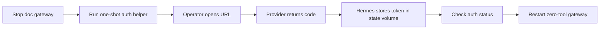

# PRD: Hermes OAuth Login

- Owner: Zhach
- Status: OpenAI OAuth validated; Anthropic implementation in progress
- Deadline: 2026-09-15
- Source: [`grounding-oauth-login.md`](grounding-oauth-login.md)

## Problem

Operator wants Hermes account login. Current doc runtime takes OpenAI API key only. No OAuth path. Current container cannot reach login hosts. Config mount read-only. Manual hacks risk token leak or broken isolation.

## Goal

One operator command starts supported OAuth flow for Claude or OpenAI Codex. Token lands only in Hermes state volume. Operator can check status and log out. Runtime remains zero-tool and not routed from doc queue.

## Success

Primary metric: operator completes one selected provider login, status survives helper restart, and one human-approved zero-tool smoke uses OAuth with same provider API-key fallback unset.

Pass only if:

- login command accepts `anthropic` and `openai-codex` only;
- token never appears in Git diff, Compose config, process arguments, or test output;
- credential survives auth-container removal and gateway restart;
- supported lifecycle command enforces one writer for shared state;
- runtime egress reaches only reviewed provider inference/refresh domains;
- logout removes selected provider auth;
- no `doc-write` route changes;
- no tools become enabled.

Failure action: stop gateway, log out provider, quarantine state volume if token handling is ambiguous.

## Scope

- One-shot interactive OAuth helper behind dedicated auth proxy.
- Shared Hermes state volume.
- Exclusive lifecycle lock and enforced stop-before-login guard.
- Provider status and logout commands.
- Provider-domain egress policy and tests.
- Operator docs.

## Non-Goals

- No browser automation.
- No host credential import.
- No token in `.env`.
- No automatic provider selection for documents.
- No background account refresh outside Hermes native behavior.
- No M2b launch approval.

## Operator Flow

What matters:

- Human controls browser step.
- Token stays in volume.
- Gateway cannot write auth state during login.
- Login success does not enable document routing.

## Launch

1. Merge reviewed PR.
2. Stop `hermes-doc`.
3. Run login for one provider.
4. Check status after fresh helper container.
5. Restart gateway.
6. Unset same-provider API-key fallback.
7. Ask human before one paid/manual OAuth smoke.

## Decisions

- OpenAI Codex ships first.
- Anthropic ships second in separate PR.
- Zhach accepted Anthropic scopes `org:create_api_key user:profile user:inference` on 2026-09-15.
- Browser approval remains final provider-terms gate.

## Next Gate

OpenAI PR review and merge. Then Anthropic implementation slice.
