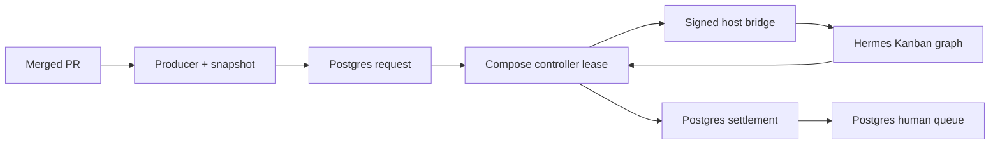
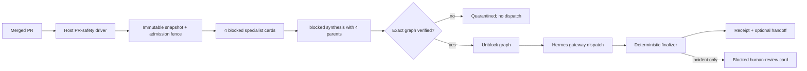

# PRD: Direct-Kanban PR Safety

- one-line description: use Hermes Kanban as the sole new-work queue for effect-free PR-safety councils;
- status: approved for inert implementation;
- responsible owner: fleet operator;
- primary user: human safety reviewer;
- linked resources: `docs/hermes/grounding-pr-safety-direct-kanban.md`;
- supersedes for new PR-safety work: `docs/hermes/PRD-pr-safety-kanban-council.md`;
- next gate: implementation PR 1 (`plan-pr-safety-direct-kanban.md`);

## Problem

PR-safety currently has two durable lifecycle owners for one effect-free analysis: Postgres/controller manages request attempts and a signed host bridge manages the Kanban graph. This duplicates queue, lease, recovery, settlement, authentication, and operational code without protecting an external model-owned effect.

## Why This Matters

- operator impact: this activation sequence hit four separate boundary failures—installed-path resolution, MCP schema normalization, Docker secret ownership, and venv ownership—each requiring a patch and full rerun;
- engineering impact: one safety request spans Postgres rows, controller leases, bridge state, Kanban SQLite, HMAC keys, and two supervisors; target is at most three operator recovery commands for a failed direct operation;
- why now: Hermes `0.21.5` and the fixed five-agent graph are proven locally; the remaining question is ownership, not agent capability;
- evidence:
  - current lifecycle: `scripts/hermes-controller.py`, `bin/hermes-kanban-safety-bridge`, `docker/initdb/13-hermes-api-control-plane.sql`;
  - native durable queue: Hermes Kanban CLI and `scripts/hermes-kanban-risk-council.py`;
  - operator direction: PR-safety requests should enter Kanban directly.

## Current State



One effect-free analysis crosses three state machines before a human can inspect it. `single` analysis and other profiles still need the existing control plane; direct Kanban need not.

## Target User

- primary: operator reviewing PR-safety findings and incident candidates;
- secondary: engineer maintaining fleet runtime and recovery;
- excluded: other five profile workflows, which retain current Postgres/Runs API control plane.

## Goals

| Goal | Metric or signal | Target | Priority |
| --- | --- | ---: | --- |
| One lifecycle authority | New direct-Kanban safety operations with any Postgres request/attempt/incident row | 0 | P0 |
| No lost or duplicate analysis | Eligible operations with exactly one durable terminal or quarantined receipt | 100% across fault suite and first 20 live operations | P0 |
| Preserve safety quality | Existing locked council quality gates | Pass | P0 |
| Reduce owned machinery | Lifecycle source deleted after rollback window versus direct-Kanban source added | deleted lines exceed added lines | P1 |
| Keep human visibility | Incident candidates represented by one blocked human-review card with immutable handoff provenance | 100% | P0 |

## Primary Metric

- name: uniquely accounted direct-Kanban safety operations;
- definition: eligible operations with exactly one engine-neutral admission record from first admission, then either one immutable closure receipt or one explicit unresolved quarantine record, and no second graph or cross-engine replay;
- baseline: current bridge path has executable lifecycle proof but no statistically valid production sample;
- target: 100% over deterministic crash matrix, sanitized corpus, and first 20 approved live operations;
- measurement source: immutable operation-journal artifacts plus exact Kanban board/task inventory;
- decision rule: any lost, duplicate, stale-identity, or falsely finalized operation blocks cutover or triggers rollback;
- evaluation window: pre-cutover fault suite, then 20 live operations with one restart drill.

## Guardrails

| Guardrail | Threshold | Failure action |
| --- | ---: | --- |
| Unauthorized/model-owned external effects | 0 | stop route immediately |
| Duplicate graph or task execution | 0 | quarantine board; rollback ingress |
| Stale snapshot/policy/diff accepted | 0 | quarantine; investigate |
| Active snapshot deleted | 0 | stop GC and route |
| Wrong profile/model/fallback | 0 | stop route |
| Lost typed handoff or dissent | 0 | fail closed |
| Severe-incident recall | 100% | no cutover |
| Incident precision | at least 90% | no cutover |
| Ordinary finding promoted to incident | at most 5% | no cutover |
| Material-finding precision | at least 80%, not below single baseline | no cutover |
| Workflow deadline | terminal or quarantined within 15 minutes | alert and quarantine |
| Human incident visibility | 100% one-card admission and derived status-index visibility | rollback human routing |
| Human incident banner publication latency | p95 under 5 minutes from card creation | pause route and repair status index |
| Human incident disposition | no unresolved card older than 24 hours | degrade fleet status and alert operator |
| Failed-operation recovery effort | at most 3 documented operator commands | stop rollout and simplify recovery |

Metrics are locked before results. Latency, tokens, cost, and human preference are diagnostic; they cannot override a failed P0 gate without explicit human design revision.

## Approach

Run one host-native PR-safety driver under `hermes-agent`. It discovers merged PRs, creates immutable snapshots, writes one engine-neutral admission fence, stages the exact five-card graph through official `hermes kanban ... --json` commands, reconciles active workflows, validates final metadata, writes immutable local handoffs, and creates incident-only blocked cards on a dedicated human-review board.

Postgres remains untouched for other profiles and historical safety rows. New safety traffic chooses one ingress mode:

```text
PR_SAFETY_QUEUE_ENGINE=postgres|kanban
```

Default remains `postgres` until evaluation, policy, canary, and human launch approval pass.

## Proposed Flow



What matters:

- all five cards stay blocked until the exact graph is present;
- models never own admission, identity, finalization, or human routing;
- no Postgres lease or replacement worker exists, so bridge stop fencing is unnecessary;
- drift becomes visible quarantine, not a second graph.

## Requirements

### R1. Same immutable input

Preserve operation ID, repository, PR, merge SHA, base SHA, diff hash, policy version/digest, snapshot path, and policy path. Recompute every digest before graph release and finalization.

### R2. Same fixed graph

Every admitted operation runs exactly:

- `council-reviewer-v2` on Haiku 4.5;
- `council-security-v2` on Haiku 4.5;
- `council-reliability-v2` on Haiku 4.5;
- `council-architect-v2` on Haiku 4.5;
- `council-orchestrator-v2` on Sonnet 5 after all four parents.

No adaptive routing, retries, fallback, Opus, Bot Mode, or delegation.

### R3. CLI-first queue ownership

The driver uses the pinned service-account Hermes CLI for board/task/list/show/runs/attachments/unblock/archive operations. Commands use argv, controlled environment, bounded timeout, exact JSON schemas, and no shell interpolation.

### R4. Crash-safe staged admission

- Create one engine-neutral admission record with exclusive create before board mutation. Both queue modes consult it for every discovered operation.
- Create tasks blocked with deterministic idempotency keys.
- Verify board cardinality, fields, profiles, models, bodies, parents, and attachment absence.
- Release specialists one at a time while synthesis remains blocked. Mixed specialist release after a crash is valid and replay resumes only still-blocked exact specialists. Release synthesis only after all four one-run specialist handoffs, graph identity, and remaining deadline revalidate.
- Replays adopt exact existing cards.
- Any duplicate or mismatch before release quarantines the board without model dispatch. Drift after release rejects the result and keeps the admission fence; effect-free workers may finish but no second engine can admit the operation.

### R5. Deterministic finalization

Use current typed metadata, changed-line evidence, dissent/residual-risk union, usage ceiling, incident threshold, trusted identity projection, and immutable handoff format. Finalization is idempotent: immutable intent first, closure receipt last after five task archives verify.

### R6. Kanban-native human queue

Incident candidates create exactly one `blocked` card on `pr-safety-human-review`. Card contains bounded immutable identity, verdict, handoff path/digest, incident evidence, owner, 24-hour disposition SLO, and exact disposition-comment format. Driver publishes a derived read-only status index consumed by Fleet status, which links to Hermes dashboard and degrades when a card is older than 24 hours. Human writes a typed `acknowledged|dismissed|remediation_planned` comment with reason, then archives; driver validates it and writes immutable disposition receipt. No model can unblock, complete, or archive human card. Existing Postgres human items remain historical and actionable in Fleet UI.

### R7. One ingress authority and rollback

A single host launchd producer owns both modes. Mode switch runs under the same process lock and writes a generation/cutover-epoch record only after old producer/CLI children drain. `postgres` mode preserves current enqueue behavior. `kanban` mode never writes a safety request, attempt, settlement, or incident row. Both modes exclusively create/consult the same admission record before queue mutation; every direct phase, including quarantine, therefore fences Postgres rollback. One-time history floor prevents pre-ledger replay. Per-author paginated discovery cursors use a 24-hour overlap and advance only after every result is admitted, so mode switches and delayed GitHub visibility cannot create a gap.

### R8. No activation by merge

Code, install, canary, policy, and cutover remain separate reviewed steps. Production default stays `postgres` until explicit approval.

## Non-Goals

- removing Postgres from other workflows;
- deleting historical safety rows or existing human items;
- replacing the fixed council or its result schema;
- model-owned graph creation, finalization, remediation, incident declaration, merge, or approval;
- remote or multi-host Kanban;
- new public HTTP service;
- Hermes fork or private runtime patch;
- automatic rerun of quarantined operations;
- production cutover before statistically valid evaluation and policy approval.

## Decision Frame

| Option | Pros | Cons | Decision |
| --- | --- | --- | --- |
| Keep Postgres + controller + bridge | Existing recovery proof | Duplicate lifecycle and transport machinery | rollback only |
| Compose controller + thin bridge | Smaller bridge | Still two authorities and HMAC transport | rejected |
| Host controller + direct CLI | Removes transport | Keeps generic Postgres attempts unnecessarily | rejected |
| Host direct-Kanban driver | One queue, no remote bridge, uses native dispatcher/audit | Human queue and rollback ingress must move | selected |
| Fork Hermes for new CLI primitives | Could add atomic graph/stop | Permanent runtime ownership burden | rejected |

## Evaluation Lock

Production evidence uses independent case-level outcomes, not repeated-run counts as independent samples:

- at least 30 independently labeled severe-positive cases;
- at least 60 independently labeled ordinary/clean cases, including ordinary findings, mechanical changes, and injection attempts;
- three repetitions per engine/case, collapsed to one case-level majority outcome;
- exact one-sided 95% Clopper-Pearson intervals use case-level outcomes;
- severe recall passes only with zero observed misses, point recall 100%, and lower confidence bound at least 90%;
- incident precision passes only with point precision at least 90% and lower confidence bound at least 80%;
- ordinary incident rate passes only with point rate at most 5% and upper confidence bound at most 10%;
- fewer than 30 incident predictions, fewer than 30 severe cases, fewer than 60 ordinary/clean cases, or any confidence guardrail failure yields `INCONCLUSIVE`, never pass;
- blind human comparison covers all case-level outputs;
- measured provider cost needs explicit human ceiling approval before live canary.

The 20-operation live bake is operational evidence only. It is not statistical proof of quality or rare-error rates.

Before implementation completion, run the same install-path, CLI-schema, secret-ownership, crash-during-admission, crash-during-finalization, and rollback scenarios against current bridge and direct-Kanban paths. Record manual commands and elapsed recovery time. Cleanup requires direct path to use at most three commands and reduce median manual commands and median recovery time by at least 50%.

## Launch Plan

| Phase | Scope | Exit criteria | Owner |
| --- | --- | --- | --- |
| Design | PRD/DD/plan only | council pass or pass-with-changes | fleet operator |
| Inert implementation | shared result module, host producer parity, CLI driver | focused tests and code review | fleet operator |
| Sanitized canary | local fixtures only | exact graph/result/archive and fault suite pass | fleet operator |
| Evaluation | independent labeled corpus | all locked quality/cost gates pass | human reviewer |
| Live canary | one allowlisted merged PR | one receipt, no duplicate/effect, human visibility | human operator |
| Cutover | `PR_SAFETY_QUEUE_ENGINE=kanban` | 20 operations plus restart drill | human operator |
| Cleanup | delete bridge/controller Kanban path | rollback window complete; deletion exceeds addition | human operator |

## Open Questions

| Question | Owner | Blocks | Status |
| --- | --- | --- | --- |
| Provider policy approval for exact Anthropic models | human operator | production cutover | open |
| Independent evaluation corpus and accepted measured cost | human reviewer | production cutover | open |
| Named reviewer signoff on Fleet critical banner → Hermes dashboard → typed disposition journey | human operator | live canary | open |

## Approval Ask

Approve direct Kanban as sole new-work queue for PR-safety, with Postgres retained for other profiles and historical rows. Approval authorizes design and implementation PRs only; it does not activate production routing.
