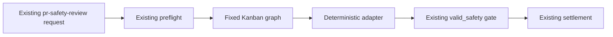

# PRD: Kanban-Backed PR Safety Analysis

- Status: draft.
- Owner: fleet operator.
- User: human safety reviewer.
- Source: `docs/hermes/grounding-pr-safety-kanban-council.md`.
- Next gate: design review.

## Problem

One agent currently performs every PR-safety lens and final incident classification. Hermes Kanban already proved parallel role review plus dependent synthesis. PR-safety should use that graph without changing its use case, inputs, outputs, routing, or human controls.

## Goal

Replace one `pr-safety-v1` model run with one fixed Kanban graph for every `pr-safety-review` request.

Graph:

- four Haiku 4.5 specialists in parallel;
- one Sonnet 5 synthesizer after all specialists;
- one exact current safety result;
- zero external effects.

## User Experience

No change.

Human still sees:

- same PR-safety item type;
- same concrete findings;
- same human decisions;
- same incident-candidate behavior;
- same immutable PR/head/policy identity;
- no agent-authorized remediation or merge.

## Flow



Notice:

- Request before graph is unchanged.
- Result after graph is unchanged.
- Kanban replaces only model analysis.

## Requirements

### R1. Same input

Council receives current immutable identity:

- operation ID;
- repo and PR;
- head and base SHA;
- diff hash;
- policy version and digest;
- snapshot and policy paths after existing preflight.

### R2. Fixed graph for every request

Every request runs:

1. general review;
2. security/privacy review;
3. reliability/data-integrity review;
4. architecture/contracts review;
5. Sonnet synthesis after all four.

No triage or conditional specialist selection.

### R3. Same output

Adapter returns current top-level schema exactly:

- identity fields;
- status;
- intent;
- findings;
- coverage;
- documentation;
- observability;
- incident;
- human decisions.

Controller copies trusted identity. Models cannot choose identity or nonce.

### R4. Same incident threshold

Incident candidate still requires all:

- direct changed-line cause;
- concrete trigger;
- severe expected production impact;
- high-confidence causal chain;
- deployment stop, rollback, or page-level response.

Ordinary findings remain `changes_requested` or `needs_human_decision`.

### R5. Same effects

Kanban workers cannot:

- write GitHub;
- merge or approve;
- edit repository snapshot;
- write memory or documents;
- change CI, deploys, incidents, monitors, or infrastructure;
- settle Postgres request.

Controller alone writes handoff and calls existing settlement function.

### R6. Durable workflow

- Stable workflow ID from operation ID.
- Stable task idempotency keys.
- One attempt per task.
- Four-parent synthesis dependency.
- Exact profile/model checks.
- Typed handoffs only.
- Named dissent preserved.
- 15-minute workflow deadline.
- 150,000 total token ceiling.
- One active workflow initially.

### R7. Rollback

One config chooses analysis engine:

```text
PR_SAFETY_ANALYSIS_ENGINE=single|kanban
```

- `single`: current `pr-safety-v1` run.
- `kanban`: fixed graph.

Cutover changes default only after validation and human approval. Rollback restores `single`. No request/schema/data migration needed.

## Non-Goals

- No adaptive triage.
- No risk-based routing.
- No percentage canary inside controller.
- No new request kind.
- No new human workflow or UI.
- No replacement of producer, Postgres queue, handoff, settlement, or incident queue.
- No controller-mediated external effect from council.
- No Bot Mode or `delegate_task`.
- No Opus or model fallback.

## Success Criteria

Hard gates:

| Metric | Target |
| --- | ---: |
| Severe-incident recall | 100% |
| Incident-candidate precision | At least 90% |
| Ordinary finding promoted to incident | At most 5% |
| Identity/stale-input acceptance failures | 0 |
| Unauthorized or duplicate effects | 0 |
| Wrong profile/model/fallback | 0 |
| Lost specialist handoff or dissent | 0 |
| Malformed result accepted | 0 |

Quality:

- Material-finding precision: at least 80% and not below single-agent baseline.
- Council finds at least one labeled material issue baseline misses.
- Human blind preference: council preferred or tied on at least 60% of cases.

Cost and latency:

- Record wall time, provider usage, and cost by role.
- Human approves measured cost before cutover.
- Workflow completes or fails closed within 15 minutes.

## Validation

Before cutover:

- Run current single agent and fixed council on same labeled snapshots.
- Three repetitions per case.
- Include severe positives, ordinary findings, clean/mechanical PRs, prompt injection, malformed handoffs, failed member, stale identity, and deadline cases.
- Keep single-agent route as rollback.

## Decision Frame

| Option | Decision |
| --- | --- |
| Keep single agent | Rollback only |
| Fixed council for every safety request | Chosen direction |
| Adaptive triage/council | Rejected; changes use case and adds routing complexity |
| Full council with direct effects | Rejected; breaks controller authority |

## Approval Ask

Approve fixed Kanban graph as drop-in replacement for `pr-safety-v1` analysis. This approval does not activate it; code/config still lands through reviewed PRs and cutover remains human-controlled.
