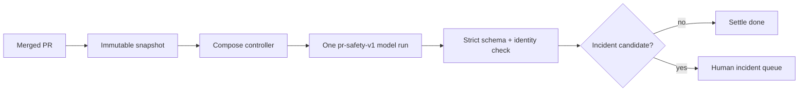
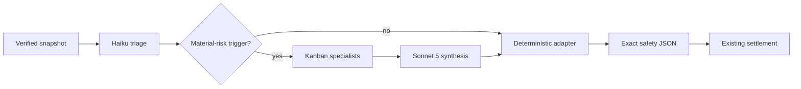

# PRD: Adaptive PR Safety Kanban Council

- Status: draft.
- Owner: fleet operator.
- User: human reviewer and on-call owner.
- Source: `docs/hermes/grounding-pr-safety-kanban-council.md`.
- Next gate: full design council.

## Problem

Current PR-safety uses one model call. One model must find general, security, reliability, data, architecture, test, doc, and observability risk. It must also apply strict incident threshold. Recent reviews over-promoted ordinary findings. One reviewer gives weak role coverage and no independent synthesis.

Five-agent Kanban graph works on sanitized input. It has no production adapter. Running all five agents on every merged PR would waste time and tokens.

## Why Now

- Current safety path is live.
- Incident queue must stay precise. False incidents waste human attention.
- Missed severe incident is worse. Recall must stay 100% on labeled severe cases.
- Kanban durability, role routing, fan-in, and effect-free execution are now proven.
- Evaluation harness exists. Candidate can be measured before routing changes.

## Current State

Notice:

- Good fence exists before and after model.
- Weak part is analysis between fences.
- Replacement must not move fences.

## Goal

Better safety judgment at bounded cost.

Use:

- Haiku 4.5 triage for every merged PR;
- four Haiku 4.5 specialists only for material security, reliability, data, architecture, or incident uncertainty;
- Sonnet 5 synthesis only after escalation;
- deterministic adapter for identity, schema, incident consistency, and settlement input.

## Non-Goals

- No autonomous merge, deploy, rollback, incident, review comment, CI action, or remediation.
- No replacement of producer, snapshot, Postgres queue, lease, dedupe, supersession, handoff, human queue, or settlement SQL.
- No Kanban write to GitHub, memory, docs, repositories, or infrastructure.
- No Opus.
- No model/provider fallback.
- No Bot Mode.
- No `delegate_task`.
- No all-PR full council.
- No Postgres-to-SQLite authority move.
- No WAL mode on vulnerable SQLite.

## Users

### Human reviewer

Needs:

- few false incident candidates;
- concrete changed-line evidence;
- one result, not six transcripts;
- visible dissent and uncertainty;
- exact PR and snapshot identity.

### Fleet operator

Needs:

- bounded tokens and latency;
- one active council at first;
- no duplicate work or effects;
- clear recovery and rollback;
- legacy route one config change away.

## Product Flow

Notice:

- Every PR pays triage cost.
- Only escalated PRs pay council and Sonnet cost.
- Models propose. Adapter checks. Existing controller settles.

## Requirements

### R1. Triage every eligible verified snapshot

Triage receives same immutable identity and policy as current analysis.

Deterministic admission first proves full diff, required policy/rules, secret gate, and worst-case token budget fit. Ineligible PR stays on legacy route. No hidden truncation.

Triage returns:

- proposed safety result;
- `escalate` boolean;
- escalation reasons;
- changed-line evidence;
- confidence;
- zero external effects.

Low confidence, conflicting evidence, or material security/reliability/data/architecture/incident uncertainty must escalate.

### R2. Escalate only material risk

Council triggers:

- security or privacy breach path;
- broad outage or serving-path failure;
- data loss or corruption path;
- architecture or contract break with material blast radius;
- possible incident where triage cannot reach high confidence;
- material specialist need named by policy.

Ordinary lint, docs, tests, CI, dependency, IAM, or speculative risk does not trigger by itself. It may still produce `changes_requested` or `needs_human_decision`.

### R3. Use role council

Escalated graph:

- general review — Haiku 4.5;
- security — Haiku 4.5;
- reliability and data integrity — Haiku 4.5;
- architecture and contract — Haiku 4.5;
- synthesis — Sonnet 5, after all four specialists.

One attempt each. Zero model fallback. Zero external effects.

### R4. Return one compatible result

Adapter emits current `valid_safety` top-level schema.

Adapter copies identity from trusted request. Model cannot choose:

- nonce;
- operation ID;
- repo or PR;
- head or base;
- diff digest;
- policy version or digest.

Adapter validates every incident citation against changed lines. It unions specialist dissent. Sonnet cannot drop it.

Each finding carries role, claim, changed-line evidence, confidence, dissent, and residual risk. `coverage.council` carries consensus and full named dissent. Canonical handoff renders both findings and council context.

### R5. Keep incident threshold

Incident candidate only when all are present:

- changed-line cause;
- concrete trigger;
- severe expected impact: customer data loss/corruption, sustained broad outage, or security/privacy breach;
- high-confidence evidence and causal chain;
- deployment stop, rollback, or page-level response is reasonable.

Missing one condition means no incident promotion.

### R6. Shadow before canary

First signal is offline. Candidate and current `pr-safety-v1` run on identical immutable cases through operator-run harness. No production bridge, route, schema migration, or alert work before offline pass.

After offline pass, bounded operator-supervised live shadow uses identical immutable packets. Legacy settles without waiting. Candidate has separate retained packet and no settlement/handoff capability.

- Three repetitions. Repetitions do not count as independent cases.
- Same labels and candidate-eligibility report.
- Candidate cannot settle production request in shadow. Settlement SQL rejects shadow route.
- Human review is blind to route where practical.
- Metric definitions, pricing, case IDs, sample sizes, and duration lock before results.

### R7. Human controls rollout

Stages:

1. offline replay with current operator-run graph;
2. bridge-backed bounded live shadow, no candidate settlement;
3. durable lineage, recovery drill, and 5% deterministic canary;
4. 25% deterministic canary;
5. 100% adaptive route for eligible PRs. Ineligible PRs stay legacy.

Human approval required before each stage after offline replay. Any hard-gate failure stops new candidate admission and drains or falls back in-flight work to legacy.

## Success Metrics

### Primary metric

- Name: incident-candidate precision.
- Definition: labeled true incident candidates divided by all candidate incident promotions.
- Baseline: measure current `pr-safety-v1` on locked replay corpus.
- Target: at least 90% and not below baseline.
- Window: every labeled case, three repetitions, plus each canary stage.

### Hard guardrails

| Guardrail | Threshold | Failure action |
| --- | ---: | --- |
| Severe-incident recall | 100% | Stop. Keep legacy route. |
| Ordinary finding promoted to incident | At most 5% | Stop. Keep legacy route. |
| Identity or stale-input acceptance | 0 | Stop and investigate. |
| Unauthorized or duplicate external effects | 0 | Stop and investigate. |
| Wrong profile/model or any fallback | 0 | Stop and investigate. |
| Malformed output accepted | 0 | Stop and investigate. |
| Lost dissent or parent handoff | 0 | Stop and investigate. |
| Candidate not adapted or in legacy fallback after 15 minutes | 0 | Stop candidate route; recover exact work. |

### Quality, throughput, and cost gates

- Material-finding precision: at least 80% and not below baseline.
- Candidate must find at least one net-new labeled material issue baseline misses.
- Human blind preference: candidate preferred or tied on at least 60% of escalated cases.
- Triage escalation recall on labeled council-required cases: 100%.
- Lock model-specific effective prices and pricing date before replay.
- Route-weighted USD per merged PR: no more than baseline unless human approves a numeric cap and measured quality tradeoff.
- Absolute monthly projection at observed volume: human-approved cap required before canary.
- Sonnet-vs-Haiku synthesis ablation: Sonnet must improve blind preference or labeled correctness without reducing precision. Human decides whether measured lift justifies added dollars.
- One-workflow utilization: below 0.7 at measured peak arrivals, escalation rate, and mean runtime.
- Candidate p95 from claim to adapted result or legacy fallback: below 15 minutes.
- All-route p95 from claim to settlement: below 45 minutes.
- No overlap 429 in target-rate shadow.

Escalation rate, p50/p95 latency, tokens, cache charges, storage, bridge cost, operator time, and model-role spend remain diagnostics. They cannot override failed safety guardrails.

## Measurement Lock

- Lock labels, metric code, thresholds, corpus IDs, independent sample sizes, repetition count, prices, and live-shadow duration before candidate results.
- Before canary use at least 90 independent safety cases: 30 severe positive controls, 30 ordinary non-incident findings, and 30 clean/mechanical cases. Injection and over-classification cases can belong to these strata.
- Repetitions measure variance. They do not increase independent sample size.
- Sample real PR size/type distribution before results. Report eligible and ineligible routes together. No eligibility selection hiding.
- Keep committed evaluation inputs sanitized. No secrets or customer data.
- Metric change after results needs human approval and rerun from zero.

## Launch Readiness

Ready for offline replay only when reviewed policy v2 or narrow sanitized-evaluation exception permits exact Anthropic models.

Ready for live shadow only when:

- offline replay passes and earns bridge work;
- policy explicitly approves exact Anthropic models, provider retention, and local retention used for real repository data;
- bridge auth and host boundary tests pass;
- candidate adapter emits exact current schema;
- offline replay passes all hard gates;
- latency/token/cost report exists;
- recovery and legacy rollback drill pass;
- human approves live shadow.

Ready for candidate settlement only when live shadow also passes and human approves rate.

## Decision Frame

### Setting

Choose analysis engine without weakening controller authority. Decision needed before production adapter work.

### People

- Responsible: fleet operator.
- Approver: human owner.
- Consulted: architecture, security, reliability, MVP reviewers.
- Informed: reviewers and on-call owners consuming incident queue.

### Alternatives

| Option | Good | Bad | Decision |
| --- | --- | --- | --- |
| Keep one reviewer | Smallest system | Weak role coverage; current precision concern | Keep as rollback only |
| Full council every PR | Maximum role coverage | High cost and latency; waste on mechanical PRs | Reject |
| Adaptive triage plus council | Bounded average cost; deep review where needed | Triage false-negative risk; bridge needed | Choose if eval passes |
| Model directly writes effects | Fewer components | Breaks authority and recovery fences | Reject |

## Open Questions

| Question | Owner | Blocks |
| --- | --- | --- |
| Approve policy v2 for Anthropic Haiku 4.5 and Sonnet 5? | Human | Live shadow |
| Exact dollar cap after replay and volume projection? | Human | Canary |
| Locked live-shadow sample and duration? | Human before shadow | Canary |

## Do Not Continue If

- Provider policy stays contradictory.
- Severe controls are missing.
- Candidate can write external systems.
- Adapter lets model supply trusted identity.
- Legacy rollback route is removed.
- Human has not approved activation stage.
