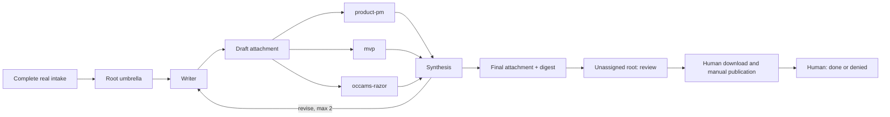

# PRD: PRD Kanban M0

- Status: approved for implementation
- Owner: Hermes operator
- Source: `docs/hermes-roadmap-doc-workflows.md`
- Board/profile: `prd-write` / `prd-write-v1`

## Decision

Use Hermes to run one small PRD workflow. Trust official Hermes task statuses, events, runs, attachments, concurrency, and recovery. M0 ends at a final attachment on an unassigned root in `review`.

A human downloads that attachment and manually copies or publishes it outside this automation. The human then marks the root `done` or `denied`.

## Flow

- Round 0 uses the writer, all three reviewers, and synthesis.
- A revision uses a writer, `mvp`, `occams-razor`, open blocker owners, and synthesis.
- Synthesis may store its blocker ledger in its structured result attachment.
- The final attachment is immutable. Its raw-byte SHA-256 digest identifies the exact handoff.

## Scope

M0 includes complete real intake, one root and its task graph, two targeted revision rounds at most, final attachment handoff, and five sequential real canaries.

M0 excludes:
- automated publication, readback, rollback, publisher helpers, receipts, effect recovery, and external-effect fault tests;
- custom lifecycle journals, state machines, databases, Postgres schema, CAS, or custom concurrency/recovery logic;
- attachment probes; profile/config/tool inspection or management; forms; other document workflows; Fleet UI; and a generic document engine.

Legacy document flow remains available for non-canary intake. Each canary uses only the M0 route; no intake runs through both flows.

## Five Real Canaries

Name five complete real requester intakes before activation. Admit them one at a time. Admit the next only after the prior root reaches visible human review and the operator checks its graph, attachments, rounds, quality, elapsed time, and cost.

| Metric | Pass |
| --- | ---: |
| Accepted without material human rewrite | at least 4/5 |
| Schema-valid | 5/5 |
| Materially rewritten by human | at most 1/5 |
| Lost or duplicate root, task, or attachment | 0 |
| Automated or unapproved publication | 0 |
| Final/downloaded attachment digest mismatch | 0 |
| Hidden human review | 0 |
| More than two revision rounds | 0 |
| Locked cycle-time and cost targets | pass |

Day 1 reports admissions, graph/attachment validity, review visibility, elapsed time, quality signal, and cost. Day 5 reports all five outcomes. Human decides pass, extend, or stop.

## Stop Conditions

Stop new canary intake for workflow quality failure, lost work, duplicate work, hidden review, revision-round cap breach, or cost breach. Keep affected root visible for human action. Do not build recovery machinery around it.

## Council Outcome

MVP and architect approve this simplified M0. Reliability's publication blocker is removed because automation has no publication effect. Architect's profile-fingerprint dissent is dismissed; M0 trusts the named Hermes profile.
