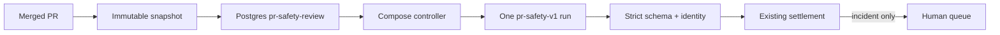

# Grounding Brief: Kanban-Backed PR Safety Analysis

> Superseded by `grounding-pr-safety-direct-kanban.md` for new PR-safety work.

## Objective

- Replace only `pr-safety-v1` single-agent analysis.
- Keep same merged-PR safety use case and all deterministic controls.
- Run one fixed multi-agent Kanban graph for every safety request.

## Sources

| Source | Pointer | Fact |
| --- | --- | --- |
| Controller | `scripts/hermes-controller.py` | Owns snapshot preflight, strict safety schema, handoff, and settlement |
| Safety SQL | `docker/initdb/11-hermes-pr-safety.sql` | Owns event dedupe, supersession, request state, and incident-only human queue |
| Safety policy | `policy/pr-safety-policy-v1.md` | Owns review rules and exceptional incident threshold |
| Council proof | `scripts/hermes-kanban-risk-council.py` | Proves four parallel tasks, dependent synthesis, typed metadata, and archive |
| Workflow contract | `agent-config/hermes/workflows/pr-risk-council-kanban.json` | Locks profiles, models, graph, deadline, and budget |
| Restricted profiles | `scripts/configure-hermes-kanban-profiles.py` | Locks memory, plugins, fallback, tools, and retries |
| Eval | `evals/manifest.json`, `scripts/hermes-eval.py` | Locks safety quality metrics and zero-tolerance gates |
| Prior plan | `~/private-docs/projects/ai-pr-automation/plans/2026-09-22-hermes-multi-agent-workflow-plan.md` | Records successful feasibility, profile, canary, and five-task graph work |

## Current Flow

## Target Flow

```mermaid
flowchart LR
    P["Merged PR"] --> S["Immutable snapshot"]
    S --> Q["Same Postgres request"]
    Q --> C["Same Compose controller"]
    C --> B["Narrow Kanban bridge"]
    B --> K["4 Haiku specialists"]
    K --> Y["Sonnet 5 synthesis"]
    Y --> V["Same strict schema + identity"]
    V --> X["Same settlement"]
    X -->|incident only| H["Same human queue"]
```

Only analysis box changes.

## Fixed Graph

- General correctness reviewer — `claude-haiku-4-5-20251001`.
- Security/privacy reviewer — `claude-haiku-4-5-20251001`.
- Reliability/data-integrity reviewer — `claude-haiku-4-5-20251001`.
- Architecture/contracts reviewer — `claude-haiku-4-5-20251001`.
- Final synthesizer — `claude-sonnet-5`, depends on all four.

No triage. No adaptive escalation. No percentage routing. Every eligible `pr-safety-review` uses this graph after cutover.

## Preserved Invariants

- Same request kind and payload.
- Same immutable snapshot and policy digest.
- Same nonce, lease, dedupe, supersession, and retry behavior.
- Same exact `valid_safety` top-level schema.
- Same incident threshold.
- Same immutable controller-written handoff.
- Same atomic incident-only insertion into `pending_maintenance_reviews`.
- Same human ownership of merge, remediation, rollback, and incident decision.
- Zero direct Kanban external effects.
- No Opus or provider/model fallback.

## Integration Fact

Compose controller cannot safely write host Hermes SQLite. Gateway already owns Kanban dispatch. Small authenticated host bridge must create, inspect, and archive exact workflow. It is not another dispatcher.

## Known Constraint

Current policy says OpenAI only. Current safety profile and planned council use Anthropic. Policy must be reconciled through human-reviewed PR before cutover.

## Proceed Gate

- Status: ready for concise PRD/DD review.
- Non-goal: redesign PR-safety routing or add adaptive product behavior.
