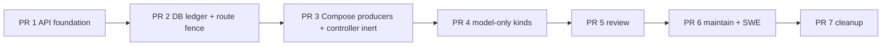

# Plan: API-Driven Hermes Control Plane

- status: draft, council pass-with-nits
- owner: Zhach
- sources:
  - [PRD](PRD-api-driven-control-plane.md)
  - [DD](DD-api-driven-control-plane.md)
  - [grounding](grounding-api-control-plane.md)
  - council room: `~/.agent-fleet/agent-chat/rooms/council-hermes-api-control-plane`
- goal: Compose owns producers + queue controller. Host Hermes runs profiles through Runs API.
- non-goal: containerize Hermes.

## Done Means

- no host dispatcher;
- no producer launchd jobs;
- one Compose controller;
- producers in Compose;
- six kinds use profile Runs API;
- one fleet Runs ledger;
- exact replay works;
- direct-effect uncertainty never auto-retries;
- doc exact-byte, safety incident-only, memory gate unchanged;
- one command starts fleet;
- native rollback stays available for 7 days.

## Execution Map

## PR 1: Hermes API Foundation And Conformance

Why first:

- prove existing server seam;
- fail cheap;
- no queue cutover.

Changes:

- enable loopback API server;
- enable profile multiplexing;
- generate distinct profile keys;
- write keys to profile `.env`;
- mount one controller key-bundle secret in a test container only;
- add pinned Runs API client library;
- add conformance fixture.

Conformance must prove:

- right profile/key gets 202;
- wrong key/profile gets 401;
- identical key/body replays same run ID;
- changed body gets 409;
- 429 at global cap;
- gateway restart returns interrupted;
- stop reaches terminal or explicit stop-unconfirmed;
- API listener is loopback only;
- Compose can reach `host.docker.internal:8642`;
- output/status schema matches pinned Hermes version/commit.

Acceptance:

- all tests pass without GitHub/model effects;
- no API key in logs/repo;
- current native dispatcher still owns all kinds.

Stop:

- any wrong-profile auth succeeds;
- exact replay fails;
- container cannot reach loopback without widening host bind.

## PR 2: One Fleet Runs Ledger And Route Fence

Changes:

- migrate `hermes_doc_runs` into generalized `hermes_runs`;
- add exact request bytes/digest;
- add route/auth/profile generation;
- add first-submit/replay/stop fields;
- add human reconcile outcome/reason/actor/time;
- add operation key uniqueness;
- add `hermes_kind_routes(kind,route,generation,max_concurrent)`;
- one claim+reserve function with expected route;
- final pre-submit CAS;
- route switch function;
- migrate old doc evidence;
- retire old doc ledger/helpers.

Tests:

- concurrent claim cap per kind;
- native/API overlap denied;
- stale generation POST CAS denied;
- one active/uncertain operation only;
- expired lease resumes same attempt;
- effect uncertainty blocks same operation;
- first POST/replay predicates;
- 8-post/5-minute bound;
- 23-hour replay boundary;
- auth/profile generation mismatch;
- schema idempotency and fresh==upgrade.

Acceptance:

- default route remains native for every kind;
- no runtime behavior change.

Stop:

- migration loses old doc run evidence;
- route switch can race submit CAS.

## PR 3: Compose Producers And API Controller Scaffold

Changes:

- new pinned `hermes-controller` image;
- Python 3.11 controller with pinned `aiohttp` + `psycopg`;
- review/maintain/safety/memory producers as Compose services;
- remove producer launchd startup from normal path;
- controller loop disabled by default;
- synthetic no-effect kind/profile for end-to-end control test;
- direct per-kind branch structure, no adapter framework;
- Fleet Controller attempt/run visibility.

Tests:

- producer authority/dedupe parity;
- controller restart after lost 202 recovers same run ID;
- 409 → reconcile;
- 429 bounded wait;
- lease loss → stop + stale nonce denial;
- Compose restart resumes attempt;
- DB cap holds with two controller replicas;
- API keys visible only to controller.

Acceptance:

- synthetic job completes through Compose→Runs API;
- native real kinds unchanged.

Stop:

- controller requires OAuth/SSH/service-home mounts;
- controller invents a second scheduler/state store.

## PR 4: Model-Only Kinds

Kinds:

- doc-write;
- pr-safety-review;
- memory-curate.

Changes:

- prompts return strict JSON in Runs `output`;
- controller doc branch calls existing stage/questions/publication functions;
- controller safety branch validates snapshot/policy and writes incident-only handoff/queue;
- controller memory branch gathers bounded sources, applies existing gates, writes team/org memory;
- route each kind native→api one at a time.

Order:

1. doc-write fixture, open questions, final, approval, publication, crash reconcile;
2. pr-safety clear/non-incident/incident/mismatch/malformed;
3. memory base gate/tier gate/dedupe/watermark.

Acceptance per kind:

- 3 successful operations or one full schedule cycle;
- no model gets DB/publication/inbox/memory-write credentials;
- deterministic invariant tests unchanged;
- rollback rehearsal succeeds within 15 minutes when termination confirmed.

Stop:

- strict output cannot fit Runs output limits;
- model can bypass deterministic gate.

## PR 5: PR Review

Changes:

- API prompt contains exact repo/PR/head;
- operation key `review:<repo>#<pr>@<head>`;
- direct-effect profile posts one marker-bound review;
- controller strict parses terminal output;
- uncertain result enters human reconcile and blocks same operation;
- route review native→api.

Tests:

- exact head;
- self-review/comment mapping;
- incomplete diff cannot approve;
- duplicate marker no second review;
- lost response/restart/lease loss creates no second run;
- unresolved reconcile blocks producer duplicate.

Live pilot:

- disposable PR with intentional issue;
- one review only;
- gateway restart fault injection.

Stop:

- any duplicate visible review;
- any automatic retry after uncertainty.

## PR 6: Maintain And SWE

### Maintain

- operation key includes repo/PR/head/round;
- exact head/branch;
- three-round cap;
- one fix pass;
- uncertainty → human reconcile;
- no second run for same operation.

### SWE

- existing operation identity;
- new branch + draft PR;
- strict PR URL output;
- uncertainty → human reconcile;
- no second run for same operation.

Tests:

- per-kind caps (3 maintain, 1 SWE);
- branch/head guards;
- fourth maintain round denied;
- partial push/thread/PR uncertainty blocks rerun;
- profile key isolation;
- controller/gateway restart fault matrix.

Live pilots:

- disposable maintain PR;
- one bounded SWE task;
- no merge.

Stop:

- any default/protected push;
- any duplicate push/reply/PR after injected failure.

## PR 7: Cleanup And Launch

Entry:

- every kind passes pilot;
- 7-day bake begins;
- rollback rehearsed.

Changes after bake:

- remove host dispatcher binary/plist;
- remove specialized host queue runners from active path;
- remove producer launchd templates/jobs;
- remove native route after rollback window;
- simplify `fleet.sh up/down/status`;
- update Fleet Controller and docs.

Keep:

- deterministic publication/reconcile helpers used by Compose controller;
- durable attempt evidence;
- Hermes gateway/dashboard/profiles;
- rollback tag/image/artifact for audit window.

Launch acceptance:

- first 20 requests: 100% API-controlled;
- zero duplicate visible effects;
- zero cross-profile auth successes;
- zero stuck running rows after reclaim cycle;
- p95 enqueue→start <=5s with capacity;
- dashboards expose queue/attempt/run/reconcile IDs.

## Dependency Graph

```dot
digraph plan {
  rankdir=LR;
  api [label="PR1 API conformance"];
  db [label="PR2 ledger/fence"];
  ctl [label="PR3 controller/producers"];
  model [label="PR4 model-only"];
  review [label="PR5 review"];
  effect [label="PR6 maintain+SWE"];
  clean [label="PR7 cleanup"];
  api -> db -> ctl -> model -> review -> effect -> clean;
}
```

## Loop Policy

- implementation loop cap: 2 per PR;
- review only changed files + failed acceptance;
- no repeated architecture council unless implementation exposes a DD mismatch;
- mismatch returns to DD; no patch-around;
- one PR merged before next cutover PR starts;
- human merge and route-switch approval required.

## Open Blockers

None for planning.

Implementation starts only after owner approves PRD/DD/plan.
