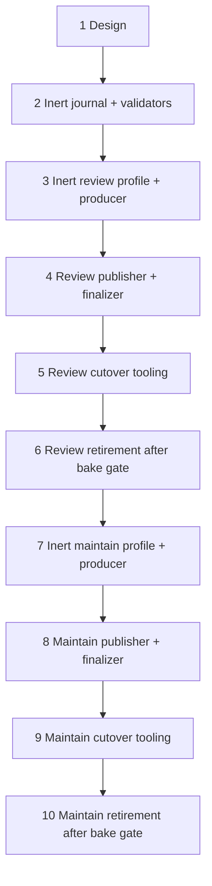

# Technical Plan: Direct PR Operations
- status: proposed;
- PRD: `PRD-direct-pr-operations.md`;
- DD: `DD-direct-pr-operations.md`;
- owner: fleet operator;
- delivery: ten small ordered reviewed PRs;
- activation: explicit human gate, never merge side effect.
## Scope Lock
Move `pr-review`, then `pr-maintain`, to persistent host-native Kanban boards. Preserve exact-head, authority, lineage, review marker/verdict, maintain branch/thread rules, three-round cap, uncertain-effect fencing, and human merge authority.

Do not migrate Postgres work, add boards per operation, expose GitHub write credentials to models, use direct SQLite, or retire shared infrastructure used by other kinds.

First code PR is PR 2. It is inert and behavior-preserving. Its identity scope includes issue #259: maintenance is triggered by changed non-empty actionable feedback, with head retained as a safety fence. No code PR may activate a route merely by merge.
## Order


Every arrow is a merge and evidence gate. No parallel activation. Maintainer work starts after review retirement.
## PR 1: Design
- Add only these PRD/DD/plan files.
- Review trust boundaries, state machine, human queue rule, rollback ownership, and deletion gates.
- Acceptance: no open architecture blocker; runtime unchanged.
## PR 2: Inert Shared Journal And Validators
- Add filename-safe operation identity—`kind|repo|PR|head` for review and the same plus `feedback_digest` for maintenance—and admission/binding/effect/quarantine/disposition/closure schemas under confined per-operation directories.
- Add atomic immutable writes, digest chain, root lock, exact-head/authority/lineage validators, round counter, separate-failure-domain mirror/restore checks, and CLI JSON adapter.
- Add isolated real-CLI probes for assign-none, unblock, request-review, complete, list, show, archived reads, and disabled default auto-assignment.
- No producer, profile, effect handler, board mutation, route, credential, or service change.
- Acceptance: fixture/fault/restore tests pass; existing review/maintain bytes and behavior are unchanged.
## PR 3: Inert Review Profile And Coordinator
- Add `pr-review` board/profile contract: proposal MCP only, no generic terminal/file/network/GitHub writes; proposal tool blocks card.
- Add deterministic paginated coordinator discovery in shadow mode and exact card-binding renderer.
- Make coordinator sole admission front door in Postgres mode only after parity, race, and rollback fixtures pass. Old producer is then disabled, not dual-run.
- Compare old and new eligible sorted operations without admitting Kanban tasks.
- Add credential/control-state denial probes, mode-generation fencing, and one-repository/concurrency-one canary configuration.
- Acceptance: zero provider calls from discovery; parity has no unexplained miss/extra; active route stays Postgres.
## PR 4: Review Effect Handler And Finalizer
- Add root coordinator review path and narrow root-only effect handler.
- Add admitted-commit proposal validation, intent, one marker-bound commit-pinned publish, publisher-identity/payload readback receipt, same-card human review transition, and closure-last handling.
- Fault-test every journal/CLI/GitHub boundary, including head race, preseeded marker, timeout-after-write, and crash-before-receipt. Ambiguity must quarantine and request human review without retry.
- Acceptance: model cannot publish or mutate control state; normal card remains blocked until receipt; human item is same unassigned non-dispatchable card.
## PR 5: Review Cutover Tooling
- Add stopped/drained mode-switch command, final discovery close, mode-generation CAS, allowlisted cohort, concurrency cap, deadman/cursor/queue alerts, status/runbook, and rollback command.
- Keep default engine Postgres. Merge never activates Kanban.
- Operational gate after merge: human stops old ingress after Postgres review work drains; records cutover floor; enables one allowlisted Kanban canary; runs restart, uncertainty, human-disposition, backup/restore, and rollback drills; ramps only after pass.
- Bake gate: 50 successful live review jobs. Count only exact receipt + card completion + closure.
- Acceptance: 50/50 accounted; zero automatic uncertainty retry; rollback admits only never-owned work. Gate evidence blocks PR 6.
## PR 6: Review Retirement
- Require completed bake, approved rollback window, zero old open review work, and explicit deletion approval.
- Remove only exact approved review manifest: Compose producer, controller route/handler, route row/default, unused credentials, and review-only Postgres functions. Preserve shared tests and historical inspect/reconcile support.
- Prove static/runtime reachability for every other kind. Restore disabled route artifact against fresh and existing databases before deletion approval.
- Acceptance: direct review works alone; restoration artifact and ownership journal remain valid; post-delete soak and required broad suite pass.
## PR 7: Inert Maintain Profile And Coordinator
- Add proposal/local-commit-only profile and persistent `pr-maintain` board contract.
- Add task-scoped workspace MCP backed by pinned macOS Seatbelt profile. No generic host terminal/file/network. Default-deny child sees bounded read-only toolchain plus one writable worktree; no credentials, service sockets, control state, inherited descriptors, or surviving process tree.
- Add shadow deterministic discovery that admits only changed non-empty actionable feedback digests, one-time Postgres lineage-round floor with exact historical feedback digests (cutover blocks if unavailable), explicit per-lineage floor/round records, per-kind locked cross-engine round reservation, immutable round `1..3` per admitted snapshot, exact worktree/head/branch binding, one-fix-pass and full-feedback-ledger validators.
- Make coordinator sole admission front door in Postgres mode only after parity/race fixtures pass. Do not enable Kanban cards or effect handler.
- Acceptance: old/new eligibility parity; concurrent different-head/engine races reserve unique rounds; crash after reservation consumes round; round 4 denied; Seatbelt path/symlink/socket/network/child/grandchild/resource escape probes fail; review path unchanged.
## PR 8: Maintain Effect Handler And Finalizer
- Add clean root-owned bare Git reconstruction from validated commit objects; sanitized config, hooks off, canonical remote, no model worktree Git config.
- Add root commit policy: expected one-parent graph, object/mode/file/byte bounds, no gitlinks, authority path policy, default high-risk path review, and enrolled PR-branch CI secret/token proof.
- Add exact force-with-lease push, per-reply, and per-resolution packets.
- Write intent before each effect and exact publisher-identity/payload readback receipt after each.
- Add head/authority/lineage recheck inside effect handler, same-card human review, authenticated anti-replay dispositions, and closure last.
- Fault-test hostile Git config/hooks/helpers, sensitive paths, gitlinks, oversized trees, privileged CI fixtures, partial push/reply/resolve, timeout-after-write, and crash-before-receipt. No uncertain effect repeats.
- Acceptance: only root effect handler writes GitHub; all feedback is receipt-backed or visibly in human review.
## PR 9: Maintain Cutover Tooling
- Add stopped/drained mode switch, final discovery close, lineage/round floor capture, cohort/concurrency caps, deadman/cursor/queue alerts, status/runbook, and rollback command. Keep default engine Postgres.
- Operational gate after merge: human drains old maintain work; enables one live allowlisted canary; runs concurrent-lineage, restart, uncertainty, sandbox, backup/restore, human-disposition, and rollback drills; ramps only after pass.
- Bake gate: 50 successful live maintenance jobs. Count only all intended effect receipts + task completion + closure.
- Acceptance: 50/50 accounted; zero wrong-commit/branch push; every addressed thread read back resolved; no round 4. Gate evidence blocks PR 10.
## PR 10: Maintain Retirement
- Require completed bake, approved rollback window, zero old open maintain work, and explicit deletion approval.
- Remove only exact approved maintain manifest. Preserve shared tests and historical inspect/reconcile support.
- Prove static/runtime reachability for every other kind. Restore disabled route artifact against fresh and existing databases before deletion approval.
- Acceptance: direct maintain works alone; post-delete soak, broad suite, restoration drill, credential denial, and round-cap tests pass.
## Validation Matrix
| Check | PRs |
| --- | --- |
| schema, atomicity, crash/replay, CLI readback | 2, 4, 8 |
| discovery parity, cursor crash, authority/head change | 3, 7 |
| task-scoped tool, sandbox, credential, host-state, and network denial | 3, 4, 7, 8 |
| same-card `review`, null assignee, non-dispatchable, immutable disposition | 4, 5, 8, 9 |
| review marker/verdict/self-review/exact-head | 4, 5 |
| maintain Seatbelt/worktree/commit policy/thread ledger/lineage-round cap | 7, 8, 9 |
| engine-neutral admission, mode CAS, rollback, no old-work migration | 3, 5, 6, 7, 9, 10 |
| backup/restore and journal/Kanban/GitHub reconciliation | 2, 5, 9 |
| observability alerts, deadman, queue age, saturation, and redaction | 4, 5, 8, 9 |

Run focused new tests per PR. Existing regression gates include:

```bash
bash tests/test-hermes-pr-producer.sh
python3 tests/test-hermes-controller.py
bash tests/test-hermes-control-plane.sh
bash tests/test-hermes-compose-wiring.sh
bash tests/test-hermes-native-foundation.sh
git diff --check
```

Run broad gates before each retirement, not on every inert slice.
## Stop And Handoff
Return to DD if pinned CLI cannot prove required unassigned non-dispatchable `review` state, default auto-assignment cannot be disabled, task-scoped sandbox isolation fails, separate-failure-domain restore is unavailable, or rollback cannot preserve engine owner. Stop rollout on any uncertain auto-retry, duplicate effect, stale effect, round-cap bypass, journal/card drift, missing human card transition, or unaccounted operation.

Each PR reports changed files, acceptance evidence, commands/results, active engine owners, open quarantines/reviews, and next human gate. No task may merge with a placeholder for effect recovery, human disposition, or deletion evidence.
