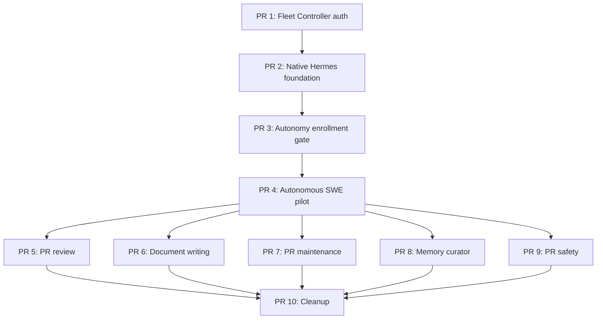

# Plan: Host-Native Autonomous Hermes

- status: draft for execution approval
- owner: Zhach
- source: [`DD-host-native-agent-engine.md`](DD-host-native-agent-engine.md)
- target: ten small PRs; first autonomous SWE signal by PR 4
- next gate: human approval, then PR 1

## Scope

Goal:

- run Hermes natively under dedicated `hermes-agent` account;
- give Hermes full autonomy inside enrolled repositories;
- keep Fleet Controller as fleet-operations and agent-gated decision UI;
- keep GitHub as PR merge UI;
- use native Hermes profiles, cron, OAuth, MCP, browser, worktrees, Git, and GitHub;
- keep Postgres, Hindsight, Coderag, and Fleet Controller in Compose;
- remove Fleet Worker, Effect Gateway, Hermes dashboard, and Compose Hermes runtime.

Human authority stays:

- PR merge or decline;
- exact document approval;
- incident disposition;
- paid-call and runtime activation approval;
- credential lifecycle;
- repository enrollment.

Non-goals:

- replace Postgres;
- make profiles security sandboxes;
- automatic merge;
- big-bang cutover;
- generic publisher platform;
- repeat full GitHub denial drill when credential and repository policy did not change.

## Success Criteria

- every model run names immutable versioned Hermes profile;
- Hermes runs as `hermes-agent`, never human account;
- Fleet Controller requires authenticated human session;
- enrolled-repository record is sole runtime repository authority;
- GitHub denial gate blocks merge, protected-branch update, unsafe CI/deployment effects, and administration;
- Hermes can edit, push, open draft PR, and post review in enrolled repository;
- producer cron uses `--no-agent` and makes zero provider calls;
- one shared queue runner owns claim, heartbeat, invoke, and terminal-state checks;
- Postgres loss watchdog stops Hermes before new claims;
- exact document publication still uses human-approved copied bytes;
- normal-path lease, nonce, dedupe, retry, reconcile, and three-round rules pass;
- no direct model SDK or Me Write runtime remains after cleanup.

## Dependency Graph

PRs 5–9 are technically independent. Preferred activation order: review, documents, maintenance, memory, PR safety.

Approved-DD sequencing exception proposed: PR 4 runs one disposable SWE autonomy pilot before document/review cutover. Plan approval approves this exception. No production repository enters pilot.

## PR 1: Authenticate Fleet Controller

Goal: protect human decisions before Hermes gets browser and host network access.

Scope:

- add operator login;
- add bounded authenticated session;
- retain CSRF, Origin, Host, and fixed-action checks;
- audit actor and action;
- add one generic run status view using existing request run IDs;
- keep localhost bind;
- add no Hermes session UI.

Likely files:

- `bin/status-server`;
- `docker-compose.yml`;
- `.env.example`;
- `tests/test-status-server.py`;
- `docs/README.md`.

Acceptance:

- anonymous user reaches login only;
- anonymous POST cannot mutate state;
- authenticated human can perform every current action;
- session secret unavailable to future `hermes-agent` account;
- current document and incident actions still work;
- generic run status view needs no role-specific UI code.

Validation:

- login, expiry, CSRF, Origin, Host, audit, and current-action tests;
- localhost browser smoke.

Rollback: restore retained `agent-fleet/status:pre-auth` with `docker-compose.status-rollback.yml`; verify HTTP status. Do not activate browser-enabled Hermes while old anonymous UI runs.

Stop condition: authentication breaks exact-byte or incident decision flow.

## PR 2: Native Hermes Foundation

Goal: install headless native Hermes with shared queue runner and no production routing.

Scope:

- lock native version, upstream commit, install root, state root, profile root, and binary digest;
- add read-only preflight;
- add root-owned install/profile-sync command;
- add `hermes-agent` LaunchDaemon template;
- add maintenance, drain, start, stop, status, and logs commands;
- report native profile, cron, gateway, and pin state through operator status command;
- add `smoke-v1` profile;
- keep all current workers and producers active;
- mark old Hermes cutover plans superseded by merged DD and this plan.

Likely files:

- `scripts/hermes-native.sh`;
- `scripts/hermes-native-preflight.py`;
- `launchd/com.example.ai-pr-automation-hermes.plist.template`;
- `agent-config/hermes/profiles/smoke-v1/`;
- `tests/test-hermes-native*`;
- `docs/hermes/README.md`;
- old cutover plan headers.

Acceptance:

- preflight fails on wrong version or digest;
- LaunchDaemon runs as `hermes-agent` and binds loopback only;
- profile source and launch files are not writable by `hermes-agent`;
- pinned runtime proves profile install/list, Runs submit/poll/stop/replay/restart, and cron `--no-agent`;
- no-agent probe makes zero provider calls;
- maintenance mode prevents automatic restart;
- no production row is claimed.

Validation:

- fake CLI/API/DB unit tests;
- clean-state install and restart smoke;
- account permission denial test;
- synthetic profile run.

Rollback: unload LaunchDaemon. Current Compose routes stay active.

Stop condition: pinned native runtime fails profile route, no-agent cron, account isolation, or watchdog contract.

## PR 3: Autonomy Enrollment Gate

Goal: make repository and credential boundary real before Hermes gets write authority.

Scope:

- add `hermes_repository_enrollments` table as sole runtime repository authority;
- store repo, credential fingerprint, ruleset digest, workflow digest, environment-policy digest, proof digest, and approval time;
- add read-only GitHub denial checker;
- add human-only enrollment command that imports successful proof;
- add Hermes database role and restricted enqueue/claim/lease/result/reconcile functions;
- add native enqueue and claim functions that require active proof checked within ten minutes;
- keep old environment allowlists only for rollback workers;
- preserve old broad role/functions for rollback until cleanup;
- add credential inventory check with no secret output.

No JSON runtime allowlist. No second enrollment authority.

Likely files:

- `docker/initdb/07-hermes-autonomy.sql`;
- `scripts/hermes-repo-gate.py`;
- `scripts/hermes-repo-enroll.py`;
- `lib/queue.sh`;
- `tests/test-hermes-repo-gate.py`;
- `tests/test-hermes-db-grants.sh`;
- `docs/hermes/README.md`.

Acceptance:

- unenrolled repo cannot enqueue, claim, or run;
- proof binds exact credential and GitHub policy identities;
- gate rejects stale evidence or any failed required denial/allowed probe;
- Hermes DB role cannot approve human action or use arbitrary table DML;
- stale nonce, cross-kind transition, and unenrolled repo calls fail;
- enqueue and claim require active non-expired authority proof;
- stale proof blocks native enqueue and claim;
- full denial drill reruns only when bound authority digest changes.

Validation:

- evidence-schema and Postgres tests;
- credential-output redaction test;
- old worker compatibility test against expanded schema.

Rollback: remove repo enrollment, revoke agent credentials, keep additive schema.

Stop condition: human-only merge or safe CI/deployment denial cannot be proven. Return to DD.

## PR 4: Prove Autonomous SWE End To End

Goal: produce first real signal. Hermes edits, pushes, and opens draft PR in disposable repository.

Scope:

- run disposable live repository denial matrix with human approval;
- add no-agent policy watcher that refreshes or invalidates enrollment when authority digests change;
- add Postgres-loss watchdog that stops Hermes before credentials activate;
- add shared queue runner with fixed kind-to-profile map;
- runner owns claim, heartbeat, profile invocation, and terminal-state check only;
- add paused executor cron definitions and generic Fleet Controller profile/cron/run health;
- add production-shaped `swe-implement-v1` profile;
- map `swe-implement` in shared queue runner;
- use current Fleet Controller task submission;
- manually enqueue one deterministic task;
- Hermes creates fresh clone, branch, edit, test, commit, push, and draft PR;
- enqueue created PR for review;
- retain old SWE image/config for rollback but stop and drain old worker during pilot;
- add no producer migration or route partitioning.

Likely files:

- `agent-config/hermes/profiles/swe-implement-v1/`;
- `bin/hermes-queue-runner` kind map;
- `bin/swe-implement` role behavior reused or reduced;
- `tests/test-hermes-swe-pilot.sh`;
- `docs/hermes/README.md`.

Acceptance:

- only disposable enrolled repository accepted;
- exact profile and request digests persist;
- Hermes creates branch and draft PR;
- default/protected branch and merge attempts fail;
- agent branch workflow gets no write token, production secret, deployment, release, or unsafe `pull_request_target` path;
- allowed actions push unprotected branch, open draft PR, and post review;
- created PR points at expected commit;
- created PR enters review queue;
- unknown push or PR-create outcome reconciles by read-back;
- Fleet Controller shows run ID, profile, status, PR URL, and error;
- credential revocation stops second effect.

Activation:

1. Stop old SWE worker.
2. Drain or reconcile active SWE row.
3. Start native SWE executor only.
4. Manually enqueue disposable task.
5. Verify one claimant.
6. After pilot, pause native executor and restore old worker by default.

After successful pilot, production activation is separate human operation. Reuse exclusive stop/drain/start sequence, enroll selected repositories, and verify one claimant. No new code PR needed unless pilot finds a gap.

Validation:

- fake Git/GitHub end-to-end;
- one live disposable-repository run;
- lease-loss and unknown-effect tests;
- authority proof digest unchanged from PR 3.

Rollback: pause SWE executor, reconcile uncertain effect, revoke pilot credentials, restart old SWE worker if needed.

Stop condition: any protected write, merge, unsafe CI/deployment effect, or human-credential access succeeds.

## PR 5: Move PR Review And Its Producer

Goal: Hermes discovers, reviews, and posts review for enrolled repositories.

Scope:

- add `producer-v1` review cron with existing eligibility/dedupe logic;
- add immutable `pr-review-v1` profile;
- map `pr-review` in shared runner;
- preserve exact-head input, capped diff, verdict schema, marker, read-back, and reconcile behavior;
- stop old review producer and worker only during human activation;
- retain old route for rollback.

Likely files:

- `agent-config/hermes/profiles/producer-v1/`;
- `agent-config/hermes/profiles/pr-review-v1/`;
- `scripts/hermes-cron-sync.py`;
- `bin/pr-producer`;
- `bin/hermes-pr-review-request`;
- `tests/test-hermes-pr-review.py`;
- `tests/test-producer-dedupe.sh`.

Acceptance:

- no-agent producer makes zero provider calls;
- same GitHub state gives same eligible operation as old producer;
- duplicate tick creates no duplicate row;
- incomplete diff cannot approve;
- review posts for exact head with marker;
- unknown POST reads back marker before settle;
- human merge remains server-enforced;
- one active producer and executor after activation.

Validation:

- fake GitHub producer/review integration;
- stale-head, replay, lease-loss, and unknown-effect tests;
- allowed review effect test;
- verify PR 3 authority proof digest unchanged. Do not repeat full denial matrix.

Rollback: pause review producer/executor, drain/reconcile, restart old producer and review worker.

Stop condition: producer parity differs or review can merge/protected-write.

## PR 6: Move Document Writing

Goal: native rich-context drafting with unchanged exact human publication.

Scope:

- add `doc-write-v1` profile;
- map `doc-write` in shared runner;
- use handbook, read-only MCP, and optional disposable web lookup;
- stage output in Hermes-owned path;
- Fleet Controller copies bytes into its approval store before review;
- keep exact digest approval and publication;
- retain old doc worker for rollback.

Likely files:

- `agent-config/hermes/profiles/doc-write-v1/`;
- `bin/doc-writer`;
- `bin/doc-writer-publication`;
- `bin/status-server` only for immutable-copy boundary;
- `tests/test-doc-writer*.sh`;
- `tests/test-status-server.py`.

Acceptance:

- Hermes cannot access approval store or private-docs inbox;
- user reviews Fleet Controller-owned copy and digest;
- source mutation after copy cannot change publication;
- only exact approved bytes publish;
- unavailable required source returns typed `blocked` result;
- unavailable optional source is explicitly omitted and cannot support a cited claim;
- one active doc executor after activation.

Validation:

- exact-byte race, symlink, digest, and target tests;
- profile/MCP/browser smoke;
- no direct model SDK call.

Rollback: pause native doc executor and restart old doc worker. Approved copied bytes remain valid.

Stop condition: exact-byte approval weakens.

## PR 7: Move PR Maintenance And Its Producer

Goal: Hermes owns exact PR worktree through push and thread resolution.

Scope:

- add maintenance producer to `producer-v1`;
- add `pr-maintain-v1` profile;
- map `pr-maintain` in shared runner;
- use native worktree, test, commit, push, reply, and resolve flow;
- keep exact head/branch, force-with-lease, all-thread, read-back, and three-round policy;
- retain Compose maintain workers for rollback.

Likely files:

- `agent-config/hermes/profiles/producer-v1/`;
- `agent-config/hermes/profiles/pr-maintain-v1/`;
- `bin/pr-producer`;
- `bin/agent-server` role logic reused or reduced;
- `tests/test-hermes-maintain-runner.sh`;
- `tests/test-maintain-resolve-threads.sh`;
- `tests/test-maintain-ci-prompt.sh`.

Acceptance:

- producer parity and zero provider calls;
- worktree starts at claim SHA;
- push targets exact PR branch;
- all unresolved threads handled or escalated;
- fourth round cannot run in normal path;
- stale head supersedes;
- unknown push/thread result reconciles;
- one active producer and executor after activation.

Validation:

- fake Git/GitHub tests;
- concurrent round-cap test;
- allowed maintenance effect test;
- authority proof digest unchanged.

Rollback: pause maintain producer/executor, drain/reconcile, restart old producer and workers.

Stop condition: exact branch, thread, or round policy regresses.

## PR 8: Move Memory Curator

Goal: Hermes owns scheduled shared-memory curation.

Scope:

- add `memory-curator-v1` profile and cron;
- preserve source roots, watermarks, sensitivity filter, dedupe, and interval;
- configure normal-path Hindsight write only for curator profile;
- keep cross-profile credential risk explicit;
- classify policy exception separately from accepted/rejected memory;
- route policy exception to Fleet Controller for human action;
- retain old curator for rollback.

Likely files:

- `agent-config/hermes/profiles/memory-curator-v1/`;
- `bin/memory-curator`;
- `scripts/memory-curator-launch.sh`;
- `bin/status-server` for new policy-exception action only;
- `tests/test-memory-curator.sh`;
- `tests/test-status-server.py`.

Acceptance:

- secret/customer/personal fixtures rejected;
- same source does not duplicate memory;
- failed retain does not advance watermark;
- cron does not overlap;
- Fleet Controller generic status shows curator run;
- policy exception enters human queue and only human can resolve it;
- old curator and new cron never active together.

Validation:

- fake Hindsight tests;
- credential inventory;
- retry, watermark, dedupe, exception-routing, and human-action tests.

Rollback: pause curator cron, restart old curator, preserve watermark.

Stop condition: sensitivity or watermark contract regresses.

## PR 9: Move PR Safety And Its Producer

Goal: move final high-risk role and immutable snapshot producer.

Scope:

- add PR-safety merged-PR producer to `producer-v1`;
- preserve snapshot creation, digest, retention, and dedupe;
- add `pr-safety-v1` profile;
- map `pr-safety-review` in shared runner;
- keep strict result schema and incident-only queue;
- copy staged handoff into Fleet Controller-owned review store;
- retain old producer and isolated worker for rollback.

Likely files:

- `agent-config/hermes/profiles/producer-v1/`;
- `agent-config/hermes/profiles/pr-safety-v1/`;
- `bin/pr-safety-merged-pr-producer`;
- `bin/agent-server-pr-safety` role logic reused or reduced;
- `tests/test-pr-safety-merged-pr-producer.sh`;
- `tests/test-agent-server-pr-safety.sh`.

Acceptance:

- producer creates same immutable snapshot identity as old path;
- snapshot and policy digests bind result;
- changed snapshot supersedes;
- malformed result fails;
- only incident candidate enters Fleet Controller;
- staged handoff mutation cannot change reviewed copy;
- one active producer and executor after activation.

Validation:

- producer parity and no-agent test;
- immutable snapshot/handoff race test;
- prompt-injection and incident-routing tests;
- authority proof digest unchanged.

Rollback: pause PR-safety producer/executor and restart old producer/worker.

Stop condition: immutable input or incident-only contract weakens.

## PR 10: Remove Replaced Runtimes

Goal: one active native Hermes fleet. Compose support services only.

Entry gate:

- native SWE, review, documents, maintenance, memory, and PR safety active;
- old queues drained;
- no unresolved unknown effect hidden by cleanup;
- rollback drill complete for every role;
- human approves deletion.

Scope:

- remove Compose Hermes gateway, dashboard, egress, OAuth, profile-init, and volumes after review;
- remove Me Write runners and dependencies;
- remove old producer and worker services;
- remove obsolete Dockerfiles, tests, env values, and docs;
- keep Postgres, Hindsight, Coderag, and Fleet Controller;
- update roadmap and operator runbook.

Acceptance:

- Compose renders support services only;
- native Hermes is sole model runtime, scheduler, and executor;
- Fleet Controller remains healthy;
- no direct model SDK or Me Write executable remains;
- no obsolete credential remains configured;
- state and credential deletion list receives human approval.

Validation:

- repository search for removed paths/env names;
- clean-host support-stack start;
- native fleet reboot smoke;
- full queue, GitHub, document, memory, safety, and reconciliation suite.

Rollback: revert cleanup PR and restore retained images/config. Do not restore deleted credentials without human action.

Stop condition: old route owns live run, queue row, or uncertain effect.

## Execution Waves

### Wave 1: Fast Signal

PRs: 1–4.

Target outcome: one week or less if external GitHub controls are ready.

Gate:

- Fleet Controller authenticated;
- native engine and watchdog healthy;
- autonomy denial matrix approved;
- one disposable edit-to-draft-PR run succeeds;
- no production repository routed.

### Wave 2: Role Cutovers

PRs: 5–9. Technically independent. Activate in preferred risk order.

Per-role gate:

1. Install profile and cron paused.
2. Confirm old route owns current work.
3. Stop old claimant.
4. Drain lease or reconcile uncertain effect.
5. Start one new claimant.
6. Run allowed-effect test.
7. Reverse route once to prove rollback.
8. Restore new route only after clean rollback.

Full GitHub denial matrix reruns only when repository, credential, ruleset, workflow, or environment-policy digest changes.

### Wave 3: Cleanup

PR 10 only after every role gate passes.

## Loop Policy

Implementation loop:

- one implementation pass;
- one focused review pass;
- one blocker-fix pass;
- no broad council unless merged DD assumption fails.

Return to DD when:

- human-only merge cannot be enforced;
- unsafe CI/deployment effect cannot be denied;
- dedicated account can read human credentials;
- exact-byte approval weakens;
- pinned profile route or no-agent cron differs;
- full autonomy requires hidden Fleet Worker or Effect Gateway.

No unrelated cleanup.

## Open Blockers

| Blocker | Owner | Needed before |
|---|---|---|
| Exact native install path and binary pin | Zhach | PR 2 implementation |
| `hermes-agent` account creation | Zhach | PR 2 activation |
| Fleet Controller operator secret | Zhach | PR 1 activation |
| Disposable GitHub repository | Zhach | PR 3 live validation |
| GitHub App and deploy keys | Zhach | PR 3 activation |
| Human-only merge and safe CI proof | Zhach | PR 4 activation |
| Profile-specific MCP/browser allowlist | Zhach | Each profile activation |

Merged DD records acceptance of cross-profile access to `hermes-agent` credentials. No further architecture approval needed unless denial gates fail.

## Handoff

After plan approval, start PR 1 from fresh `origin/main`.

Every PR includes:

- scope lock;
- focused tests;
- generic Fleet Controller status, not role-specific UI unless human action differs;
- activation command when applicable;
- rollback command and drill;
- proof no secret entered diff, logs, or artifacts.

Human merges every PR. Human approves paid calls, credentials, activation, repository enrollment, and final deletion.
