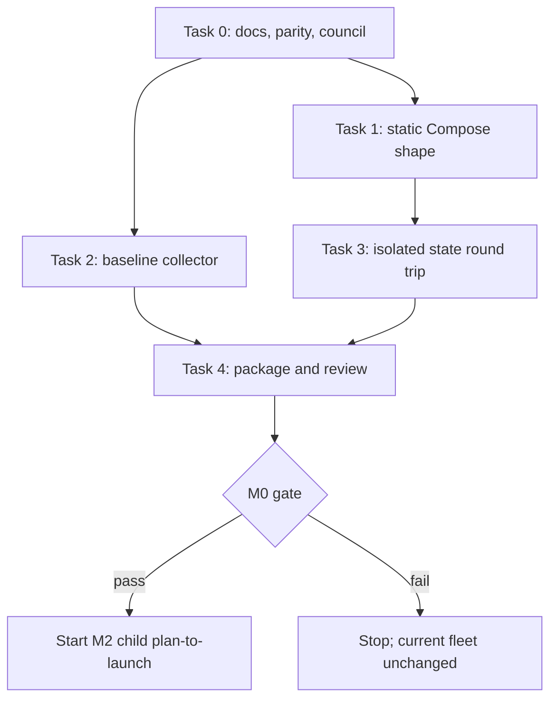

# Technical Plan: Hermes M0 Evidence Scaffold

- status: ready-for-implementation
- source PRD: [`PRD-m0-m2.md`](PRD-m0-m2.md)
- source DD: [`DD-m0-m2.md`](DD-m0-m2.md)
- council: [`council-m0-m2.md`](council-m0-m2.md)
- parity matrix: [`parity-matrix.md`](parity-matrix.md)
- responsible owner: Zhach
- implementers: ship agent per task
- reviewers: code-reviewer; architecture/reliability delta review on mismatch
- target: `Zhachory1/ai-pr-automation`
- execution mode: one concern per PR

## Accepted Scope

Goal:

- gather evidence for later Hermes child designs;
- keep full trust-tier and invariant parity matrix;
- add pinned, disabled Hermes service shape in root Compose;
- add current-fleet baseline metrics;
- prove isolated Hermes state-volume checksum round trip.

Non-goals:

- no Hermes model run;
- no GitHub call through Hermes;
- no doc config or handbook mount;
- no doc worker route change;
- no scheduler cutover;
- no `hermes_run_attempts` table;
- no publisher, queue-state, Postgres, or UI change;
- no production backup/restore tool;
- no claim that M1 or M2 can launch.

Success:

- root `docker-compose.yml` remains sole deployment manifest;
- `scripts/compose.sh` remains operator entrypoint;
- Hermes image uses exact digest;
- default Compose behavior stays unchanged;
- no host API port;
- no GitHub, Postgres, provider, doc, inbox, handbook, or code access in M0 service;
- baseline output is deterministic and does not invent unavailable target audits;
- isolated state archive restores byte-for-byte into new volume.

## Stop Conditions

Stop and ask if:

- official image needs entrypoint, `user`, or `init` override;
- M0 needs live provider, GitHub, or DB credential;
- default Compose startup changes without profile;
- state test touches live volume or `.env`;
- task needs unresolved run-attempt or publication schema.

Return to DD if:

- Hermes needs host port;
- one state volume must be shared;
- M0 needs doc files mounted;
- baseline needs payload contents;
- implementation activates route or model work.

## File Map

| Path | Change | Responsibility | Task |
| --- | --- | --- | --- |
| `docs/hermes/parity-matrix.md` | create/modify | trust-tier, invariant, request, effect inventory | 0 |
| `docs/hermes/council-m0-m2.md` | create | committed council decision | 0 |
| `docker-compose.yml` | modify | disabled pinned `hermes-doc` service, volume, network | 1 |
| `.env.example` | modify | non-secret M0 API settings | 1 |
| `tests/test-hermes-compose-contract.sh` | create | rendered-Compose contract | 1 |
| `scripts/hermes-baseline.py` | create | read-only baseline JSON | 2 |
| `tests/test-hermes-baseline.py` | create | fixed-data metric contract | 2 |
| `tests/test-hermes-state-roundtrip.sh` | create | isolated archive/checksum/restore proof | 3 |
| `docs/hermes/README.md` | create | commands, limits, gate state | 4 |
| `docs/README.md` | modify | link Hermes docs | 4 |

## Contracts

### Compose Service

Name: `hermes-doc`.

- profile: `hermes-m0`;
- image: `nousresearch/hermes-agent@sha256:6d7285e1476d0661fc347e3d55245c99decb781d76d39d67582166d2c9561874`;
- command: `gateway run`;
- default image entrypoint untouched;
- no `user`, `init`, entrypoint override, or host port;
- unique `hermes_doc_state:/opt/data`;
- dedicated network;
- API key comes from private `.env` only when operator starts profile;
- authenticated detailed-readiness shape present;
- no doc config, handbook, inbox, code, GitHub token, provider key, or DB password;
- no current service depends on it.

M0 proves static deployment shape. It does not prove no-tools execution, provider egress, runtime hardening, or M2 readiness.

### Baseline JSON

Top level:

- `schema_version`;
- UTC `window.start` and `window.end`;
- request count by kind and status;
- throughput count and denominator;
- queue age p50/p95/p99;
- start lag p50/p95/p99;
- completion time p50/p95/p99;
- failure count/rate;
- retry count/rate;
- reconcile count/rate;
- superseded count/rate;
- human queue count by state, pending count, oldest pending age;
- `target_audit.duplicate_effects` and `target_audit.missed_eligible`.

Target audit fields use explicit `unavailable` when no target inventory exists. They never default to zero.

No prompts, payload bodies, tokens, or secrets.

### M0 State Round Trip

Test only:

- unique source and target Docker volumes;
- deterministic non-secret fixture;
- tar archive plus SHA-256 manifest;
- checksum verified before restore;
- restore only into empty target;
- byte comparison;
- trap removes both volumes and temp files;
- no live Compose project, Postgres, `.env`, or current volume access.

Production backup, clean-host restore, and 15-minute route rollback belong to M2/M1 child designs after ownership exists.

## Execution Map



Tasks 1 and 2 can run in parallel. Task 3 needs state-volume name. Task 4 packages evidence. No task starts live work.

## Tasks

### Task 0: Intent And Parity

Why:

- implementer needs committed evidence. Machine-local council room is not enough.

Outputs:

- grounded PRD/DD;
- committed council synthesis;
- trust-tier and guarantee parity matrix;
- M0-only task plan.

Acceptance:

- every current kind lists credentials, writable mounts, network need, effect, and authority;
- every migration invariant maps to current evidence and retained/replaced decision;
- M1/M2 activation marked blocked;
- roadmap records M0 → M2 → M1 investigation order.

Validation:

```bash
git diff --check
```

### Task 1: Pinned Disabled Compose Service

Why:

- prove exact upstream image can fit root Compose without default behavior change.

Steps:

1. Add `hermes-doc` behind `hermes-m0` profile.
2. Use exact multi-architecture image digest.
3. Preserve default entrypoint and `gateway run` command.
4. Add unique state volume and dedicated network.
5. Add API settings and authenticated detailed-readiness shape.
6. Mount no doc config, handbook, inbox, or code.
7. Add static rendered-Compose test.
8. Assert existing services unchanged when profile omitted.

Acceptance:

- default and profile Compose config render;
- exact digest present;
- no host port or forbidden credential/mount;
- no current service depends on Hermes;
- no `user`, `init`, or entrypoint override;
- unique state volume exists;
- mutable tag or forbidden field fails test.

Validation:

```bash
bash tests/test-hermes-compose-contract.sh
bash tests/test-compose-producers.sh
```

Rollback:

- revert service, volume, network, env docs, and test. No runtime route exists.

### Task 2: Baseline Collector

Why:

- pilot accounting and latency gates need locked baseline.

Steps:

1. Query aggregate values only.
2. Calculate deterministic p50/p95/p99.
3. Return `null` for empty percentiles.
4. Include raw count and denominator for every rate.
5. Count retry by repeated kind+dedupe attempts inside window and document definition.
6. Include human dispositions from maintenance and decision queues.
7. Mark target audits unavailable without explicit target inventory.
8. Reject invalid or reversed windows.
9. Test empty, mixed status, repeated attempt, human disposition, and byte-stable rerun.

Acceptance:

- same state and window gives byte-stable JSON;
- collector performs no write;
- empty window is valid;
- all rates name count and denominator;
- target audit unknown is not zero;
- no payload content appears.

Validation:

```bash
python3 tests/test-hermes-baseline.py
```

Rollback:

- remove collector and test. No schema change.

### Task 3: Isolated State Round Trip

Why:

- prove volume bytes can be archived and restored without touching live state.

Steps:

1. Create source and target volumes with unique test names.
2. Write deterministic fixture into source.
3. Archive and write SHA-256 manifest.
4. Verify modified archive fails before restore.
5. Restore valid archive into empty target.
6. Compare source and target bytes.
7. Remove volumes in trap.

Acceptance:

- no live project or Postgres access;
- checksum failure stops restore;
- non-empty target stops;
- valid restore is byte-identical;
- `.env` and host paths never enter archive;
- cleanup removes isolated volumes.

Validation:

```bash
bash tests/test-hermes-state-roundtrip.sh
```

Rollback:

- remove test file. No production state changed.

### Task 4: M0 Package And Review

Why:

- M2 child design needs readable evidence and explicit limits.

Steps:

1. Update parity matrix against shipped diff.
2. Document exact opt-in Compose config command. Do not instruct operator to run provider work.
3. State what M0 does not prove, including production backup/rollback and runtime containment.
4. Run focused suites.
5. Run code-reviewer.
6. Run delta council only on design mismatch, conflicting blocker, or new security/reliability risk.
7. Open PR. Do not start Hermes profile as launch action.

Acceptance:

- docs state M1/M2 remain blocked;
- no real secret value;
- focused tests pass;
- review has no blocker;
- PR names limits and next gate.

Validation:

```bash
git diff --check
bash tests/test-hermes-compose-contract.sh
bash tests/test-compose-producers.sh
python3 tests/test-hermes-baseline.py
bash tests/test-hermes-state-roundtrip.sh
```

Rollback:

- revert M0 PR. Current runtime never depended on it.

## Execution Order

| Wave | Tasks | Gate | Owner |
| --- | --- | --- | --- |
| 0 | Task 0 | docs review clean | Zhach |
| 1 | Task 1, Task 2 | focused tests | ship agents |
| 2 | Task 3 | isolated recovery test | ship agent |
| 3 | Task 4 | code-reviewer and human PR approval | Zhach |

## Loop Policy

- implementation: one ship pass plus one blocker-fix pass per task;
- review: delta-only, cap 2;
- design kickback: live routing, attempt schema, publisher change, shared state, broad credential, or production restore returns to DD;
- council: delta-only on mismatch or unresolved security/reliability issue;
- M1 and M2: each starts new plan-to-launch run.

## Open Blockers

None for static M0 tasks.

M0 cannot start Hermes on operator host or claim runtime security parity. M2 child design owns that decision.

## Handoff

Read:

- [`grounding-brief.md`](grounding-brief.md);
- [`PRD-m0-m2.md`](PRD-m0-m2.md);
- [`DD-m0-m2.md`](DD-m0-m2.md);
- [`council-m0-m2.md`](council-m0-m2.md);
- [`parity-matrix.md`](parity-matrix.md).

Execute one task per PR. Do not implement M1/M2 activation. Report changed files, validation, concerns, and design mismatches.

## Plan Self-Review

- every task has validation: yes;
- parity artifact included: yes;
- tasks independently reviewable: yes;
- no M1/M2 activation: yes;
- no unresolved schema: yes;
- no speculative production recovery tooling: yes;
- stop conditions explicit: yes.
