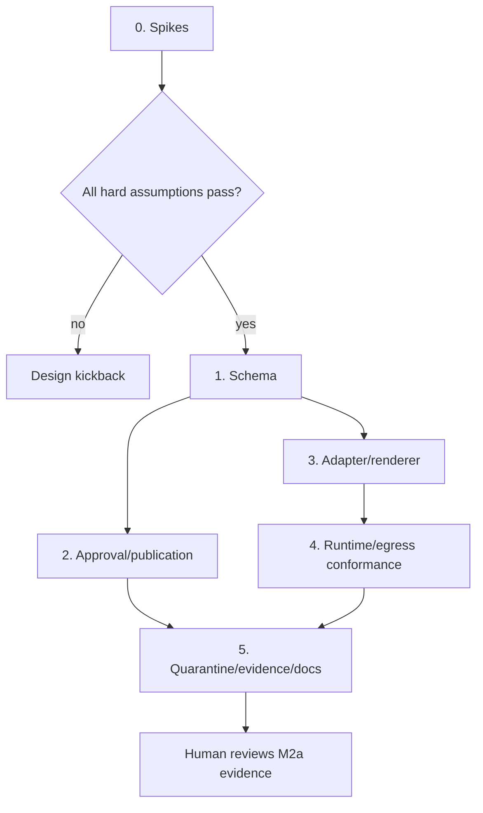

# Technical Plan: Hermes M2a Doc Foundation

- status: ready-for-implementation
- PRD: [`PRD-m2-doc-runtime.md`](PRD-m2-doc-runtime.md)
- DD: [`DD-m2-doc-runtime.md`](DD-m2-doc-runtime.md)
- council: [`council-m2-doc-runtime.md`](council-m2-doc-runtime.md)
- owner: Zhach
- scope: non-routing M2a only

## Scope Lock

Build:

- front-loaded platform spikes;
- crash-safe publication under legacy runtime;
- exact-byte Publish/Dismiss approval;
- durable Hermes phase and submission ledger;
- standalone pure HTTP adapter with fake server;
- prompt renderer contract without controller routing;
- pinned stock Hermes zero-tool/fake-provider conformance;
- doc-only egress test;
- rollback quarantine transaction and M2a evidence report.

Do not build:

- no Hermes-routed `doc-write` request;
- no paid provider call or shadow;
- no `DOC_WRITER_RUNTIME=hermes` controller branch;
- no live activation or purge automation;
- no M2b report approval;
- no legacy runner deletion;
- no inbound Runs proxy, TLS relay, or custom Hermes image unless new DD approves it.

## Stop Conditions

Stop and return to DD/council if:

- stock image emits tools or unexpected model-directed effect;
- config cannot stay reviewed/read-only;
- direct traffic bypasses egress proxy;
- `renameat2(RENAME_NOREPLACE)` fails on actual inbox bind;
- trace cannot bind exact container/run interval without dropped events;
- request identity needs queue nonce;
- forecast or actual exceeds 10 engineer-days;
- one task needs paid provider call.

## Budget

| Task | Estimate | Reusable Without Hermes |
| --- | ---: | --- |
| 0. Cheap-failure spikes | 1.0 day | partial |
| 1. Schema and transitions | 1.5 days | yes |
| 2. Exact approval/publication | 4.0 days | yes |
| 3. Standalone Runs adapter/prompt renderer | 1.5 days | partial |
| 4. Runtime/egress conformance | 1.5 days | no |
| 5. Quarantine/evidence/docs | 0.5 day | partial |
| **Total** | **10.0 days** | |

Actual elapsed implementation: 2 calendar days (2026-09-14 through 2026-09-15), within the 10-day cap.

Rescope before total forecast exceeds 10 days. Do not borrow from M2b.

## Execution



## Task 0 — Cheap-Failure Spikes

Estimate: 1 day.

Create focused disposable tests. Commit no production route.

Spikes:

1. Actual configured inbox bind supports Linux `renameat2(RENAME_NOREPLACE)` from hidden same-filesystem temp to final path.
2. Existing target remains unchanged and returns `EEXIST`.
3. Pinned stock Hermes starts with reviewed read-only config.
4. `platform_toolsets.api_server: [no_mcp]`, safe mode, memory off, background review off produce fake-provider request with no tools.
5. Same key/body returns same run ID after gateway restart; mismatched body returns 409.
6. Process/file/socket trace can bind container ID, image digest, init PID/start time, cgroup/PID namespace, Hermes run ID, fake-provider capture, and complete interval with zero dropped events.
7. Internal doc network blocks direct internet; doc egress proxy allows only OpenAI destination shape.

Acceptance:

- every spike passes on pinned digest;
- raw evidence retained under test temp only;
- no real provider key/call;
- no current service or volume touched;
- one failure stops M2a implementation and opens DD delta.

Validation:

```bash
bash tests/test-hermes-doc-spikes.sh
```

## Task 1 — State Schema And Queue Contracts

Estimate: 1.5 days.

Files:

- `docker/initdb/06-hermes-doc-foundation.sql`;
- `lib/queue.sh`;
- `tests/test-hermes-doc-state.sh`.

Schema:

- idempotent `hermes_doc_runs`;
- request/phase primary key;
- stable runtime generation;
- total submit count 0–2;
- state-dependent run/output constraints;
- idempotent `doc_publications`;
- root-relative stage/target paths;
- legacy/Hermes `document_generation`;
- preapproval invalid, postapproval reconcile, published constraints.

Transitions:

- atomic open-question insert plus request done;
- atomic awaiting-approval insert plus request done;
- exact approval plus same-request requeue;
- publication prepare plus request quarantine before target access;
- conditional published/done;
- durable POST reservation;
- rollback quarantine for all nonterminal Hermes phases/prepared publications;
- legacy doc side-effect stale reclaim → reconcile before generic requeue.

Acceptance:

- migration applies twice;
- legacy rows valid;
- invalid state combinations fail;
- `reconcile` publication requires approval;
- approved bindings cannot mutate;
- phase key ignores queue nonce;
- third submit reservation fails;
- stale owner cannot mutate;
- all compound transitions commit all or none;
- SQL injection tests pass.

Validation:

```bash
bash tests/test-hermes-doc-state.sh
bash tests/test-queue-injection.sh
bash tests/test-single-instance.sh
```

## Task 2 — Exact Approval And Publication

Estimate: 4 days.

Files:

- `bin/doc-writer`;
- `bin/doc-writer-server`;
- one Python CLI `bin/doc-writer-publication` with `publish`, `inspect`, `reconcile`;
- `bin/status-server`;
- `docker-compose.yml` read-only stage mount for status;
- doc/server/status tests.

Behavior:

- final bytes durably stage under request ID;
- stage temp fsync, no-replace rename, stage-directory fsync;
- council stays advisory appendix;
- bytes include provenance and `human_reviewed: true`; they can publish only after exact digest approval;
- no inbox write at finalize;
- publication row and human action created atomically;
- status reads stage through read-only volume, HTML-escapes exact preview, and sends no path/digest from form;
- Publish validates stored request/path/digest/generation and requeues same request for publication only;
- Dismiss publishes nothing;
- preapproval corruption → invalid; postapproval corruption → reconcile;
- prepare quarantines request before target access;
- hidden `.tmp` uses deterministic request/digest name;
- final syscall is only `renameat2(RENAME_NOREPLACE)`;
- both parent directories fsync;
- final DB transition checks matching target bytes;
- reconcile commands never choose new target or run model.

Canonical Publication Matrix:

| Boundary | Request | Publication | Files | Next Action |
| --- | --- | --- | --- | --- |
| before durable stage | running | none | no final stage/target | legacy retry under lease |
| after stage temp fsync | running | none | stage temp | recover/replace temp |
| after stage rename/fsync | running | none | exact publish.md | create approval atomically |
| after approval row transaction | done | awaiting approval | stage only | human Publish/Dismiss |
| corrupt before approval | done | invalid | no target | new doc request |
| after Publish transaction | queued | approved | stage only | claim publication-only |
| after claim | running | approved | stage only | prepare |
| after prepare transaction | reconcile | prepared | stage only | explicit publisher continues |
| before final rename | reconcile | prepared | hidden temp | inspect/reconcile |
| after final rename before fsync | reconcile | prepared | final target only | verify/fsync/reconcile |
| after fsync before DB done | reconcile | prepared | matching final | mark published/done |
| target matching | reconcile | prepared | one final | no rewrite; done |
| target absent + valid stage/approval | reconcile | prepared | no final | explicit same-target publish |
| mismatch/symlink/directory | reconcile | reconcile | untouched | human action |
| missing/bad stage after approval | reconcile | reconcile | no mutation | human action |

Acceptance:

- exact human approval before every inbox write;
- one `.md`, no orphan temp after successful/reconciled publish;
- no overwrite or suffix change after approval;
- model bytes HTML-escaped;
- refine/finalize/dismiss stay CSRF guarded;
- legacy model path still creates same draft/council content, now staged for approval;
- fault matrix automated;
- actual inbox spike from Task 0 remains green.

Validation:

```bash
bash tests/test-doc-writer.sh
bash tests/test-doc-writer-server.sh
python3 tests/test-status-server.py
bash tests/test-hermes-doc-state.sh
```

## Task 3 — Standalone Runs Adapter And Prompt Renderer

Estimate: 1.5 days.

Files:

- `bin/hermes-run`;
- prompt-render mode/helper in `bin/doc-writer` or one small sibling script;
- `tests/test-hermes-run.py`;
- prompt-render tests.

No controller routing in M2a.

Adapter:

- pure HTTP; no DB, queue, stage publication, or inbox code;
- exact request keys and fixed provider/model;
- ≤1 MiB body and ≤256 KiB terminal output;
- one POST when invoked without run ID;
- poll-only mode with known run ID sends zero POSTs;
- first/replayed 202 support;
- documented statuses only;
- one fixed poll interval;
- timeout/TERM stop best effort;
- bounded error bodies;
- machine envelope with run ID/status/output/usage.

Renderer:

- strips persona frontmatter and tool/path context;
- embeds exact handbook bundle;
- frames untrusted request after policy;
- creates immutable request-specific body;
- emits request/runtime component digests;
- no Hindsight/Coderag claim;
- draft and council phases;
- council remains advisory.

HTTP Matrix:

| Event | Phase State | Request State | Submit Count | Run ID | Files | Next Automatic Action |
| --- | --- | --- | ---: | --- | --- | --- |
| intent only | submitting | running | 0 | null | request body | reserve POST |
| reservation then crash; lease reclaimed; before deadline | submitting | queued | 1 | null | request body | next owner claims, then may reserve one same-key POST |
| first 202 | submitting until controller stores terminal | running | 1 | known in adapter | body | poll |
| lost 202 response; lease still live | submitting | running | 1 | null | body | controller may reserve one same-key replay |
| replayed 202 | submitting | running | 2 | same run ID | body | poll |
| second unknown | reconcile | reconcile | 2 | null | body | none |
| body mismatch 409 | reconcile | reconcile | ≤2 | null | body | none |
| confirmed failed/cancelled/interrupted | failed | failed | ≤2 | optional | body | none |
| timeout + confirmed cancelled | failed | failed | ≤2 | known | body | none |
| timeout/stop unconfirmed; run ID known; lease live | submitting | running | ≤2 | known | body | poll same run ID; zero POST |
| timeout/stop unconfirmed; run ID unknown; count=1; before deadline; lease live | submitting | running | 1 | null | reserve one same-key replay |
| timeout/stop unconfirmed; run ID unknown and count=2 or deadline reached | reconcile | reconcile | ≤2 | null | body | none |
| rollback quarantine while unconfirmed | reconcile | reconcile | ≤2 | optional | body | none; offline inspection only |
| valid completed output | completed | running | ≤2 | known | output staged | controller consumes later in M2b |
| invalid/oversized output | failed | failed | ≤2 | known | no accepted output | none |
| deadline reached with unknown run ID | reconcile | reconcile | ≤2 | null | body | zero POST |
| lost queue lease; run ID known | submitting | queued after reclaim | ≤2 | known | body | new owner polls same run ID; zero POST |
| lost queue lease; run ID unknown; count=1; before deadline | submitting | queued after reclaim | 1 | null | body | new owner may reserve one same-key replay |
| lost queue lease; run ID unknown; count=2 or deadline reached | reconcile | reconcile | ≤2 | null | body | none |
| stale owner returns after reclaim | unchanged | owned by new worker or reconcile | unchanged | optional | unchanged | stale result discarded |

Acceptance:

- fault matrix tests exact states/allowed POST count;
- no fresh key;
- no provider/network call beyond fake server;
- invalid windows/status/output fail closed;
- M2a never calls adapter from controller.

Validation:

```bash
python3 tests/test-hermes-run.py
bash tests/test-doc-writer.sh
```

## Task 4 — Pinned Runtime And Egress Conformance

Estimate: 1.5 days.

Files:

- `agent-config/hermes/doc-config.yaml`;
- doc-specific Squid config/image;
- `docker-compose.yml`, `.env.example`;
- Compose contract and runtime conformance tests.

Build/test:

- `[no_mcp]` API toolset;
- memory/profile/provider off;
- background review off;
- safe mode/ignore rules;
- one turn/concurrent run; provider retries zero;
- reviewed read-only config;
- internal doc network;
- separate destination-only Squid;
- no doc/stage/inbox/code/DB/Docker mount in Hermes;
- fake-provider request has no tools;
- pinned idempotency/restart behavior;
- bound process/file/socket trace, descendants followed, zero dropped events;
- inspected state inventory;
- missing/wrong API auth and excess concurrency fail;
- direct/off-allowlist traffic fails;
- PR-safety proxy/network unchanged.

Acceptance:

- same Task 0 assumptions pass in durable tests;
- no real provider call or key;
- stock failure is design kickback;
- service remains profile-gated and no doc controller depends on it.

Validation:

```bash
bash tests/test-hermes-compose-contract.sh
bash tests/test-hermes-doc-runtime.sh
bash tests/test-pr-safety-egress.sh
```

## Task 5 — Quarantine Evidence And Docs

Estimate: 0.5 day.

Files:

- M2a verifier/report script;
- quarantine fixture test;
- `docs/hermes/README.md`, parity matrix, PRD/DD status.

Build:

- verifier recomputes component/aggregate digests;
- evidence binds inspected container/run/trace interval;
- M2a profile cannot authorize routing/paid call;
- quarantine transaction takes no provider dependency;
- state loss maps attached work to reconcile;
- timed fixture completes under 15 minutes;
- M2b remains blocked and has no approved generation.

Acceptance:

- forged/stale/wrong-generation evidence fails;
- dropped trace event fails;
- hung/unknown runs quarantine without POST;
- unattached queued request remains eligible for legacy;
- attached request never routes legacy;
- no schema down migration;
- combined forecast/actual ≤10 days.

Validation:

```bash
bash tests/test-hermes-doc-gate.sh
bash tests/test-hermes-doc-quarantine.sh
git diff --check
```

## Waves

| Wave | Tasks | Gate |
| --- | --- | --- |
| 0 | docs/council/plan | M2a pass-with-nits |
| 1 | Task 0 | every spike passes or design kickback |
| 2 | Task 1 | schema/state tests |
| 3 | Task 2 and Task 3 | publication and HTTP matrices |
| 4 | Task 4 | pinned conformance |
| 5 | Task 5 | combined M2a evidence and code review |

## Review Loop

Each task:

1. `ship` smallest patch;
2. spec-check;
3. add missing behavior tests only;
4. code-reviewer;
5. delta fix cap two.

New council only for design kickback, conflicting blocker, new proxy/image, or >10-day scope.

## M2a Final Gate

- combined focused suites pass;
- code-reviewer clean;
- M2a evidence report complete;
- no paid call;
- no Hermes-routed doc request;
- runtime remains legacy;
- no M2b approved generation;
- human reviews PRs.

Next: separate M2b plan-to-launch. No automatic shadow or pilot.
