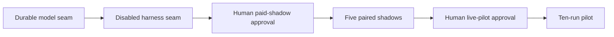

# Plan: M2b Shadow And Routing

- Owner: Zhach
- Status: shadow effective; direct cutover approved
- PRD: [`PRD-m2-doc-runtime.md`](PRD-m2-doc-runtime.md)
- DD: [`DD-m2-doc-runtime.md`](DD-m2-doc-runtime.md)
- Prior council: [`council-m2-doc-runtime.md`](council-m2-doc-runtime.md)
- Merged-main M2a generation: `3d52f7d24967f3b149bfa588551646c92b79be27b167bb664e284cf59fd484c0`

## Scope

Goal: add tested Hermes model seam, then paid shadow, then separately approved live pilot.

Current slice builds seam only. Default stays legacy. No paid calls. No queue route.

Success:

- legacy model invocation, parsing, and publication behavior unchanged;
- Hermes draft and council phases use immutable renderer, bounded adapter, and durable DB attempt rows;
- one retry owner; same key and body only;
- ambiguous outcome goes reconcile;
- lost lease cannot settle;
- no publication path change;
- shadow output cannot reach inbox or normal human queue;
- live service absent until later PR.

## Metrics

Primary: five blinded shadow pairs have no material quality regression.

Guardrails:

- maximum five shadow documents;
- one active run;
- maximum two same-key submissions per phase;
- zero fresh-key retry;
- zero inbox publication from shadow;
- zero unreconciled ambiguity;
- stop on first auth, egress, tool, state, or budget breach.

Provider budget and paid-shadow approval block actual shadow execution. Code and fake tests do not need that approval.

## Tasks

### S1 — Durable Model Seam

Build one helper around existing renderer, adapter, and queue functions.

Inputs:

- request ID;
- queue nonce;
- phase `draft|council`;
- payload for draft;
- runtime generation;
- Hermes URL/key;
- stage root.

Behavior:

1. Render immutable body.
2. Bind request digest and runtime generation in `hermes_doc_runs`.
3. Reserve POST before network.
4. Submit/poll with derived key `doc:<id>:<phase>`.
5. Persist run ID, output digest, usage, raw status, and terminal state.
6. Return output file metadata only after durable completion.
7. Reconcile ambiguous or exhausted state. Never invent key.

Accept:

- existing row with wrong body/generation fails closed;
- known run polls with zero POST;
- first unknown submit permits at most one same-key replay;
- second unknown, expired deadline, 409, invalid output, or lost lease reconciles;
- known provider failure fails;
- completed output bytes match stored digest;
- helper cannot publish.

Validate:

```bash
bash tests/test-hermes-doc-model.sh
python3 tests/test-hermes-run.py
bash tests/test-hermes-doc-schema.sh
```

### S2 — Legacy Harness Seam

Add `DOC_WRITER_RUNTIME=legacy|hermes`. Default `legacy`.

- Legacy model invocation and output handling stay behavior compatible; generation digest changes when harness code changes.
- Hermes mode calls S1 for draft and council.
- Existing parsing, human questions, exact-byte staging, and publication remain shared.
- Hermes final document generation uses approved runtime generation.
- Controller maps helper reconcile to request reconcile, not failed.
- No Compose service selects Hermes mode in this slice.

Accept:

- all legacy tests pass unchanged;
- fake Hermes draft/open-question/finalize/council paths pass;
- heartbeat remains live through both phases;
- publication-only request never calls Hermes.

### S3 — Isolated Paid Shadow

Separate PR and human approval.

- Add shadow-only profile and output root.
- Use five fixed local payloads.
- No queue claim, inbox mount, publication helper, or normal review insert.
- Record latency, usage, model, provider, generation, and artifact digest.
- Blind evaluator compares legacy and Hermes output.

Stop unless provider hard budget and five-call admission cap are verified.

### S4 — Live Pilot

Separate PR and human approval after shadow acceptance.

- Add `hermes-m2b-live` controller profile.
- Require approved generation match.
- One replica, one run, ten admissions maximum.
- Run rollback quarantine drill first.
- Stop on first guardrail breach.

## Graph



What matters:

- Current PR ends after S2.
- Paid calls start only after H1.
- Queue routing starts only after H2.

## S1/S2 Evidence

- model seam, adapter, schema, legacy harness, Hermes harness, controller, and image checks pass;
- run ID acknowledgement blocks first poll until DB persistence;
- full non-routing gate generation: `3664d84e54cf0d0e7ced79405fceea52049f555f7f217b79e6d480da6a1f9660`;
- final code review: pass, no blockers;
- no Compose service selects Hermes model mode.

## First Shadow Attempt

Date: 2026-09-16.

- Five direct OpenAI baselines completed.
- Direct usage: 142,004 input + 36,033 output = 178,037 tokens.
- First Hermes shadow failed before output: 60-second Codex SSE idle watchdog.
- Six of ten approved model calls attempted. Remaining pairs did not run.
- No queue, review, or publication effect occurred.
- Runtime provider key returned to empty after stop.
- Fix sets pinned long-document event-stale timeout to 300 seconds.
- First retry approved for five more calls.

Second attempt, 2026-09-16:

- Hermes pairs 1–3 completed.
- Pair 4 failed before output: implicit 90-second API-call stale timeout.
- Four of five retry calls attempted; pair 5 did not run.
- Total attempted calls across both attempts: 10.
- Provider key returned to empty after stop.
- Fix sets explicit `HERMES_API_CALL_STALE_TIMEOUT=300`.
- Completing pairs 4–5 needs approval for up to two calls; one unused call remains from prior approval.

## Cutover Decision

Human approval, 2026-09-16:

- migrate `doc-write` model calls directly to Hermes;
- keep current controller, human loop, exact-byte approval, and publisher;
- keep legacy harness code as rollback;
- skip more rollout scaffolding;
- stop and return to legacy on first ambiguous or failed routed request.

## Review

- Council level: none. Existing M2 council settled boundaries. User asked no more council loops.
- Code reviewer required after S1/S2.
- Design kickback if helper needs publisher authority, new idempotency identity, or controller-owned provider retry.
- Human owns paid shadow, live pilot, merge, rollback, and budget approval.
