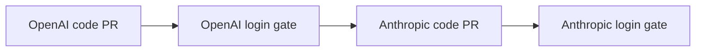

# Plan: Hermes OAuth Login

- Owner: Zhach
- Status: approved
- PRD: [`PRD-oauth-login.md`](PRD-oauth-login.md)
- DD: [`DD-oauth-login.md`](DD-oauth-login.md)
- Council: `council-hermes-oauth-login`; dual-provider launch blocked, provider split accepted

## Scope

Goal: login current Hermes state to OpenAI Codex first. Then Anthropic. One provider per PR. No doc routing.

Success:

- OAuth token only in Hermes volume;
- login survives helper restart;
- lifecycle lock stops concurrent gateway/auth writes;
- runtime stays proxy-only and zero-tool;
- OAuth-only smoke passes with API-key fallback absent;
- logout works;
- each PR can roll back alone.

## Tasks

### O1 — OpenAI OAuth Lifecycle

Depends on: merged M2a gate and OAuth docs.

Build:

- dedicated auth network and auth-only proxy;
- one-shot auth helper with pinned image and state volume only;
- lifecycle wrapper for login, status, logout, start, stop;
- atomic lock, dead-owner recovery, gateway-stop verification;
- runtime proxy hosts `auth.openai.com` and `chatgpt.com`;
- no token in env, args, Git, or output.

Accept:

- unsupported provider/action fails;
- live lock and concurrent start fail;
- stale lock recovers;
- auth helper has no default network, ports, repo, DB, or service secrets;
- M2a no-route and zero-tool tests pass.

Validate:

```bash
bash tests/test-hermes-oauth.sh
bash tests/test-hermes-compose-contract.sh
bash tests/test-hermes-doc-egress.sh
git diff --check
```

Stop: OAuth host differs from pinned source, token appears in output, or gateway mounts state during auth.

Handoff: OpenAI human login.

### O2 — OpenAI Human Gate

Depends on: O1 PR open and focused validation green.

Run:

1. login with device code;
2. status from fresh helper;
3. restart gateway through wrapper;
4. confirm zero toolsets;
5. remove OpenAI API-key fallback from runtime;
6. ask human before one OAuth-only paid smoke;
7. logout/relogin only if status fails.

Accept: smoke names `openai-codex`, returns expected text, and proxy log shows only reviewed hosts.

Stop: provider terms rejected, refresh token missing, unexpected host, or ambiguous state write.

### A1 — Anthropic OAuth Lifecycle

Depends on: O1 merged. Separate branch and PR.

Build:

- add Anthropic login option;
- auth proxy hosts `platform.claude.com` and fallback `console.anthropic.com`;
- runtime proxy hosts those refresh endpoints plus `api.anthropic.com`;
- assert PKCE/state flow and owner-only atomic credential file;
- keep OpenAI evidence unchanged.

Accept: same lifecycle tests pass independently for `anthropic`. Scope shown before login: `org:create_api_key user:profile user:inference`.

Stop: scope changes, runtime needs `claude.ai`, or unrelated state changes.

### A2 — Anthropic Human Gate

Depends on: A1 PR open and focused validation green.

Run status, restart, refresh, zero-tool, OAuth-only smoke, and logout checks. Human browser approval is required.

## Graph



What matters:

- OpenAI proves lifecycle seam first.
- Anthropic adds only provider-specific domains and checks.
- No task enables `doc-write` routing.

## Loop Policy

- One implementation review per provider.
- Delta review only after blocker fix.
- No extra council unless OAuth behavior differs from pinned source.
- Human owns browser approval, paid smoke, merge, revocation, and volume deletion.
