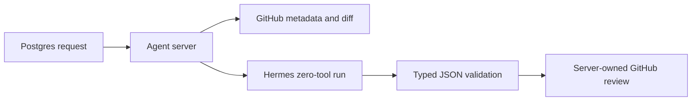

# Plan: Hermes PR Review Cutover

- Owner: Zhach
- Status: approved
- Source: [`../hermes-migration-roadmap.md`](../hermes-migration-roadmap.md), M3/M4

## Goal

Move `pr-review` model execution to Hermes. Keep queue, head check, schema validation, GitHub marker, self-review rule, and review publisher in agent server.

## Scope

- Hermes gets PR metadata, description, and capped immutable diff.
- Hermes gets no GitHub credential, code mount, terminal, MCP, or write path.
- Hermes returns typed JSON text.
- Agent server injects queue nonce, validates schema, rechecks head, and publishes review.
- Existing Me Write runner remains only as explicit rollback.
- Default review runtime becomes Hermes.

## Non-Goals

- No `pr-maintain` change.
- No branch edits.
- No test execution inside Hermes.
- No direct Hermes GitHub delivery.
- No PR-safety change.

## Tasks

1. Add bounded review request renderer and Hermes runner.
2. Allow stable `review:<request-id>` Runs idempotency key.
3. Make server own COMMENT, REQUEST_CHANGES, and APPROVE publication.
4. Connect review worker to existing internal Hermes runtime.
5. Add fake-provider, malformed-output, wrong-head, self-review, marker, and publisher tests.
6. Default to Hermes; retain `AGENT_SERVER_REVIEW_RUNTIME=legacy` rollback.

## Guardrails

- Diff cap: 750 KiB.
- Request cap: 1 MiB.
- One active Hermes run.
- No fresh idempotency key.
- Invalid output fails without GitHub write.
- Head mismatch supersedes before publish.
- Existing marker suppresses duplicate review.

## Flow



## Validation

```bash
python3 tests/test-hermes-pr-review.py
bash tests/test-agent-server-auto-approve.sh
bash tests/test-queue-injection.sh
git diff --check
```

## Rollback

Set `AGENT_SERVER_REVIEW_RUNTIME=legacy` and recreate `agent-server-review`. Queue identity and GitHub markers stay unchanged.
