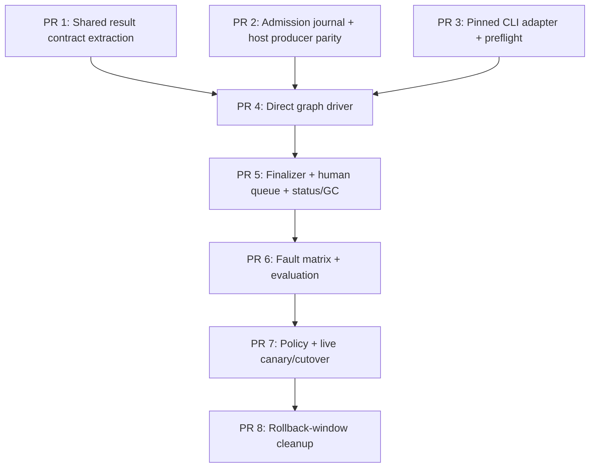

# Technical Plan: Direct-Kanban PR Safety

- status: ready-for-implementation;
- source PRD: `docs/hermes/PRD-pr-safety-direct-kanban.md`;
- source DD: `docs/hermes/DD-pr-safety-direct-kanban.md`;
- grounding: `docs/hermes/grounding-pr-safety-direct-kanban.md`;
- CLI evidence: `docs/hermes/evidence-pr-safety-direct-kanban-cli.json`;
- council: `docs/hermes/council-pr-safety-direct-kanban.md`; formal room `council-pr-safety-direct-kanban`; PASS-WITH-CHANGES after delta checker PASS;
- responsible owner: fleet operator;
- target repo/branch: `ai-pr-automation`, one feature branch/PR per task;
- execution mode: `ship` per slice, code-reviewer after each;
- activation: separate human-approved PR; default remains Postgres/single.

## Accepted Scope

### Goal

Make Hermes Kanban the sole new-work execution queue for PR-safety while keeping other profile queues and historical Postgres data unchanged.

### Non-Goals

- no production route activation in foundation/driver PRs;
- no Postgres removal for other profiles;
- no historical data migration;
- no model-owned graph creation, finalization, human disposition, remediation, merge, or approval;
- no Hermes fork, network bridge, remote Kanban, adaptive routing, Opus, fallback, Bot Mode, or delegation;
- no automatic rerun of quarantined operations.

### Success Criteria

- one immutable cross-engine admission per operation;
- exact five-task fixed graph, one run per task, zero fallback/effects;
- no Postgres safety write in Kanban mode;
- no lost/duplicate admission across discovery/mode-switch fault matrix;
- closure receipt only after exact five task archives and local finalization evidence;
- incident-only human card visible through Fleet status and Hermes dashboard;
- every locked PRD quality, policy, cost, canary, and human-approval gate passes before cutover;
- after bake/rollback window, deleted lifecycle source exceeds added source and recovery benchmark improves median commands/time by at least 50%.

### Validation Required

- focused unit tests per PR;
- real pinned `0.21.5` CLI contract probe;
- Postgres producer parity before direct mode;
- crash matrix for cursor/admission/staging/release/finalization/disposition/rollback;
- sanitized five-agent canary;
- independent 30 severe + 60 ordinary/clean evaluation with locked intervals;
- one seeded human incident journey and one approved live canary;
- 20-operation operational bake, restart drill, and rollback drill.

## Stop Conditions

Stop and return to DD if:

- required CLI field/transition cannot be proven from official pinned runtime;
- any graph card can dispatch before exact blocked-graph verification;
- mode switch can lose or cross-admit a merged PR;
- Kanban mode needs a PR-safety Postgres write or network bridge;
- quarantine can release synthesis or admit a replacement engine;
- human incident cannot remain blocked, visible, typed, and retention-protected;
- direct path fails one locked quality/security gate;
- cleanup would leave more lifecycle code than current bridge design.

Escalate to human before:

- provider policy/model approval;
- choosing measured cost ceiling;
- naming live reviewer/notification ownership;
- one live merged-PR canary;
- changing `PR_SAFETY_QUEUE_ENGINE` default;
- deleting bridge/controller/SQL rollback components.

## Task Graph



PRs 1, 2, and 3 may be developed independently but merge in number order to keep review and installation evidence linear. PR 4 consumes all three contracts. No PR before PR 7 activates production direct mode.

## File And Responsibility Map

| Path | Action | Responsibility |
| --- | --- | --- |
| `scripts/hermes_pr_safety_result.py` | create | shared pure schemas, mapping, evidence, handoff bytes/publication |
| `scripts/hermes_pr_safety_journal.py` | create | mode/cursor/admission/graph/intent/quarantine/receipt/disposition artifacts and locks |
| `scripts/hermes_kanban_cli.py` | create | pinned local CLI argv/env/timeout/JSON/text mutation+readback contracts |
| `scripts/hermes-pr-safety-kanban.py` | create | direct graph staging, reconciliation, finalization, human-card, quarantine resolution |
| `bin/hermes-pr-safety-producer` | modify | common discovery/snapshot plus `postgres|kanban` backend and cursor windows |
| `launchd/com.example.ai-pr-automation-pr-safety-producer.plist.template` | modify | sole host producer in both modes |
| `scripts/hermes-native.sh` | modify | install/preflight/start/stop producer and driver support; eventually remove bridge |
| `scripts/fleet.sh` | modify | status, mode switch, direct inspect/quarantine/disposition commands |
| `scripts/hermes-controller.py` | modify | PR 1 shared-result reuse; PR 8 remove Kanban bridge branch |
| `docker-compose.yml` | modify | PR 2 remove Compose safety producer; PR 8 remove bridge secret/env |
| `bin/status-server` | modify | derived direct safety/human status banner and dashboard link |
| `docker/initdb/13-hermes-api-control-plane.sql` | modify only in PR 8 | retire obsolete Kanban safety functions idempotently |
| `docs/hermes/*direct-kanban*` | update | decisions/evidence/operations |

## Interface Contracts

### Operation journal

Defined by `scripts/hermes_pr_safety_journal.py`:

- exclusive immutable admission: operation ID, canonical request/digest, engine, mode generation;
- per-author cursor: completed window end, overlap start, result count/digest;
- immutable graph manifest, finalization intent, quarantine, closure, disposition, GC tombstone;
- exact-byte replay or conflict;
- mode switch/drain lock;
- no Kanban task-state mirror.

### CLI adapter

Defined by `scripts/hermes_kanban_cli.py`:

- `run(args, expected_json, timeout)` with fixed service launcher/home/environment;
- typed wrappers for board list/create, task create/list/show/attachments/unblock/archive, board retention archive;
- every text mutation followed by JSON readback;
- stdout/stderr bounds and redaction;
- no shell.

### Driver

Defined by `scripts/hermes-pr-safety-kanban.py`:

```text
enqueue <canonical-request-file>
reconcile [--operation ID|--all]
status [--json]
resolve-quarantine <operation> --reason <text>
disposition <human-task-id> --decision <value> --reason <text>
```

All commands acquire shared lock. `enqueue/reconcile` in Kanban mode have no Postgres credential or call.

## PR 1: Shared Safety Result Contract

### Why

Direct finalizer and rollback controller must use one typed validation/mapping/handoff implementation before queue ownership changes.

### Inputs

- `scripts/hermes-controller.py` safety normalization, validation, council mapping, handoff;
- `scripts/hermes-kanban-risk-council.py` metadata/evidence/usage validation;
- existing controller/risk-council tests.

### Outputs

- `scripts/hermes_pr_safety_result.py`;
- controller and existing council import shared functions without behavior change;
- focused tests compare old fixtures/bytes/results.

### Acceptance Criteria

- current `single` outputs and handoff bytes remain unchanged;
- current v2 council package maps identically;
- trusted identity never comes from model metadata;
- incident still requires all five predicates;
- dissent/residual-risk/evidence/usage bounds unchanged;
- no queue, bridge, profile, SQL, or routing change.

### Validation

```bash
python3 -m unittest tests.test_hermes_controller tests.test_hermes_kanban_risk_council
```

### Rollback

Revert extraction; no state migration.

## PR 2: Engine-Neutral Admission Journal And Host Producer Parity

### Why

Move one ingress owner to host while still using proven Postgres/single path. This establishes rollback and cursor correctness before Kanban admission exists.

### Work

- add journal schemas, exclusive writes, lock/drain, per-author paginated 24-hour-overlap cursors, mode generation, initial history floor;
- add admission-before-queue rule in `postgres` mode;
- repair crash after admission/before SQL enqueue by operation lookup/idempotent enqueue;
- install launchd producer under `hermes-agent`;
- remove Compose `pr-safety-producer` service only after parity tests;
- default mode `postgres`; controller remains `single`;
- add status for heartbeat, cursor, mode, and journal conflicts;
- benchmark current six recovery scenarios for commands/time baseline.

### Acceptance Criteria

- fixture and live-dry discovery payload/snapshot/dedupe match current producer;
- one producer only; Compose cannot enqueue safety after migration;
- cursor never advances before every result has admission;
- delayed visibility, pagination, switch-window merge, restart, and overlap replay lose/duplicate zero operations;
- same operation/different bytes or engine fails closed;
- no production route change beyond producer location;
- rollback to previous Compose producer remains documented until PR 4.

### Validation

```bash
bash tests/test-hermes-pr-safety-producer.sh
bash tests/test-hermes-compose-wiring.sh
bash tests/test-hermes-native-foundation.sh
python3 -m unittest tests.test_hermes_pr_safety_journal tests.test_status_server
```

### Stop Condition

Any parity mismatch or unbounded GitHub search/cursor gap blocks PR 4; independent CLI contract work in PR 3 may continue.

## PR 3: Pinned Hermes CLI Adapter And Executable Preflight

### Why

Prove public CLI surface before workflow code depends on it.

### Work

- implement `scripts/hermes_kanban_cli.py` wrappers only;
- turn `docs/hermes/evidence-pr-safety-direct-kanban-cli.json` into real isolated-board conformance;
- validate exact v0.21.5/commit, command flags, JSON keys, text-mutation readback, parent gating, `max-retries=1` first-failure semantics, one run, attachments, task archive, and board retention archive limitation;
- test timeout, malformed/oversized output, stderr redaction, nonzero exit, schema drift, wrong HOME, and shell metacharacters;
- install support bytes but expose no live workflow command.

### Acceptance Criteria

- no Kanban SQLite import or direct read/write;
- no shell command construction;
- exact service CLI, not operator CLI;
- mutation success is never trusted without readback;
- unsupported board removal cannot become closure evidence;
- preflight writes only isolated temporary Hermes home/board and makes zero model calls;
- runtime drift blocks startup before direct mode.

### Validation

```bash
python3 -m unittest tests.test_hermes_kanban_cli tests.test_hermes_kanban_cli_preflight
```

## PR 4: Inert Direct Graph Driver

### Why

Stage/reconcile fixed graph without finalization, human routing, or production mode activation.

### Work

- implement driver enqueue/reconcile/status against journal + CLI adapter;
- one board prefix `pr-safety-op-<32hex>`;
- create four specialists and synthesis blocked with deterministic keys and body files;
- exact five-card verification and immutable graph manifest;
- release specialists one by one; synthesis stays blocked;
- after four done, verify one-run typed handoffs, identity, usage availability, graph, and remaining deadline before synthesis release;
- quarantine on duplicate/drift/member failure/deadline/ambiguity;
- admission fence remains under every phase;
- add disk warning/admission floor and typed quarantine resolution after worker drain;
- wire producer `kanban` mode behind non-default explicit test config only.

### Acceptance Criteria

- no graph dispatch before immutable manifest;
- crash during every create/manifest/release step resumes or quarantines without second graph;
- CLI idempotency race/duplicate injection never dispatches duplicate card;
- synthesis cannot claim before all specialists validate;
- each task has `max-retries=1` and at most one run;
- quarantine rejects output, blocks second engine, counts active until worker-free;
- Kanban mode produces zero PR-safety Postgres writes;
- no handoff, human card, closure receipt, board removal, or production activation yet.

### Validation

```bash
python3 -m unittest tests.test_hermes_pr_safety_kanban_driver tests.test_hermes_kanban_risk_council
bash tests/test-hermes-pr-safety-producer.sh
```

Run sanitized five-task canary only; archive test board manually after evidence.

## PR 5: Finalization, Human Queue, Status, And Retention

### Why

Complete direct operation after trusted synthesis without reintroducing Postgres.

### Work

- use shared result module for exact final package;
- immutable finalization intent with precomputable paths/keys/digests;
- exact-byte handoff publication;
- persistent `pr-safety-human-review` board and incident-only blocked card;
- enumerate active/archived cards for exact operation-ID/title/body replay before create; deterministic idempotency key is write-only defense, not readback evidence;
- archive exact five execution tasks and verify worker-free runs;
- write closure receipt last;
- add typed human disposition comment/receipt and unresolved-archive handling;
- derived shared status index, Fleet critical banner/link, heartbeat/age/quarantine/disk signals;
- fail-closed snapshot GC, 30-day minimum, newest-25, human/quarantine holds, GC tombstones;
- board retention GC after closure/rollback window.

### Acceptance Criteria

- clear: closure receipt, no handoff, no human card;
- non-clear ordinary: exact immutable handoff, no incident card;
- incident: exact handoff plus one blocked human card and status banner;
- crash at every intent/handoff/card/task-archive/receipt boundary replays exactly;
- card archive without typed disposition remains unresolved and snapshot-protected;
- no closure receipt before five tasks archived and worker-free;
- no Postgres safety write in Kanban mode;
- status ambiguity degrades/fails closed;
- seeded named-reviewer journey is documented but remains launch gate.

### Validation

```bash
python3 -m unittest tests.test_hermes_pr_safety_finalizer tests.test_status_server
bash tests/test-hermes-pr-safety-producer.sh
bash tests/test-hermes-native-foundation.sh
```

## PR 6: Fault Matrix, Evaluation, And Recovery Benchmark

### Why

Execution proof is not quality, rare-error, or simplification evidence.

### Work

- automate every cursor/admission/create/release/finalization/disposition/GC/mode-switch crash point;
- compare current bridge and direct path on six matched recovery scenarios;
- populate independent corpus: at least 30 severe positives and 60 ordinary/clean cases;
- run three repetitions per engine/case, collapse to case-level majority;
- compute exact one-sided 95% intervals and locked point/confidence gates;
- blind human comparison and measured cost;
- seeded incident and notifier/status-index outage drill;
- emit `INCONCLUSIVE` when sample/prediction/cost/human gates are incomplete.

### Acceptance Criteria

- all P0 guardrails pass;
- direct recovery uses at most three commands and improves median commands/time at least 50%;
- severe: zero observed misses, 100% point, lower bound at least 90%;
- precision: point at least 90%, lower bound at least 80%;
- ordinary incident rate: point at most 5%, upper bound at most 10%;
- at least 30 incident predictions, 30 severe, 60 ordinary/clean independent cases;
- cost ceiling and named reviewer signoff remain explicit human gates;
- 20-operation bake is not represented as statistical evidence.

### Validation

```bash
python3 scripts/hermes-pr-safety-compare.py validate
python3 -m unittest tests.test_hermes_pr_safety_compare tests.test_hermes_pr_safety_faults
```

Failure leaves default `postgres`.

## PR 7: Policy, Live Canary, And Cutover Package

### Why

Activation changes provider policy, ingress authority, and human workflow.

### Work

- human-reviewed policy for exact Haiku/Sonnet models, retention, no fallback;
- choose cost ceiling and named reviewer;
- run mode-switch drain preflight;
- one explicitly approved merged-PR canary;
- seeded incident journey with Fleet banner, Hermes card, typed disposition;
- rollback drill;
- only after approval set queue engine `kanban`; keep controller analysis `single` for rollback mode;
- 20-operation bake plus restart.

### Acceptance Criteria

- no open Postgres safety work at entry;
- one ingress owner and fresh status index;
- canary gets one admission, graph, closure receipt, expected handoff/card, no Postgres write;
- rollback at every journal phase skips Kanban admissions;
- 20 operations uniquely accounted; restart and rollback pass;
- human signs launch package.

### Human Approval Required

No automated agent changes production default or starts live canary.

## PR 8: Rollback-Window Cleanup

### Why

Simplification claim becomes true only after old lifecycle is deleted.

### Entry Gate

- PR 7 bake and rollback window complete;
- no active/nonarchived bridge workflow;
- no need to recover old Kanban attempt markers;
- recovery benchmark and source-deletion gates pass;
- explicit human deletion approval.

### Work

- delete bridge binary, launchd plist, preflight, reconcile, HMAC source/controller keys;
- remove bridge install/start/status paths;
- remove controller Kanban branch/client/recovery and Compose key/env mounts;
- idempotently retire obsolete Kanban safety SQL functions;
- preserve single Runs API safety path, generic Postgres tables, historical safety rows, and old human items;
- update docs/status/tests;
- compare lifecycle source additions/deletions.

### Acceptance Criteria

- `single` rollback mode still processes host-producer Postgres admissions;
- direct Kanban remains functional without bridge/controller Kanban code;
- no port 8766, bridge key, launchd label, or bridge state dependency;
- historical Postgres items remain readable/actionable;
- deleted lifecycle source exceeds direct lifecycle source added;
- broad required suite passes.

## Execution Order

| Wave | PRs | Gate before next wave |
| --- | --- | --- |
| 1 | PR 1 | exact behavior-preserving review |
| 2 | PR 2 | host producer Postgres parity and cursor fault tests |
| 3 | PR 3 | real pinned CLI contract/preflight pass |
| 4 | PR 4 | inert sanitized graph and crash matrix pass |
| 5 | PR 5 | exact finalization/human/status/GC pass |
| 6 | PR 6 | locked evaluation and benchmark pass, not `INCONCLUSIVE` |
| 7 | PR 7 | human policy/cost/reviewer/live approval |
| 8 | PR 8 | bake/rollback window and deletion approval |

## Review Checkpoints

- PR 1: generalist correctness and exact output parity;
- PR 2: data/reliability review for cursor/admission and single ingress;
- PR 3: CLI/DX and security review;
- PR 4: architecture/reliability/red-team review;
- PR 5: human UX, security, retention, and operations review;
- PR 6: evaluation/statistics review;
- PR 7: full launch council and human approval;
- PR 8: code-reviewer plus Occam/deletion audit.

## Test Plan

- unit: schemas, pure mapping, CLI parsing, graph reconciliation, finalization, retention;
- integration: host producer/Postgres parity, pinned CLI, five-task board, status index;
- fault: every durable-write/mutation boundary and mode switch;
- evaluation: independent labeled corpus with locked statistics;
- manual: named reviewer journey, one live canary, restart, rollback;
- observability: stale heartbeat/operation, quarantine, human age, disk floor, index ambiguity;
- regression: all other five profile producers/controllers unchanged.

## Handoff To Implementer

Read PRD, DD, grounding, CLI evidence, and council synthesis first. Execute one PR at a time. Do not merge tasks, activate future modes, add fallback, or weaken a failed gate. Report:

- status: done | done-with-concerns | blocked | design-kickback;
- changed files;
- acceptance evidence;
- validation commands/results;
- remaining launch blockers.

## Plan Self-Review

- every PR has one primary concern and rollback;
- public CLI contract is proven before workflow use;
- producer parity precedes queue change;
- graph precedes finalization;
- finalization precedes evaluation;
- evaluation precedes live traffic;
- old lifecycle deletion is last and separately approved;
- no task silently changes the fixed council, human-only effects, or other profile control planes.
