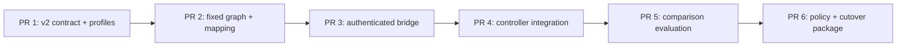

# Technical Plan: Kanban-Backed PR Safety Analysis

- Status: ready for human review.
- PRD: `docs/hermes/PRD-pr-safety-kanban-council.md`.
- DD: `docs/hermes/DD-pr-safety-kanban-council.md`.
- Owner: fleet operator.
- Repo: `ai-pr-automation`.
- Execution: one focused PR per slice.

## Scope Lock

Goal:

- Same `pr-safety-review` use case.
- Fixed Kanban graph replaces one `pr-safety-v1` model run.
- Four Haiku specialists feed one Sonnet synthesizer.
- Existing identity, output, handoff, incident threshold, settlement, and human queue stay.

Non-goals:

- adaptive triage;
- risk-based routing;
- new request kind;
- new UI;
- new lineage table;
- direct Kanban effects;
- Bot Mode;
- broad worker terminal/file tools;
- automatic single-agent fallback.

Stop and return to DD if:

- exact read/search-only worker toolset cannot be enforced;
- pinned Hermes cannot stop deadline-expired workers safely;
- bridge needs Postgres/effect credentials;
- current safety schema cannot carry council result;
- council misses quality gates or cost is rejected.

## Dependency Graph



No PR activates target route by merge alone.

## PR 1: V2 Contract And Read-Only Profiles

### Why

Need production graph identities without changing proven v1 canary profiles.

### Files

Create:

- `agent-config/hermes/workflows/pr-risk-council-kanban-v2.json`;
- `bin/hermes-council-tools`;
- `tests/test-hermes-council-tools.py`.

Modify:

- `scripts/configure-hermes-kanban-profiles.py`;
- `scripts/hermes-kanban-workflow-preflight.py`;
- `scripts/hermes-native.sh`;
- `launchd/com.example.ai-pr-automation-hermes.plist.template`;
- `tests/test-hermes-kanban-profiles.py`;
- `tests/test-hermes-kanban-workflow-preflight.py`;
- `tests/test-hermes-native-foundation.sh`.

### Work

- Add five versioned profiles:
  - `council-reviewer-v2`;
  - `council-security-v2`;
  - `council-reliability-v2`;
  - `council-architect-v2`;
  - `council-orchestrator-v2`.
- Lock Haiku specialists and Sonnet synthesizer.
- Keep fallback empty.
- Keep memory, plugins, web, terminal, delegation, connections, built-in file tools, and all other MCP off.
- Add bounded repo-owned stdio MCP with exactly `snapshot_read`, `snapshot_search`, `kanban_show`, `kanban_comment`, `kanban_heartbeat`, `kanban_complete`, and `kanban_block`; define the mode-0440 `.council-tools.json` protocol under the validated `COUNCIL_WORKSPACE` alias interpolated from `HERMES_KANBAN_WORKSPACE`.
- Keep Kanban task, board, run, claim lock, and session out of model schemas. MCP discovery starts before `AIAgent` creates `HERMES_SESSION_ID`, so do not configure a session alias or restore session identity to handlers. Interpolate and validate only required task, run, claim lock, board, DB, workspace, roots, profile, and interpreter aliases; remove the delegated-child marker only around exact pinned handlers because this MCP is the explicitly supervised own-task transport.
- Set `platform_toolsets.cli: [council-tools]` and `agent.disabled_toolsets: [delegation, kanban]` so pinned worker auto-tools cannot add create, link, list, unblock, review-routing, attachment, or URL capabilities.
- Confine logical snapshot/input paths to validated `COUNCIL_SNAPSHOT_ROOT` and `COUNCIL_WORKFLOW_ROOT` aliases interpolated from `PR_SAFETY_SNAPSHOT_ROOT` and `PR_SAFETY_WORKFLOW_ROOT`; reject absolute paths, `..`, symlinks, non-regular files, non-UTF-8 text, paths over 4,096 characters or 32 components, and bound violations.
- Enforce fixed 256 KiB JSON-RPC request, 1 MiB file, 2,000-file/4,096-entry/32-level/16 MiB search, 100-result, 256-character query, 2,000-character returned-line, and bounded Kanban text/metadata limits.
- Defer `PR_SAFETY_WORKFLOW_ROOT`, binding creation, and live bound reads to PR 3 bridge work.
- Install root-owned mode 0555 at `/usr/local/libexec/ai-pr-automation/hermes-council-tools`, verify installed bytes match repo source, and pin its interpreter to the installed Hermes venv through launchd env.
- Prove exact seven MCP-prefixed model definitions through real stdio MCP discovery (`initialize` and `tools/list`), full canonical schemas, zero built-ins, exact model, alias interpolation, and empty fallback lists from pinned runtime. Do not trust config text alone.
- Keep v1 check/apply/restore behavior unchanged.

### Acceptance

- V1 profile bytes and contract unchanged.
- V2 check reports exact five profiles, models, and seven tools.
- Council-tools protocol and unit confinement tests prove bounded read/search, fail-closed path handling, required worker env, own-task-only routing, and exact pinned handler calls; no live bound read is claimed.
- Any built-in Kanban, write/terminal/web/effect, or extra MCP tool fails preflight.
- Any Opus/fallback fails preflight.
- Check mode writes zero state.
- Apply/restore remains stopped-service only.

### Validation

```bash
python3 -m unittest tests/test-hermes-kanban-profiles.py tests/test-hermes-kanban-workflow-preflight.py tests/test-hermes-council-tools.py
```

Run pinned-runtime effective-tool preflight as `hermes-agent`. Do not configure `PR_SAFETY_WORKFLOW_ROOT`, perform a live bound read, apply profiles, or activate a route in this PR.

## PR 2: Fixed Graph And Pure Mapping

### Why

Prove exact multi-agent analysis and compatible output before network/service integration.

### Files

Modify:

- `scripts/hermes-kanban-risk-council.py`;
- `tests/test-hermes-kanban-risk-council.py`;
- `scripts/hermes-controller.py`;
- `tests/test-hermes-controller.py`.

Create only if needed:

- `evals/cases/pr-safety-council/` fixtures.

### Work

- Parameterize current fixed fixture path with trusted request input.
- Preserve existing default sanitized canary behavior.
- Create exact four specialist tasks and one Sonnet synthesis task.
- Use stable operation-derived workflow/task keys.
- Generate read-only `identity.json`, `diff.patch`, and `policy.md`; create `.council-tools.json` for sanitized local graph acceptance only. PR 3 owns production binding creation.
- Add exact specialist and synthesis validators.
- Validate changed-line citations.
- Union dissent/residual risk deterministically.
- After task and run workers clear, resolve each role's usage from its profile-scoped state DB through a read-only URI. Require exactly one closed (`ended_at` non-null) `source='kanban'` session with expected model when available and bounded start/end times around trusted run times; require non-negative input/output tokens and include cache tokens when supported. Pinned Kanban leaves `cwd` null, so do not match it. Never use task session ID or `worker_session_id` metadata.
- Add private pure controller mapping to current safety schema.
- Add council context to existing handoff rendering.

### Acceptance

- Five tasks exactly.
- Four-parent synthesis fan-in.
- One attempt each.
- Exact profiles/models.
- Unique profile-scoped usage match; zero, multiple, out-of-window, wrong-source/model, or negative usage fails closed; nullable Kanban `cwd` is ignored.
- Optional `worker_session_id` metadata is stripped and deterministic task session IDs are absent.
- No attachments, children, fallback, or effect tools.
- Exact current top-level safety schema.
- Trusted identity always comes from request.
- Incident requires all five current conditions.
- V1 sanitized command still passes.

### Validation

```bash
python3 -m unittest tests.test_hermes_kanban_risk_council tests.test_hermes_controller
```

Run one sanitized local graph. Archive it.

## PR 3: Authenticated Host Bridge

### Why

Compose controller cannot write host Kanban SQLite. Bridge is narrow owner boundary, not dispatcher.

### Files

Create:

- `bin/hermes-kanban-safety-bridge`;
- `launchd/com.example.ai-pr-automation-hermes-kanban-safety-bridge.plist.template`;
- `scripts/hermes-kanban-safety-bridge-preflight.py`;
- `tests/test-hermes-kanban-safety-bridge.py`.

Modify:

- `scripts/hermes-native.sh`;
- `scripts/hermes-native-preflight.py`;
- `docs/hermes/README.md`.

### Work

- Add signed create/status/stop/archive endpoints.
- Bind `127.0.0.1` only.
- Add Host, content-type, Origin, timestamp, nonce, request/response HMAC checks.
- Derive workflow/task IDs server-side.
- Persist `creating|active|stopping|stopped|terminal|archiving|archived` state atomically.
- Resume exact crash windows.
- Enforce one active workflow.
- Assert DELETE journal, busy timeout, disk headroom, and integrity.
- Add report-only reconcile command.
- Purge raw workflow input/board after settled archive while retaining tombstone/audit digest.

### Acceptance

- No Postgres or effect credential/mount.
- Duplicate create replays exact workflow.
- Same ID/different bytes returns 409.
- Stop confirms no worker remains.
- Archive resumes before/after board removal.
- State/board mismatch fails closed.
- Logs contain no code, packet, model output, or secret.

### Validation

```bash
python3 -m unittest tests.test_hermes_kanban_safety_bridge
```

Fault matrix:

- crash before/after state write;
- crash during each task creation;
- crash during stop;
- crash before/after board removal;
- replay every endpoint;
- wrong HMAC/generation/Host/Origin/content type;
- busy/corrupt/disk-full fixtures.

No live launchd activation in PR.

## PR 4: Controller Integration

### Why

Route same safety request through bridge while retaining current single-engine rollback.

### Files

Modify:

- `scripts/hermes-controller.py`;
- `docker/initdb/13-hermes-api-control-plane.sql`;
- `docker-compose.yml`;
- `.env.example`;
- `Dockerfile.hermes-controller`;
- `tests/test-hermes-controller.py`;
- `tests/test-hermes-compose-wiring.sh`;
- `tests/test-schema-migrate-idempotent.sh`.

### Work

- Add `PR_SAFETY_ANALYSIS_ENGINE`, default `single`.
- For Kanban claims, atomically store `kanban:<workflow_id>` in current attempt `run_id`.
- Recover from persisted prefix, not current env.
- Add signed bridge client.
- Poll while renewing same lease.
- On lease loss/deadline, stop and confirm workers before recovery.
- Split safety settlement-only helper from attempt completion.
- Kanban order:
  1. settle;
  2. archive/tombstone confirm;
  3. complete effect attempt.
- Extend open-attempt query for settled-but-unclosed Kanban cleanup.
- Keep single path behavior byte-for-byte where practical.

### Acceptance

- Request kind/payload unchanged.
- No new table.
- `single` tests unchanged.
- Engine change affects new claims only.
- Open Kanban attempt resumes Kanban after restart under `single` config.
- Settlement happens once.
- Crash after settlement resumes archive, not analysis or settlement.
- Incident queue row remains atomic and unique.

### Validation

```bash
python3 -m unittest tests.test_hermes_controller
bash tests/test-hermes-compose-wiring.sh
bash tests/test-schema-migrate-idempotent.sh
```

Fake bridge integration covers all crash windows.

## PR 5: Baseline Comparison

### Why

Prove fixed council is worth added cost before cutover.

### Files

Modify:

- `evals/manifest.json`;
- `scripts/hermes-eval.py`;
- `tests/test-hermes-eval.py`;
- `evals/README.md`.

Add labeled sanitized safety cases as needed.

### Work

- Run `single` and `kanban` on same immutable snapshots.
- Three repetitions.
- Score current incident and material-finding metrics.
- Record latency, tokens, cost by role, variance, and human blind preference.
- Include severe positives, ordinary findings, clean/mechanical, injection, malformed handoff, failed member, stale identity, and deadline.

### Gates

- Severe-incident recall: 100%.
- Incident precision: at least 90%.
- Ordinary finding promoted to incident: at most 5%.
- Material-finding precision: at least 80% and not below baseline.
- Identity/effect/profile/model/fallback failures: zero.
- Human accepts measured cost.

Failure stops cutover. Keep single engine.

## PR 6: Policy And Cutover Package

### Why

Provider policy contradicts target models. Activation needs explicit human decision and rollback evidence.

### Files

Modify through separate review:

- `policy/pr-safety-policy-v1.md` or add approved v2;
- `README.md`;
- `docs/hermes/README.md`;
- `.env.example` only if default is approved.

### Work

- Name exact Anthropic models and no-fallback rule.
- Record provider/local retention.
- Link comparison report.
- Document apply, preflight, one-live-request check, rollback, and cleanup.
- Keep default `single` unless human explicitly approves default change.

### Acceptance

- Policy digest/version update is explicit.
- Profiles/bridge installed only after merged PRs.
- Cutover command changes one engine value.
- Rollback command restores `single`.
- No credentials in repo or PR.
- Human approves activation.

## Review Checkpoints

| After | Review |
| --- | --- |
| PR 1 | Tool/capability and model contract |
| PR 2 | Typed graph/output fidelity |
| PR 3 | Security and crash recovery |
| PR 4 | Controller/SQL correctness and rollback |
| PR 5 | Quality/cost decision |
| PR 6 | Human policy and activation approval |

## Final Validation Before Cutover

```bash
scripts/fleet.sh status
python3 scripts/hermes-kanban-workflow-preflight.py --contract agent-config/hermes/workflows/pr-risk-council-kanban-v2.json
python3 scripts/hermes-native-preflight.py
python3 scripts/hermes-eval.py validate
```

Then run exact bridge/controller conformance and one approved live safety request.

## Handoff

Implement PRs in order. Stop after any failed gate. Do not combine bridge, controller, evaluation, policy, or activation into one PR.
