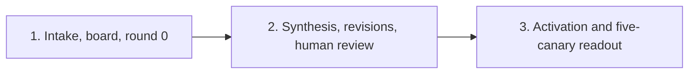

# Plan: PRD Kanban M0

- Status: approved for implementation
- PRD/DD: `PRD-prd-kanban-m0.md`, `DD-prd-kanban-m0.md`
- Run: one M0 plan-to-launch run
- Limit: three ordered PR groups, each under 400 changed lines

## Scope Lock

Build only real intake through final attachment and human review. Trust Hermes for task state, events, runs, attachments, concurrency, and recovery. No automated publication or rollback effect. No CAS, publisher, receipt, readback, rollback engine, lifecycle journal, attachment probe, profile/config/tool inspection, Postgres state, or custom state machine. Do not modify publication helpers or add external-effect fault tests.

Legacy document flow continues for non-canary intake. A canary uses only the new route.

## Order

All three groups stay in one M0 plan-to-launch run. Do not split out helper, storage, profile, publication, or readout infrastructure.

## PR Group 1: Direct PRD Intake, Board, Round 0 Graph

Build:
- complete real-intake command/path for named canaries;
- `prd-write` board route and one tenant-scoped root umbrella;
- `prd-write-v1` writer and immutable draft attachment with raw-byte SHA-256;
- parallel `product-pm`, `mvp`, and `occams-razor` tasks;
- synthesis task after all three results;
- deterministic `{tenant}:{root-operation}:{round}:{role}` create keys.

Acceptance:
- producer replay adopts the same creates and makes no duplicate root/task;
- round 0 has root, writer, three reviewers, and synthesis;
- all reviewers bind results to one draft digest;
- non-canary intake still uses legacy flow;
- no intake enters both flows;
- no custom concurrency, recovery, state, or profile inspection code exists.

## PR Group 2: Synthesis, Revisions, Human Review

Build:
- structured synthesis result with blockers, owners, resolution, and reviewed digest;
- final selection or targeted revision;
- revision writer plus `mvp`, `occams-razor`, open blocker owners, and synthesis;
- hard cap of two revision rounds;
- final writer attachment reference and writer/synthesis-declared SHA-256;
- transition of the same root to unassigned standard Hermes `review`;
- human `done` or `denied` disposition after manual download/copy/publication.

Acceptance:
- synthesis never edits PRD bytes;
- duplicate reviewer roles create one task;
- malformed/conflicting output and blockers after round 2 remain visible in `review`;
- no round 3 can be created;
- root review identifies final writer task, attachment, size, and declared digest; human canary review verifies downloaded SHA-256;
- no automated external effect or publication state exists.

## PR Group 3: Activation And Five-Canary Readout

Before activation, record five complete real requester intakes, operator owner, cycle-time target, cost ceiling, and measurement method.

Run canaries sequentially. For each one, wait for visible human review; check graph, attachments, revision count, quality, elapsed time, and cost; then get operator signoff before admitting the next.

Day 1 reports admissions, graph/attachment validity, review visibility, quality signal, elapsed time, and cost. Day 5 reports all five results:

| Metric | Pass |
| --- | ---: |
| Accepted without material human rewrite | at least 4/5 |
| Schema-valid | 5/5 |
| Materially rewritten by human | at most 1/5 |
| Lost or duplicate root, task, or attachment | 0 |
| Automated or unapproved publication | 0 |
| Final/downloaded attachment digest mismatch | 0 |
| Hidden human review | 0 |
| More than two revision rounds | 0 |
| Locked cycle-time and cost targets | pass |
Human chooses pass, approved extension, or stop. No automatic ramp.

## Stop And Evidence

Stop new canary intake only for workflow quality failure, lost work, duplicate work, hidden review, revision-round cap breach, or cost breach. Preserve the same Hermes root, tasks, events, runs, and attachments for review. Leave non-canary legacy traffic unchanged.

Focused checks cover graph shape, replay idempotency, declared digest propagation, revision reviewer selection, round cap, final handoff reference, route isolation, and human-review visibility. Canary evidence verifies downloaded bytes.

## Council Outcome

MVP and architect approve the simplified plan. Reliability's publication blocker is removed because M0 has no automated publication effect. Profile-fingerprint dissent is dismissed.
